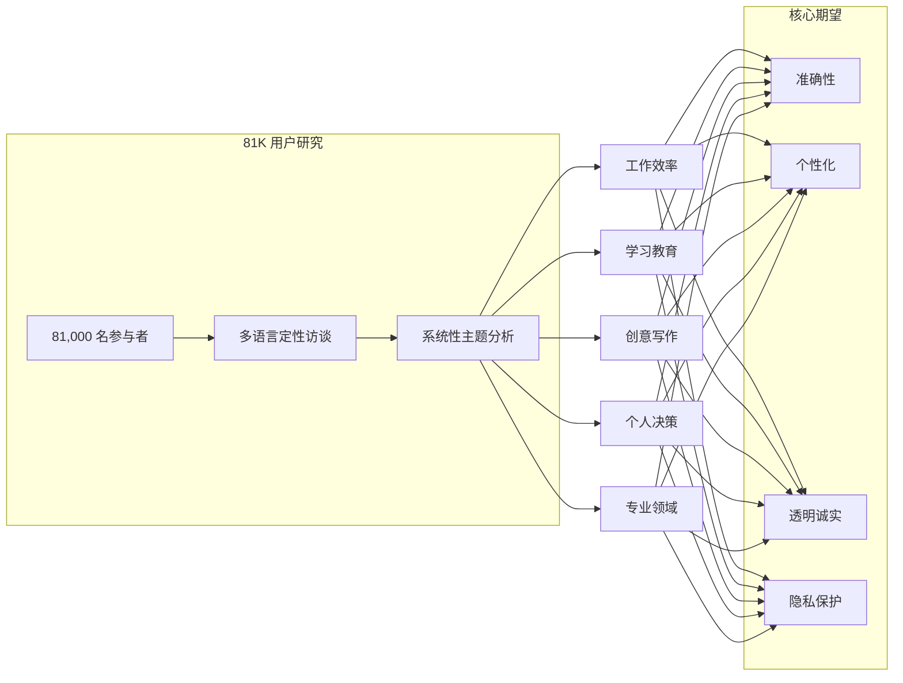

# What 81,000 People Want from AI | 81,000 人对 AI 的期望

> **原标题：** What 81,000 People Want from AI
> **作者：** Anthropic
> **发布日期：** 2026年3月18日
> **原文链接：** https://www.anthropic.com/research/81k-interviews

---

## 一句话摘要

Anthropic 对近 81,000 名 Claude.ai 用户进行了迄今规模最大、语言覆盖最广的 AI 使用定性研究，深入了解全球用户如何在日常生活中使用 AI，以及他们对 AI 未来发展的真实期望。

---

## 完整核心内容翻译

### 一、研究概述

Anthropic 开展了一项前所未有的大规模定性研究，邀请近 **81,000 名** Claude.ai 用户分享他们使用 AI 的方式和期望。这是目前已知的**最大规模**且**语言覆盖最广**的 AI 使用定性研究。

与传统的问卷调查不同，本研究采用开放式对话形式，让用户用自己的语言描述 AI 在生活中扮演的角色，捕获了量化调查难以获取的细微洞察。

### 二、研究方法

- **参与规模：** 近 81,000 名 Claude.ai 活跃用户
- **研究形式：** 定性访谈与开放式反馈
- **语言覆盖：** 多语言，覆盖全球不同地区用户
- **数据处理：** 对海量定性数据进行系统性编码和主题分析

### 三、核心发现

#### 用户如何使用 AI

用户报告的 AI 使用场景涵盖日常生活的方方面面：

- **工作效率：** 文档撰写、数据分析、代码编写、邮件处理
- **学习与教育：** 概念解释、技能习得、学术研究辅助
- **创意与写作：** 头脑风暴、内容创作、翻译与编辑
- **个人决策：** 复杂问题分析、方案比较、规划建议
- **专业领域：** 医疗信息查询、法律文件理解、财务规划

#### 用户对 AI 的期望

研究揭示了用户对 AI 发展方向的多元期望：

1. **可靠性与准确性：** 用户最关心 AI 输出的事实准确性
2. **个性化理解：** 希望 AI 能更好地理解个人上下文和偏好
3. **透明与诚实：** 期望 AI 在不确定时坦诚告知
4. **隐私保护：** 对数据使用和隐私问题高度敏感
5. **持续可用性：** 希望 AI 成为稳定、可信赖的日常工具

### 四、多语言与文化视角

作为覆盖最广的多语言研究，不同语言和文化背景的用户展现出：

- **共通性：** 对准确性、可靠性和诚实性的期望跨文化一致
- **差异性：** 具体使用场景和优先级因文化和经济背景而异
- **包容性需求：** 非英语用户对母语支持质量有强烈需求

### 五、研究意义

这项研究为 AI 开发提供了直接的用户视角，帮助实验室：

- 理解真实用户需求而非假设需求
- 识别不同群体的差异化期望
- 在产品决策中融入多元文化考量
- 为负责任 AI 开发提供实证依据

---

## 技术要点

1. **大规模定性研究方法论：** 81,000 人的开放式定性研究在社会科学中极为罕见，需要结合 NLP 技术进行系统性编码和主题提取，开创了 AI 公司用户研究的新范式。
2. **多语言覆盖的重要性：** 仅基于英语用户的研究会产生系统性偏差，多语言研究揭示了非英语用户的独特需求和期望。
3. **定性数据的独特价值：** 相比 Likert 量表等定量工具，开放式访谈能够捕获用户自身框架中的需求表达，避免研究者预设类别带来的偏差。
4. **用户中心的 AI 开发：** 大规模用户研究为"以用户为中心"的 AI 产品迭代提供了实证基础，弥合了技术能力与用户需求之间的差距。
5. **隐私-个性化张力：** 用户同时要求个性化和隐私保护，这两个目标之间存在内在张力，是 AI 产品设计中的核心挑战。

---

## 深度解读

这项研究的规模和方法论本身就是一个重要信号。**81,000 人的定性研究在任何领域都是前所未有的**——传统定性研究通常涉及数十到数百名参与者。这只有在 AI 辅助分析的条件下才可行，本身就是"用 AI 研究 AI 用户"的有趣递归。

**从产品视角看，这是 Anthropic 的战略性投资。** 了解用户如何真实使用 AI——而非假设他们如何使用——对于产品方向决策至关重要。许多 AI 公司基于基准测试和技术指标进行模型优化，而 Anthropic 选择直接倾听用户声音，这反映了一种更加成熟的产品思维。

**多语言维度尤为关键。** AI 领域的大部分研究和讨论都以英语为中心，但全球大多数 AI 用户的母语并非英语。非英语用户的需求、期望和使用模式可能与英语用户有显著差异。这项研究为全球化 AI 产品设计提供了难得的数据基础。

**准确性和诚实性被用户置于首位，这与行业的技术竞争焦点形成有趣对比。** 当实验室关注基准测试分数、上下文窗口大小和推理速度时，用户最关心的是"AI 告诉我的东西是否可靠"和"它不知道的时候会不会告诉我"。这种需求-供给的错位值得整个行业反思。

**隐私与个性化的张力是一个深层架构问题。** 更好的个性化通常需要更多的用户数据，但用户同时要求严格的隐私保护。解决这一矛盾可能需要在本地化处理、联邦学习或差分隐私等技术方向上取得突破。

---

## 延伸思考

1. 81,000 名 Claude.ai 用户是否具有代表性？那些不使用 AI 或使用竞品的人群可能有什么不同的期望？
2. 用户对"准确性"的期望如何量化？不同领域（医疗 vs. 创意写作）对准确性的标准是否应有差异？
3. 多语言研究中发现的文化差异如何影响模型训练——是否需要为不同文化背景训练不同的行为模式？
4. 大规模定性研究方法能否标准化，成为 AI 公司定期进行的"用户脉搏检测"？

---

*本文为 Anthropic 官方研究文章的深度中文解读。*
