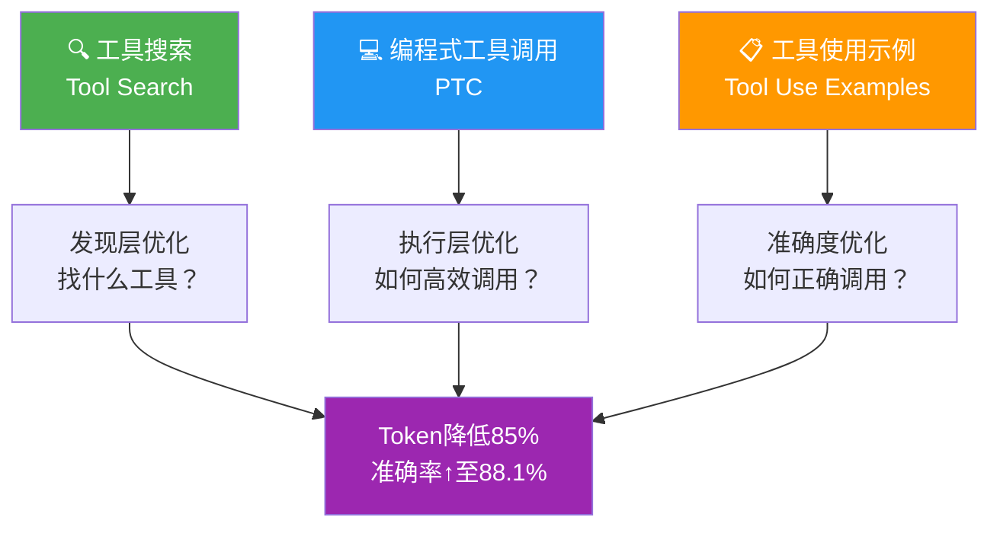

> 📊 难度：⭐⭐⭐ | ⏱️ 阅读：15分钟 | 📅 2025年11月24日 | 🏷️ 工具使用, API, Claude开发者平台

# 🛠️ Claude开发者平台的高级工具使用

> **原标题：** Advanced Tool Use on the Claude Developer Platform
>
> **作者：** Anthropic Engineering | **发布日期：** 2025年11月24日
>
> **原文链接：** https://www.anthropic.com/engineering/advanced-tool-use

---

## 📌 一句话摘要

Anthropic推出三项Beta功能——工具搜索（Tool Search Tool）、编程式工具调用（Programmatic Tool Calling）和工具使用示例（Tool Use Examples），让Claude能够动态发现、学习和执行工具，大幅降低token消耗并显著提升工具调用的准确率。

---

## 📖 完整核心内容翻译

### 🌐 三大功能全景

Anthropic在Claude开发者平台上推出了三项互补的Beta功能，旨在从根本上改变AI智能体与工具交互的方式。这三项功能分别解决了工具使用中的发现效率、数据处理效率和调用准确性三大核心痛点。

### 🔍 一、工具搜索工具（Tool Search Tool）

**核心理念：按需发现，而非全量加载**

传统方式要求在会话开始时将所有工具定义一次性加载到模型上下文中。当工具数量众多时，仅工具定义就可能消耗55,000+个token。工具搜索工具改变了这一范式：初始加载仅需约500个token（仅加载搜索工具本身），其他工具按需动态发现。

**⚙️ 关键机制：**
- 开发者通过设置 `defer_loading: true` 标记来指定哪些工具支持按需发现
- Claude在需要时通过搜索工具查找并加载相关工具定义
- 工具定义仅在实际需要时才进入上下文窗口

**📊 量化成果：**
- Token使用量降低85%
- Opus 4模型准确率从49%提升至74%
- Opus 4.5模型准确率从79.5%提升至88.1%

**🎯 适用场景：**
- 工具定义总计消耗超过10K token
- 工具选择准确率存在问题
- 基于MCP的系统接入了多个服务器
- 可用工具数量超过10个

### 💻 二、编程式工具调用（Programmatic Tool Calling, PTC）

**核心理念：用代码编排工具，而非逐一调用**

Claude不再逐个发起独立的API工具调用，而是编写Python代码来编排多个工具的调用流程。关键创新在于：工具调用的结果进入代码执行环境而非Claude的上下文窗口，从而避免了大量中间数据的冗余传递。

**📋 典型场景举例：** 检查团队中哪些成员的第三季度差旅预算超标
- 传统方式：2,000+条费用明细全部进入上下文（50KB+）
- 使用PTC：仅最终汇总结果进入上下文（1KB）

**📊 量化成果：**
- 复杂研究任务中token消耗降低37%（从43,588降至27,297）
- 内部知识检索准确率从25.6%提升至28.5%
- GIA基准测试从46.5%提升至51.2%

**🎯 适用场景：**
- 处理大型数据集以提取聚合指标
- 包含3个以上相互依赖调用的多步骤工作流
- 需要在Claude"看到"结果之前先进行过滤或转换

### 📋 三、工具使用示例（Tool Use Examples）

**核心理念：用具体示例弥补JSON Schema的表达缺陷**

JSON Schema虽然能描述工具参数的类型和结构，但无法表达以下关键信息：何时应该包含可选参数？哪些参数组合才有意义？复杂嵌套结构应如何填充？工具使用示例通过提供具体的调用模式来弥补这一不足。

**⚙️ 配置方式：** 通过 `input_examples` 字段为工具提供示例调用，展示参数格式约定、参数关联关系和嵌套结构的正确用法。

**📊 量化成果：**
- 在复杂参数处理场景中，内部测试准确率从72%提升至90%

**🎯 适用场景：**
- 复杂嵌套结构的工具
- 拥有大量可选参数的工具
- 涉及领域特定约定的工具
- 需要区分功能相似工具的场景

### 🔧 实现细节

三项功能均以Beta形式提供，使用时需要：
- 设置Beta请求头：`advanced-tool-use-2025-11-20`
- 使用 `claude-sonnet-4-5-20250929` 或更高版本的模型
- 在工具配置中使用相应的标记（`defer_loading`、`allowed_callers`、`input_examples`）

### 💼 真实应用案例

Claude for Excel使用了编程式工具调用功能来修改包含数千行数据的电子表格，而不会使上下文窗口过载——这证明了该技术在实际生产环境中的可行性，而非仅停留在内部测试阶段。

---

## 🔬 技术要点

1. **延迟加载机制**：通过 `defer_loading: true` 实现工具定义的按需加载，将初始上下文占用从55K+ token压缩至约500 token，降幅达85%以上。

2. **代码执行环境隔离**：PTC的关键设计是工具调用结果进入代码执行沙箱而非模型上下文，实现了数据处理与模型推理的解耦。

3. **示例驱动的参数理解**：JSON Schema的静态类型描述不足以传达参数使用的动态语义，`input_examples` 通过少样本学习（few-shot learning）的方式弥补了这一缺陷。

4. **三位一体的协同效应**：工具搜索解决"找什么工具"、PTC解决"如何高效调用"、使用示例解决"如何正确调用"——三者共同构成完整的工具使用优化方案。

---

## 🧠 深度解读

### 🟢 通俗版

想象你去一家巨大的五金店修水管。老方法是进门时就把整个店的商品清单背下来（消耗大量"脑容量"），然后一件一件地买工具、自己搬运中间材料。新方法就像配了三个智能助手：一个帮你按需查找工具（工具搜索），一个帮你写好购物清单自动采购并只告诉你最终结果（PTC），还有一个通过实际使用范例教你怎么正确使用每个工具（使用示例）。三个助手配合，你修水管的效率和准确率都大幅提升。

### 🔴 深入版

本文的核心贡献在于将AI工具使用的优化从"单点改进"提升到了"系统性方案"的层次。三项功能并非独立存在，而是形成了一个完整的优化闭环：

**发现层优化（Tool Search）→ 执行层优化（PTC）→ 准确度优化（Tool Use Examples）**

这种分层思路值得深思。传统的工具使用优化往往聚焦于提示词工程（如何描述工具）或模型能力（如何理解工具），而Anthropic的方案则从架构层面入手，重新定义了模型与工具之间的信息流。

特别值得关注的是PTC功能。它本质上是在"模型推理"和"工具执行"之间引入了一个"代码编排层"。这个设计暗合了软件工程中的经典模式——编排器模式（Orchestrator Pattern）。模型不再是一个逐步执行的"脚本运行器"，而是一个"编排代码的生成器"。这种角色转换意味着模型可以用更少的推理步骤完成更复杂的任务编排。

从72%到90%的准确率提升（通过工具使用示例）也揭示了一个重要洞察：**JSON Schema是为机器解析设计的，而不是为LLM理解设计的**。LLM更善于从具体实例中归纳抽象规则，而不是从抽象定义中推导具体用法。这与人类学习的方式高度一致。

---

## 💡 延伸思考

1. **工具搜索的语义鸿沟**：当可用工具达到数千个时，如何确保工具搜索的召回率？工具的命名和描述质量将成为关键瓶颈——这可能催生"工具元数据工程"这一新的实践领域。

2. **PTC的调试挑战**：当Claude编写的编排代码出错时，调试链路变得更长——从"检查工具调用参数"变为"理解AI生成的Python代码的执行逻辑"。这对开发者体验提出了新的要求。

3. **示例的维护成本**：工具使用示例需要随工具API的演进而更新。在大规模系统中，这些示例的版本管理和一致性保障可能成为新的运维负担。

4. **从Beta到GA的鸿沟**：三项功能目前均为Beta状态。在生产环境大规模采用之前，稳定性、性能和兼容性等方面还有多少未知挑战？

---

> **原文链接：** https://www.anthropic.com/engineering/advanced-tool-use
