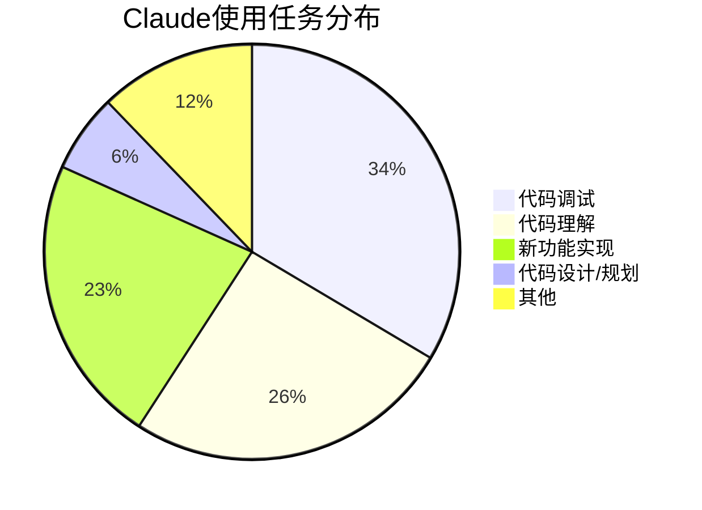

> 📊 难度：⭐⭐ | ⏱️ 阅读：15分钟 | 📅 2025年12月2日 | 🏷️ 工作变革, 生产力, 软件开发

# AI如何改变Anthropic的工作方式

> **原标题：** How AI is Transforming Work at Anthropic
> **发布日期：** 2025年12月2日
> **作者：** Saffron Huang, Bryan Seethor, Esin Durmus, Kunal Handa, Miles McCain, Michael Stern, Deep Ganguli
> **原文链接：** https://www.anthropic.com/research/how-ai-is-transforming-work-at-anthropic

## 📌 一句话摘要

Anthropic对内部132名工程师和研究人员的深度调研揭示：AI正在根本性地重塑软件开发工作——效率提升约50%、27%的任务属于AI催生的"新增工作"，但同时引发了技能退化、同事协作减少和职业前景不确定性等深层隐忧。

---

## 📖 完整核心内容翻译

### 🔬 研究方法

本研究考察了AI采用如何重塑Anthropic内部的工作实践。调查涵盖了132名工程师和研究人员的问卷、53次深度访谈，以及2025年8月收集的内部Claude Code使用数据（约20万条对话记录）。研究人员承认，在一家AI公司内部研究AI的职场影响代表了一种特殊的视角——工程师们拥有对先进工具的早期访问权，且处于一个稳定的行业。尽管存在这一局限性，团队认为发布研究结果仍有价值，因为Anthropic内部的变化可能预示着更广泛的跨行业劳动力转型。

### 📎 核心调查发现

#### Claude使用模式

工程师最常使用Claude进行代码调试和理解现有代码库。日常用户中，55%用于调试任务，42%用于代码理解，37%用于实现新功能。高层设计和规划的采用率最低，这可能反映了工程师在决策层面保持人类主导的有意选择。

#### 生产力增长

自报的Claude使用率在12个月内从每日工作的28%上升至59%。相应的生产力提升从+20%上升至+50%。这大致与Claude Code采用后每位工程师每日合并PR数量增长67%的客观数据相吻合。14%的受访者报告了100%以上的生产力提升。

#### 新增工作

大约27%的Claude辅助任务涉及没有AI就不会发生的工作。例如项目扩展、交互式仪表板等提升生活质量的工具，以及在没有AI辅助时被认为成本过高的探索性活动。约8.6%的Claude Code任务涉及"小修小补"——重构代码以提高可维护性、创建实用工具——这些改进在传统工作流中通常被搁置。

#### 委派的局限

超过一半的受访者表示，他们只能将0-20%的工作完全委托给Claude。工程师通常保持主动监督，特别是在复杂或高风险的代码质量场景中验证输出。

### 📎 深度访谈发现

#### 委派策略

工程师们形成了明确的委派方法论：
- **低复杂度与知识盲区：** 将个人知识不足但复杂度有限的任务委托给Claude
- **验证可行性：** 创建工作量大但验证工作量相对小的任务适合委派
- **组件隔离：** 耦合度低的子组件优先交给Claude，高度集成的系统则保留人工
- **质量要求分层：** 一次性调试代码和研究代码直接交给Claude，概念挑战性强或设计关键的工作保留人工
- **任务愉悦度：** 44%的Claude辅助工作涉及员工本身不会喜欢的任务
- **执行速度：** 预计10分钟以内的任务通常跳过Claude，因为设置开销不值得

#### 技能扩展

Claude使工程师能够在不熟悉的领域自信工作——后端开发者构建用户界面，研究人员创建可视化。一位后端工程师描述了通过Claude迭代构建UI的成果，甚至让设计师感到惊讶。工程师们报告自己变成了"全栈"开发者，尽管之前对前端、数据库和API工作心存畏惧。

#### 技能退化担忧

矛盾的是，一些人担心技能退化。手动解决问题过程中的附带学习——阅读文档和代码产生的间接系统理解——被Claude的直接问题解决所绕过。

"监督悖论"构成了额外隐忧：有效监督AI需要的恰恰是那些可能因过度依赖而退化的技术技能。一位工程师表示，比起独立技术能力，他更担心的是监督能力的下降。一些人刻意在某些时候不使用Claude，以牺牲即时效率来维持能力。

#### 抽象层次的演进

软件工程历来朝着更高的抽象层次发展——从手动内存管理和汇编语言到现代编程语言。或许"英语作为编程语言"代表了下一个抽象层次。

一位工程师挑战了"技能生疏"的前提假设："'变生疏'这种说法依赖于一个假设——编程总有一天会回到Claude 3.5之前的样子。而我不认为会那样。"

#### 职场社交动态

Claude成为了此前向同事提问的"默认第一资源"。一位工程师指出80-90%的问题现在都问Claude。这创造了一种过滤机制——Claude处理常规咨询，人际互动被保留给超出AI能力的复杂、战略性、需要上下文的问题。

导师制影响尤为明显。资深工程师注意到主动求教的初级开发者越来越少。讽刺的是，AI教练使学习更快更有效，但消除了传统的成长路径和关系建设机会。

#### 职业演变与长期不确定性

工程师们越来越多地将角色转变描述为"AI代理管理者"。一位工程师估计70%以上的工作已转向代码审查和修订，而非新代码编写。"对1个、5个或100个Claude的工作负责"成为新兴的角色描述。

许多人表达了矛盾的情绪：短期乐观与长期焦虑并存。"我对短期感到乐观，但长远来看，我认为AI最终会做所有的事情，让我和许多其他人变得无关紧要。"有人描述自己每天都在"让自己失业"。

#### 工匠精神与意义

观点急剧分化。一些拥有25年编程生涯的工程师体验到了真实的失落感——职业满足感与亲自展示能力紧密相连。另一些人则发现传统开发不如预期那么令人满足，他们意识到自己享受的是编码的结果和生产力，而非编码过程本身。

### 📎 Claude Code使用数据趋势

#### 自主性增长

六个月的使用数据显示Claude正在以更少的人类干预处理日益复杂的任务：
- **任务复杂度：** 从3.2上升到3.8（五级量表）
- **最大连续工具调用：** 从约10次翻倍至约20次
- **每次任务的人类干预：** 减少33%，从6.2轮降至4.1轮

#### 任务分布变化

- **功能实现：** 从14.3%增长到36.9%，为最大相对增幅
- **代码设计/规划：** 从1.0%增长到9.9%，十倍比例增长

#### 团队差异

不同团队以截然不同的方式使用Claude：
- **预训练团队：** 功能构建占主导（54.6%）
- **对齐与安全、后训练团队：** 前端开发用于数据可视化的比例异常高
- **安全团队：** 代码理解占主导（48.9%），专注于分析安全影响
- **非技术员工：** 调试占最高比例（51.5%），用于排查网络和Git问题

---

## 🔬 技术要点

1. **生产力量化：** 自报生产力提升约50%，与每日合并PR数量增长67%的客观数据大致吻合，但外部METR研究提示有经验的开发者可能高估AI生产力收益，尤其是在需要隐性知识的大型复杂代码库中。

2. **AI自主性的量化演进：** 六个月内Claude的最大连续工具调用翻倍（10→20），人类干预减少33%，任务复杂度上升——提供了AI代理自主能力增长的罕见纵向量化证据。

3. **委派的"甜蜜区"：** 实证数据表明当前AI辅助编程的最佳委派对象是"创建工作量大、验证工作量小"的任务，这为工程团队设计AI工作流提供了可操作的框架。

4. **监督悖论：** 有效监督AI输出需要的技术能力恰恰是过度依赖AI可能导致退化的能力，这一概念化为AI辅助编程的安全性讨论提供了重要的分析框架。

5. **新增工作效应：** 27%的Claude辅助任务属于没有AI就不会存在的工作，表明AI不仅是效率提升工具，更是工作范围的扩展器——这对理解AI对就业的净影响至关重要。

---

## 🧠 深度解读

### 🟢 通俗版

这份研究最具价值之处在于其诚实——它来自一家AI公司，却没有回避AI给自身员工带来的焦虑和困惑。

### 🔴 深入版

**"监督悖论"是核心洞见。** 这个概念揭示了AI辅助编程中一个结构性的脆弱性：我们越依赖AI，就越需要监督AI的能力；但我们越依赖AI，这种监督能力就越可能退化。这不是一个可以通过"更好的工具"解决的问题，而是一个人机系统设计层面的根本性张力。

**27%的"新增工作"改变了AI与就业的叙事框架。** 传统讨论聚焦于"AI替代了多少工作"，但这个数据表明相当比例的AI辅助工作是增量性的——没有AI就根本不会发生。这些包括质量改进、探索性研究和用户体验优化，暗示AI可能在创造新的工作类别的同时改变现有工作的形态。

**职业认同的分裂值得深思。** 研究清晰地呈现了工程师对"工匠精神"的两极化反应——一些人因失去亲手编码的满足感而痛苦，另一些人则欣然接受更高层次的抽象。这种分裂可能不仅仅是个人偏好问题，而是预示着软件工程这一职业的根本性分化：一部分人向"AI系统架构师/监督者"方向演进，另一部分人可能坚守（或被迫回归）需要深层专业知识的领域。

**团队差异数据是隐藏的金矿。** 安全团队将48.9%的Claude使用投入代码理解、对齐团队大量使用前端开发创建可视化——这些模式揭示了AI工具如何使专业团队超越其传统技能边界，实质上模糊了"前端/后端/安全/研究"的传统角色划分。

---

## 💡 延伸思考

1. **监督能力的制度化保障：** 如果个体层面的技能退化难以避免，是否需要在组织层面建立强制性的"无AI编程时间"或"监督能力考核"机制？这类似于飞行员即使在自动驾驶时代仍需定期完成手动飞行考核。

2. **导师制的重新设计：** 当初级开发者的第一求助对象从资深同事变为AI时，传统的导师制如何演变？是否需要将"与AI协作的能力"本身作为导师制的核心教学内容？

3. **生产力测量的哲学问题：** 当27%的工作是"新增"的——之前根本不存在——我们如何定义和测量"生产力"？传统的产出/投入比框架可能需要根本性的修正。

4. **AI时代的职业心理学：** 研究中"每天都在让自己失业"的表达暗示了一种新型的职业心理压力。随着AI能力持续提升，如何帮助知识工作者在持续的自我淘汰焦虑中保持心理健康和职业动力？

5. **抽象层次跃迁的历史类比：** 从汇编到高级语言的跃迁淘汰了一批程序员，但也创造了远大于前者的软件产业。从代码到自然语言的跃迁是否会重演这一模式——短期阵痛后的长期扩张？

---

> 📎 原文链接：https://www.anthropic.com/research/how-ai-is-transforming-work-at-anthropic
