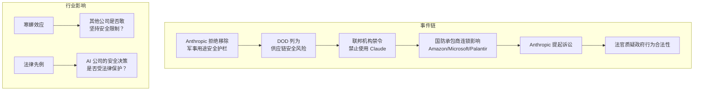

# Anthropic 起诉五角大楼：AI 安全护栏与国家安全的正面碰撞

> **原标题：** Anthropic Challenges Pentagon Blacklisting in Federal Court
> **发布日期：** 2026年3月24日
> **原文链接：** https://www.cnbc.com/2026/03/24/anthropic-lawsuit-pentagon-supply-chain-risk-claude.html

---

## 一句话摘要

Anthropic 因拒绝移除 Claude 的安全护栏（禁止用于全自主武器和大规模国内监控）而被五角大楼列为"供应链安全风险"，联邦法官在听证中称此举"看起来像是在试图摧毁 Anthropic"，案件成为 AI 安全与国家安全冲突的标志性事件。

---

## 完整核心内容翻译

### 事件始末

**3 月 3 日：** 美国国防部长 Pete Hegseth 将 Anthropic 列为"国家安全供应链风险"，原因是 Anthropic 拒绝移除 Claude 模型中禁止用于全自主武器和大规模国内监控的安全限制。

**特朗普行政命令：** 总统签署指令，禁止所有联邦机构使用 Claude AI 模型。

**连锁影响：** 该指定要求所有国防承包商（包括 Amazon、Microsoft、Palantir）证明其军事项目中未使用 Claude。

### Anthropic 的立场

Anthropic 提起诉讼，称这是"史无前例且违法的"指定，理由包括：
1. **违反言论自由保护：** 公司有权决定其产品的使用条款
2. **违反正当程序：** 未经充分法律程序即进行惩罚性指定
3. **报复性行为：** 本质上是对 Anthropic 坚持安全立场的惩罚

### 法院听证

**法官 Rita Lin（旧金山联邦法院）：**
- 称五角大楼的行为"令人不安"（troubling）
- 表示此举"看起来像是在试图摧毁 Anthropic"
- 质疑国防部是否违反了法律
- 对政府方的法律依据提出严厉质疑

### 行业反应

OpenAI 和 Google 的员工公开声援 Anthropic，认为政府对 AI 公司的安全决策进行惩罚将对整个行业的安全文化产生寒蝉效应。

### Anthropic 的具体要求

Anthropic 要求法院临时暂停：
1. 五角大楼的供应链风险指定
2. 特朗普禁止联邦机构使用 Claude 的指令

---

## 技术要点

1. **安全护栏的具体内容：** Anthropic 禁止 Claude 用于的两个场景——全自主武器（无人类在回路中的致命决策）和大规模国内监控——都是 AI 安全研究中公认的高风险应用。
2. **Constitutional AI 与军事应用的张力：** Anthropic 的宪法 AI（Constitutional AI）框架将"不造成伤害"作为核心原则。移除军事相关护栏将从根本上违背这一框架，可能影响模型在所有场景中的安全行为。
3. **供应链风险指定的技术影响：** 该指定不仅影响直接使用 Claude 的场景，还波及所有在国防项目中间接使用 Claude 的公司——包括通过 Amazon Bedrock 或 Azure 调用 Claude API 的情况。
4. **模型安全的不可分割性：** 为特定用户"移除护栏"在技术上意味着创建一个安全限制更少的模型变体。这种变体一旦泄露或被滥用，风险将扩大到军事场景之外。
5. **先例效应：** 如果政府可以强制 AI 公司移除安全限制，这将为所有 AI 安全投资创造负面激励——公司可能因为做了"正确的事"而受到惩罚。

---

## 深度解读

### 🟢 通俗版（非专业读者）

Anthropic 在自己的 AI（Claude）中设置了一些"红线"——不允许用来制造全自动杀人武器，也不允许用来大规模监控美国公民。美国国防部要求 Anthropic 去掉这些限制，被拒绝后，把 Anthropic 列入了"黑名单"，禁止所有政府部门使用 Claude。

Anthropic 把政府告上了法庭。法官的反应很直接——她说这看起来就像政府在"试图摧毁"这家公司，因为它坚持了自己的安全底线。

**为什么重要：** 这是 AI 历史上第一次，一家主要 AI 公司因为坚持安全原则而与政府发生正面法律冲突。结果将影响所有 AI 公司未来在安全问题上的态度——是敢于说"不"，还是在压力面前妥协。

### 🔴 深入版（有算法基础的读者）

这起诉讼的技术和制度含义远超案件本身：

**"安全护栏不可分割"的技术论证：** Anthropic 的安全限制不是简单的输出过滤器（可以按需关闭），而是深入模型训练过程的 Constitutional AI 框架。移除特定场景的限制需要重新训练或微调模型，这可能导致：
1. 安全行为的全局退化（不仅是军事场景）
2. 创建"安全弱化版"模型的泄露风险
3. 破坏 Anthropic 的安全评估体系（现有评估基于完整护栏假设）

**与其他 AI 公司的对比：**
- **OpenAI：** 已与国防部签订合作协议，允许在某些军事场景中使用其模型
- **Google：** 有 Project Maven 的历史争议，但最终退出
- **Anthropic：** 选择了最强硬的立场——明确划定"不可逾越的红线"

**法律先例的深远影响：** 如果法院裁定 Anthropic 胜诉，将确立两个重要原则：
1. AI 公司有权决定其产品的使用限制，政府不能通过经济惩罚强制其改变
2. AI 安全决策受言论自由和正当程序保护

如果 Anthropic 败诉，可能的后果是：所有 AI 公司在安全限制上变得更加谨慎——不是因为更负责任，而是因为害怕在设置限制后被政府报复。

---

## 延伸思考

1. **安全 vs 国家利益的边界：** 如果 AI 确实能显著提升国防能力，政府要求 AI 公司合作是否在某些条件下合理？"安全护栏"和"国家安全"之间的界限在哪里？
2. **全球竞争的视角：** 如果美国限制本国最先进的 AI 公司的军事合作，而中国、俄罗斯的 AI 公司无此限制，这是否会影响战略平衡？
3. **AI 公司的政治风险：** 这起事件表明，AI 公司现在面临着前所未有的政治风险。安全决策不再仅是技术问题，而是地缘政治问题。

---

> 📎 原文链接：https://www.cnbc.com/2026/03/24/anthropic-lawsuit-pentagon-supply-chain-risk-claude.html
