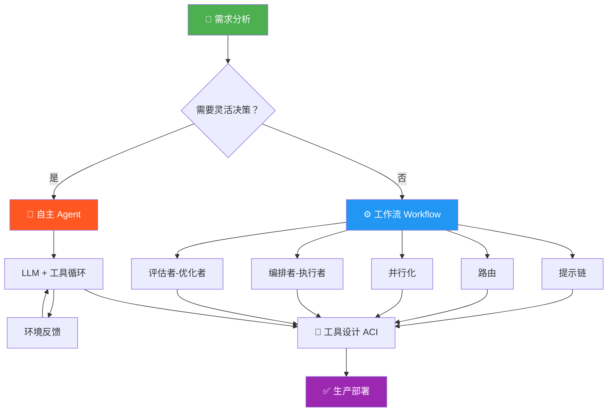
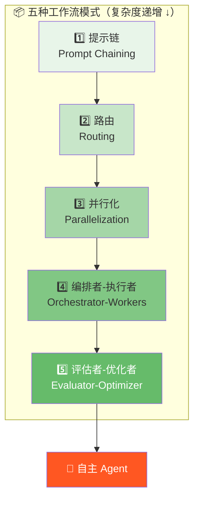
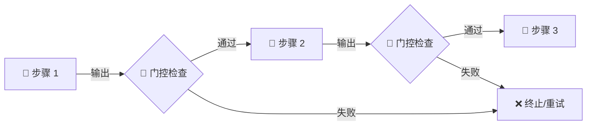
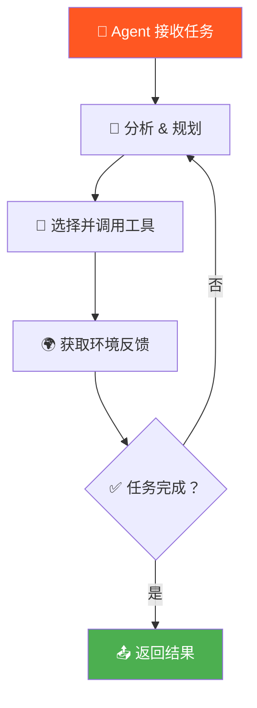
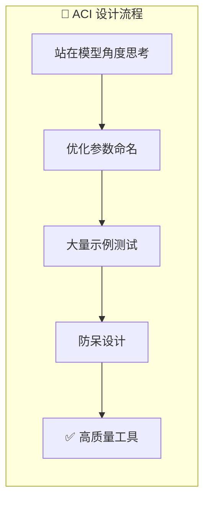
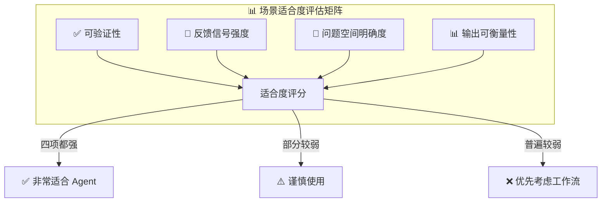

# Building Effective Agents | 构建高效的 AI Agent

> 📊 难度：⭐⭐⭐ | ⏱️ 阅读：18分钟 | 📅 2024-12-19 | 🏷️ Agent, 工作流, 架构模式, 工具设计

> **原标题：** Building Effective Agents
> **作者：** Erik Schluntz, Barry Zhang (Anthropic)
> **发布日期：** 2024 年 12 月 19 日

---

## 📌 一句话摘要

**成功的 Agent 系统不需要复杂的框架——用简单、可组合的模式，从最小可行方案出发，才是正道。**

---

## 🗺️ 一图看懂

---

## 🟢 通俗版：给非技术读者

### 🧩 这篇文章在讲什么？

想象你要开一家餐厅。你可以雇一个万能的大厨（Agent），让他自己决定做什么菜、怎么做；也可以制定一套标准化的流水线（工作流），让不同的人按步骤执行。

Anthropic 这篇文章说的就是：**别一开始就请大厨，先看看流水线能不能搞定。**

### 🎯 核心观点

| 比喻 | 含义 |
|------|------|
| 🏭 流水线 | 工作流——步骤固定，按顺序执行 |
| 🧑‍🍳 大厨 | Agent——自主判断，灵活应变 |
| 🔧 好用的厨具 | 工具设计——让 AI 用起来顺手的接口 |

### 📋 五种"流水线"模式

1. **提示链** 🔗 ——像传送带一样，一步接一步
2. **路由** 🚦 ——像前台分诊，把不同问题派给不同部门
3. **并行化** ⚡ ——多人同时干活，最后汇总
4. **编排者-执行者** 👔👷 ——经理分配任务，员工各自执行
5. **评估者-优化者** 🔄 ——一个人做，一个人改，反复打磨

### 💡 关键启示

> 不要为了用 Agent 而用 Agent。如果一个简单的提示词就能解决问题，那就够了。

---

## 🔴 深入版：给技术读者

### 📖 完整核心内容翻译

#### 一、引言：简单胜过复杂

在过去一年中，Anthropic 与数十个跨行业团队合作，协助他们构建基于大语言模型（LLM）的 Agent。一个反复出现的结论是：**最成功的实现并没有使用复杂的框架或专用库，而是基于简单、可组合的模式构建的。**

本文意在分享这些经验，为开发者提供构建高效 Agent 的实用指南。

---

#### 二、什么是 Agent？

"Agent" 这个词在业界众说纷纭。Anthropic 将其分为两大类架构：

- **工作流（Workflows）：** LLM 和工具按照**预定义的代码路径**运行。流程是固定的，开发者事先编排好每一步。
- **Agent（智能体）：** LLM **自主决定**流程走向和工具使用方式。模型根据当前环境动态规划行动。

二者并非对立，而是一个连续谱——从完全确定性的工作流，到完全自主的 Agent，开发者应根据具体场景选择合适的位置。

---

#### 三、何时使用 Agent？

核心原则：**先找到最简单的可行方案，再逐步增加复杂度。**

Agent 系统必然涉及延迟、成本与任务效果之间的权衡。具体而言：

| 场景特征 | 推荐方案 | 理由 |
|---|---|---|
| 🟩 任务定义明确、流程固定、需要可预测性 | 工作流 | 低延迟、低成本、高可控 |
| 🟥 任务开放、需要灵活性、由模型驱动决策 | Agent | 高灵活性、适应性强 |

不要为了"用 Agent"而用 Agent——如果一个简单的提示词加一次 LLM 调用就能解决问题，那就这样做。

---

#### 四、关于框架的看法

市面上已有多种框架可供选择，包括 Claude Agent SDK、AWS 的 Strands Agents SDK、Rivet（拖拽式 GUI 工作流构建器）、Vellum（可视化复杂工作流编辑器）等。

框架的好处是降低了 LLM 调用、工具链接等常见操作的门槛。但 Anthropic 给出了一个关键建议：

> **从直接使用 LLM API 开始。** 许多模式只需要几行代码即可实现。

原因在于：框架引入的抽象层会遮蔽底层的提示词和响应细节，增加调试难度，也容易让开发者在不必要的地方引入过度设计。在原型阶段使用框架无妨，但进入生产环境时，**减少抽象层、回归本质**往往更为可靠。

---

#### 五、构建模块与核心模式

以下是 Anthropic 总结的从简单到复杂的五种工作流模式，以及自主 Agent 模式。

##### 5.1 增强型 LLM（Augmented LLM）—— 一切的基石

最基础的构建单元是一个经过增强的 LLM，它具备三种能力：

- 🔍 **检索（Retrieval）：** 从外部知识库获取信息
- 🔧 **工具调用（Tools）：** 执行外部操作（API 调用、数据库查询等）
- 🧠 **记忆（Memory）：** 跨对话保持上下文

当前最先进的模型已经能够**主动运用**这些能力——自己生成搜索查询、选择合适的工具、决定哪些信息需要保留。Model Context Protocol（MCP）提供了与第三方工具和数据源集成的标准化方式。

##### 5.2 提示链（Prompt Chaining）

**将任务分解为顺序执行的多个步骤，每一步的 LLM 调用处理上一步的输出。**

关键特征：步骤之间可以插入编程化的**"门控检查"（Gates）**，验证中间结果是否合格，再决定是否继续。

**适用场景：**
- 任务可以自然分解为固定的子步骤
- 用延迟换取更高准确率
- 例如：先生成营销文案，再将其翻译为多种语言

##### 5.3 路由（Routing）

**对输入进行分类，并将其导向不同的专用处理路径。**

这种模式实现了"关注点分离"——每条路径可以使用各自优化过的提示词，避免因兼顾所有情况而导致任何一种情况的处理质量下降。

**适用场景：**
- 客服系统根据问题类别（退款、技术支持、账单）分流到不同处理流程
- 不同类型的查询需要差异化的处理策略

##### 5.4 并行化（Parallelization）

两种变体：

- **分段（Sectioning）：** 将任务拆分为**相互独立的子任务**，并行执行后汇总。例如：一个子模型负责内容安全审核（护栏），另一个同时执行核心任务。
- **投票（Voting）：** 对**同一个任务**运行多次，获取多样化的输出。适用于需要多视角的场景，如代码审查、内容评估。

##### 5.5 编排者-执行者（Orchestrator-Workers）

**一个中央 LLM（编排者）动态分解任务，分派给多个工作 LLM（执行者），最后综合结果。**

与并行化的关键区别在于**灵活性**：并行化的子任务是预先定义好的，而编排者模式中的子任务**由编排者根据具体输入动态决定**。

**适用场景：**
- 编码任务中需要同时修改多个文件
- 搜索任务中需要从多个数据源收集和分析信息

##### 5.6 评估者-优化者（Evaluator-Optimizer）

**一个 LLM 生成响应，另一个 LLM 提供评估和反馈，形成迭代循环。**

当存在明确的评估标准、且迭代优化能带来可衡量的改进时，这种模式最为有效。

**适用场景：**
- 文学翻译（一个翻译，一个评审，来回迭代直至满意）
- 复杂搜索任务（需要多轮检索和验证）

---

#### 六、自主 Agent

当 LLM 在以下能力上足够成熟时，真正的自主 Agent 才得以实现：

- 🧠 理解复杂输入
- 📐 推理与规划
- 🔧 可靠地使用工具
- 🔄 从错误中恢复

Agent 的工作方式本质上很简单：**LLM 在一个循环中根据环境反馈使用工具。** 每一步，Agent 都能从环境中获得"真实反馈"（ground truth）——工具返回的结果、代码执行的输出——而不是仅凭模型的想象行事。

**何时使用自主 Agent：**
- 问题高度开放，无法提前预测所有步骤
- 无法用固定路径硬编码解决方案
- 需要在可信环境中大规模自主运行

**⚖️ 权衡对比：**

| 维度 | 工作流 | 自主 Agent |
|------|--------|-----------|
| 💰 成本 | 低（少量 LLM 调用） | 高（多轮调用） |
| ⏱️ 延迟 | 可预测 | 不可预测 |
| 🎯 准确率 | 高（固定路径） | 视任务而定 |
| 🔄 灵活性 | 低 | 高 |
| 🐛 错误传播 | 可控 | 可能层层放大 |
| 🔍 可调试性 | 容易 | 需要透明机制 |

**典型案例：**
- 🖥️ 编码 Agent：在 SWE-bench Verified 基准测试中，仅凭 PR 描述就能解决真实的 GitHub Issue
- 🖱️ 计算机使用 Agent：Claude 操控计算机界面完成各类任务

---

#### 七、三大核心实践原则

1. 🎯 **保持简单（Simplicity）：** Agent 的设计越简洁越好。不要堆砌不必要的复杂性。
2. 🔍 **确保透明（Transparency）：** 让 Agent 的规划步骤可见、可解释。显式地展示思考过程，而非黑箱运行。
3. 🔧 **精心设计 Agent-计算机接口（ACI）：** 工具的文档、参数命名、行为设计，都需要像设计人机界面（HCI）一样用心。

---

#### 八、工具设计："给你的工具做提示工程"

这是文章中非常有洞察力的一部分。Anthropic 指出：**在 SWE-bench Agent 的开发中，他们花在优化工具设计上的时间比优化整体提示词还要多。**

同一个操作可以有多种格式（diff vs. 全文件重写、Markdown vs. JSON），而某些格式对 LLM 来说**明显更难处理**。

**📐 格式选择原则：**

- 给模型留出足够的 token 空间去"思考"
- 格式尽量贴近互联网上自然出现的文本样式（模型训练数据中常见的格式）
- 消除不必要的格式负担（如行号计数、字符串转义等）

**🏗️ ACI 设计最佳实践：**

- 设身处地站在模型的角度思考——仅凭工具描述，用法是否一目了然？
- 改进参数命名和描述，提升清晰度
- 在大量示例输入上进行充分测试
- 采用"防呆设计"（Poka-yoke）——让犯错变得更难。例如：要求使用绝对路径而非相对路径，从根本上避免路径错误。

---

#### 九、实际应用案例

##### 9.1 💬 客户服务

客服是 Agent 的天然应用场景。对话式交互本身就是 LLM 的强项，同时客服又需要调用外部系统（订单查询、退款处理等）。一些公司已经采用**按成功解决收费**的定价模式，说明了对 Agent 质量的信心。

##### 9.2 💻 编码 Agent

软件开发展现了最令人瞩目的潜力。Agent 在编码场景中尤其有效，原因有四：

1. ✅ 代码的正确性可以通过**自动化测试验证**
2. 🔄 Agent 可以利用测试结果作为**迭代反馈**
3. 📐 问题空间**定义清晰**
4. 📊 输出质量**可客观衡量**

尽管 Agent 已经能在 SWE-bench Verified 基准中解决真实的 GitHub Issue，但**人类审查仍然不可或缺**——Agent 可能写出功能正确但不符合更广泛系统设计的代码。

---

#### 十、结论

> **成功在于为具体需求构建合适的系统，而不是构建最复杂的系统。**

路线图很清晰：
1. 从简单的提示词开始
2. 通过全面的评估来优化
3. 只有在简单方案不够用时，才引入多步 Agent 系统

框架在初期开发中有帮助，但在生产部署时，减少抽象层通常是更明智的选择。

---

## 🧠 技术要点

### 要点一：五种工作流模式构成了 Agent 设计的完整工具箱

提示链、路由、并行化、编排者-执行者、评估者-优化者——这五种模式从简单到复杂，覆盖了绝大多数场景。开发者不需要发明新的架构，而是需要判断哪种模式最适合当前问题。

### 要点二：工具设计的重要性被严重低估

Anthropic 坦承在 SWE-bench 中，工具优化投入超过了提示词优化。这暗示了一个行业盲区：大多数开发者把精力放在 Prompt Engineering 上，却忽略了 Tool Engineering——参数命名、返回格式、错误处理，每一个细节都直接影响 Agent 的表现。

### 要点三：Agent 的核心是"环境反馈循环"

真正区分 Agent 和工作流的标志不是"自主决策"，而是**从环境中获取真实反馈的能力**。工具调用的返回值、代码执行的结果、API 的响应——这些"ground truth"让 Agent 得以自我纠正，而非在幻觉中越走越远。

### 要点四：透明性是信任的基础

Agent 必须让人看到它在想什么、计划做什么。黑箱式的 Agent 即使效果好，也难以在生产环境中被信任和采纳。显式的规划步骤不仅帮助调试，也帮助用户建立信心。

### 要点五：框架是拐杖，不是骨架

框架降低了入门门槛，但也引入了调试盲区。Anthropic 的建议很明确：原型阶段用框架快速验证，生产阶段回归 API 直调，保持对每一层的完全掌控。

| 要点 | 核心关键词 | 重要程度 |
|------|-----------|---------|
| 五种工作流模式 | 架构选择 | ⭐⭐⭐⭐⭐ |
| 工具设计 > 提示词 | ACI / Tool Engineering | ⭐⭐⭐⭐⭐ |
| 环境反馈循环 | Ground Truth | ⭐⭐⭐⭐ |
| 透明性 | 可解释性 | ⭐⭐⭐⭐ |
| 框架 vs API 直调 | 生产就绪 | ⭐⭐⭐ |

---

## 🔬 深度解读：对开发者构建 Agent 的实际指导意义

### "少即是多"哲学的回归

在 Agent 热潮中，很多团队的第一反应是搭建复杂的多 Agent 协作系统。Anthropic 这篇文章本质上是在泼冷水——**不是所有问题都需要 Agent，不是所有 Agent 都需要复杂。** 这种务实态度来自于真实的一线经验，而非学术理想。

### 模式选择即架构决策

五种工作流模式并非理论分类，而是实战中反复验证的架构原型。开发者面对新需求时，第一步应该是：**这个问题最接近哪种模式？** 而不是从零设计。这是一种"设计模式"级别的思维工具，类似于 GoF 设计模式之于面向对象编程。

### ACI 是被忽视的第二战场

文章揭示了一个关键洞见：**对于 Agent 来说，工具就是它的"用户界面"。** 正如好的 UI 设计让用户不犯错，好的工具设计让 Agent 不犯错。"Poka-yoke（防呆设计）"这个概念从制造业引入 Agent 设计，极具启发性——与其让模型学会避免错误，不如让工具本身不允许错误发生。

### 编码场景是 Agent 的最佳试炼场

文章点明了编码场景为何特别适合 Agent 的四个原因，这其实也暗示了**评估其他场景是否适合 Agent 的标准**：可验证性、反馈信号的强度、问题空间的明确度、输出的可衡量性。如果你的场景在这四个维度上都很弱，那么 Agent 可能还不是最佳选择。

### 对"信任"的隐含讨论

文章多次提到 Agent 需要"一定程度的信任"，且错误可能"层层传递"。这实际上指向了 Agent 应用的核心障碍：**不是技术能力不够，而是可控性和可审计性不足。** 透明性、人类审查、防呆设计——这些机制本质上都在回答同一个问题：如何让人类对 Agent 的行为保持信心。

---

## 💭 延伸思考

1. **🔀 Agent 与工作流的融合趋势：** 未来最实用的系统很可能不是纯粹的 Agent 或纯粹的工作流，而是两者的混合体——在确定性强的环节使用工作流保证可靠性，在需要灵活应变的环节切换为 Agent 模式。这种"混合智能体"架构值得更多探索。

2. **🏰 工具生态将成为竞争护城河：** 如果工具设计（ACI）真的如此重要，那么谁能构建出最好用的工具生态，谁就能让自己的 Agent 表现最好。Model Context Protocol（MCP）的提出正是朝这个方向迈出的一步——标准化工具接口，降低集成成本。

3. **📏 评估体系的缺失：** 文章反复强调"全面评估"的重要性，但并未深入讨论如何构建评估体系。对于复杂的 Agent 系统，评估本身可能比构建 Agent 还难——如何定义成功？如何衡量"差不多对了"？如何测试 Agent 在边界情况下的行为？这是一个亟需行业共建的领域。

4. **🔄 错误传播与自愈能力：** 文章提到错误会"层层传递"，但真正强大的 Agent 应该具备自愈能力——检测到偏离轨道时能够自我纠正。这需要更好的自我反思机制和更丰富的环境反馈信号。

5. **🤝 从单 Agent 到多 Agent 协作：** 本文聚焦于单个 Agent 系统的设计，但实际应用中多 Agent 协作（如编排者-执行者模式的扩展）将成为必然趋势。如何在多个 Agent 之间建立有效的通信协议、避免冲突、分配任务，是下一阶段的核心挑战。

---

## 🔗 原文链接

[Building Effective Agents - Anthropic Engineering](https://www.anthropic.com/engineering/building-effective-agents)
