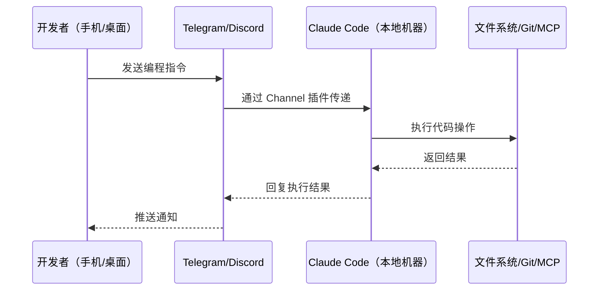

# Claude Code Channels：从终端到 Telegram 和 Discord 的异步编程

> **原标题：** Claude Code Channels
> **发布日期：** 2026年3月20日
> **原文链接：** https://code.claude.com/docs/en/channels

---

## 一句话摘要

Anthropic 发布 Claude Code Channels（研究预览），通过插件架构将 Claude Code 连接到 Telegram 和 Discord，开发者可以随时随地通过消息应用向本地运行的 Claude Code 下达编程指令，开启异步自主编程新范式。

---

## 完整核心内容翻译

### 核心概念

Claude Code Channels 是一个基于插件的功能，允许开发者从 Telegram 或 Discord 直接向本地运行的 Claude Code 会话发送消息。会话以完整的文件系统、MCP 工具和 Git 访问权限处理请求，然后通过同一消息应用回复结果。

### 工作流程

### 关键特性

1. **完整本地访问：** Channel 消息直接进入本地 Claude Code 会话，拥有完整的文件系统、Git 和 MCP 工具访问权限。
2. **异步工作模式：** 从同步的"问-等"模式转变为异步的"指令-通知"模式。开发者可以在通勤路上发送任务，到办公室时查看结果。
3. **插件架构：** Telegram 和 Discord 是首批支持的平台，架构设计支持后续扩展更多平台。
4. **MCP 基础设施：** 底层基于 Anthropic 在 2024 年推出的 Model Context Protocol 开放标准，提供标准化的 AI 与外部工具连接方式。

### 典型使用场景

- **移动端代码审查：** 在手机上让 Claude 审查最新 PR 并给出修改建议
- **远程调试：** 通过 Telegram 描述问题，Claude 直接在本地环境中诊断和修复
- **持续任务监控：** 启动长时间运行的任务后，通过 Discord 获取进度更新
- **跨设备工作流：** 在平板上构思方案，通过 Channel 让本地 Claude Code 实现

### 安全模型

Channel 会话继承本地 Claude Code 的权限设置。所有操作都在用户的本地机器上执行，不经过第三方服务器处理代码。

---

## 技术要点

1. **本地执行，远程控制：** 计算和文件操作都在本地机器完成，消息应用仅作为通信通道，保障代码安全性。
2. **MCP 标准化接口：** 基于 Model Context Protocol 构建，使得 Channel 可以访问所有已配置的 MCP 服务器（数据库、API、文档等）。
3. **插件化可扩展架构：** Telegram 和 Discord 作为首批插件发布，架构上支持添加 Slack、Teams 等企业通信平台。
4. **会话状态持久化：** Channel 消息进入正在运行的 Claude Code 会话，共享完整的对话上下文和工作状态。
5. **与 OpenClaw 的竞争定位：** 媒体将 Channels 与 OpenClaw 的消息集成功能对比，标志着 AI 编程工具正在从终端走向全渠道。

---

## 深度解读

### 🟢 通俗版（非专业读者）

以前用 AI 写代码，你必须坐在电脑前，打开终端，一条一条输入指令。Claude Code Channels 就像给你的 AI 程序员配了一个微信号——你在地铁上用 Telegram 发一条消息说"帮我把那个登录页面的 bug 修了"，AI 就会在你的电脑上自动修复，修完了给你发条消息"搞定了，这是改了什么"。

**为什么重要：** 这改变了"人必须在电脑前才能让 AI 工作"的限制，让 AI 编程助手变成了真正的"远程同事"。

### 🔴 深入版（有算法基础的读者）

Channels 的技术架构值得深入分析：

**MCP 作为统一抽象层：** Channels 的真正威力不在于 Telegram/Discord 集成本身，而在于它暴露了 MCP 的全部能力。一个 Channel 消息可以触发数据库查询（通过 MCP 数据库服务器）、API 调用（通过 MCP API 服务器）、文件操作（通过本地文件系统），这意味着 Channel 实际上是一个通用的远程智能体控制接口。

**异步智能体的工程挑战：**
- **上下文管理：** 异步消息天然是碎片化的，如何在多条零散消息间维持连贯的任务上下文是核心难题。
- **并发控制：** 如果多条 Channel 消息同时到达，如何避免并发文件操作冲突？
- **错误恢复：** 异步环境下，操作失败时用户可能不在线，需要更健壮的错误处理和状态回滚机制。

**与 CI/CD 的融合前景：** Channels 可能演化为一种新型的"对话式 CI/CD"——开发者通过消息触发构建、测试、部署，Claude 作为智能体协调整个流水线。

---

## 延伸思考

1. **安全边界扩展：** 将编程智能体暴露到公共消息平台，是否增加了攻击面？如果攻击者获取了 Telegram 账号控制权，就等于获取了本地文件系统访问权限。
2. **团队协作场景：** 如果多个团队成员通过同一个 Discord 频道向 Claude Code 下达指令，如何处理冲突和优先级？
3. **从编程到通用工作：** 如果这种模式成功，是否会扩展到非编程场景——比如通过 Telegram 让 AI 整理文档、分析数据、生成报告？

---

> 📎 原文链接：https://code.claude.com/docs/en/channels
