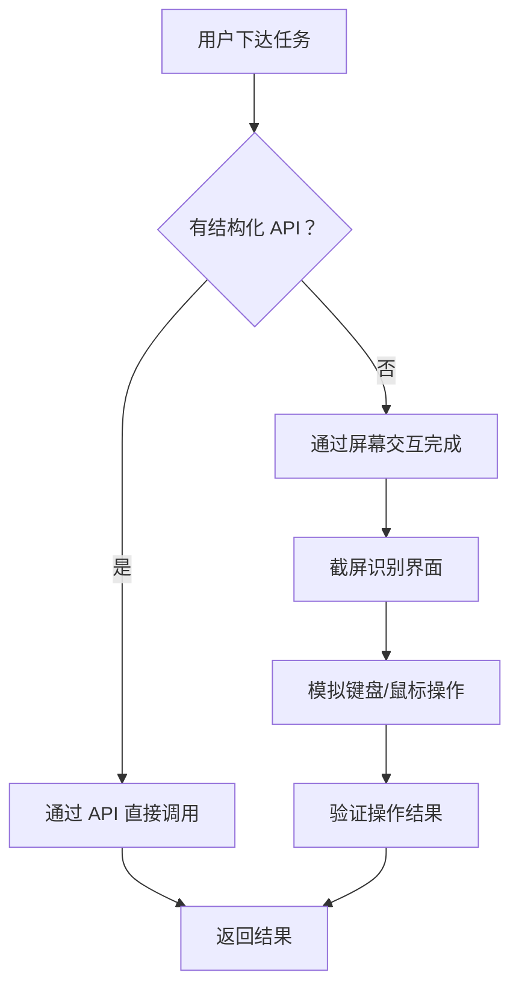

# Claude Cowork 桌面控制：AI 接管你的 Mac

> **原标题：** Claude Computer Use in Cowork
> **发布日期：** 2026年3月24日
> **原文链接：** https://www.anthropic.com/news/claude-cowork-computer-use

---

## 一句话摘要

Anthropic 为 Claude Cowork 推出桌面控制（Computer Use）功能，Claude 可以直接操控 macOS 的键盘和鼠标，打开应用、浏览网页、填写表格，配合 Dispatch 功能实现从手机端远程指派任务。

---

## 完整核心内容翻译

### 功能概述

Claude Cowork 获得了直接控制 macOS 桌面的能力——键盘输入、鼠标点击、应用切换，以及在没有结构化 API 的情况下通过屏幕交互完成任务。

### 工作方式

Claude 优先使用结构化 API 连接器完成任务（更快、更可靠），仅在 API 不可用时才回退到屏幕级交互。

### 典型场景

- **数据整理：** 打开 Excel，自动填写和格式化数据
- **网页研究：** 打开浏览器，搜索信息并汇总
- **跨应用工作流：** 从邮件复制内容到文档，再生成演示文稿
- **表单填写：** 自动登录网站并完成表单提交

### Dispatch 远程指派

Dispatch 功能（上周发布）允许用户通过手机或桌面与 Claude 持续对话，远程指派任务。结合 Computer Use：

1. 用户在手机上发送任务："帮我把这周的销售数据整理成报表"
2. Claude 在 Mac 上打开相关应用
3. 自动完成数据收集、整理、格式化
4. 通知用户任务完成

### 安全机制

- **应用级权限：** Claude 访问新应用前必须征得用户许可
- **macOS 隔离：** 利用 macOS 原生的权限管理系统
- **Pro/Max 限定：** 仅面向 Claude Pro 和 Max 订阅用户
- **设置中手动启用：** 需要在桌面应用设置中主动开启

### 当前限制

- 仅支持 macOS
- 需要在桌面应用设置中手动启用
- 屏幕交互模式下速度较慢

---

## 技术要点

1. **双通道交互策略：** 优先使用结构化 API（速度快、准确率高），仅在 API 不可用时回退到屏幕级交互（基于截屏理解和模拟输入），实现最大覆盖率。
2. **多模态理解：** 屏幕交互依赖视觉理解能力——模型需要"看懂"屏幕内容、识别 UI 元素位置、规划点击和输入序列。
3. **Dispatch 异步架构：** 用户通过手机发送任务后无需保持连接，Claude 在 Mac 上独立完成工作并异步通知，实现真正的"后台智能体"。
4. **macOS 原生集成：** 通过 macOS 辅助功能（Accessibility）API 获取屏幕控制权限，利用操作系统级别的安全沙箱。
5. **从 Computer Use Beta 到产品化：** 2024 年底 Anthropic 首次展示 Computer Use 研究预览，经过一年多的迭代，现在正式进入消费级产品。

---

## 深度解读

### 🟢 通俗版（非专业读者）

以前 AI 助手只能在聊天框里回答问题。现在 Claude 真的可以"坐在你的电脑前帮你干活"了——打开 Excel 填数据、打开浏览器查资料、帮你做 PPT。更厉害的是，你可以在手机上给它派任务，然后去做别的事，回来时工作已经完成了。

就像你雇了一个远程助理，只不过这个助理是 AI，而且它真的在操作你的电脑。

**为什么重要：** 这是 AI 从"对话工具"变成"真正的数字员工"的标志性时刻。不再局限于文字交流，而是实际动手干活。

### 🔴 深入版（有算法基础的读者）

Computer Use 的产品化标志着多模态智能体从研究走向生产的重要里程碑：

**屏幕理解的工程复杂度：** GUI 交互不像 API 调用那样确定性强。UI 布局变化、弹窗干扰、加载延迟都可能导致操作失败。Anthropic 采用的"API 优先，屏幕回退"策略是务实选择——结构化接口覆盖高频场景，屏幕交互覆盖长尾场景。

**与 Google Gemini Computer Use 的路线对比：**
- Anthropic 选择本地桌面控制（macOS 原生集成），优势是低延迟和完整本地访问
- Google 在 Gemini 2.5 中也展示了类似能力，但更侧重 Android 生态
- 两者竞争的本质是：谁能更早建立"AI 操作系统级集成"的标准

**安全性的根本张力：** 给 AI 桌面控制权意味着它理论上可以执行任何用户能做的事——包括发送邮件、转账、删除文件。Anthropic 目前的"应用级权限申请"是最小可行安全方案，但长期来看可能需要更细粒度的权限模型（类似移动端的权限管理）。

---

## 延伸思考

1. **可审计性挑战：** 当 AI 通过屏幕交互操作时，操作日志远不如 API 调用完整。如何确保可追溯性和可审计性？
2. **多步骤任务的容错：** 一个 10 步的 GUI 操作序列中，第 7 步失败了怎么办？屏幕级操作的回滚远比 API 调用复杂。
3. **数字员工的劳动力市场影响：** 如果 AI 可以操作电脑完成行政工作，数据录入、表格处理等岗位会受到多大影响？

---

> 📎 原文链接：https://www.anthropic.com/news/claude-cowork-computer-use
