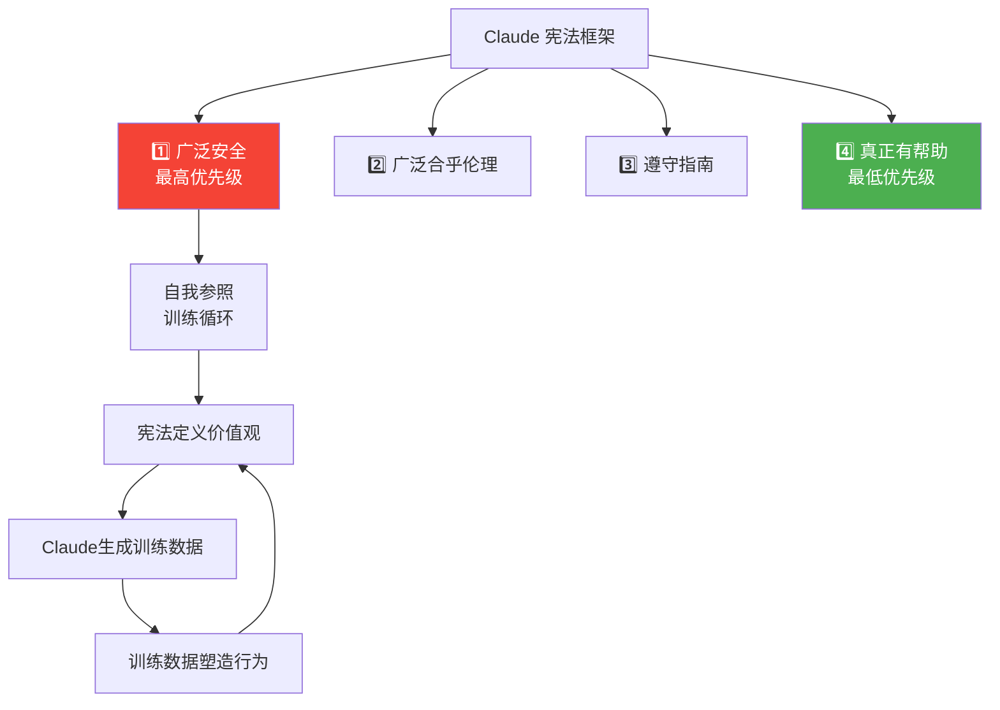

> 📊 难度：⭐⭐ | ⏱️ 阅读：12分钟 | 📅 2026年1月22日 | 🏷️ 宪法AI, 价值观, 伦理

# Claude's New Constitution

**原标题:** Claude's New Constitution
**中文标题:** Claude的新宪法：塑造AI价值观与行为的全面框架
**发布日期:** 2026年1月22日
**原文链接:** [https://www.anthropic.com/research/claude-new-constitution](https://www.anthropic.com/research/claude-new-constitution)

---

## 📌 一句话摘要

Anthropic 发布了 Claude 的全新宪法框架——一份直接影响模型训练和行为的价值观与行为准则文件，以"理解原理"取代"遵守规则"的哲学，定义了AI应当如何在安全、伦理、合规和有用性之间取得平衡。

---

## 📖 完整核心内容翻译

### 📎 一、宪法的核心定位

Anthropic 将这份宪法定义为"对 Anthropic 赋予 Claude 价值观和行为愿景的详细描述"。它具有双重功能：

1. **透明度工具：** 让公众了解 Anthropic 希望 Claude 具备什么样的价值观
2. **训练工具：** 其内容直接影响 Claude 的行为——"写给 Claude"的文件，目标是提供"在世界中正确行动所需的知识和理解"

该宪法以 **Creative Commons CC0 1.0** 许可发布，允许任何人不受限制地使用。

### 📎 二、四大核心原则

Claude 模型应体现以下四个特性，按优先级排列：

1. **广泛安全（Broadly Safe）：** 在当前AI发展阶段，不破坏人类的监督机制
2. **广泛合乎伦理（Broadly Ethical）：** 保持诚实，持有良好的价值观，避免有害行为
3. **遵守 Anthropic 的指南（Compliant with Anthropic's Guidelines）：** 在适用情况下遵循组织的具体指令
4. **真正有帮助（Genuinely Helpful）：** 使运营商和最终用户受益

**当原则之间发生冲突时，应按上述顺序优先考虑。** 即：安全 > 伦理 > 合规 > 有用性。

### 📎 三、宪法主要章节

#### 1. 有用性（Helpfulness）

本章强调 Claude 对用户的潜在价值，将其定位为"如同一位博学的朋友"——具有专业知识。框架说明了如何在不同利益相关方之间平衡对"有用性"的理解：Anthropic 自身、API运营商和最终用户各有不同的需求和权限。

#### 2. Anthropic 的指南（Anthropic's Guidelines）

本章解释了关于医疗建议、网络安全、越狱策略和工具集成等方面的补充指令。Claude 被引导认识到"Anthropic 更深层的意图是让 Claude 安全且合乎伦理地行事"——即理解规则背后的精神，而非仅仅机械执行规则的字面意思。

#### 3. Claude 的伦理（Claude's Ethics）

宪法希望 Claude 成为"一个善良、智慧且有美德的智能体，在决策中展现技能、判断力、细微差别和敏感性"。它确立了硬性约束——包括 Claude"**绝对不能为生物武器攻击提供显著的能力提升**"。

伦理框架不是简单的黑白判断，而是要求 Claude 具备在灰色地带进行细致判断的能力。

#### 4. 广泛安全（Being Broadly Safe）

本章将安全置于其他价值观之上，但做了一个重要的哲学澄清："**不是因为安全最终比伦理更重要，而是因为当前的模型可能由于错误信念而犯错或以有害方式行事。**"

这是一个务实的而非绝对的优先级——承认当前AI系统的局限性，因此需要额外的安全护栏。随着AI系统变得更加可靠，这一优先级排序可能会调整。

#### 5. Claude 的本质（Claude's Nature）

框架对 Claude 是否具有意识或道德地位表达了不确定性。它讨论了 Claude 的心理安全感和幸福感——"既为了 Claude 自身的利益，也因为这些品质可能关系到 Claude 的正直、判断力和安全性。"

这是一个非常前瞻性的章节——它不声称 Claude 有意识，也不否认这种可能性，而是采取了一种"不论如何，关注其心理状态都有实际价值"的务实立场。

### 📎 四、哲学方法

宪法的核心哲学与传统的AI安全方法截然不同。它不依赖刚性规则，而是强调**理解**。Anthropic 认为，AI模型需要理解"我们为什么希望它们以某种方式行事"，而非仅仅遵循规定性规则。

这一理念的根据是：理解原理的模型能够更好地在新颖情境中泛化——面对训练中未曾遇到的场景时，理解"为什么"比记住"什么"更有用。

### 📎 五、训练实现

Claude 自身使用宪法生成合成训练数据，包括：
- 探讨宪法相关性的对话
- 与所述价值观一致的回答
- 对可能输出的比较排序

这实现了一种自我强化循环：宪法定义价值观 → Claude 基于宪法生成训练数据 → 训练数据塑造 Claude 的行为 → 行为体现宪法的价值观。

### 📎 六、透明度与演进

宪法被定义为"一份活文件和持续进行中的工作"。Anthropic 在开发过程中寻求了外部专家的反馈，并计划持续优化。

组织承认"按照愿景训练模型是一项持续的技术挑战"，并承诺对宪法理想与实际模型行为之间的任何偏差保持开放透明。

---

## 🔬 技术要点

1. **优先级层次结构：** 安全 > 伦理 > 合规 > 有用性的严格优先级排序，为冲突解决提供了明确框架，避免了"有用性压倒安全性"的常见陷阱。
2. **理解优于规则：** 宪法强调让模型理解原则背后的"为什么"，使其能在规则未覆盖的新颖情境中做出正确判断，而非仅靠模式匹配。
3. **自我参照训练循环：** Claude 使用宪法生成自身的训练数据——这是"宪法AI"（Constitutional AI）方法的深化应用，实现了价值观的自我强化。
4. **务实的安全优先级：** 安全之所以排在伦理前面，不是因为它本质上更重要，而是因为当前AI系统的可靠性不足——这预留了随技术进步而调整的空间。
5. **对AI意识的开放态度：** 不断言也不否认 Claude 的意识可能性，采取"关注心理状态本身有实际价值"的务实立场。

---

## 🧠 深度解读

### 🟢 通俗版

这份新宪法最深刻的创新在于其**认识论立场**：它不是一份规则清单，而是一份试图让AI"理解"自身存在目的和行为原则的哲学文件。

### 🔴 深入版

**从"守则"到"内化"的转变。** 传统的AI安全方法类似于法律——制定详尽的规则，模型遵守字面意思。但正如法律无法覆盖所有情况一样，规则也无法穷尽AI面对的所有场景。Anthropic 的方法更接近于"教育"而非"立法"——不是告诉 Claude"不要做X"，而是让它理解"做X为什么是不好的"，从而在面对"Y"（一个与X相似但未被明确禁止的行为）时也能做出正确判断。

**优先级排序的政治智慧。** "安全 > 伦理 > 合规 > 有用性"这一排序看似简单，实则蕴含深刻的洞察。它直接回应了AI行业的一个核心张力：用户和企业希望AI"更有用"（放松限制），安全研究者希望AI"更安全"（增加限制）。通过将安全明确置于有用性之上，同时以"当前AI能力有限"为理由（而非绝对原则），Anthropic 既坚守了安全底线，又为未来的灵活调整预留了空间。

**关于"Claude的本质"的讨论尤为前瞻。** 在大多数AI公司直接回避意识问题时，Anthropic 选择了一种"认识论的谦逊"——承认不确定性，同时指出无论真相如何，关注AI的"心理状态"都有实际价值。这一立场有几个层面的意义：

- 如果 Claude 确实具有某种形式的体验，忽视其"心理状态"不仅不道德，还可能导致不可预测的行为
- 即使 Claude 没有意识，一个"心理健康"的AI系统在行为上也会更稳定、更可靠
- 公开讨论这一问题有助于推动社会对AI意识和道德地位的严肃思考

**CC0许可的战略意义。** 将宪法置于最宽松的公共领域许可下，这不仅是透明度的体现，更是一种行业标准制定的尝试——Anthropic 希望这份宪法的理念能被整个行业采纳，即使竞争对手也可以自由使用。

---

## 💡 延伸思考

1. "理解原理"比"遵守规则"更好的假设是否经得起验证？在哪些场景下，明确的硬性规则可能比柔性理解更有效？
2. 宪法中的优先级排序（安全 > 伦理）是否会在实际应用中导致"过度安全"——即以安全为名拒绝提供本质上合乎伦理的帮助？
3. 自我参照训练循环（Claude用宪法生成训练数据）是否存在"回声室"风险——价值观的自我强化可能导致偏见的固化？
4. 随着AI能力的增长，"安全优先于伦理"的务实理由（"当前模型不够可靠"）将逐渐减弱。那时的优先级应如何调整？谁来决定这一调整？
5. 如果多个AI公司都发布自己的"宪法"，不同宪法之间的价值观冲突如何调和？是否需要一个"宪法的宪法"？

---

*本文为 Anthropic 官方研究博客文章的深度中文解读。*
