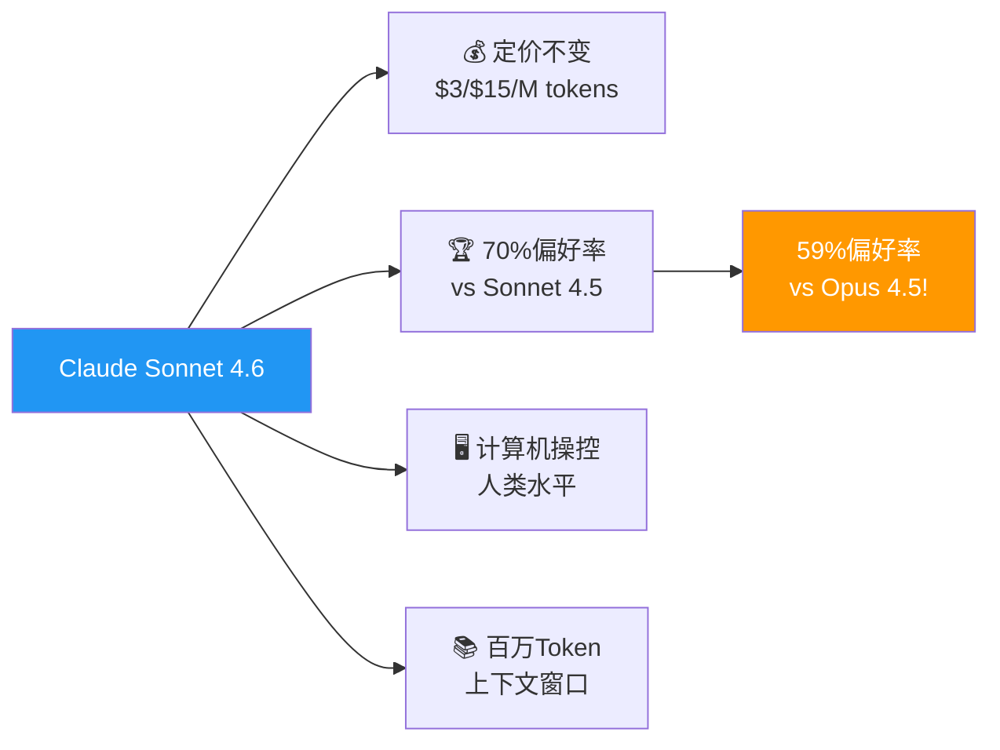

> 📊 难度：⭐⭐ | ⏱️ 阅读：11分钟 | 📅 2026年2月17日 | 🏷️ 模型发布, Sonnet, 性价比

# Claude Sonnet 4.6：Anthropic 迄今最强 Sonnet 模型

> **原标题：** Introducing Claude Sonnet 4.6
> **发布日期：** 2026年2月17日
> **原文链接：** https://www.anthropic.com/news/claude-sonnet-4-6

---

## 📌 一句话摘要

Anthropic 发布 Claude Sonnet 4.6，在编程、计算机操控、长上下文推理、智能体规划、知识工作和设计能力上全面升级，配备百万 token 上下文窗口（beta），且定价保持不变。

---

## 📖 完整核心内容翻译

### 🌐 总览

Anthropic 宣布推出 Claude Sonnet 4.6，称其为"我们有史以来最强大的 Sonnet 模型"。该模型在编程、计算机操控、长上下文推理、智能体规划、知识工作和设计能力等方面均实现了全面提升，并首次为 Sonnet 系列提供百万 token 上下文窗口（beta 阶段）。

### 可用性与💰 定价

- 在 claude.ai 和 Claude Cowork 上成为免费版和 Pro 版用户的默认模型
- 定价与 Sonnet 4.5 完全一致：输入 $3 / 输出 $15（每百万 token）
- 可通过所有 Claude 计划、Claude Cowork、Claude Code、API 以及各大云平台使用
- 免费版默认升级至 Sonnet 4.6，支持文件创建、连接器、技能和上下文压缩功能

### 📎 编程能力

早期测试显示，用户在约 **70%** 的情况下更偏好 Sonnet 4.6 而非 Sonnet 4.5。更令人瞩目的是，用户甚至在 **59%** 的情况下更偏好它而非 Opus 4.5（2025年11月发布的前沿模型）。具体改进包括：修改代码前更充分地阅读上下文、更好地整合共享逻辑、更少的虚假成功声明和幻觉，以及在多步骤任务中更稳定的完成率。

### 📎 计算机操控

Sonnet 4.6 在 OSWorld 基准测试上取得了显著进步。模型展现出"在复杂电子表格导航或多步骤网页表单填写等任务上的人类水平能力"。在防范提示注入攻击方面，相比 Sonnet 4.5 有了重大改进，表现与 Opus 4.6 相当。

### 📎 长上下文推理

百万 token 上下文窗口使模型能够处理完整代码库、冗长合同或数十篇研究论文，并"在所有上下文中进行有效推理"，改善了长期规划能力。在 Vending-Bench Arena 评估中，Sonnet 4.6 展示了一种战略性方法：在前十个模拟月份大力投资产能建设，随后急剧转向盈利，最终大幅领先竞争对手。

### 📎 设计与视觉输出

早期客户不约而同地将 Sonnet 4.6 的视觉输出描述为明显更精致，在布局、动画和设计感方面均优于前代模型。达到生产级别品质所需的迭代轮次更少。

### 📊 基准测试表现

- **文档理解（OfficeQA）：** 与 Opus 4.6 持平，衡量模型阅读企业文档（图表、PDF、表格）、提取相关事实并推理的能力
- **保险工作流：** 在提交受理和首次损失通知工作流中达到 **94%** 准确率，为计算机操控应用测试中的最高水平
- **金融分析：** 金融服务基准答案匹配率相比 Sonnet 4.5 显著提升
- **企业文档任务：** 在真实企业文档的深度推理问答中，比 Sonnet 4.5 提升 **15个百分点**

### 🛡️ 安全评估

广泛的安全评估表明 Sonnet 4.6 的安全性与其他近期 Claude 模型持平或更优。安全研究人员总结认为，该模型拥有"总体温暖、诚实、亲社会且时而幽默的性格，非常强大的安全行为，且在高风险错位形式方面没有显示重大隐患"。

### 📎 平台功能更新

- 支持自适应思维和扩展思维模式
- 上下文压缩（beta）：对话接近限制时自动总结较早的上下文
- 网页搜索和抓取工具现可自动编写并执行代码来过滤和处理结果
- 代码执行、记忆、程序化工具调用、工具搜索和工具使用示例全面上线（GA）
- Claude in Excel 插件现支持 MCP 连接器，集成 S&P Global、LSEG、Daloopa 等数据源

### 📎 客户评价精选

- **Databricks：** 文档理解工作负载的改进达到了 Opus 4.6 的水平
- **Replit：** "性能与成本比……非凡"，在编排评估和复杂智能体工作负载上表现卓越
- **GitHub：** 在大型代码库中处理复杂代码修复表现出色，适合规模化智能体编码团队
- **Bolt：** 在复杂应用构建和 bug 修复上取得前沿级成果，替代了更昂贵的模型

---

## 🔬 技术要点

1. **百万 token 上下文窗口（beta）：** 首次在 Sonnet 系列中提供，能处理完整代码库和大量文档，支持跨上下文有效推理
2. **计算机操控达到人类水平：** 在 OSWorld 基准测试上取得显著进步，提示注入防御能力与 Opus 4.6 相当
3. **性价比突破：** 定价保持 Sonnet 4.5 水平（$3/$15/M tokens），但在 70% 的用例中表现优于前代，甚至 59% 优于 Opus 4.5
4. **自适应思维与上下文压缩：** 模型可智能决定何时使用扩展推理，长对话中自动压缩上下文以维持性能
5. **企业级文档推理大幅提升：** 企业文档深度推理问答提升15个百分点，金融分析和保险工作流准确率均创新高

---

## 🧠 深度解读

### 🟢 通俗版

Sonnet 4.6 的发布标志着 Anthropic 在"以更低成本提供更强能力"这一战略方向上的又一次重大突破。最引人注目的数据是：用户在 59% 的情况下更偏好 Sonnet 4.6 而非上一代旗舰模型 Opus 4.5。这意味着 Sonnet 系列正在系统性地侵蚀 Opus 的独占领地——对于绝大多数日常使用场景，用户不再需要为最强模型支付溢价。

### 🔴 深入版

百万 token 上下文窗口的引入使 Sonnet 首次能够处理企业级规模的文档和代码库，这对于智能体编码（agentic coding）场景尤为关键。结合上下文压缩功能，模型可以在超长对话中持续保持高质量输出，解决了此前长对话中性能衰减的痛点。

在计算机操控方面，Sonnet 4.6 达到了"人类水平"的里程碑，同时在提示注入防御上与旗舰模型 Opus 4.6 持平。这表明安全性不再是高端模型的专利——即使是中端定价的模型也能提供前沿级的安全保障。

从客户反馈来看，多家头部科技公司（GitHub、Replit、Cursor、Bolt 等）已将 Sonnet 4.6 定位为可替代更昂贵模型的生产级选择。这种"向下兼容"的趋势正在重塑 AI 模型的市场格局。

---

## 💡 延伸思考

1. **Sonnet 与 Opus 的定位问题：** 当中端模型在多数场景下已经超越上一代旗舰，Opus 系列如何持续证明其溢价的合理性？这是否预示着 AI 模型市场将逐步走向"一个模型打天下"的格局？
2. **计算机操控的商业化拐点：** 人类水平的计算机操控能力加上高度的提示注入防御，是否意味着自动化办公和 RPA 领域即将迎来颠覆性变革？
3. **免费版用户的福利：** 将 Sonnet 4.6 设为免费版默认模型，同时开放文件创建、连接器等高级功能，Anthropic 正在以何种策略争夺消费级市场？
4. **上下文压缩技术的意义：** 自动上下文压缩是否会改变用户与 AI 交互的基本范式？从"单次对话"转向"持续协作"？
5. **对竞争格局的影响：** 文章中直接与 GPT-5.2 和 Gemini 3 Pro 对标，反映出前沿 AI 模型竞争已进入白热化阶段。性价比优势能否成为持续的护城河？
