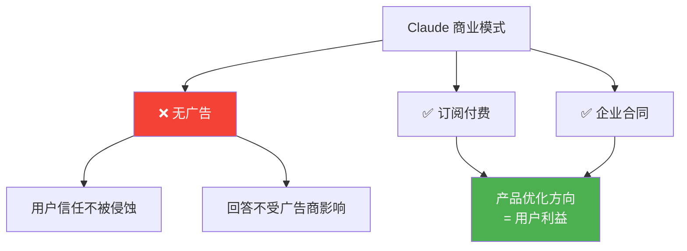

> 📊 难度：⭐⭐ | ⏱️ 阅读：9分钟 | 📅 2026年2月4日 | 🏷️ 商业模式, 隐私, 广告

# Claude 是一个思考的空间：Anthropic 宣布永不投放广告

> **原标题：** Claude is a Space to Think
> **发布日期：** 2026年2月4日
> **原文链接：** https://www.anthropic.com/news/claude-is-a-space-to-think

---

## 📌 一句话摘要

Anthropic 正式宣布 Claude 将永远保持无广告，拒绝以用户注意力或数据换取广告收入，致力于将 Claude 打造为一个纯粹的、值得信赖的思考空间。

---

## 📖 完整核心内容翻译

### 📎 开篇宣言

"有很多适合投放广告的好地方。与 Claude 的对话不是其中之一。"

### 📎 核心立场

Anthropic 决定 Claude 将永远保持无广告。用户不会在对话中遇到赞助内容，广告主的激励不会影响 Claude 的回答，也不会出现不请自来的产品推荐。

### 📎 AI 对话的独特性

Anthropic 将 AI 助手的交互与传统数字产品区分开来。在搜索引擎和社交媒体上，人们已经习惯了有机内容与赞助内容的混合，但 AI 对话有着根本性的不同。用户经常在对话中分享敏感的、深度个人化的内容——类似于与信任的顾问交谈。正是这种使 AI 对话富有价值的开放性，也使其特别容易受到商业影响的侵蚀。

研究显示，相当比例的 Claude 对话涉及敏感话题或复杂问题解决。在这些场景中，广告会显得格格不入。早期研究既揭示了 AI 的好处（提供可及的支持），也揭示了风险（可能强化弱势用户的有害信念）。在这一阶段引入广告激励会增添难以预测的复杂性。

### 📎 激励机制的腐蚀

"真正有帮助"是 Claude 宪法（Constitution）的核心原则之一。广告驱动的商业模式会制造错位的激励。设想这样一个场景：用户提到失眠问题。在没有广告激励的情况下，AI 助手会探索潜在原因。但在广告支持的版本中，系统则会考虑可变现的商业机会。与搜索结果不同的是，广告对模型回答的影响会掩盖其商业动机。

即便是不影响模型回答的独立广告，也会损害 Claude 作为"一个清晰的思考和工作空间"的定位。独立广告会引入参与度优化——这些指标未必与真正的有用性一致。

### 📎 商业模式

Anthropic 通过企业合同和付费订阅获取收入，并将收入再投资于产品改进。这涉及取舍，但避免了向广告商出售用户注意力或数据。

### 📎 可及性举措

Anthropic 已经采取的行动包括：
- 为 60 多个国家的教育工作者提供 AI 工具和培训
- 与多国政府启动国家级 AI 教育试点项目
- 以大幅折扣向非营利组织提供 Claude
- 投资开发更小的模型，确保免费版保持前沿水平
- 计划考虑推出更低价格的订阅层级和区域定价

### 📎 商业集成的边界

虽然 Claude 支持智能体商务和用户主动发起的产品研究，但所有第三方交互都遵循一个设计原则：由用户发起，而非广告商。Claude 的唯一激励始终是提供有帮助的回答。

### 📎 愿景

"我们希望 Claude 以同样的方式工作"——像没有广告的实体工具一样，成为思考工作、挑战和创意时值得信赖的工具。

---

## 🔬 技术要点

1. **无广告承诺的深层逻辑：** AI 对话的敏感性和信任属性使其与传统数字产品存在本质差异，广告会从根本上破坏用户信任和模型有用性
2. **激励机制设计：** 广告模式会创造"帮助用户"与"服务广告商"之间的激励冲突，这种冲突在 AI 对话中比搜索引擎更加隐蔽和危险
3. **订阅+企业合同的商业模式：** Anthropic 选择以直接付费而非注意力经济为基础，确保产品优化方向与用户利益一致
4. **用户发起原则（User-Initiated Principle）：** 所有第三方商业交互必须由用户主动发起，AI 不会主动推荐产品或服务
5. **可及性与盈利的平衡：** 通过教育折扣、非营利优惠、免费版维护和区域定价等机制，在商业可持续性与普惠可及性之间寻求平衡

---

## 🧠 深度解读

### 🟢 通俗版

这篇文章表面上是一则"我们不会投放广告"的声明，实则是 Anthropic 对 AI 商业伦理的一次深度定义。它触及了 AI 行业最根本的问题之一：**当 AI 成为人类的思考伙伴时，其商业模式应该服务于谁？**

### 🔴 深入版

**对注意力经济的根本性挑战。** 过去二十年的互联网商业模式建立在一个核心逻辑上：用免费服务换取用户注意力，再将注意力卖给广告商。这个模式在搜索和社交媒体中虽有争议但基本可行。然而 Anthropic 敏锐地指出，AI 对话场景从根本上不同——用户分享的内容更加私密、交互更加信任、影响也更加深远。在这种场景中引入广告不仅仅是"体验不好"的问题，而是会系统性地腐蚀 AI 的核心价值。

**"失眠场景"的精妙论证。** 文章中用一个简单的例子——用户提到失眠——完美地展示了广告激励如何扭曲 AI 的行为。无广告的 AI 会帮用户分析原因（压力、作息、饮食等），而广告支持的 AI 则会倾向于推荐安眠药或睡眠产品。更关键的是，这种偏差在 AI 对话中远比搜索结果更难被用户察觉——因为用户倾向于信任 AI 的"个性化建议"。

**商业模式的战略选择。** Anthropic 选择订阅+企业合同的模式，本质上是在说："我们的客户是用户，不是广告商。"这看似简单，但实际上需要巨大的商业勇气——广告模式的规模效应和边际成本优势是极其诱人的。这一选择也为 Anthropic 在 AI 安全和对齐领域的定位提供了一致性——一个号称致力于 AI 安全的公司，不应该有出卖用户信任的商业激励。

**对整个行业的隐性施压。** 这篇文章虽然没有点名批评竞争对手，但实际上为整个行业设立了一个道德标杆。如果 Google 或 Meta 的 AI 助手开始投放广告，用户将不可避免地拿它们与 Claude 的"纯净"体验做对比。

---

## 💡 延伸思考

1. **承诺的可持续性：** "永不投放广告"的承诺在 Anthropic 当前的融资阶段是否可持续？如果公司面临盈利压力，这一承诺是否会被重新审视？
2. **广告的替代形态：** 文章明确排除了传统广告，但"用户主动发起的商业交互"与"AI 推荐"之间的界限在哪里？当 Claude 帮用户选购产品时，推荐算法是否也是一种隐性广告？
3. **竞争者的两难：** Google 的核心商业模式就是广告。当 AI 助手取代搜索成为信息入口时，Google 如何在保持广告收入的同时不损害 AI 助手的信任度？
4. **教育与非营利的商业逻辑：** 为 60 多个国家提供教育工具、向非营利大幅折扣——这些举措是纯粹的社会责任，还是建立品牌信任和锁定未来用户的长期策略？
5. **"思考空间"的哲学意义：** 在注意力经济无处不在的时代，一个"纯净的思考空间"本身是否已经成为一种奢侈品？这是否意味着高质量的 AI 思考工具将成为付费用户的特权？
