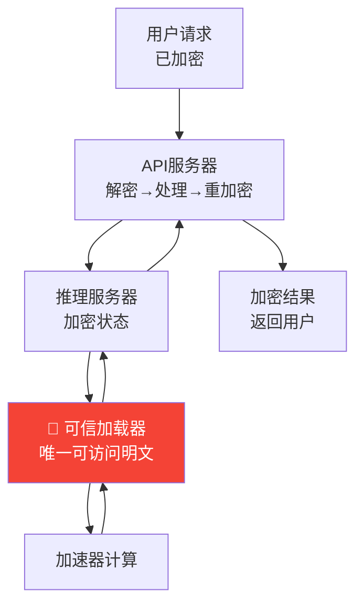

> 📊 难度：⭐⭐ | ⏱️ 阅读：8分钟 | 📅 2025年6月18日 | 🏷️ 安全, 隐私计算, 硬件

# 基于可信虚拟机的机密推理

> **原标题:** Confidential Inference via Trusted Virtual Machines
> **中文标题:** 通过可信虚拟机实现AI机密推理
> **发布日期:** 2025年6月18日
> **来源:** Anthropic（与Pattern Labs合作）

---

## 📌 一句话摘要

Anthropic提出"机密推理"安全框架，通过加密处理同时保护AI模型权重和用户数据，确保敏感数据仅在高度受限的可验证环境中被短暂解密处理，从硬件层面构建AI安全的信任根基。

---

## 📖 完整核心内容翻译

### 📎 核心理念

该方案的基本原则是：**敏感数据在整个处理链路中始终保持加密，仅在需要处理的确切时刻在高度受限、可验证的环境中被解密**。这一设计同时应对了日益复杂的针对前沿AI模型（如Claude）的攻击威胁。

### 📎 两大应用方向

1. **模型权重安全**：保护Claude免受高级威胁行为者的攻击，建立在RAND最近关于保护AI模型权重的报告框架之上
2. **用户安全**：通过密码学手段证明用户的机密信息在整个处理过程中保持私密

### 📎 技术架构

#### 推理服务组成

系统通过两个关键处理节点运作：

- **API服务器**：处理提示词、分词和请求逻辑
- **推理服务器**：在硬件加速器上执行模型计算

#### 可信加载器

系统设计了一个"模型加载器与调用器"——一个小型、隔离的程序，执行三项核心功能：

1. 接收加密数据并为加速器解密
2. 调用加速器操作
3. 将加密后的结果返回给调用方

**只有这个可信加载器可以访问未加密数据**；系统其余部分在"不可信"模式下运行，即使频繁变更也不会危及安全性。

#### 可信环境的三大基石

1. **加密内存**：与其他工作负载硬件隔离，防御物理攻击和恶意虚拟化层
2. **调试禁用**：通过标准机密计算实践消除潜在攻击向量
3. **密码学证明**：使用可信平台模块（TPM）度量启动各阶段，生成证明代码执行和配置正确性的attestation

密钥服务器最终裁定环境的可信度，仅在验证通过后释放解密密钥。

### 📎 数据流保护

**用户请求流程：**
- 请求在到达Anthropic服务器之前即已加密
- API服务器解密、处理后重新加密，再转发至推理服务器
- 推理服务器处理加密请求，仅在可信加载器内部解密
- 完成结果加密后，经API服务器返回

**模型权重流程：**
路径更为简洁：加密存储 → 在加载器中解密 → 永不对外释放。

### 🔮 未来方向

研究团队预见了若干潜在增强：

- 对持有明文权重的服务器实施额外的出站带宽限制
- 要求推理执行前获得安全分类器签名
- 由外部独立方管理密钥服务器，提供更强的机密性保证

### 📎 硬件层面的呼吁

Anthropic鼓励硬件设计者在加速器中内置机密计算能力，特别是附着在加速器上的硬件信任根（hardware roots of trust），这将显著缩小系统信任边界。

### 📎 当前状态

Anthropic明确将此工作定性为初步阶段："我们在这项工作上仍处于早期，预测其将如何演变为具体设计或功能还为时过早。"

---

## 🔬 技术要点

1. **最小信任边界设计**：将可信代码收敛到一个极小的"加载器与调用器"程序，系统其余部分均为不可信组件，大幅降低了攻击面
2. **TPM attestation链**：利用可信平台模块的度量-证明机制，在密码学层面验证运行环境的完整性，而非依赖网络边界或操作系统层面的安全
3. **双向保护架构**：同一框架同时保护模型权重（Anthropic资产）和用户数据（用户隐私），实现了安全利益的对齐
4. **加密-解密-重加密流水线**：数据在传输和存储的每个阶段都保持加密状态，明文仅存在于可信加载器的内存空间中

---

## 🧠 深度解读

### 🟢 通俗版

这项研究触及了AI行业一个日益紧迫的问题：**如何在部署中同时保护价值数十亿美元的模型权重和用户的隐私数据？**

### 🔴 深入版

传统的安全方案往往在两者之间做出取舍——要么将模型完全封闭在服务器端（牺牲用户对数据处理过程的可验证性），要么开放模型权重（牺牲商业利益和安全控制）。Anthropic提出的机密推理框架试图用硬件级密码学打破这一二元对立。

最精妙的设计在于"可信加载器"概念。通过将信任边界压缩到一个极小的、可审计的程序中，整个复杂的推理服务栈（API服务器、网络组件、操作系统等）都不需要被信任。这符合安全工程的核心原则——**信任边界越小，越容易验证和保护**。

然而，现实挑战也同样严峻。首先，当前GPU/TPU等AI加速器普遍缺乏内置的硬件信任根，这意味着完整方案的落地依赖硬件厂商（如NVIDIA）的配合。其次，机密计算通常带来性能开销，在对延迟极为敏感的AI推理场景中，这一开销是否可接受仍是未知数。

Anthropic将这一研究定位为"初步工作"的态度是务实的。但它所指向的方向——**可验证的AI安全**——可能成为未来企业级AI部署的基础要求，特别是在医疗、金融、政府等高监管行业。

---

## 💡 延伸思考

1. 当硬件信任根成为AI安全的基石时，AI行业对芯片供应商的依赖是否会产生新的系统性风险？
2. 机密推理能否与联邦学习、差分隐私等技术结合，构建更完整的隐私计算栈？
3. 如果外部独立方管理密钥服务器，这一角色应由谁来担任——政府机构、行业联盟、还是独立第三方？
4. 在推理性能与安全保障之间，不同应用场景（实时对话 vs 批量分析）应如何做出不同的权衡选择？

---

## 🔗 原文链接

[Confidential Inference via Trusted Virtual Machines](https://www.anthropic.com/research/confidential-inference-trusted-vms)
