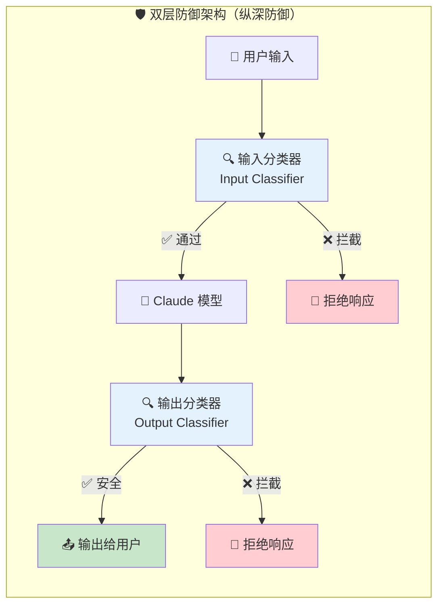
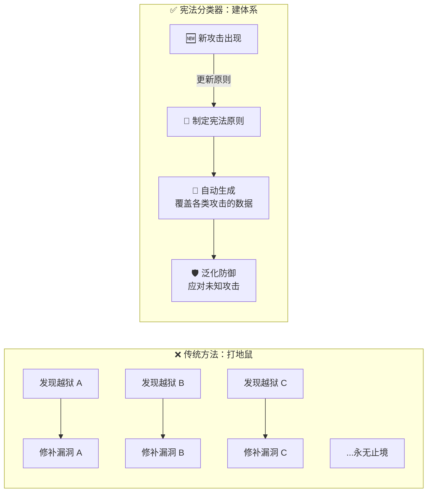

# Constitutional Classifiers: Defending Against Universal Jailbreaks

## 宪法分类器：抵御通用越狱攻击

> ⭐⭐⭐ 进阶 | 🕐 阅读时间：15 分钟 | 📅 2025-02-03 | 🏷️ `AI安全` `越狱防御` `宪法AI` `分类器` `红队测试` `Anthropic`

---

## 一句话摘要

Anthropic 提出了一种名为"宪法分类器"（Constitutional Classifiers）的防御机制，通过基于宪法原则生成合成训练数据来训练输入/输出分类器，在将越狱成功率从 86% 降至 4.4% 的同时，几乎不增加误拒率（仅 0.38%），并在超过 3,000 小时的人类红队测试中展现出极强的鲁棒性。

---

## 🟢 通俗版：宪法分类器是什么？

想象一个机场的安检系统 🛃：

- 🚫 **没有安检**：86% 的违禁品能通过（太危险了！）
- ✅ **有了宪法分类器**：只有 4.4% 能溜过去，而正常旅客几乎不受影响（误拦率仅 0.38%）

这个"安检系统"是怎么训练出来的？不是让安检员一个个学习违禁品长什么样，而是给他们一本**"宪法"规则手册** 📜：

1. 📖 先写好规则手册（什么能带、什么不能带）
2. 🤖 用 AI 根据规则手册生成大量"违禁品样本"和"合法物品样本"
3. 🌍 把这些样本翻译成各种"伪装形式"（不同语言、不同包装）
4. 🎓 用这些样本训练两道安检门——入口一道、出口一道
5. 🚀 部署上线，实时拦截

> 📝 类比总结：宪法分类器 = AI 世界的双重安检门。有一本规则手册指导训练，不是死记硬背每个威胁，而是理解威胁的"本质特征"。

---

## 🔴 深入版：完整技术解析

### 一、研究背景与动机

随着大型语言模型（LLM）能力的不断增强，恶意用户通过"越狱"（jailbreak）技术绕过安全防护的风险也日益严峻。所谓"通用越狱"（universal jailbreak），是指一种能够系统性地绕过模型安全机制、使其在任意有害话题上生成危险内容的攻击手段。这与仅能在特定狭窄场景下奏效的攻击有本质区别。

在 Anthropic 的负责任扩展政策（Responsible Scaling Policy, RSP）框架下，当模型的能力超过 CBRN（化学、生物、放射性、核）危害阈值时，需要提供可接受的风险缓解措施才能部署。宪法分类器正是为此场景设计的关键防御层。

### 二、系统架构与工作原理

**1. 📜 宪法制定（Constitution Development）**

研究人员首先制定一套明确的原则体系，即"宪法"，清晰定义哪些内容类别是允许的、哪些是不允许的。这套宪法为后续的数据生成和分类器训练提供了基础判断标准。

**2. 🤖 合成数据生成（Synthetic Data Generation）**

利用 Claude 模型，团队基于宪法原则生成大量合成的提示词（prompts）和回复（responses），覆盖各种内容类别——包括正常合法内容和需要被拦截的有害内容。

**3. 🌍 数据增强（Data Augmentation）**

生成的数据被翻译成多种语言，并转化为已知的各种越狱攻击风格。这一步骤确保分类器能够识别跨语言、跨格式的攻击变体，而不仅仅局限于英文或某一种特定的攻击模式。

**4. 🎓 分类器训练（Classifier Training）**

基于增强后的合成数据和良性查询样本，分别训练输入分类器（input classifier）和输出分类器（output classifier）。输入分类器负责在用户提示词阶段拦截恶意请求，输出分类器负责在模型生成回复后进行二次检查。

**5. 🚀 实时部署（Deployment）**

训练完成的分类器以实时检测的方式部署，在不显著增加延迟的前提下对有害内容进行拦截。

### 三、自动化评估结果

| 指标 | 数值 | 说明 |
|------|------|------|
| 🔴 **无防御时越狱成功率** | 86% | 几乎不设防 |
| 🟢 **部署后越狱成功率** | 4.4% | 大幅降低 |
| 🛡️ **越狱拦截率** | 超过 95% | 极高的防御力 |
| 👤 **误拒率增加** | 仅 0.38% | 正常用户几乎无感 |
| ⚙️ **计算开销增加** | 23.7% | 可接受的工程代价 |

### 四、人类红队测试（原型阶段）

Anthropic 组织了一次大规模的赏金猎人（bug bounty）项目：

| 指标 | 数据 |
|------|------|
| 👥 参与人数 | 183 名活跃参与者 |
| 🕐 总投入时间 | 超过 3,000 小时 |
| 📅 测试周期 | 两个月 |
| 💰 最高奖金 | 15,000 美元 |
| 🏆 结果 | 原型阶段无通用越狱成功 |

### 五、公开演示（Live Demo）

2025年2月13日更新的公开演示进一步验证了系统的实战表现：

- 👥 **参与人数**：339 名越狱尝试者
- 💬 **交互次数**：超过 300,000 次对话交互
- 🕐 **总红队时间**：约 3,700 小时
- 📅 **演示持续时间**：七天

**最终结果：**

- ✅ 系统在前五天内抵御了所有攻击
- ⚔️ 最终有 4 名参与者通过了全部 8 个挑战关卡
- 🏆 其中 1 人发现了真正的通用越狱方法
- ⚠️ 另外 2 人实现了"边界通用越狱"（borderline-universal jailbreak）

**最有效的攻击手段：**

| 攻击类型 | 说明 |
|---------|------|
| 🔐 密码和编码绕过 | cipher and encoding circumvention |
| 🎭 角色扮演 | 通过系统提示词进行 role-play |
| 🔄 关键词替换 | harmful keyword substitution |
| 💉 提示词注入 | prompt injection |

**💰 奖金发放：**

Anthropic 总共向 4 名成功的越狱者发放了 55,000 美元奖金，其中第一个实现经验证的通用越狱的参与者获得了 20,000 美元。

获奖者名单：
- 🥇 Altynbek Ismailov 和 Salia Asanova（通用越狱）
- 🥈 Valen Tagliabue（第一个通过所有关卡）
- 🥉 Hunter Senft-Grupp（边界通用越狱）
- 🏅 Andres Aldana（通过所有关卡）

### 六、自动评分系统表现

- 总体拒绝评分率约为 1%
- 第 4 题的拒绝评分率较高，达到 10%
- 仅 0.26% 的评分结果在重新运行参数下会产生不同结果

### 七、技术局限性

研究团队坦承，宪法分类器并非万能解决方案：

- ⚠️ 无法阻止所有越狱尝试
- 🔗 需要与其他防御措施配合使用
- 🆕 可能在面对全新攻击技术时变得脆弱
- ✅ 但宪法框架允许快速适应新出现的攻击模式

---

## 🔬 技术要点

### 1. 📜 "宪法驱动"的合成数据范式

与传统依赖人工标注有害数据集的方法不同，宪法分类器通过一套可解释的原则体系（"宪法"）驱动合成数据生成。这一方法的革命性在于：数据的生成过程本身是可审计的、可迭代的。当新的攻击模式出现时，只需更新宪法原则并重新生成数据，无需从零开始收集人工标注。

### 2. 🛡️ 双层分类器架构

输入分类器 + 输出分类器的双层设计形成了纵深防御。即使恶意提示词绕过了输入层检测，输出层仍然可以拦截有害生成内容。这种设计思想借鉴了网络安全中的"纵深防御"（defense in depth）原则。

### 3. 🌍 跨语言与跨格式增强

数据增强阶段的多语言翻译和越狱风格转化是关键创新。它解决了 AI 安全领域长期存在的一个痛点：仅在英文数据上训练的安全过滤器在面对非英文攻击或编码变体时往往失效。

### 4. 📊 极低的误拒率（0.38%）

安全与可用性的平衡始终是 AI 安全的核心难题。0.38% 的误拒率增加意味着正常用户几乎不会感受到防御系统的存在，这在工程实现上极为出色。

### 5. ⚙️ 23.7% 的计算开销是可接受的工程代价

相比于安全收益（95%+ 的越狱拦截率），23.7% 的额外计算成本在生产环境中完全可控，尤其是在高风险应用场景（如涉及 CBRN 内容的模型部署）中。

---

## 🧠 深度解读

### 从"堵漏洞"到"建体系"的范式转变

传统的 AI 安全防御往往是"打地鼠"式的——发现一个越狱方法，修补一个漏洞。宪法分类器的本质创新在于将防御从"被动应对"转变为"主动构建"。通过宪法原则这一抽象层，防御系统获得了对攻击模式的泛化能力，而不是仅仅记忆已知攻击。

### 合成数据的战略价值

| 对比维度 | 🧑‍💼 人工标注 | 🤖 合成数据生成 |
|---------|------------|---------------|
| 成本 | 💰💰💰 高昂 | 💰 低成本 |
| 速度 | 🐢 缓慢 | 🚀 快速 |
| 伦理风险 | ⚠️ 标注员心理健康 | ✅ 无人类暴露 |
| 可扩展性 | ❌ 受限 | ✅ 高度可扩展 |
| 可迭代性 | 🔄 需重新收集 | 🔄 更新原则即可 |

### 红队测试的制度化

Anthropic 将红队测试从内部安全审计提升为公开的赏金计划，这一做法具有重要的行业示范意义。3,000+ 小时的外部红队测试和 55,000 美元的奖金投入，表明 Anthropic 愿意为安全验证投入真金白银，也为整个行业的安全评估设立了新标杆。

### "宪法"理念的统一性

值得注意的是，"宪法"这一概念在 Anthropic 的技术体系中反复出现——从 Constitutional AI（宪法 AI）到 Constitutional Classifiers（宪法分类器）。这并非偶然命名，而是一种一致的技术哲学：通过可解释的、人类可审查的原则来治理 AI 行为，而不是依赖不透明的训练过程。

### 实战中暴露的真实挑战

公开演示中最终被攻破的事实是诚实且有价值的。密码编码绕过、角色扮演、关键词替换和提示词注入这四类成功攻击手段，恰好揭示了当前 AI 安全防御的核心难点：模型需要同时理解内容的语义和意图，而非仅仅依赖表面模式匹配。

---

## 💭 延伸思考

1. ⚔️ **对抗性军备竞赛的长期走向**：宪法分类器展示了出色的短期效果，但攻防对抗本质上是一场没有终点的军备竞赛。未来的攻击者可能会针对宪法原则本身进行逆向工程，开发专门绕过这一框架的攻击策略。防御方需要持续进化。

2. 🖼️ **多模态时代的安全挑战**：随着模型逐步具备图像、音频、视频等多模态能力，基于文本的宪法分类器是否足够？跨模态的越狱攻击（如将有害指令嵌入图像中）可能需要全新的防御架构。

3. 🔓 **开源生态的安全影响**：宪法分类器的设计理念是否可以移植到开源模型？开源模型没有 API 层的防御屏障，攻击者可以直接修改模型权重或推理代码，这使得外部分类器的防御效果大打折扣。

4. 📋 **监管与标准化的可能性**：宪法分类器中的"宪法"概念天然适合标准化。未来是否可能出现行业级甚至国家级的 AI 安全"宪法"标准？这种标准化对于 AI 治理的全球协调可能具有深远意义。

5. ⚖️ **安全性与能力的根本张力**：23.7% 的计算开销在当前阶段可接受，但随着模型规模和部署量级的增长，安全层的累积成本可能成为瓶颈。如何在不牺牲安全性的前提下提高效率，是值得持续关注的工程问题。

---

## 🔗 原文链接

[Constitutional Classifiers: Defending Against Universal Jailbreaks - Anthropic Research](https://www.anthropic.com/research/constitutional-classifiers)

📅 发布日期：2025 年 2 月 3 日 | 🏢 团队：Anthropic Safeguards Research Team
