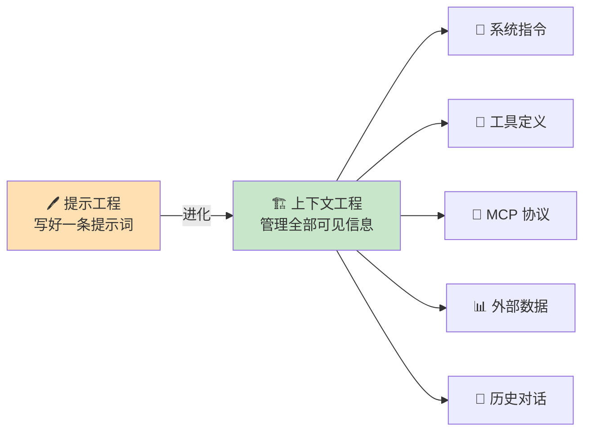
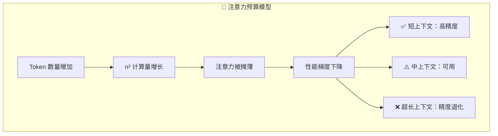
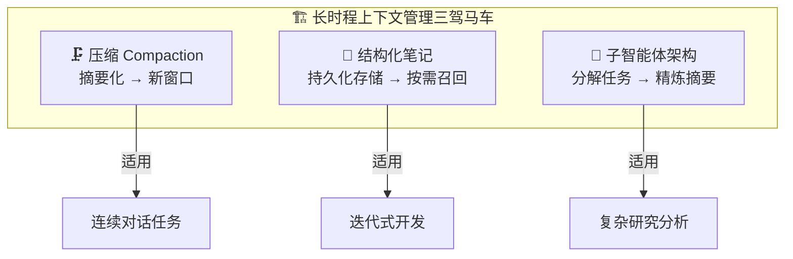

# Effective Context Engineering for AI Agents

# 面向 AI 智能体的高效上下文工程

> ⭐⭐⭐ 进阶 | 🕐 阅读时间：15 分钟 | 📅 2025-09-29 | 🏷️ `上下文工程` `智能体` `Transformer` `RAG` `Anthropic`

---

## 一句话摘要

上下文工程（Context Engineering）是提示工程的进化形态——它不再局限于"写好一条提示词"，而是系统性地管理 LLM 每一轮推理时可见的全部信息，将有限的注意力预算花在信号密度最高的 token 上，从而让智能体在长时程、多轮次的复杂任务中保持高效与可靠。

---

## 🟢 通俗版：上下文工程是什么？

想象你是一位厨师，面前有一张**有限大小的操作台**（上下文窗口）。你需要烹饪一道复杂的菜肴（完成任务），但操作台上只能同时放这么多食材和工具。

- 🍳 **提示工程** = 写好一张菜谱（告诉模型做什么）
- 🧑‍🍳 **上下文工程** = 管理整个厨房——决定**什么时候**把**什么食材**放上操作台，用完的及时清走，需要的及时取来

如果你把所有食材一股脑堆上去，操作台就乱了，你找不到盐在哪里。这就是**上下文腐化**——信息太多反而找不到关键内容。

> 类比总结：上下文工程 = 厨房管理术。操作台有限，食材要精选，摆放要有序，用完要清理。

---

## 🔴 深入版：完整技术解析

### 一、从提示工程到上下文工程

*图：提示工程 vs 上下文工程——从单条提示词到系统性管理模型可见信息的全面升级*

早期与 LLM 协作的核心能力是**提示工程**（Prompt Engineering）——关注如何写出清晰、有效的指令来完成单次任务。然而，当 AI 从"单轮问答"进化为跨多轮推理、持续运行的**智能体**（Agent）时，仅靠打磨一条提示词已远远不够。

**上下文工程**将视野扩大到推理时模型可见的全部 token：系统指令、工具定义、MCP（Model Context Protocol）协议、外部数据、历史对话等。它的核心问题是——

> 📐 在 LLM 固有的注意力约束下，如何让每一轮推理所消耗的 token 集合的效用最大化？

智能体在循环中运行，每一轮都会产生可能影响下一轮的新数据。这些信息必须被**持续精炼**，否则上下文会迅速膨胀并劣化。

### 二、为什么上下文工程至关重要

#### 2.1 ⚠️ 上下文腐化与注意力预算

"大海捞针"（Needle-in-a-Haystack）基准测试揭示了一个现象：**上下文腐化**（Context Rot）。随着 token 数量增加，模型准确回忆信息的能力会下降。注意力窗口是一种**有限资源**，类似于人类的工作记忆——每引入一个新 token，都在消耗这笔预算。

*图：上下文工程的核心挑战——如何在有限的注意力预算内实现最优信息配置*

#### 2.2 🧬 架构层面的根源

注意力稀缺源于 Transformer 的自注意力机制：每个 token 都要与其余所有 token 计算关联，产生 n² 级的成对关系。当上下文变长，模型捕捉这些关系的能力被摊薄。此外，训练数据中短序列占主导，模型对超长上下文的"经验"天然不足。位置编码插值等技术虽可扩展序列长度，但也引入精度退化。

最终表现并非"悬崖式崩塌"，而是一条**性能梯度**：模型在长上下文下依然可用，但在信息检索和远程推理的精度上不及短上下文。

### 三、高效上下文的构成要素

核心原则：

> 💡 好的上下文工程，就是找到最小且信号密度最高的 token 集合，最大化达成目标的概率。

#### 3.1 📋 系统提示（System Prompts）

*图：系统提示的抽象层级校准——在过度具体（脆弱）和过度模糊（无效）之间找到最佳平衡点*

系统提示的语言必须**极其清晰**，并处于恰当的"抽象层级"（right altitude）——在两种失败模式之间取得平衡：

| 失败模式 | 表现 | 类比 |
|---------|------|------|
| ❌ **过度具体** | 硬编码复杂脆弱逻辑，维护成本高 | 🤖 事无巨细的操作手册 |
| ❌ **过度模糊** | 缺乏具体信号，假设模型共享上下文 | 🌫️ "把事情做好就行" |
| ✅ **恰当层级** | 最少信息完整描述预期行为 | 🎯 清晰的工作职责描述 |

建议用 XML 标签或 Markdown 标题将提示分区组织（如 `<background_information>`、`<instructions>`、`## Tool guidance`、`## Output description`），追求**以最少的信息完整描述预期行为，同时提供足够的细节确保模型遵循**。

#### 3.2 🔧 工具（Tools）

工具让智能体得以操作环境、拉取额外上下文。高效的工具应做到：

- ✅ **自包含且容错**：调用失败时能优雅处理
- ✅ **用途极其明确**：描述清晰到不会与其他工具混淆
- ✅ **功能不重叠**：避免工具集臃肿

常见反模式：工具集过于庞杂，功能覆盖重叠，导致模型面临"该用哪个工具"的歧义。文章一针见血地指出——

> 🎯 如果一个人类工程师都无法确定应该使用哪个工具，就不能指望 AI 智能体做得更好。

#### 3.3 📖 示例（Few-Shot）

与其穷尽罗列边界情况，不如精心挑选**多样性强、具有代表性的典型示例**。对 LLM 而言，示例就是"胜过千言万语的图片"。

### 四、上下文检索与智能体搜索

#### 4.1 🔄 从预检索到即时检索

传统 RAG 管线依赖嵌入向量在推理前检索上下文。新趋势是**即时（just-in-time）检索**：智能体仅保留轻量标识符（文件路径、查询语句、网页链接等），在运行时通过工具动态加载数据。

以 Claude Code 为例：它在分析大型数据库时，会编写有针对性的查询、存储结果，并利用 `head`/`tail` 等 Bash 命令分析大量数据，**从不将完整数据对象一次性载入上下文**。

#### 4.2 🔍 渐进式披露（Progressive Disclosure）

让智能体自主导航，实现**渐进式发现**：每次交互获取的上下文为下一步决策提供线索——文件大小暗示复杂度，命名规范提示用途，时间戳可以作为相关性的代理指标。

#### 4.3 ⚖️ 权衡与混合策略

运行时探索比预计算检索更慢，且需要"有主见、经过深思的工程"来防止智能体浪费上下文——误用工具或追逐死胡同。

最佳实践往往是**混合策略**：预先检索一部分数据，同时允许自主探索。Claude Code 正是这样做的——将部分信息直接注入上下文，同时提供 `glob` 和 `grep` 等原语让智能体按需导航。

### 五、长时程任务的上下文工程

当任务从几分钟延伸到数小时，上下文窗口的限制就成为核心瓶颈。Anthropic 团队总结了三种策略：

#### 5.1 🗜️ 压缩（Compaction）

当对话接近上下文窗口上限时，**将内容摘要化，用摘要重新启动新的上下文窗口**。

具体做法：将消息历史交给模型，让它总结并压缩最关键的细节——保留架构决策、未解决的 bug、实现细节，丢弃冗余的工具输出和消息。

压缩的艺术在于**取舍**：过度激进可能丢失"看似不起眼但后来才显现重要性"的微妙上下文。建议先最大化召回率（确保所有相关信息被保留），再迭代提升精确率（剔除多余内容）。工具结果清理（Tool Result Clearing）是 Claude 开发者平台近期推出的一种轻量级、安全的压缩手段。

#### 5.2 📝 结构化笔记（Structured Note-Taking）

也称**智能体记忆**（Agentic Memory）。让智能体定期将笔记写入上下文窗口之外的持久化存储，在需要时再拉回上下文。

这一模式开销极小但效果显著——就像 Claude Code 维护一份待办列表，或自定义智能体维护一份 `NOTES.md`，让智能体在数十次工具调用后依然能追踪进度、保持关键上下文与依赖关系。

> 🎮 **生动案例：Claude 玩宝可梦**——智能体在数千步游戏中维护精确的统计："在过去 1,234 步中，我一直在 1 号道路训练宝可梦，皮卡丘已经升了 8 级，目标是 10 级。" 它还绘制已探索区域的地图、记住解锁的成就、维护战略笔记，且无需人类显式指定记忆结构。

Anthropic 近期在开发者平台发布了记忆工具（Memory Tool）公测版，让智能体可以随时间构建知识库、跨会话维护项目状态、引用先前工作成果。

#### 5.3 👥 子智能体架构（Sub-Agent Architectures）

将任务分解给专门的子智能体，每个子智能体拥有**干净的上下文窗口**，专注于一个聚焦的子任务。主智能体负责高层计划与协调，子智能体执行深度技术工作或信息检索。每个子智能体可能消耗数万 token，但最终只返回一份**精炼摘要**（通常 1,000-2,000 token）。

这实现了清晰的**关注点分离**：详细的搜索上下文被隔离在子智能体内部，主智能体只需专注于综合与分析。Anthropic 的多智能体研究系统在复杂研究任务上相比单智能体系统取得了显著提升。

#### 📊 如何选择？

| 策略 | 适用场景 | 核心优势 | 注意事项 |
|------|---------|---------|---------|
| 🗜️ 压缩 | 需要大量来回对话的连续任务 | 保持对话流畅 | 可能丢失微妙上下文 |
| 📝 结构化笔记 | 里程碑清晰的迭代式开发任务 | 跨轮次持久记忆 | 需要设计存储结构 |
| 👥 子智能体架构 | 复杂研究与分析任务 | 并行探索+关注点分离 | 额外推理成本 |

*图：不同上下文管理策略的效果对比——压缩、结构化笔记与子智能体架构各有适用场景*

### 六、结论

上下文工程代表了一次**根本性的范式转变**。随着模型能力增强，挑战已从"写出完美的提示词"转向"精心管理每一步进入模型有限注意力预算的信息"。

无论是实现压缩、设计 token 高效的工具，还是赋予智能体探索能力，**指导原则始终如一**：

> 🎯 找到最小且信号密度最高的 token 集合，最大化达成目标的概率。

这些技术仍在持续演进。更聪明的模型需要更少的规范性工程，能以更高自主度运行。但即便能力持续提升，**将上下文视为宝贵的有限资源**，仍将是构建可靠、高效智能体的核心原则。

---

## 🔬 技术要点

### 要点一：上下文是有限资源，必须像管理预算一样管理

Transformer 的 n² 自注意力机制决定了上下文窗口本质上是稀缺资源。随着 token 增多，模型的检索精度和远程推理能力会沿着一条**性能梯度**逐步下降，而非突然断裂。每引入一个 token 都在消耗"注意力预算"。

### 要点二：系统提示需要"恰当的抽象层级"

在"过度具体导致脆弱"和"过度模糊导致失控"之间找到平衡点。用结构化标签分区组织提示，以最小信息量完整描述预期行为。

### 要点三：即时检索优于一次性预加载

与其把所有可能相关的数据一股脑塞入上下文，不如让智能体保留轻量引用（路径、链接、查询），在运行时按需加载。这实现了"渐进式披露"，每次交互为下一步提供决策线索。

### 要点四：长时程任务需要三驾马车——压缩、笔记、子智能体

三种策略各有分工：压缩保持对话连续性，结构化笔记提供跨轮次的持久记忆，子智能体架构通过关注点分离解决上下文爆炸问题。实践中往往需要组合使用。

### 要点五：工具设计是上下文工程的关键一环

工具不仅是智能体的"手脚"，更是上下文的重要来源。工具集必须精简、无歧义、自包含、容错。工具描述本身就是在消耗上下文预算，因此设计不当的工具集会从两个方向侵蚀性能——既浪费 token，又制造决策歧义。

---

## 🧠 深度解读

### 1. "上下文工程"本质上是一种系统架构思维

这篇文章最重要的洞见并不是某个具体技巧，而是思维方式的转变。Prompt Engineering 是一种"写作技能"，而 Context Engineering 是一种**系统架构能力**。它要求开发者像设计数据流管道一样设计信息流——什么信息在什么时间以什么形式进入模型的视野，什么信息应该被压缩、缓存或丢弃。

这与传统软件工程中的内存管理高度类似。上下文窗口就是 LLM 的"工作内存"，而上下文工程就是这块内存的"垃圾回收器"和"页面调度器"。

| 上下文工程概念 | 传统软件工程类比 |
|---------------|----------------|
| 🧠 上下文窗口 | 💾 工作内存（RAM） |
| 🗜️ 压缩 | 🗑️ 垃圾回收（GC） |
| 📝 结构化笔记 | 💿 磁盘持久化存储 |
| 👥 子智能体 | 🖥️ 微服务架构 |
| 🔧 工具调用 | 📡 API 调用 |
| 🔍 即时检索 | 📄 按需分页（Paging） |

### 2. 从"一次性交互"到"持续运行的系统"

文章隐含的一条主线是：AI 智能体的未来不是更长的上下文窗口，而是**更聪明的上下文管理**。即使上下文窗口继续扩大，n² 注意力机制带来的性能梯度不会消失。因此，"把所有东西都塞进去"永远不是好策略。

这对产品设计的启示是：要为智能体设计**信息生命周期**——从获取、使用、压缩到淘汰，形成完整的管理闭环。

### 3. Claude 玩宝可梦：记忆系统的极致验证

文章用"Claude 玩宝可梦"这个案例说明了结构化笔记的威力。这个例子之所以有说服力，是因为宝可梦游戏对记忆的要求非常苛刻——需要追踪精确的数值、空间位置、长期目标和中间状态。如果一个智能体能在这种环境下保持一致性，那么它在软件开发、研究分析等场景下也能胜任。

### 4. 子智能体模式与微服务的类比

子智能体架构让人联想到微服务——每个服务处理一个职责明确的任务，通过精简的接口通信。子智能体消耗数万 token 但只返回 1,000-2,000 token 的摘要，压缩比可达 10:1 甚至更高。这本质上是用"计算换空间"——付出额外的推理成本来换取主智能体更干净的上下文。

---

## 💭 延伸思考

1. 🏢 **上下文工程会催生新工种吗？** 正如 DevOps 从开发和运维中分化出来，"Context Engineer"可能成为 AI 应用团队中的专门角色——负责设计信息流架构、调优工具集、制定压缩策略。

2. 📏 **上下文窗口的扩大会让这些技术过时吗？** 不会。文章明确指出，性能梯度源于 Transformer 的基本架构特性。即使窗口扩展到百万 token，精心管理上下文依然比"全部塞入"更优。上下文工程不是对窗口限制的权宜之计，而是一种**持久的工程原则**。

3. 🧠 **与人类认知的对照。** 人类也不是靠"记住所有事情"来处理复杂任务的。我们用笔记、文件结构、团队分工来管理认知负荷。上下文工程本质上是在为 AI 复现这些人类策略——压缩对应"写摘要"，结构化笔记对应"做笔记"，子智能体对应"团队协作"。

4. 🔗 **MCP 和工具生态的影响。** Model Context Protocol 的提出暗示了一个开放的工具生态。当工具可以跨平台复用时，工具设计的质量会更加关键——一个设计拙劣的 MCP 工具可能在无数个智能体中造成上下文浪费。

5. 📊 **评估与可观测性。** 文章没有深入讨论如何量化上下文工程的效果。未来可能需要类似 APM（应用性能监控）的工具来追踪智能体的"上下文健康度"——token 利用率、注意力分布、压缩损失率等指标。

---

## 🔗 原文链接

[Effective Context Engineering for AI Agents - Anthropic Engineering Blog](https://www.anthropic.com/engineering/effective-context-engineering-for-ai-agents)

📅 发布日期：2025 年 9 月 29 日

✍️ 作者：Anthropic Applied AI 团队——Prithvi Rajasekaran、Ethan Dixon、Carly Ryan、Jeremy Hadfield，以及 Rafi Ayub、Hannah Moran、Cal Rueb、Connor Jennings 等人的贡献。
