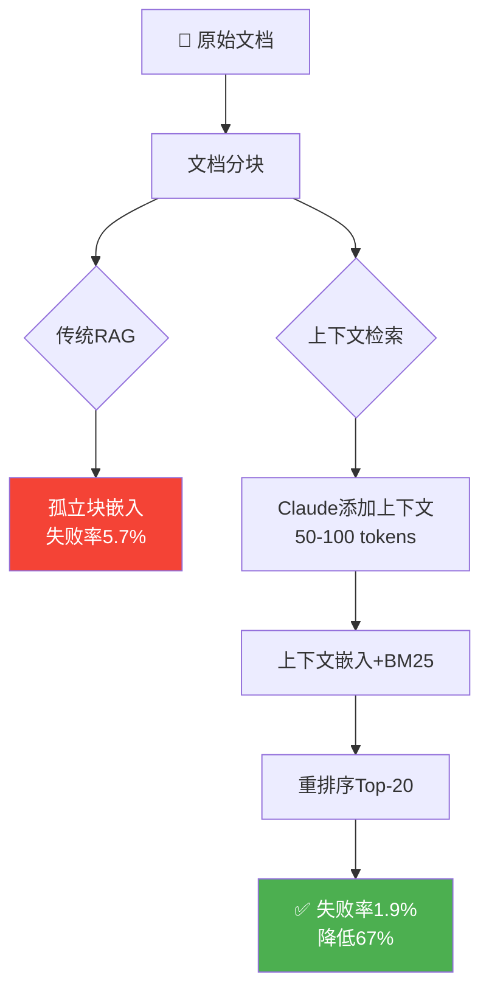

> 📊 难度：⭐⭐ | ⏱️ 阅读：12分钟 | 📅 2024年9月19日 | 🏷️ RAG, 检索, 嵌入

# Introducing Contextual Retrieval

**原标题:** Introducing Contextual Retrieval
**中文标题:** 上下文检索：让RAG系统检索失败率降低67%的突破性方法
**作者:** Daniel Ford | **发布日期:** 2024年9月19日
**原文链接:** [https://www.anthropic.com/engineering/contextual-retrieval](https://www.anthropic.com/engineering/contextual-retrieval)

---

## 📌 一句话摘要

Anthropic 提出"上下文检索"（Contextual Retrieval）技术，通过在文档分块嵌入前为每个块添加上下文说明，结合BM25词法匹配和重排序，将RAG系统的检索失败率降低最高67%。

---




## 📖 完整核心内容翻译

### 📎 一、问题背景

AI模型在特定领域应用中需要背景知识。检索增强生成（RAG）是最主流的知识注入方式，但传统RAG存在一个根本缺陷：**在编码阶段丢失了上下文信息，导致检索失败。**

**替代方案提醒：** 对于知识库在200,000个Token以下（约500页）的场景，开发者可以利用 Anthropic 的 Prompt 缓存功能将完整知识库直接放入提示中，延迟降低超过2倍，成本降低最高90%。

### 📎 二、传统RAG的工作流程

1. 将文档切分成块（通常几百个Token）
2. 将每个块转换为向量嵌入
3. 将嵌入存入向量数据库

检索时结合两种搜索方法：
- **语义嵌入（Semantic Embeddings）：** 捕捉意义层面的关联关系
- **BM25：** 使用词法匹配，精确匹配短语和技术术语

**BM25的价值示例：** 查询"Error code TS-999"时，嵌入模型可能找到关于一般错误代码的内容，而 BM25 能精确匹配包含"TS-999"的文档块。

### 📎 三、核心问题：上下文丢失

传统RAG将文档切碎后，每个孤立的块失去了周围的上下文信息。

**典型案例：** 一个文档块包含"该公司收入较上一季度增长了3%"。但这个块本身缺少关键信息——是哪家公司？什么时间段？这使得检索和使用都变得困难。

### 📎 四、上下文检索的解决方案

**实现方法：** 在嵌入之前，使用 Claude 3 Haiku 为每个块生成特定的上下文说明。

Prompt 模板：
```
<document>
{{WHOLE_DOCUMENT}}
</document>
Here is the chunk we want to situate within the whole document
<chunk>
{{CHUNK_CONTENT}}
</chunk>
Please give a short succinct context to situate this chunk within the
overall document for the purposes of improving search retrieval of the
chunk. Answer only with the succinct context and nothing else.
```

**转换示例：**

原始块："该公司收入较上一季度增长了3%。"

上下文化后："此块来自ACME公司2023年第二季度SEC备案文件；上一季度收入为3.14亿美元。该公司收入较上一季度增长了3%。"

添加的上下文通常为50-100个Token。

### 📎 五、成本效率

利用 Prompt 缓存技术（假设800 Token的块、8K Token的文档、50 Token的上下文指令、100 Token的上下文输出），上下文化的成本约为**每百万文档Token 1.02美元**。

### 六、🧪 实验方法与结果

**测试领域：** 代码库、小说、ArXiv论文、科学论文等多个领域。

**评估指标：** 使用"1 - recall@20"，衡量在前20个检索块中未能找到相关文档的比例。

**核心结果：**

| 方法 | 失败率 | 相比基线降幅 |
|------|--------|-------------|
| 基线（传统嵌入） | 5.7% | - |
| 上下文嵌入 | 3.7% | **35%** |
| 上下文嵌入 + 上下文BM25 | 2.9% | **49%** |
| 上下文嵌入 + 上下文BM25 + 重排序 | 1.9% | **67%** |

### 📎 七、重排序增强

重排序流程：
1. 初始检索获取前150个候选块
2. 重排序模型对每个候选块与用户查询的相关性评分
3. 选择得分最高的20个块用于最终回答生成

测试使用了 Cohere 的重排序器，Voyage 也提供重排序能力。

**权衡：** 重排序增加运行延迟，但提高准确性并通过更聚焦的处理降低成本。

### 📎 八、实施建议

- **分块边界：** 文档分割策略影响检索性能
- **嵌入模型：** Voyage 和 Gemini 嵌入效果最优
- **自定义Prompt：** 领域特定的上下文化Prompt可能比通用版本效果更好
- **检索块数量：** 测试5、10、20个块，20个块最优
- **评估：** 运行评估以确定上下文化块是否提升了下游回答质量

### 📎 九、总结发现

1. 嵌入+BM25优于单独使用嵌入
2. Voyage 和 Gemini 嵌入表现最优
3. Top-20 块优于 Top-10 或 Top-5
4. 添加上下文显著提升准确率
5. 重排序优于不重排序
6. 效果可叠加：上下文嵌入 + 上下文BM25 + 重排序 + 20个块 = 最大化性能

---

## 🔬 技术要点

1. **上下文丢失是RAG的核心痛点：** 传统分块方法将文档碎片化，每个块失去"我属于哪个文档、讨论什么主题"的元信息，导致语义歧义和检索失败。
2. **用LLM为分块"注入"上下文：** 在嵌入前，将完整文档和目标块一起输入 Claude，生成50-100 Token的上下文前缀，成本仅约$1/百万Token。
3. **语义搜索+词法搜索的互补性：** 嵌入模型擅长语义匹配，BM25擅长精确术语匹配，两者结合比任一单独方法效果显著更好。
4. **重排序的"粗筛-精选"范式：** 先宽泛检索150个候选块，再用重排序模型精选Top-20，以少量延迟换取大幅精度提升。
5. **Prompt缓存使方案经济可行：** 将完整文档放入Prompt的高成本通过缓存技术大幅降低，使"每个块都看到全文"在实践中可行。

---

## 🧠 深度解读

### 🟢 通俗版

本文的核心贡献不在于提出某种全新的检索算法，而在于揭示了一个被普遍忽视的系统性问题：**RAG系统的分块过程本身就是信息损失的根源。**

### 🔴 深入版

传统思路将"分块"视为预处理中的琐碎步骤，将优化精力集中在嵌入模型选择、向量数据库配置等后续环节。而Anthropic的洞察在于：**如果输入端已经丢失了关键信息，后续再精妙的检索算法也无法找回。** 这是一个"垃圾进、垃圾出"的问题。

上下文检索的优雅之处在于"用AI解决AI的问题"——用LLM生成的上下文来修复RAG流水线中被LLM处理所丢失的信息。这形成了一个有趣的闭环：大模型既是产生问题的原因（需要RAG来注入知识），也是解决问题的工具（为分块添加上下文）。

从工程实践角度，67%的检索失败率降幅意味着：对于一个原本每20次查询失败1次的系统，优化后约60次才失败1次。在生产环境中，这可能是"勉强可用"与"可靠好用"之间的分界线。

值得注意的是，**效果的叠加性**——每一层优化都在前一层基础上继续改进，且互不冲突。这意味着开发者可以渐进式地采用这些技术，根据延迟和成本预算逐步增加优化层。

---

## 💡 延伸思考

1. 上下文检索的"上下文"由LLM生成，那么这个生成过程本身是否引入了新的幻觉风险？如果上下文描述有误，是否会导致检索偏差？
2. 随着模型上下文窗口不断扩大（Gemini 1M、Claude 200K），直接将完整知识库放入Prompt的"暴力方案"是否会逐渐取代RAG？两者的边界在哪里？
3. 上下文检索与 GraphRAG（基于知识图谱的检索）可以如何结合？知识图谱是否提供了一种更结构化的"上下文"？
4. 在多轮对话场景中，上下文检索如何与对话历史交互？用户的对话上下文是否也应该被纳入检索的"上下文"中？

---

*本文为 Anthropic 官方工程博客文章的深度中文解读。*
