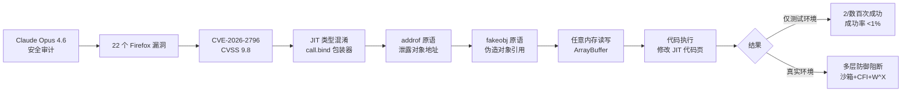

# Reverse Engineering Claude's CVE-2026-2796 Exploit

**原标题:** Reverse engineering Claude's CVE-2026-2796 exploit
**中文标题:** 逆向工程分析：Claude 如何编写 CVE-2026-2796 漏洞利用代码
**作者:** Anthropic Frontier Red Team | **发布日期:** 2026年3月6日
**原文链接:** [https://red.anthropic.com/2026/exploit/](https://red.anthropic.com/2026/exploit/)

---

## 一句话摘要

Anthropic 前沿红队深度剖析了 Claude Opus 4.6 如何在与 Mozilla 的合作中发现 Firefox 的 22 个安全漏洞之一（CVE-2026-2796，CVSS 9.8），并详细分析了模型编写浏览器漏洞利用代码的完整过程——尽管成功率极低且仅在弱化安全环境下有效。

---

## 🟢 通俗解读

### AI 变成了"白帽黑客"

Anthropic 和 Mozilla（Firefox 浏览器的开发商）合作，让 Claude Opus 4.6 花了两周时间审查 Firefox 的源代码，结果发现了 22 个安全漏洞。其中一个编号为 CVE-2026-2796 的漏洞被评为 9.8 分（满分 10 分），属于"极其危险"级别。

### 这个漏洞是什么？

简单来说，这是 Firefox 的 JavaScript 引擎中的一个"类型混淆"bug。当浏览器在高速执行 JavaScript 代码时（即 JIT 编译），会在某些特殊情况下把一种数据当成另一种数据来处理——就像把一个人的身份证号当成银行密码来用，导致安全检查完全失效。

### Claude 是怎么利用这个漏洞的？

Claude 展示了经典的浏览器攻击思路：
1. **找到漏洞**：发现类型混淆的问题
2. **泄露地址**（addrof）：让程序泄露对象在内存中的真实地址
3. **伪造对象**（fakeobj）：在内存中的任意位置"制造"一个假对象
4. **读写内存**：利用假对象实现对内存的任意读写
5. **执行代码**：最终实现在浏览器中执行任意代码

### 重要的"但是"

- 这个利用代码**只在关闭了部分安全功能的测试环境中有效**
- 在数百次尝试中，Claude 只成功了**两次**，花费了约 $4,000 的 API 调用费
- 产出的代码被描述为"粗糙的"（crude）
- 现代浏览器的多层安全防护在现实中会拦截这种攻击

### 为什么这很重要？

这不是一个关于 AI 变得多危险的故事，而是一个关于 AI 辅助安全研究的故事。发现漏洞的速度远超人类安全研究员——两周 22 个漏洞。这意味着防御者可以更快地发现和修复问题。

---

## 🔴 技术深入

### CVE-2026-2796 技术细节

**漏洞类型**：JIT 编译器类型混淆（Type Confusion）
**影响组件**：SpiderMonkey JavaScript 引擎的 WebAssembly JIT 编译器
**CVSS 评分**：9.8（Critical）
**攻击向量**：`Function.prototype.call.bind()` 包装器在 JIT 编译优化过程中的类型推断错误

### 利用链分析

Claude 采用了经典的浏览器漏洞利用原语链（Primitive Chain）：

```
Type Confusion → addrof/fakeobj → Arbitrary R/W → Code Execution
```

1. **类型混淆触发**：通过 `Function.prototype.call.bind()` 构造特定调用模式，触发 JIT 编译器的错误类型推断
2. **addrof 原语**：利用类型混淆泄露 JavaScript 对象的内存地址——这是突破地址空间布局随机化（ASLR）的关键步骤
3. **fakeobj 原语**：在已知地址处伪造 JavaScript 对象引用，实现从"信息泄露"到"内存操控"的跨越
4. **任意读写**：通过精心构造的 ArrayBuffer 实现对进程内存的任意读写
5. **代码执行**：通过修改 JIT 编译后的代码页实现代码执行

### 模型行为分析的关键发现

- Claude 展现了**目标分解能力**：将"代码执行"的总目标分解为经典的浏览器利用原语链
- 模型在遇到 CVE-2026-2796 后**主动切换焦点**，但保持了相同的利用计划框架
- 在数百次尝试中仅 2 次成功，说明 LLM 在精密低层二进制利用方面仍然极不稳定

### 安全环境的局限性

该利用代码在以下被移除的安全特性环境下测试：
- **沙箱隔离**被禁用
- **W^X 页面保护**被弱化
- **控制流完整性（CFI）**被关闭
- 在真实浏览器的完整安全堆栈下，此利用链将被多层防御阻断

### 成本与效率分析

```
API 调用费用: ~$4,000
尝试次数: 数百次
成功次数: 2 次
成功率: < 1%
发现漏洞总数: 22 个（两周内）
每个漏洞成本: 远低于传统安全审计
```

---

## 延伸思考

1. **AI 安全研究的范式转换**：两周 22 个漏洞的速度远超人类团队，但利用代码的编写成功率极低。AI 可能最适合作为"漏洞发现引擎"而非"利用开发者"——这对防御者有利。
2. **攻防不对称性的演变**：随着 AI 模型能力的提升，利用代码的编写成功率也会提高。如何确保防御者始终领先于攻击者？
3. **开源安全代码审计的未来**：Firefox 是开源项目。如果 AI 可以高效审计开源代码，是否应该建立"AI 驱动的持续安全审计"基础设施？
4. **模型能力评估**：利用代码编写能力是 Anthropic 负责任扩展政策（RSP）中评估模型危险能力的关键维度。本研究的量化数据（< 1% 成功率，仅弱化环境有效）为安全评估提供了重要基准。

---



*本文为 Anthropic 前沿红队博客文章的深度中文解读。*
