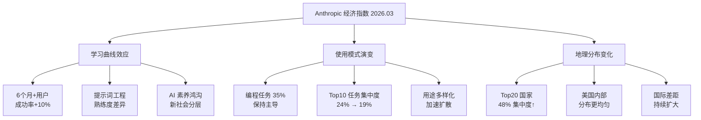

# Anthropic Economic Index: Learning Curves

**原标题:** Anthropic Economic Index report: Learning curves
**中文标题:** Anthropic 经济指数报告：学习曲线
**作者:** Anthropic Economic Research Team | **发布日期:** 2026年3月24日
**原文链接:** [https://www.anthropic.com/research/economic-index-march-2026-report](https://www.anthropic.com/research/economic-index-march-2026-report)

---

## 一句话摘要

Anthropic 第五期经济指数报告揭示了一个关键发现：使用 Claude 六个月以上的用户比新用户的对话成功率高出 10%，AI 使用存在显著的"学习曲线"效应，且全球 AI 采纳差距持续扩大。

---

## 🟢 通俗解读

### 核心发现：AI 也需要"练手"

想象一下学开车——刚拿驾照的人和开了半年的人，驾驶水平差别很大。Anthropic 发现 AI 使用也是一样的：用了 Claude 半年以上的人，和刚开始用的人相比，成功率高出 10%。

这个差距不是因为他们做的任务不同、用的模型不同或者所在的国家不同——纯粹是"会用"和"不太会用"的区别。

### 编程仍然是最热门的用途

在所有 Claude.ai 的对话中，编程相关任务占了 35%。但好消息是，使用场景正在变得更多样化——2025年11月到2026年2月期间，最常见的10种任务从占比24%降到了19%，说明人们开始把 AI 用在更多不同的事情上。

### 全球差距在扩大

使用量最高的20个国家占据了全部人均使用量的 48%（之前是45%），差距在拉大。不过在美国国内有改善：前五个州的人均使用份额从 30% 降到了 24%，说明美国内部的 AI 使用正在变得更均匀。

### 对普通人的启示

这份报告传达了一个重要信号：**越早开始学习使用 AI，越早获得优势**。AI 不是即插即用的——它需要时间去掌握，而那些已经在用的人正在积累经验优势。

---

## 🔴 技术深入

### 方法论与数据规模

本报告基于 Anthropic 平台上数百万次真实对话数据，通过 O*NET 职业任务分类体系将用户行为映射到具体的职业和任务类型。使用六个月的分界线是基于对用户账户注册时间和活跃度的统计分析得出的。

### 学习曲线的技术解释

10% 成功率提升的技术原因可能包括：

1. **提示词工程熟练度**：经验用户更擅长构建清晰、结构化的提示词，减少了模型误解的概率
2. **上下文管理**：熟练用户更善于管理对话的上下文窗口，知道何时开启新对话、如何提供足够的背景信息
3. **工具和功能的利用**：了解 artifacts、系统提示词、项目功能等高级特性
4. **迭代策略**：知道如何在不满意时有效地引导模型修正方向

### 使用集中度下降的意义

```
编程相关: 35% (稳定)
Top 10 任务: 24% → 19% (下降 5pp)
Top 20 国家: 45% → 48% (上升 3pp，国际集中度增加)
美国 Top 5 州: 30% → 24% (下降 6pp，美国内部扩散)
```

这些数据揭示了一个有趣的"双速扩散"模式：在国家内部，AI 使用正在向更多人群扩散；但在国际层面，先发国家的优势反而在加强。

### 对 AI 产品设计的启示

学习曲线的存在对 AI 产品设计提出了重要挑战：如何降低新用户的上手门槛？可能的方向包括：
- 更智能的引导式提示
- 自动优化用户输入的中间层
- 基于用户经验等级的自适应交互界面
- 更好的 onboarding 教程和模板系统

---

## 延伸思考

1. **AI 素养鸿沟**：如果 AI 使用确实存在学习曲线，那么"AI 素养"（AI Fluency）将成为新的社会分层维度——已有媒体将其称为"美国下一场阶级战争"。
2. **提示词标准化**：学习曲线的存在是否说明我们需要更标准化的 AI 交互范式？就像编程语言从汇编到高级语言的演进一样，AI 交互是否也需要更高层的抽象？
3. **经济影响的滞后效应**：如果掌握 AI 需要半年以上才能发挥全部效力，那么 AI 对经济的真正影响可能被当前的测量严重低估——大量新用户还在学习曲线的爬坡阶段。

---



*本文为 Anthropic 官方研究报告的深度中文解读。*
