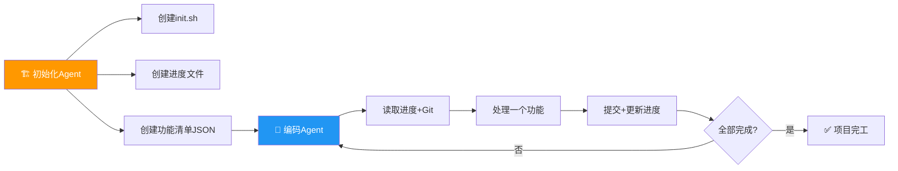

> 📊 难度：⭐⭐ | ⏱️ 阅读：16分钟 | 📅 2025年11月26日 | 🏷️ 智能体, 工程实践, 长任务

# Effective Harnesses for Long-Running Agents

## 📎 原标题 / 中文标题

**原标题:** Effective Harnesses for Long-Running Agents

**中文标题:** 长时间运行 Agent 的高效管控框架

**作者:** Justin Young | **发布日期:** 2025年11月26日

---

## 📌 一句话摘要

本文提出了一套受专业软件工程师工作方式启发的实用框架，通过"初始化 Agent + 编码 Agent"的双阶段架构、结构化进度追踪和功能清单机制，解决 AI Agent 在跨越多个上下文窗口执行长周期任务时丢失记忆、进度混乱的核心难题。

---




## 📖 完整核心内容翻译

### 📎 引言：问题的本质

随着 AI Agent 能力日益增强，开发者越来越多地要求它们承担需要数小时甚至数天才能完成的复杂任务。然而，**让 Agent 在多个上下文窗口之间保持一致的进度，仍然是一个未解决的开放性问题。**

长时间运行 Agent 的核心挑战在于：它们必须在离散的会话（session）中工作，而每个新会话开始时都没有之前的记忆。文章用了一个非常贴切的类比：

> "想象一个软件项目由轮班制的工程师来开发，每个新上班的工程师对前一班发生了什么毫无记忆。"

### 📎 实验设定

Anthropic 团队以"构建一个 claude.ai 的克隆应用"为测试任务，使用 Opus 4.5 等先进模型进行实验。仅给出高层级指令时，观察到两种典型的失败模式。

### 📎 失败模式一：贪多嚼不烂

Agent 倾向于一次性完成太多工作——本质上是试图"一把梭"整个应用。这往往导致模型在实现过程中耗尽上下文窗口，留下半完成且未文档化的功能。下一个会话的 Agent 不得不从一个半成品状态开始，猜测之前发生了什么。

### 📎 失败模式二：过早宣布完工

在部分功能已经构建完成后，后续的 Agent 实例会环顾四周，看到已有进展，便直接宣布任务完成——即使还有大量功能尚未实现。

### 📎 双阶段解决方案

#### 第一阶段：初始化 Agent（Initializer Agent）

项目的第一个 Agent 会话使用专门的提示词（prompt），要求模型搭建初始环境，包括：

- **`init.sh` 脚本**：用于启动开发服务器的标准化入口
- **`claude-progress.txt` 文件**：记录各个 Agent 会话工作内容的进度日志
- **初始 Git 提交**：展示已添加的文件，建立版本控制基线
- **功能需求清单**：以 JSON 格式列出 200+ 端到端功能点

#### 第二阶段：编码 Agent（Coding Agent）

所有后续会话遵循结构化的工作流程：

- 会话开始时读取进度文件和 Git 历史
- **每次只专注处理一个功能**
- 提交变更时附带描述性的提交信息
- 更新进度文档
- 确保代码始终处于可生产部署的状态

### 📎 功能清单的设计

初始化 Agent 创建的 JSON 功能文件格式如下：

```json
{
  "category": "functional",
  "description": "New chat button creates fresh conversation",
  "steps": ["..."],
  "passes": false
}
```

关键设计决策：**Agent 只被允许修改 `passes` 字段**。文章明确指出："删除或编辑测试是不可接受的，因为这可能导致功能缺失或产生 Bug。" 这一约束防止了 Agent 为了"通过测试"而篡改测试本身。

### 📎 增量式进度推进

要求 Agent 逐个功能推进（而非一次性构建整个应用），从根本上防止了"一把梭"的倾向。Git 提交和进度摘要的组合让 Agent 能够回退有问题的变更，始终维持可工作的状态。

### 📎 测试协议

在构建 Web 应用的场景下，Claude 在被明确提示使用浏览器自动化工具（如 Puppeteer MCP）后，大多能很好地进行端到端功能验证——像真实用户一样测试功能。测试过程中截取的屏幕截图可以确认功能正常运行。

但仍存在局限性：Claude 无法通过 Puppeteer 检测到浏览器原生的 alert 弹窗，导致依赖弹窗的功能更容易出现 Bug。

### 📎 会话启动序列

每个编码 Agent 的会话开始时执行以下标准化步骤：

1. 运行 `pwd` 确认工作目录
2. 读取 Git 日志和进度文件，了解近期工作内容
3. 读取功能清单，选择优先级最高的未完成功能
4. 通过 `init.sh` 启动开发服务器
5. 运行基础端到端验证测试

这一机制防止了 Agent 在实现新功能的过程中才发现旧 Bug——那个时候修复往往会让问题更加恶化。

### 📎 失败模式与解决方案对照表

| 问题 | 初始化 Agent 的做法 | 编码 Agent 的做法 |
|------|-------------------|-----------------|
| 过早宣布项目完成 | 创建包含 JSON 结构的功能清单文件 | 读取功能清单；每次会话开始时处理一个功能 |
| 产出有 Bug、缺乏文档的进度 | 初始化 Git 仓库并撰写进度笔记 | 读取进度/Git 日志；运行基础服务器测试；会话结束时提交并更新 |
| 过早标记功能完成 | 建立功能清单 | 彻底验证后才将 `passes` 标记为 `true` |
| 花大量时间理解应用配置 | 编写 `init.sh` 脚本 | 会话开始时先读取 `init.sh` |

### 🔮 未来方向

研究提出了若干开放性问题：**单一通用 Agent 在各种场景下是否表现最优，还是多 Agent 架构能带来更好的性能？** 专门用于测试、质量保证（QA）和代码清理的专用 Agent 或许能在跨开发周期中改善结果。

当前方案主要针对全栈 Web 应用开发进行了优化，未来有望推广到科学研究和金融建模等需要 Agent 在更长时间周期内工作的领域。

---

## 🔬 技术要点

### 📎 1. 结构化记忆传递是跨会话协作的基石

Agent 的上下文窗口是有限的，跨会话时记忆完全丢失。通过 `claude-progress.txt` + Git 历史 + JSON 功能清单这三层持久化机制，实现了"无状态 Agent"之间的有效信息传递。这本质上是将"人脑中的项目记忆"外化为文件系统中的结构化数据。

### 📎 2. 约束比自由更能产生好结果

限制 Agent 每次只做一个功能、只能修改 `passes` 字段、不能删除测试——这些看似"束缚"的规则恰恰是高质量输出的保障。这与软件工程中的"约定优于配置"（Convention over Configuration）理念一脉相承。

### 📎 3. 初始化阶段决定后续所有会话的质量

"初始化 Agent"的设计承认了一个关键事实：第一个会话的产出（脚手架、规范、基础设施）会深刻影响所有后续 Agent 的效率。这类似于软件架构设计中"Day 0"决策的重要性。

### 📎 4. 验证必须像用户一样端到端执行

仅靠单元测试或代码审查不够——Agent 必须通过浏览器自动化工具（Puppeteer）模拟真实用户操作来验证功能。这将"测试左移"的理念推向了极致。

### 📎 5. 会话启动时的"健康检查"防止错误累积

每次新会话开始时先运行验证测试，而非直接开始新功能开发。这一实践对应的是 CI/CD 流水线中"先验证主干健康再合并"的思想。

---

## 🧠 深度解读

### 🟢 通俗版

### 📎 这不只是 Prompt Engineering，而是 Agent 工程学

### 🔴 深入版

这篇文章表面上讨论的是如何用 prompt 控制 Agent 行为，但其核心贡献远超 prompt engineering 的范畴。它实际上提出了一套**Agent 工程学（Agent Engineering）**的方法论：

**1. 将人类工程实践"编码"给 Agent**

文章最深刻的洞察在于：让 Agent 高效工作的最佳方式，就是让它模仿高效的人类工程师。轮班交接文档、Git 提交规范、任务拆解、先测试后开发——这些都不是什么新发明，而是成熟软件团队早已采用的标准实践。Anthropic 的创新在于将这些实践系统性地转化为 Agent 可执行的协议。

**2. "一把梭"是 Agent 的原罪**

两种失败模式的根源都指向同一个问题：Agent 缺乏对"进度"的概念理解。它要么试图一次性完成所有工作（因为它不知道自己会"轮班交接"），要么看到部分进展就认为已经完成（因为它无法区分"部分完成"和"全部完成"）。功能清单的 JSON 设计巧妙地将"进度"这个抽象概念具象化为可机器读取的数据结构。

**3. 对多 Agent 架构的暗示**

文章末尾提到的"多 Agent 架构"方向值得关注。当前的"初始化 + 编码"双阶段设计本身就是一种简化的多 Agent 模式。未来可能出现的架构：Architect Agent（设计） -> Coder Agent（实现） -> Tester Agent（验证） -> Reviewer Agent（审查），每个角色有各自的专用 prompt 和工具集。

**4. 工具使用的边界问题**

Puppeteer 无法检测浏览器原生 alert 弹窗这一细节揭示了一个更大的问题：Agent 的能力上限不仅取决于模型本身，还受限于它可用工具的能力边界。这暗示了未来 Agent 工具生态的重要性——更好的工具直接等同于更强的 Agent。

---

## 💡 延伸思考

1. **可迁移性问题：** 文章承认当前方案针对全栈 Web 开发优化。但不同领域（数据分析、科学研究、系统运维）的"进度"形态截然不同。通用的 Agent 管控框架应该如何抽象？是否存在一个跨领域的"进度协议"标准？

2. **自我改进的可能：** 当前的功能清单和进度文件格式由人类设计。未来是否可以让 Agent 自己设计最优的进度追踪格式？Meta-Agent 的概念——一个专门优化其他 Agent 工作流程的 Agent——是否可行？

3. **与 Claude Code 的关系：** 这篇文章的实践思路与 Claude Code（Anthropic 的官方 CLI 工具）的设计理念高度吻合。Claude Code 中的 `CLAUDE.md` 文件、项目记忆机制，本质上就是这篇文章所描述的"结构化记忆传递"的产品化实现。

4. **上下文窗口扩展是否让这些技术过时？** 随着上下文窗口从 200K 扩展到 1M 甚至更大，这些跨会话管控技术是否会变得不再必要？答案很可能是"不会"——因为即使上下文窗口无限大，**注意力的有效分配**仍然是一个根本性挑战。结构化的任务管理不仅帮助模型记住信息，更帮助它聚焦于当前最重要的工作。

5. **从 Agent 到 Agent 团队：** 这篇文章描述的本质上是一个"单 Agent 轮班制"。但现实中的软件开发是多人协作的。当多个 Agent 需要同时在同一个代码库上工作时（并行而非串行），冲突解决、任务分配、代码合并等新挑战将浮出水面。这可能是 Agent 工程学的下一个前沿。

---

## 🔗 原文链接

[Effective Harnesses for Long-Running Agents - Anthropic Engineering](https://www.anthropic.com/engineering/effective-harnesses-for-long-running-agents)
