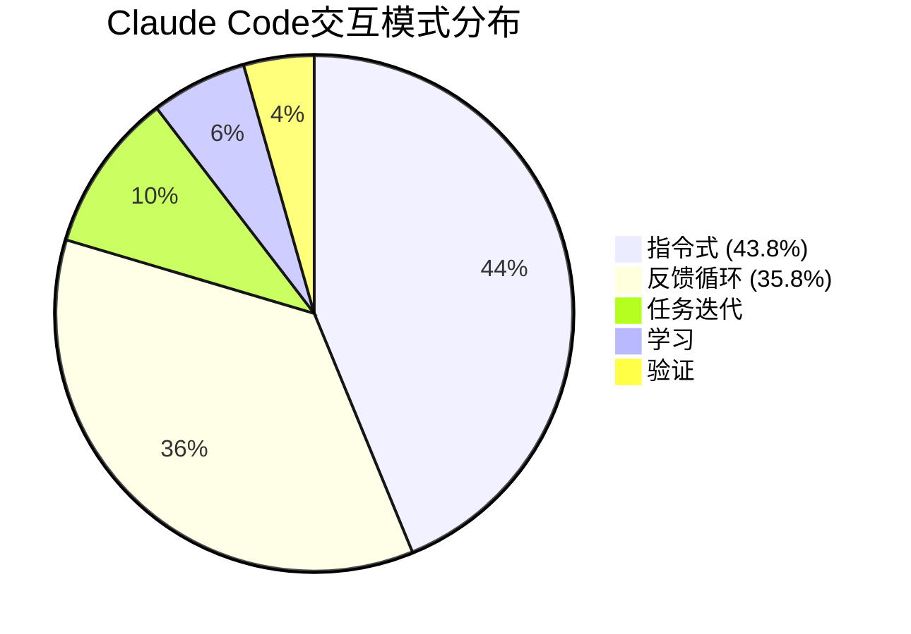

> 📊 难度：⭐⭐ | ⏱️ 阅读：12分钟 | 📅 2025年 | 🏷️ 经济指数, 软件开发, 自动化

# Anthropic Economic Index: AI's Impact on Software Development

> 原标题：Anthropic Economic Index: AI's Impact on Software Development
> 中文标题：Anthropic 经济指数：AI 对软件开发的影响

> 原文链接：https://www.anthropic.com/research/impact-software-development

## 📌 一句话摘要

Anthropic 通过分析 50 万次编码交互发现，智能体工具（Claude Code）中 79% 的对话属于"自动化"模式，前端/用户界面开发是 AI 辅助编码的最大应用场景，初创公司在采用 AI 编码工具方面显著领先于大型企业。

---

## 📖 完整核心内容翻译

### 🔬 研究概述

Anthropic 最新的经济分析研究审视了 Claude.ai 和 Claude Code 上的 50 万次编码交互，旨在理解 AI 如何重塑软件开发工作。这项研究是 Anthropic 经济指数系列的一部分，聚焦于软件开发这一 AI 影响最直接、最深远的领域。

### 📊 核心发现一：自动化 vs. 增强

研究将 AI 辅助编码交互分为两大类：**自动化**（AI 直接执行任务）和**增强**（AI 辅助人类完成任务）。

两个平台的差异极为显著：

| 平台 | 自动化比例 | 增强比例 |
|------|-----------|---------|
| Claude Code | 79% | 21% |
| Claude.ai | 49% | 51% |

这表明智能体系统驱动了更高程度的任务自动化。

**交互模式的细分：**

研究识别出五种交互模式：

- **指令式（Directive）**：完全的任务委托，最少交互
  - Claude Code: 43.8% | Claude.ai: 27.5%
- **反馈循环（Feedback Loop）**：任务完成后由人类验证
  - Claude Code: 35.8% | Claude.ai: 21.3%
- **任务迭代（Task Iteration）**：协作式的逐步改进
- **学习（Learning）**：知识获取
- **验证（Validation）**：工作核查

值得注意的是，"反馈循环"模式在 Claude Code 上出现的频率几乎是 Claude.ai 的两倍。这说明即使在自动化程度更高的智能体工具中，人类仍然通过错误纠正和反馈机制深度参与。

### 📊 核心发现二：编程语言分布

以 Web 为中心的语言占据主导地位：

- **JavaScript + TypeScript**：31%（合计）
- **HTML + CSS**：28%（合计）
- **Python**：14%（兼用于后端开发和数据分析）
- **SQL**：6%

JavaScript、TypeScript、HTML 和 CSS 合计占编码查询的 59%，表明开发者将 AI 主要用于构建用户界面和交互元素。

### 📊 核心发现三：编码应用场景

研究发现 **UI/UX 组件开发**和 **Web/移动应用开发**是最主要的应用场景。"氛围编码"（Vibe coding）作为一种新兴模式浮现——开发者用自然语言描述期望的结果，而 AI 负责具体实现。

用户面向的界面工作获得了不成比例的 AI 辅助，这暗示前端开发角色可能比后端开发角色更早受到颠覆性影响。

### 📊 核心发现四：组织类型分布

不同组织类型在 AI 工具采用上呈现显著差异：

| 组织类型 | Claude Code | Claude.ai |
|---------|-------------|-----------|
| 初创公司 | 32.9% | 13% |
| 大型企业 | 23.8% | 25.9% |
| 学生/学术/个人项目 | ~50%（两个平台合计） |

初创公司在 Claude Code 上的占比是企业的近 2.5 倍（33% vs 13%），展示了组织规模与 AI 工具采用速度之间的强相关性。学生、学术研究者和个人项目开发者合计占所有交互的约一半。

### 📎 方法论与局限性

研究团队使用隐私保护分析工具对 50 万次编码交互进行了分析。研究承认了若干限制：

- 分析仅覆盖 Claude.ai 和 Claude Code（不包括 Team/Enterprise/API 用量）
- 自动化/增强框架在智能体工具上需要进一步完善
- 用户类型的分类依赖于有限上下文的推断
- 数据集捕获的是早期采用者
- 隐私考量限制了时间序列分析
- 对更广泛 AI 工具采用模式的代表性尚不明确

### 📎 未来影响

随着智能体 AI 系统的进步，反馈循环模式——人类验证并迭代——最终可能需要更少的用户输入。开发者可能从编写代码转向管理 AI 系统。研究表明，即使在自动化程度最高的场景中，人类目前仍然深度参与其中。

---

## 🔬 技术要点

1. **智能体工具将自动化率从 49% 提升至 79%**：Claude Code 与 Claude.ai 的对比清晰展示了工具形态对人机协作模式的决定性影响——智能体界面天然推动任务向更高自动化程度演进。

2. **前端开发是 AI 编码的最大受益/受冲击领域**：59% 的编码查询涉及 JavaScript/TypeScript/HTML/CSS，UI/UX 开发是最大应用场景，表明"氛围编码"模式在用户界面构建中已成现实。

3. **反馈循环是当前人机协作的主导模式**：35.8% 的 Claude Code 交互属于"反馈循环"——AI 执行、人类验证、迭代修正，这是当前最高效的人机协作模式。

4. **初创公司采用速度远超大企业**：初创公司在 Claude Code 上的占比是企业的近 2.5 倍，反映了组织灵活性在技术采用中的决定性作用。

5. **"增强"在对话式界面中仍占半壁江山**：Claude.ai 上 51% 的交互仍属于增强模式（学习、验证等），表明对话式 AI 在知识传递和学习方面的价值不可忽视。

---

## 🧠 深度解读

### 🟢 通俗版

**"自动化"并不等于"无人参与"。** 这是本研究最重要的细微发现。即使在被分类为"自动化"的 79% 交互中，"反馈循环"模式（人类验证和迭代）占比高达 35.8%。真正的"甩手不管"式指令式交互虽然占比最高（43.8%），但人类仍在设定任务、审查结果。自动化是一个光谱，而非开关。

### 🔴 深入版

**前端优先的"AI 化"暗示了更深层的产业变革。** 59% 的查询集中在前端技术上，这并非巧合。用户界面开发具有几个特点使其特别适合 AI 辅助：(1) 需求可以用自然语言清晰描述，(2) 结果可以视觉化验证，(3) 模式化程度高。这预示着"全栈开发者"的定义可能被重新改写——未来的全栈可能是"提示 + 验证 + 架构"。

**初创公司的 AI 优势可能改变竞争格局。** 初创公司在 Claude Code 上的采用率是企业的 2.5 倍。这不仅仅是"小公司更灵活"的老生常谈——当 AI 能够实质性地加速开发时，小团队与大团队之间的生产力差距可能被根本性地重构。一个 5 人初创团队加上 AI 工具的产出可能比拟一个 20 人的传统开发团队。

**方法论的诚实值得赞赏。** 研究明确列出了多项局限性，包括数据仅代表早期采用者、不包括 API 用量等。这种透明度在行业研究中并不常见，也提醒读者不要过度推广这些发现。

---

## 💡 延伸思考

1. **后端开发的"护城河"有多深？** 当前前端开发是 AI 辅助的主战场，但随着模型对系统架构、数据库设计、分布式系统的理解加深，后端开发的自动化是否只是时间问题？

2. **"氛围编码"的质量天花板**：用自然语言描述需求、AI 生成代码的模式，在产品复杂度达到什么级别时会遇到瓶颈？企业级应用是否会成为氛围编码的天然边界？

3. **企业采用的真正障碍是什么？** 大企业在 Claude Code 上的低采用率，是因为安全合规顾虑、组织惯性，还是因为企业级代码库的复杂性确实降低了 AI 工具的有效性？

4. **50% 的"个人/学术"用户意味着什么？** 这一数据暗示了一个庞大的"AI 原生开发者"群体正在形成——他们从学习编程的第一天起就与 AI 共同编码。这将如何重塑未来开发者的技能结构？

5. **自动化率的上限在哪里？** 从 Claude.ai 的 49% 到 Claude Code 的 79%，随着工具的进一步发展，这个数字会趋近 95% 还是在某个水平上达到平台期？
