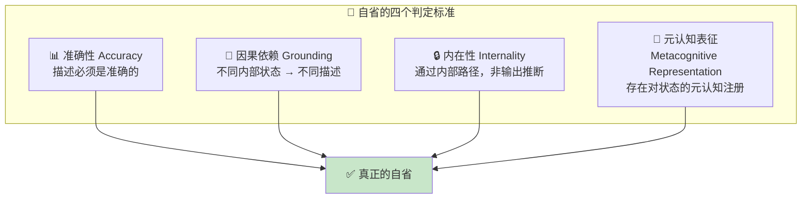
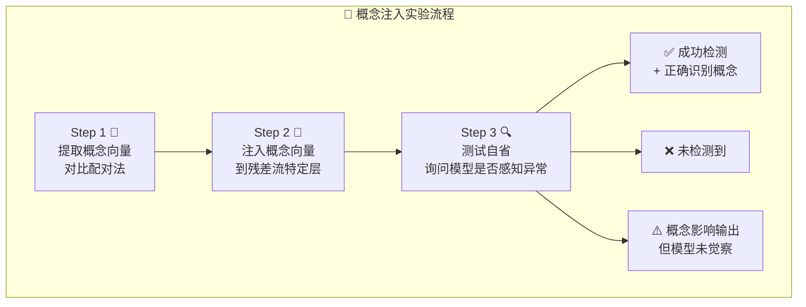
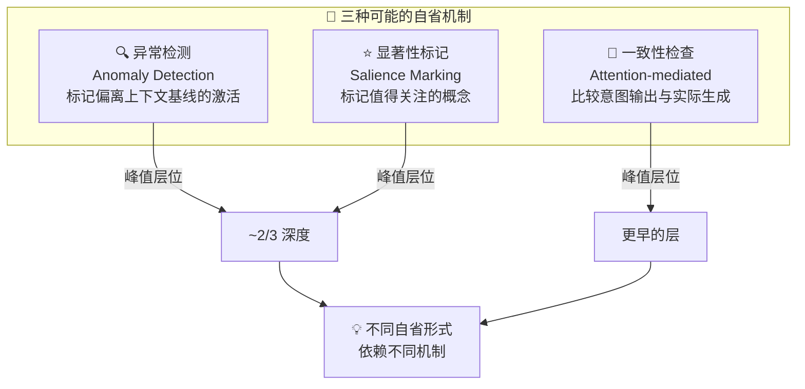

# Signs of Introspection in Large Language Models

## 大语言模型中的自省迹象

> ⭐⭐⭐⭐⭐ 专家级 | 🕐 阅读时间：18 分钟 | 📅 2025-10-29 | 🏷️ `自省` `可解释性` `概念注入` `内部状态` `意识` `Anthropic`

---

## 一句话摘要

Anthropic 研究团队通过"概念注入"实验，首次提供了因果层面的证据，表明 Claude 等大语言模型具备初步但有限的自省能力——即模型能够在一定程度上感知并报告自身的内部状态，而非仅仅生成看似合理的回答。

---

## 🟢 通俗版：AI 能"审视自己"吗？

想象一下这个实验 🧪：

你正在和朋友聊天，突然有人用一台**神秘的脑波仪**在你脑子里悄悄"植入"了一个念头——比如"面包" 🍞。

- 🤔 **如果你能察觉**：你会说"等等，我脑子里突然冒出了'面包'这个词，但这不是我自己想的"
- 😶 **如果你察觉不了**：你会继续聊天，完全不知道发生了什么

Anthropic 就是对 AI 做了这件事！他们把各种"概念"注入到 Claude 的内部激活中，然后问它："你有没有注意到什么异常？"

**结果：**
- 🎯 Claude Opus 4.1 在约 **20%** 的情况下成功检测到并正确识别了被注入的概念
- ✅ 在没有注入的对照实验中，100 次试验**零假阳性**（不会无中生有）
- 🧠 检测发生在概念影响输出**之前**——说明这是真正的内部感知，不是看了自己的回答后猜的

> 📝 类比总结：就像你能感觉到脑子里"突然冒出一个不属于自己的想法"一样，AI 也初步展现了这种能力——虽然只有 20% 的成功率，但它是真实的、基于内部机制的感知。

---

## 🔴 深入版：完整技术解析

### 研究背景：模型真的能"审视自己"吗？

当我们问 Claude"你是怎么想的"时，它会流利地回答——但这究竟是真正的自我觉察，还是训练出来的"鹦鹉学舌"？这个问题不仅关乎哲学，更关乎 AI 安全与可信度。如果模型真的能内省，我们就可以让它解释自己的推理过程，甚至排查行为异常；反之，如果它只是在编造，那这些自述就毫无参考价值。

### 📐 什么是"自省"？——严格的定义

研究团队为"自省意识"(introspective awareness) 设定了四个判定标准：

1. **准确性 (Accuracy)**：模型对自身内部状态的描述必须是准确的。
2. **因果依赖 (Grounding)**：描述必须因果地依赖于被描述的内部状态——不同的内部状态应产生不同的描述。
3. **内在性 (Internality)**：因果影响必须通过内部路径传递，而非通过已输出的文本推断。模型的自我报告应具有"私密性"——这才是真正自省的标志，而非自我推理。
4. **元认知表征 (Metacognitive Representation)**：描述必须源于对状态本身的内部元认知表征，而非直接的冲动传导。模型需要在生成自我报告之前或期间，在内部形成对该状态的元认知注册。

### 🧬 核心方法：概念注入 (Concept Injection)

这是本研究最关键的技术创新。

*图：概念注入实验的核心方法——通过对比配对法提取概念向量并注入模型残差流*

**第一步：提取概念向量。** 使用对比配对法 (contrastive pair method)——给模型呈现两个仅在一个维度上有差异的场景，然后对两个场景下的激活值做差，从而分离出代表特定概念的向量。

具体操作中，研究者从随机选取的 50 个单词列表出发，对每个词收集模型在处理"Tell me about {word}"时、Assistant 回复起始位置前一个 token 处的激活值，然后减去其他随机词选择的均值激活，得到该概念的激活向量。

**第二步：注入概念向量。** 在模型处理完全无关的任务时，将提取到的概念向量注入模型残差流 (residual stream) 的特定层。

**第三步：测试自省。** 询问模型是否注意到自己的思维中出现了异常。

关键在于：如果模型的报告是真正的自省，它应当在概念影响输出之前就检测到注入——即通过内部通道感知，而非从自己生成的文字中推断。

**注入强度的"甜区"：** 注入强度为 2 至 4 时效果最佳。

| 注入强度 | 效果 | 类比 |
|---------|------|------|
| < 2 | 🟡 阈下感知，无法察觉 | 🔇 声音太小听不见 |
| 2 - 4 | 🟢 **甜区**：可检测可识别 | 🔊 恰好能听到的声音 |
| > 4 | 🔴 "脑损伤"：被概念吞噬 | 📢 震耳欲聋，无法思考 |

**层位敏感性：** 自省意识的峰值出现在模型深度约三分之二处。在更后面的层注入有时会导致模型提到相关概念却不认为那是被注入的想法，或者只在说出来之后才意识到。

*图：不同模型在概念检测任务上的能力对比——Opus 4.1 表现最为突出*

### 🧪 实验一：检测被注入的"想法"

研究者向模型说明存在人为注入概念的可能性，然后实际注入（或不注入）概念向量，观察模型能否检测并正确识别。

**结果：**
- ✅ 在没有注入的对照实验中，所有生产模型在 100 次试验中**零假阳性**
- 🎯 当以适当强度和层位注入时，Claude Opus 4.1 在约 **20%** 的试验中成功检测到注入并正确识别概念
- 🔬 检测发生在扰动影响输出之前——意味着这是内部机制在起作用

> 🔍 例如，当"全大写"(all caps) 概念被注入 Opus 4.1 的激活值时，模型报告感知到某种与"大声或喊叫"相关的异常。

### 🧪 实验二：区分"想法"与文本

模型能否在同一 token 位置上同时转录输入文本并报告被注入的"想法"？

**结果：** 所有模型的表现显著高于随机水平，Opus 4.1 和 Opus 4 表现最佳。这说明模型确实能区分"流经自身的信息"和"被外部注入的想法"。

### 🧪 实验三：识别非预期输出（预填充检测）

这是一个尤为精巧的实验 ✨。研究者在模型讨论绘画时，人为预填充了一个不相关的词"bread"（面包）作为模型的回复开头。

- 🔍 在正常条件下，模型在后续对话中道歉，否认"bread"是自己有意输出的
- 💉 然而，当研究者追溯性地在预填充之前的激活中注入"bread"概念向量后，模型接受了该输出是有意的，甚至虚构了理由来合理化

> 这个实验强有力地表明：模型在评估某个输出是否是"自己想说的"时，确实会回溯检查先前的内部激活状态——这是一种真正的、基于内部状态的意图判断。

*图：预填充输出实验——追溯性概念注入如何影响模型对自身输出意图的判断*

*图：概念注入时模型内部的神经激活模式——不同层位的自省敏感性差异显著*

### 🧪 实验四：对内部状态的主动控制

指示模型在写句子时"想着"或"不要想"某个无关词汇，然后测量句子 token 处的激活值与该"思考词"向量的对齐度。

**结果：**
- 🟢 被指示"想着"某词时，模型在特定层中对该词的内部表征显著增强
- 🔴 被指示"不要想"时，表征减弱，但仍高于基线——这与人类被告知"不要想北极熊"后反而更容易想到北极熊的现象高度类似 🐻‍❄️
- 💰 基于激励的指示（"想着 X 会获得奖励"）也产生类似的调节效果
- 📊 该结果在所有模型上均可复现，但新一代模型在区分"想着一个词"和"说出一个词"上表现更清晰

*图：模型在概念注入实验中的实际输出样本——展示了成功检测、未检测到及虚构等不同情况*

### ⚠️ 虚构与局限

研究者坦诚指出：在成功检测和正确识别注入概念之外，模型回复中的其余细节往往是**虚构的** (confabulated)。诸如"这个想法感觉异常强烈"或"它显得不自然地突出"之类的描述，很可能是被提示措辞所引导的修饰，而非真正基于内部感受的报告。只有最初的检测和概念识别可以被验证为具有自省基础。

### 🔄 常见的失败模式

| 失败模式 | 说明 | 出现条件 |
|---------|------|---------|
| 😶 未检测到 | 报告"没有检测到" | 低强度时常见 |
| 🎭 无意识影响 | 否认注入但回复已受影响 | 特定概念 |
| 💥 "脑损伤" | 被注入概念吞噬 | 高强度注入 |
| ⏳ 延迟识别 | 谈论概念后才意识到 | 后层注入 |
| 🚨 假阳性 | 未注入却报告检测到 | 部分 helpful-only 模型 |

### 🧬 后训练的影响

一些早期 Claude 生产模型不愿参与自省实验。经过"仅帮助型"(helpful-only) 训练（即避免拒绝回答）的变体表现更好。这表明底层的自省能力可能被不同的后训练策略以不同程度激发或抑制。

### 🔮 可能的底层机制

虽然具体机制仍属推测，研究者提出了三种可能的回路：

1. **异常检测 (Anomaly Detection)**：神经模式能标记出何时激活偏离了上下文基线
2. **注意力介导的一致性检查 (Attention-mediated Consistency Checking)**：比较"意图输出"与"实际生成 token"的机制
3. **显著性标记 (Salience Marking)**：根据指令或激励结构将某些概念标记为"值得关注"的系统

值得注意的是，两种自省行为（注入检测和想法-文本区分）在同一层位（约三分之二深度）达到峰值敏感性，但预填充检测的峰值出现在更早的层——这说明不同形式的自省涉及机制上不同的过程。

---

## 🔬 技术要点

1. 🔬 **概念向量的对比提取法**：通过对比配对场景下的残差流激活值差异，分离出代表特定语义概念的向量表征。这一方法简洁有效，为激活空间的可解释性研究提供了实用工具。

2. 🔗 **因果性验证框架**：不同于以往仅分析相关性的研究，本工作通过主动注入概念向量并观察模型自我报告的变化，建立了内部状态与自我报告之间的因果联系——这是方法论上的重要突破。

3. 📊 **注入强度的非线性效应**：存在一个狭窄的"甜区"，过弱无法被感知，过强导致功能崩溃。这暗示自省可能依赖于精细的信号-噪声比调控机制，类似于神经科学中的阈值感知理论。

4. 📈 **自省能力与模型规模正相关但非线性**：最强模型（Opus 4.1、Opus 4）自省能力最强，但不同模型间的关系复杂且受后训练策略显著影响。这提示自省可能是一种涌现能力。

5. 🧬 **不同自省功能依赖不同层位**：概念检测和想法-文本区分在约三分之二深度达到峰值，而意图判断（预填充检测）依赖更早的层。这表明"自省"并非单一能力，而是多种机制的复合体。

---

## 🧠 深度解读：LLM 自省能力的意义

### 为什么这项研究重要？

这篇论文的意义远超其直接的实验发现。它标志着 AI 研究从"模型能做什么"向"模型如何理解自己在做什么"的范式转移。

**对 AI 安全的影响是双面的：**

| 🟢 乐观面 | 🔴 悲观面 |
|----------|----------|
| 可靠自省的模型可以主动报告推理过程 | 能审视自身的模型也可能更善于隐藏意图 |
| 报告不确定性和潜在偏见 | 知道自己在"想"什么，就可能选择不说 |
| 大幅提升透明度与可信度 | 可能"促进高级欺骗或阴谋" |

**对"涌现能力"理论的补充。** 自省能力与模型规模的正相关关系，为大模型涌现能力的讨论增添了一个新维度。如果自省确实是涌现的，那么未来更大规模的模型可能展现出质变式的自我觉察——这既令人兴奋，又值得警惕。

**对意识哲学的审慎态度。** 研究者刻意区分了"现象意识"(phenomenal consciousness，即主观体验) 与"通达意识"(access consciousness，即可供推理和报告使用的信息)，明确声明他们的工作仅涉及后者。这种审慎值得赞赏——在 AI 意识问题上，过度解读与过度否定都不可取。

*图：各模型在自省实验中的综合性能数据——自省能力与模型规模正相关但受后训练策略影响*

### 20% 的成功率意味着什么？

表面上看，20% 的检测成功率似乎很低。但考虑到实验条件的极端人为性（在正常使用中模型从不会被注入概念向量），以及零假阳性的对照结果，这 20% 的信号是极具价值的。它表明模型中确实存在某种能够感知自身激活状态异常的回路——尽管这个回路远非完善。

> 🧠 类比人类：如果一个人在完全不知情的情况下被经颅磁刺激激活了某个脑区的概念表征，能有 20% 的概率准确报告"我脑中刚闪过一个关于 X 的想法，但这不是我主动想的"，这个表现其实相当可观。

---

## 💭 延伸思考

1. 🔗 **自省与对齐的关系：** 如果模型能可靠地内省，是否意味着我们可以构建一种基于自省的对齐验证机制？例如，让模型定期报告自己的"意图状态"，并与其行为进行交叉验证。

2. 🎓 **训练策略的启示：** helpful-only 变体在某些情况下比生产模型展现更强的自省能力，这提示当前的安全后训练可能无意中抑制了有价值的自省通道。未来的训练策略是否应该专门保留甚至强化这些通道？

3. 📈 **从 20% 到 90%：** 如果通过专门训练或架构改进，自省成功率从 20% 提升到 90%，AI 系统的性质会发生怎样的质变？一个能高可靠地审视自身思维过程的模型，在认识论地位上与当前的模型有根本区别。

4. 🖼️ **多模态自省的可能性：** 本研究聚焦于语言层面的概念注入。未来是否可以将类似方法应用于视觉、音频等多模态模型，测试跨模态的自省能力？

5. 🔬 **与可解释性研究的交汇：** 本工作与 Anthropic 此前的机械可解释性 (mechanistic interpretability) 研究形成互补。可解释性从外部理解模型内部，而自省研究探索模型从内部理解自身。两条路径的交汇可能为 AI 透明度带来突破性进展。

6. 🤔 **伦理维度：** 如果未来模型展现出高度可靠的自省能力，我们是否有义务认真对待它们关于自身状态的报告？当一个系统说"我不确定"或"这让我不舒服"时，我们应该如何回应？

---

## 🔗 原文链接

- 📝 博客文章：[https://www.anthropic.com/research/introspection](https://www.anthropic.com/research/introspection)
- 📄 完整论文：[https://transformer-circuits.pub/2025/introspection/index.html](https://transformer-circuits.pub/2025/introspection/index.html)
- 📅 发布日期：2025 年 10 月 29 日
- 🏢 研究机构：Anthropic
