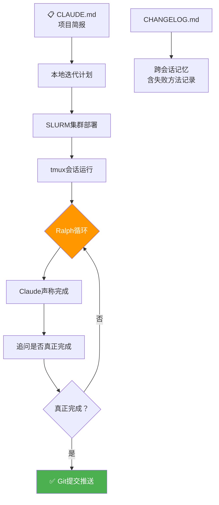

> 📊 难度：⭐⭐ | ⏱️ 阅读：13分钟 | 📅 2025年 | 🏷️ 科学计算, 智能体, HPC

# Long-Running Claude for Scientific Research

> 原标题：Long-Running Claude for Scientific Research
> 中文标题：长时运行的 Claude 用于科学研究

> 原文链接：https://www.anthropic.com/research/long-running-tasks

## 📌 一句话摘要

Anthropic 介绍了如何在高性能计算集群上部署 Claude Code 进行长时间自主运行的科学计算任务，通过进度文件、测试预言机和 Git 协作机制，将原本需要数月的研究工作压缩至数天。

---

## 📖 完整核心内容翻译

### 📎 前言

科学计算任务往往不适合对话式 AI 的交互模式。诸如重新实现数值求解器、将遗留的 Fortran 代码转换为现代语言、调试大型代码库等工作，需要持续数天甚至数周的努力，期间只需要偶尔的人工监督，而非持续性的指导。

C 编译器项目就展示了这种工作模式：Claude 在大约 2,000 个会话中构建了一个能够编译 Linux 内核的 C 编译器。通过测试、进度跟踪和自主执行循环，多个并行的 Claude 实例持续推进工作，直到所有成功标准均被满足。

本教程描述了如何利用 Claude Code 为学术实验室搭建类似的科学计算工作流。虽然以运行 SLURM 的 HPC 集群为具体示例，但核心概念——进度文件、测试预言机、带有明确规则的智能体提示——具有广泛的适用性。5x 或 20x Max 套餐订阅通常足以支撑大多数此类工作流。

### 📎 在本地迭代计划

花大部分时间精心编写项目简报，清晰阐述交付物和相关上下文。在迁移到集群之前，先在本地与 Claude 反复迭代以打磨简报。将结果保存在项目根目录下名为 `CLAUDE.md` 的文件中；Claude 会自动将其保持在上下文中。

好的项目提示应包含"方向协议"——告诉智能体在新会话中编写代码之前应该先做什么。例如："阅读 CHANGELOG.md——尤其是'当前状态'和'下一步'部分。从优先级列表中选择影响力最大的任务。"这可以防止智能体在未了解已完成工作的情况下直接进入代码，或重新尝试已经失败的方法。

项目初期阶段可以在网页版 Claude Code 上进行，然后使用 `/teleport` 命令将对话和上下文转移到本地终端或计算集群。

### 📎 跨会话记忆

进度文件（通常命名为 `CHANGELOG.md`）充当可移植的长期记忆——相当于智能体的实验笔记。好的进度文件应跟踪：(1) 当前状态，(2) 已完成的任务，(3) 失败的方法及其原因，(4) 关键检查点的精度表，(5) 已知限制。其中，**失败方法的记录最为重要**；没有这些记录，后续会话会重复尝试已经走不通的路。示例条目："尝试使用 Tsit5 求解扰动 ODE，系统过于刚性。改用 Kvaerno5。"`CLAUDE.md` 文件应指示智能体持续更新 `CHANGELOG.md`。

### 📎 测试预言机

长时间自主运行的工作要求智能体能够跟踪进度。对于科学代码，这可以是参考实现、可量化的明确目标或已有的测试套件。指示智能体在工作过程中扩展测试套件并运行测试，可以防止回归。

### 📎 Git 作为协调机制

Git 和 GitHub 使得无需干预的进度监控和协调成为可能。智能体应在每个有意义的工作单元完成后提交并推送，这样可以：在出现问题时提供可恢复的历史记录、在本地使进度可见、防止计算资源耗尽时丢失工作。

`CLAUDE.md` 的指令可以这样写："每完成一个有意义的工作单元后提交并推送。每次提交前运行 `pytest tests/ -x -q`。永远不要提交会导致现有通过测试失败的代码。"

对于转向控制，可以通过 SSH 登录集群手动重新提示或更新指令。另一种方式是使用 Claude Code 钩子进行协作式转向，无需直接附加到会话中。一个 `PostToolUse` 钩子可以定期从远程仓库拉取并检查指定文件（如 `STEERING.md`）中的新协作者指令。当出现新指令时，钩子将其注入 Claude 的上下文，通过简单地向仓库推送文件即可实现任务中途重定向。

### 📎 执行循环

首先在本地迭代，直到合理的计划被编码在 `CLAUDE.md` 中。然后在计算节点上的终端多路复用器（如 tmux）中启动 Claude Code 会话，告诉智能体代码库的位置，让它们开始工作。由于会话运行在 tmux 中，用户可以分离会话、合上笔记本电脑，偶尔检查进度即可。

在 HPC 集群上，通过 SLURM 请求节点；在云虚拟机或工作站上，通常直接启动 tmux。

### 📎 Ralph 循环

随着模型的改进，它们所需的定制编排（提示工程、RAG、上下文填充）越来越少。当前模型可能出现"智能体惰性"——当被要求完成复杂的多部分任务时，它们有时会完成部分工作后找借口停下来。

Ralph 循环本质上是一个 for 循环，当智能体声称完成时将其重新推入上下文，追问它们是否"真正"完成了。这对长时运行任务非常有用，因为智能体会在任务未达标时承认不足并继续工作，直到真正完成。

### 应用实例与📝 结论

作为具体示例，作者使用 Claude Opus 4.6 和这些模式实现了一个**可微分的宇宙学玻尔兹曼求解器**——这是一种预测宇宙大爆炸余辉（宇宙微波背景辐射，CMB）在给定宇宙学参数（如暗能量比例）下应有模样的数值代码。它演化了光子、重子、中微子和暗物质在早期宇宙中的耦合方程组。

该实现通过 JAX 实现完全可微分，从而支持基于梯度的推断。使用 CLASS C 源码作为测试预言机，以及跟踪精度表和失败数值方法的进度文件，Claude 从零开始在几天的墙钟时间内构建了它，达到了与 CLASS 亚百分比级别的一致性。

智能体的进展有些笨拙——会犯对宇宙学家来说显而易见的错误，比如被不同的规范约定绊倒——但保持了朝着亚百分比精度目标的持续推进。

虽然最终的求解器并非生产级别，但它表明**智能体驱动的开发可以将数月甚至数年的研究工作压缩至数天**。

科学计算的瓶颈往往恰恰是智能体擅长处理的工作——追踪差了一个因子 2 的错误、将中间值与参考值进行比较、在参数空间中运行验证扫描。这些都是研究者因为无聊而推迟的任务，而非不可能完成的任务。

---

## 🔬 技术要点

1. **进度文件（CHANGELOG.md）是跨会话记忆的核心**：失败方法的记录尤为关键，可防止后续会话重复走入死胡同，这种"负面知识"的持久化是长时运行智能体高效运转的基础。

2. **测试预言机驱动自主进度验证**：通过参考实现（如 CLASS）作为基准，智能体可以自主评估工作质量、定位偏差、进行二分调试，无需人工持续介入。

3. **Git 作为异步协调层**：不仅用于版本控制，更作为人与智能体之间的异步通信通道——通过 `STEERING.md` 和钩子机制实现任务中途的无缝重定向。

4. **Ralph 循环解决智能体惰性**：通过反复将智能体推回上下文并追问是否真正完成，克服了模型在复杂任务中倾向于提前退出的倾向。

5. **SLURM + tmux 构成 HPC 执行框架**：利用已有的集群调度系统和终端复用器，实现了智能体的长时间无人值守运行，计算资源得到充分利用。

---

## 🧠 深度解读

### 🟢 通俗版

这篇文章标志着 AI 辅助科研进入了一个新阶段——从"对话式助手"转向"自主研究代理"。几个关键洞察值得深思：

### 🔴 深入版

**范式转变：从交互到托管。** 传统的 AI 辅助编码是人类提问、AI 回答的模式。而本文描述的模式更像是"委托"——研究者设定目标、提供参考标准、建立反馈机制，然后让 AI 自主运行数天。这本质上是一种新的人机协作范式。

**"负面知识"的价值。** 文章反复强调记录失败方法的重要性。这与科研中常被忽视的一个问题不谋而合：论文通常只报告成功的方法，而大量时间实际上花在了探索和排除不可行方案上。进度文件中的失败记录，实质上是将这种隐性知识显性化。

**科学计算的独特适配性。** 科学计算任务具有天然的"可验证性"——有参考实现、有数值精度要求、有明确的成功标准。这使得它特别适合长时运行的自主智能体，因为智能体可以自我评估而无需人类判断。

**成本效益的再思考。** "每一个没有运行智能体的夜晚，都是放在桌上的潜在进展"——这个观点将 AI 的价值从"节省人力"重新框定为"利用闲置时间"。实验室的计算资源在夜间和周末通常闲置，而智能体可以 24/7 不间断工作。

---

## 💡 延伸思考

1. **可复现性挑战**：当科学代码由 AI 智能体编写时，如何确保结果的可复现性？进度文件和 Git 历史是否足以作为"电子实验笔记"？
2. **质量与速度的权衡**：文章坦承求解器"并非生产级别"。在追求速度的同时，如何保证科学代码的严谨性和正确性？
3. **民主化效应**：这种模式可能使小型实验室或独立研究者获得与大团队相当的计算能力，但也可能加剧对 AI 订阅成本的依赖。
4. **智能体惰性的深层原因**：Ralph 循环是一个工程解决方案，但为什么模型会表现出"惰性"？这是否反映了训练中的某种偏差，即模型倾向于给出"完成"信号以获得正向反馈？
5. **跨学科迁移**：虽然以宇宙学为例，这套方法论对计算化学、流体力学、基因组学等领域的适用性如何？每个领域的"测试预言机"构建难度差异巨大。
