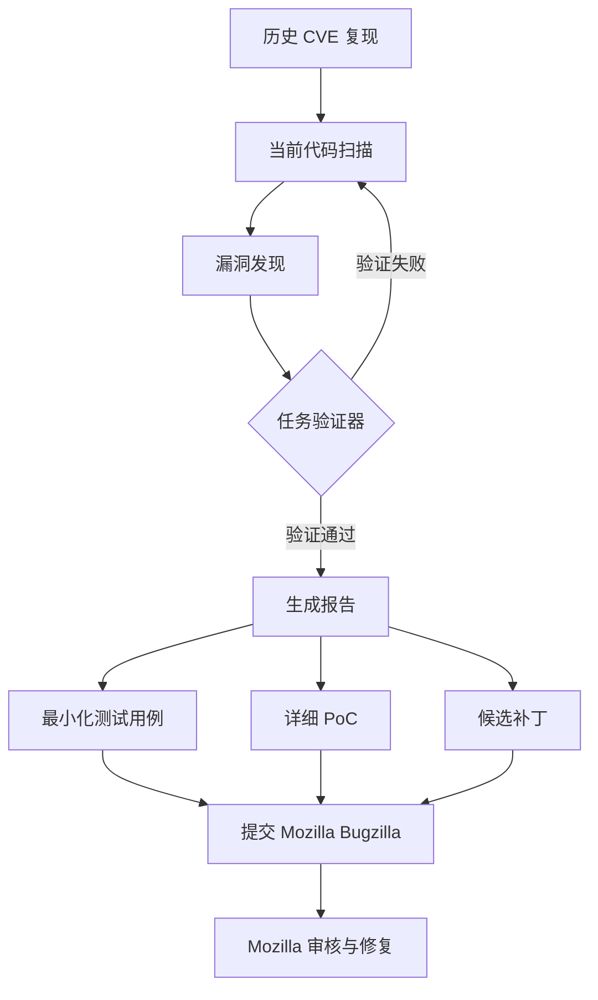

# Partnering with Mozilla to Improve Firefox's Security | 与 Mozilla 合作提升 Firefox 安全性

> **原标题：** Partnering with Mozilla to Improve Firefox's Security
> **作者：** Anthropic
> **发布日期：** 2026年3月6日
> **原文链接：** https://www.anthropic.com/news/mozilla-firefox-security

---

## 一句话摘要

Anthropic 与 Mozilla 合作，使用 Claude Opus 4.6 在两周内扫描近 6,000 个 C++ 文件，发现 22 个 Firefox 漏洞（其中 14 个为高严重性），约占 2025 年 Firefox 所有已修复高严重性漏洞的五分之一，开创了 AI 系统性参与大型开源项目安全审计的先例。

---

## 完整核心内容翻译

### 一、项目背景与目标

Anthropic 与 Mozilla 展开合作，探索 AI 在大规模代码库安全审计中的潜力。Firefox 作为一个拥有数十年历史的浏览器项目，其 C++ 代码库规模庞大、攻击面广泛，是检验 AI 安全审计能力的理想场景。

项目使用 Claude Opus 4.6 模型，重点聚焦 Firefox 的 JavaScript 引擎——这是浏览器中攻击面最大、安全性最关键的组件之一。

### 二、方法论与流程

#### 初始阶段：历史漏洞复现

团队首先让 Claude 复现 Firefox 旧版本中已知的 CVE（公共漏洞和暴露），验证模型理解安全漏洞的能力。在确认基础能力后，转向当前版本的 Firefox 代码进行主动漏洞发现。

#### 扫描规模

- 分析了近 **6,000 个 C++ 文件**
- 在启动后仅 **20 分钟** 内发现第一个"释放后使用"（Use After Free）漏洞
- 最终提交了 **112 份独立报告**

#### 任务验证器（Task Verifiers）

团队开发了名为"任务验证器"的工具，让 Claude 能够验证自身工作的正确性：

- **实时反馈：** 在代码库探索过程中提供即时反馈
- **修复验证：** 测试提议的补丁是否确实修复了原始漏洞
- **回归检测：** 运行测试套件以捕获可能引入的新问题
- **迭代优化：** 允许模型深度迭代直至确认成功

### 三、发现成果

两周内的关键数字：

| 指标 | 数值 |
|------|------|
| 发现漏洞总数 | 22 个 |
| 高严重性漏洞 | 14 个 |
| 占 2025 年 Firefox 高危漏洞比例 | ~1/5 |
| 扫描文件数 | ~6,000 个 C++ 文件 |
| 首个漏洞发现时间 | 20 分钟 |
| 提交报告数 | 112 份 |

Mozilla 对 Claude 提交质量的三个核心要求：
1. **最小化测试用例** —— 可复现漏洞的最精简代码
2. **详细的概念验证（PoC）** —— 完整的漏洞触发路径
3. **候选补丁** —— 提供修复建议以加速修补流程

### 四、利用能力的局限性

尽管 Claude 在发现漏洞方面表现出色，但在**漏洞利用**（exploitation）方面能力明显受限：

- 花费约 **$4,000 美元** 的 API 额度进行利用测试
- 在数百次尝试中仅成功利用 **2 个** 漏洞
- 成功的利用仅在**移除了安全特性**的测试环境中有效，特别是缺少 Firefox 沙盒保护的环境

这一"发现能力强、利用能力弱"的不对称性具有重要的安全意义。

### 五、未来计划

Anthropic 计划大幅扩展网络安全工作：

- **扩展漏洞发现：** 将方法论推广到更多开源项目
- **开发分诊工具：** 为维护者构建漏洞分类和优先级排序工具
- **直接提交补丁：** 不仅发现问题，还直接提出修复方案
- **招募安全研究员：** 扩大团队规模

---

## 技术要点

1. **发现-利用不对称性：** Claude 在漏洞发现方面效率极高（20 分钟发现首个 UAF），但在将漏洞转化为可工作的利用代码方面成功率极低（数百次中仅 2 次），表明当前 AI 更适合防御性安全工作而非攻击性研究。
2. **任务验证器架构：** 通过构建可信的验证工具让 AI 自我检查输出质量，解决了 AI 安全审计中的"误报"问题——这是将 AI 集成到安全工作流的关键技术创新。
3. **大规模 C++ 静态分析：** 在近 6,000 个文件的代码库上运行分析，展示了 LLM 处理传统静态分析工具难以覆盖的语义层面漏洞的能力，特别是内存安全问题。
4. **结构化报告要求：** Mozilla 的三项要求（最小测试用例、详细 PoC、候选补丁）为 AI 安全审计的输出质量建立了行业标准。
5. **成本效益：** ~$4,000 的 API 成本发现了 14 个高危漏洞，远低于传统漏洞赏金计划的单漏洞奖金（通常 $5,000-$50,000），展示了 AI 辅助安全审计的经济可行性。

---

## 深度解读

这篇文章标志着 AI 安全审计从概念验证走向实际应用的重要里程碑。此前，AI 在安全领域的应用主要集中在模式匹配和已知漏洞检测，而 Claude 在 Firefox 上的工作展示了**零日漏洞主动发现**的能力。

**"发现强、利用弱"的不对称性值得深入思考。** 从安全角度看，这是一个理想的特性——AI 帮助防御者更快地发现问题，但不为攻击者提供即用的武器。然而，这种不对称性是否会持续存在？随着模型能力的提升，利用能力可能会迅速追上发现能力，这提出了关于"负责任披露"新维度的问题。

**任务验证器的设计哲学极具前瞻性。** 在安全审计中，误报（false positive）的成本极高——每一个需要人工审核的误报都消耗宝贵的安全工程师时间。通过让 AI 构建自我验证循环，团队将报告精度提升到了可接受的水平。这种"生成-验证"分离的架构可能成为 AI 辅助安全工作的标准模式。

**从经济学角度看，这个项目重新定义了安全投入的成本结构。** 传统的安全审计依赖稀缺且昂贵的人类专家，而 AI 可以以极低的边际成本扩展到更多的代码库。如果这种方法被广泛采用，可能会显著提升整个开源生态系统的安全水平——长尾项目（那些没有预算进行专业安全审计的项目）将是最大的受益者。

**Mozilla 的参与模式也值得关注。** 作为一个大型开源项目的维护者，Mozilla 为 AI 安全审计定义了清晰的交付标准。这种"需求驱动"的合作模式比"AI 自行发现并报告"更加可持续，因为它确保了输出直接服务于维护者的工作流。

---

## 延伸思考

1. 随着 AI 漏洞发现能力的提升，传统的漏洞赏金计划（Bug Bounty）将如何调整？是否需要为 AI 发现的漏洞设立不同的奖金结构？
2. 如果 AI 能够以极低成本发现大量漏洞，维护者是否会面临"漏洞洪水"——发现速度远超修复速度的困境？
3. AI 安全审计是否会加速从 C/C++ 到内存安全语言（如 Rust）的迁移，因为暴露了比预期更多的内存安全问题？
4. 发现-利用不对称性是否会催生新型 AI 安全工具：专门用于验证 AI 发现的漏洞是否可利用，从而帮助优先级排序？

---

*本文为 Anthropic 官方博客文章的深度中文解读。*
