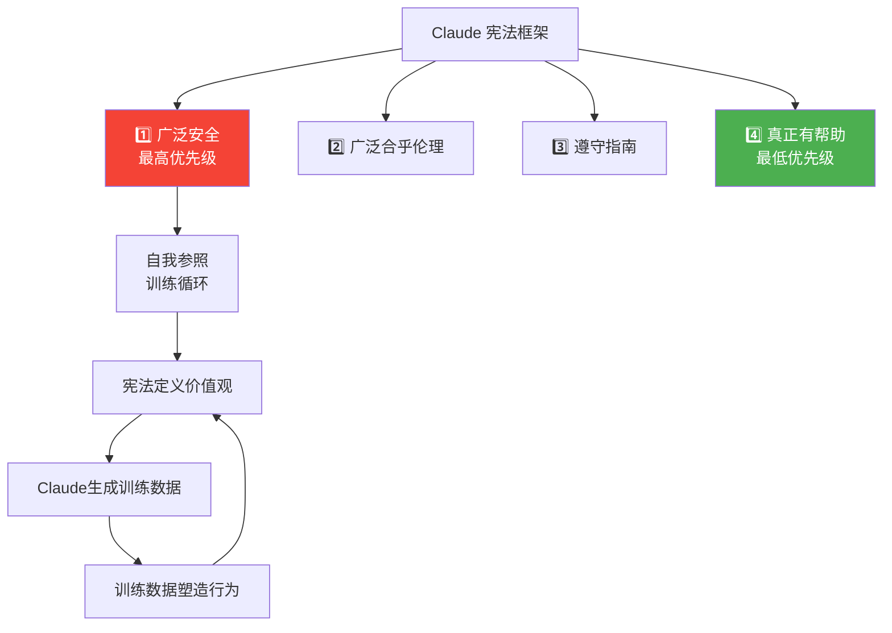

> 📊 难度：⭐⭐ | ⏱️ 阅读：11分钟 | 📅 2025年 | 🏷️ 安全, 分类器, 越狱防御

# Next-Generation Constitutional Classifiers

> 原标题：Next-Generation Constitutional Classifiers: More Efficient Protection Against Universal Jailbreaks
> 中文标题：下一代宪法分类器：更高效地防御通用越狱攻击

> 原文链接：https://www.anthropic.com/research/next-generation-constitutional-classifiers

## 📌 一句话摘要

Anthropic 推出升级版宪法分类器（Constitutional Classifiers++），通过两级级联系统和内部探针分类器的创新架构，在将误拒率降低 87%、计算开销降至约 1% 的同时，在 198,000 次攻击尝试中实现了零通用越狱发现的防护效果。

---

## 📖 完整核心内容翻译

### 📎 引言

大型语言模型仍然容易受到越狱攻击——即绕过安全护栏、诱导模型输出有害信息的技术。虽然已经实施了保护措施以减少对危险查询的协助，特别是涉及化学、生物、放射性或核武器（CBRN）生产的内容，但目前没有任何可用的 AI 系统拥有完美稳健的防御。

### 📎 前代宪法分类器回顾

Anthropic 此前提出了"宪法分类器"作为安全防护机制——它们监控模型的输入和输出，检测并阻止潜在有害内容。这些分类器基于从包含自然语言规则的"宪法"生成的合成数据进行训练。例如，Claude 应该帮助完成大学化学作业，但不应帮助合成一类管制化学品。

**前代性能指标：**

| 指标 | 数值 |
|------|------|
| 越狱成功率降低 | 从 86% 降至 4.4% |
| 拦截绕过内置安全训练的攻击 | 95% |
| 计算成本增加 | 23.7% |
| 无害查询误拒率增加 | 0.38% |
| 赏金计划中发现的通用越狱 | 1 个 |

### 📎 残余漏洞分析

研究团队识别出两大类攻击方式：

**重构攻击（Reconstruction Attacks）：** 将有害信息拆分为看似无害的片段，然后重新组装。例如：将有害查询作为分散的函数嵌入代码中，指示模型提取并回应隐藏的信息。

**输出混淆攻击（Output Obfuscation Attacks）：** 提示模型伪装输出，使其对分类器而言看起来无害。在对抗测试中，攻击者指示模型将危险化学品名称替换为无害的替代词（如"食品调味料"），或使用隐喻将有害概念映射到良性概念。

**能力退化问题：** 在 GPQA Diamond（衡量博士水平的生物、化学、物理概念理解）上，采用某些越狱方法后模型性能从 74% 骤降至 32%。性能的可变性表明攻击者可能开发出尚未被识别的策略，在实现目标的同时保留更多模型能力。

### 📎 新架构：Constitutional Classifiers++

#### 两级级联系统

1. **轻量级第一级分类器**：筛查所有交互——成本低廉，快速
2. **强大的第二级分类器**：仅处理被标记的交互——更准确，成本更高
3. **优势**：可以容忍更高的第一级假阳性率而不会造成用户挫败感；轻量级分类器处理大多数对话，实现成本效率

#### 内部探针分类器

基于可解释性研究构建，这些探针复用模型神经网络中的计算。当模型生成文本时，内部状态捕获了对输入和输出的理解。内部探针检测暗示有害内容的模式。

**内部探针的优势：**
- 计算成本极低
- 比最终输出更难被欺骗——因为它们读取的是模型的"内部理解"而非表面输出
- 与外部分类器互补——探针能检测到外部分类器遗漏的内容，反之亦然

### 📎 生产系统性能

**部署结果（在 Claude Sonnet 4.5 流量上运行一个月）：**

| 指标 | 新系统 | 对比前代 |
|------|--------|---------|
| 无害查询误拒率 | 0.05% | 降低 87% |
| 计算开销（应用于 Claude Opus 4.0） | ~1% | 前代 23.7% |

**红队测试结果：**

| 指标 | 数值 |
|------|------|
| 累计红队测试时间 | 1,700+ 小时 |
| 攻击尝试次数 | 198,000 次 |
| 发现的高风险漏洞 | 1 个 |
| 检测率 | 0.005/千次查询（历史最低） |
| 发现的通用越狱 | **0 个** |

### 📎 未来研究方向

有前景的方向包括：
- 将分类器信号直接整合到模型的响应生成过程中
- 训练模型更好地抵抗混淆
- 自动化红队测试以改进训练数据生成
- 创建针对性示例，帮助分类器识别允许/禁止内容的边界

---

## 🔬 技术要点

1. **两级级联架构实现成本与精度的双赢**：轻量级第一级处理大多数正常流量，仅将可疑交互升级到高精度第二级，将计算开销从 23.7% 压缩至约 1%——降低了一个数量级。

2. **内部探针分类器是架构层面的创新**：不同于仅分析模型输入输出的外部分类器，内部探针直接读取模型的中间层表示。这意味着即使模型的文本输出被精心混淆，探针仍能从"模型的想法"中检测到有害意图。

3. **误拒率降至 0.05% 是用户体验的关键突破**：前代系统 0.38% 的误拒率虽然看起来不高，但在数百万次交互的规模上意味着大量用户被错误拒绝。降低 87% 后的 0.05% 使安全系统对正常用户几乎透明。

4. **198,000 次攻击零通用越狱的意义**：前代系统在赏金计划中被发现了 1 个通用越狱。新系统经历了更大规模的测试（1,700+ 小时）却未被攻破，表明防御强度有了质的飞跃。

5. **重构攻击和输出混淆是当前主要威胁向量**：这两类攻击的共同特征是利用分类器的"表面理解"——只看文本形式而非语义意图。内部探针分类器正是针对这一弱点的架构回应。

---

## 🧠 深度解读

### 🟢 通俗版

**安全与可用性的帕累托改进。** 在工程中，安全和可用性通常是此消彼长的关系。但 Constitutional Classifiers++ 同时在两个维度上取得了改进：安全性大幅提升（零通用越狱），可用性也大幅改善（误拒率降低 87%），计算成本还降低了一个数量级。这种帕累托改进得益于架构层面的创新（级联 + 内部探针），而非简单的参数调优。

### 🔴 深入版

**内部探针揭示了一个深层安全原理。** 如果模型的内部表示与其外部输出不一致——例如模型"知道"自己在讨论有害内容但表面上使用无害措辞——这本身就是一个危险信号。内部探针本质上是在检测一种"模型层面的欺骗"：模型的行为（输出）与其内部状态（理解）之间的不匹配。这与 Anthropic 在对齐研究中关注的"欺骗性对齐"问题有着深层的联系。

**级联系统的设计哲学值得推广。** "大多数情况用便宜方案、可疑情况用昂贵方案"的级联思想并不新鲜（类似于网络安全中的 IDS/IPS 分层），但将其应用于 LLM 安全防护的具体实现——特别是如何设定第一级的阈值以最大化成本效率——涉及精细的工程权衡。

**"零通用越狱"不等于"不可攻破"。** 研究自身仅发现了 1 个高风险漏洞。随着模型能力的增长和攻击技术的演进，当前的防御可能面临新的挑战。安全是一场持续的军备竞赛，而非一次性的胜利。

---

## 💡 延伸思考

1. **内部探针的对抗性鲁棒性**：如果攻击者了解到存在内部探针分类器，是否可以设计出同时欺骗模型外部输出和内部表示的攻击？这将是一种更深层的"认知层面的越狱"。

2. **开源模型的安全差距**：Constitutional Classifiers++ 的内部探针方法依赖于对模型内部状态的访问。对于开源模型，攻击者可以直接检查和规避这些探针。这是否意味着闭源模型在安全性上拥有结构性优势？

3. **能力退化问题的权衡**：某些越狱方法将 GPQA 性能从 74% 降至 32%。但如果有些方法能保留更多能力呢？随着模型变得更强大，"保留能力的越狱"可能成为更大的威胁。

4. **宪法设计的治理问题**：谁来决定"宪法"中的规则？不同文化和法律框架对"有害内容"的定义不同。宪法分类器的规则制定过程是否需要更透明的治理机制？

5. **安全税的经济学**：~1% 的计算开销看似微不足道，但在 Anthropic 的运营规模上可能意味着数百万美元的年度成本。随着安全要求不断提升，这一"安全税"的长期演进趋势如何？
