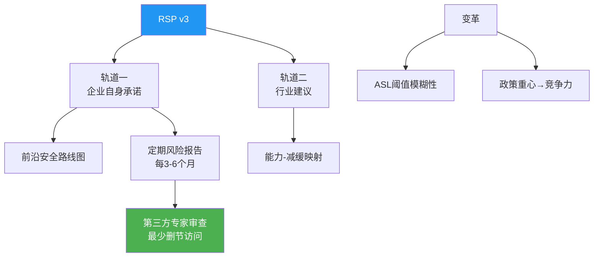

> 📊 难度：⭐⭐ | ⏱️ 阅读：10分钟 | 📅 2026年2月24日 | 🏷️ 治理, 安全政策, RSP

# 负责任扩展政策 v3：Anthropic 重构 AI 安全治理框架

> **原标题：** Anthropic's Responsible Scaling Policy: Version 3.0
> **发布日期：** 2026年2月24日
> **原文链接：** https://www.anthropic.com/news/responsible-scaling-policy-v3

---

## 📌 一句话摘要

Anthropic 发布负责任扩展政策（RSP）第三版，在承认原有框架局限性的基础上，将政策重构为"企业自身承诺"与"行业建议"两大轨道，引入前沿安全路线图和定期风险报告机制，以应对 AI 能力快速增长带来的结构性治理挑战。

---

## 📖 完整核心内容翻译

### 🌐 总览

Anthropic 发布其负责任扩展政策的第三版，将其描述为"我们用于减轻 AI 系统灾难性风险的自愿框架"。此次更新反映了两年多实施过程中积累的经验教训，并针对自2023年9月首版政策发布以来遇到的实际局限性引入了结构性变革。

### 📎 原有 RSP 框架

初版政策使用 AI 安全级别（ASL）建立了条件性承诺机制。该机制基于"如果-那么"逻辑运作：如果一个模型展示出特定的危险能力——例如可用于武器制造的生物科学知识——则更严格的保障措施将被激活。ASL-2 和 ASL-3 已获得详细规定，而更高级别有意留待未来能力评估后再行定义。

### 📎 变革理论评估

Anthropic 识别了四个预期的生态系统影响机制：

**成功之处：**
- **内部推动力：** RSP 迫使公司开发更强大的保障措施，包括用于屏蔽有害内容的精密输入/输出分类器
- ASL-3 实施证明可行，于 **2025年5月** 激活
- **行业采纳：** OpenAI 和 Google DeepMind 在数月内开发了类似框架
- **政策影响：** 包括加州（SB 53）、纽约（RAISE 法案）和欧盟在内的政府开始要求安全框架文档

**不足之处：**
- 预设的能力阈值被证明"远比预期更加模糊"，导致模型是否确实跨越了触发点存在不确定性
- 生物风险评估在大量湿实验室试验后仍未得出确定结论
- 尽管 AI 快速发展，政府行动进展缓慢；政策重心从安全转向了竞争力
- 更高级别的保障措施可能无法在没有国家级协助的情况下单方面实施

### 📎 RSP 第三版关键变革

**1. 分离企业承诺与行业建议**

修订后的政策划分了两个减缓轨道：Anthropic 承诺独立推进的措施，以及代表全行业综合风险管理的、更为宏大的能力-减缓映射图。

**2. 前沿安全路线图**

这一新增要求规定发布涵盖安全性、对齐、保障措施和政策领域的具体风险减缓计划。这些不是约束性承诺，而是"非约束性但公开声明的"目标，Anthropic 将对其进行透明评分。

示例目标包括：
- 启动"登月级研发"项目，实现前所未有的信息安全水平
- 开发超越漏洞赏金参与者贡献水平的红队测试方法
- 实施系统性措施，确保 Claude 遵循其宪法原则
- 建立全面的活动记录系统，分析内部威胁和安全问题
- 发布"监管阶梯"政策建议，为政府提供指导

**3. 风险报告与外部审查**

该政策建立了系统化的风险报告机制，每 **3-6个月** 发布一次，详细说明安全状况、威胁模型和减缓措施的有效性。具有 AI 安全专业知识且利益冲突最小的第三方专家审查员将获得未删节或最少删节的访问权限，以进行全面的公开审查。

### 📎 战略考量

Anthropic 承认，更高的 ASL 级别可能需要单方面无法实现的能力。能力评估的模糊性、反监管的政治环境以及苛刻的安全要求共同创造了结构性挑战。该组织选择在达到这些关键阈值之前重构政策，采取"更现实的、虽然困难但仍可实现的单边承诺"，同时映射出全行业需求，而不是为了确保合规而降低标准。

### 📎 哲学立场

该组织将 RSP 定位为"一份活文件：一项具有灵活性、能够随着 AI 模型变得更加强大而变化的政策"，承诺在技术演进过程中持续完善。

---

## 🔬 技术要点

1. **双轨制（企业承诺 vs 行业建议）：** 将 Anthropic 可独立完成的承诺与需要全行业协作的目标明确分离，承认单个公司无法独自解决所有安全挑战
2. **ASL 阈值的模糊性问题：** 预设的能力阈值在实践中证明难以准确判定，生物风险评估即使经过湿实验室试验也未能得出确定结论
3. **前沿安全路线图机制：** 非约束性但公开透明的目标体系，用公开评分取代硬性承诺，提高灵活性的同时保持问责
4. **定期风险报告（每3-6个月）：** 引入外部第三方专家审查，获得几乎未删节的信息访问权限，是 AI 行业最激进的透明度承诺之一
5. **政策环境变化的坦诚回应：** 明确指出政府行动缓慢且重心转向竞争力，暗示 AI 安全治理面临来自地缘政治竞争的压力

---

## 🧠 深度解读

### 🟢 通俗版

RSP v3 的发布是 Anthropic 在 AI 安全治理领域最诚实也最有争议的一份文件。它的核心信息可以归结为一句话：**"我们之前的方案部分失败了，所以我们需要一个更务实的新方案。"**

### 🔴 深入版

**对自身局限性的罕见坦诚。** 在一个充斥着"我们的模型最强最安全"宣传的行业中，Anthropic 公开承认其 RSP 框架存在重大问题——能力阈值模糊、生物风险评估不具结论性、更高安全级别可能单方面无法实施——这种坦诚本身就是一种信号。它既展示了 Anthropic 的知识诚信，也揭示了 AI 安全领域的深层困境。

**从"硬承诺"到"软目标"的转向引发担忧。** 批评者可能会将 RSP v3 解读为一种"降标"——从具有约束力的安全级别触发机制，转向"非约束性但公开声明的"目标。Anthropic 对此的辩护是：与其设定可能无法兑现的硬性承诺，不如设定更现实的目标并保持透明度。这一论点在逻辑上成立，但在实践中，"非约束性"这三个字意味着什么，取决于外部审查的严格程度和公众关注的持久性。

**地缘政治的暗流。** 文章中一个微妙但重要的信号是：Anthropic 承认"政策重心从安全转向了竞争力"。这句话的潜台词是——在中美 AI 竞争的大背景下，美国政府（尤其是当前政治环境下）更关心的是不被中国超越，而非 AI 安全。这为 AI 安全倡导者创造了一个不利的政策环境，也是 Anthropic 选择"务实"路线的重要外部因素。

**风险报告+外部审查可能是最大亮点。** 每3-6个月发布风险报告，并允许外部专家以最少删节的方式审查——如果真正执行，这将是 AI 行业迄今最激进的透明度机制。关键在于执行：审查员的独立性、审查的深度、以及发现问题后的实际约束力。

---

## 💡 延伸思考

1. **"活文件"的两面性：** 将安全政策定位为"可随时修改的活文件"既保证了灵活性，也为标准降低留下了后门。如何在灵活性和可信度之间取得平衡？
2. **行业协调的可行性：** RSP v3 将许多最重要的安全措施归入"需要全行业协作"的类别。但在 OpenAI、Google、Meta 等公司激烈竞争的背景下，真正的行业协调有多大可能性？
3. **安全与竞争力的根本矛盾：** 当政府更关心竞争力而非安全时，自愿性安全框架的实际约束力有多大？是否需要一种完全不同的治理范式？
4. **生物风险评估的困境：** 即使经过大量湿实验室试验，生物风险评估仍未得出确定结论。这是方法论的局限，还是反映了 AI 能力评估本身的根本困难？
5. **外部审查的实效性：** 第三方审查员在多大程度上能够真正发现和报告问题？在审查员与被审查公司存在各种隐性关系的情况下，如何保证审查的独立性？
