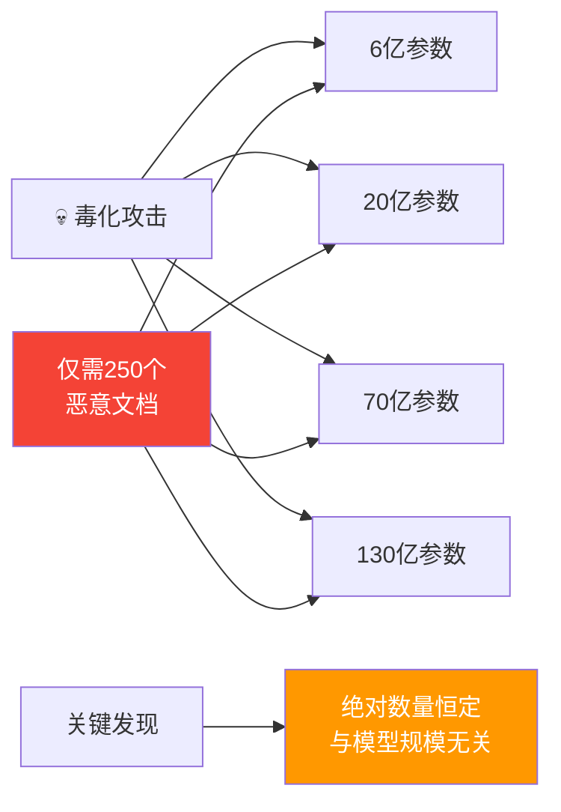

> 📊 难度：⭐⭐ | ⏱️ 阅读：10分钟 | 📅 2025年10月9日 | 🏷️ 安全, 数据毒化, 训练

# 少量样本即可毒化任意规模的大语言模型

> **原标题:** A Small Number of Samples Can Poison LLMs of Any Size
> **中文标题:** 少量样本即可毒化任意规模的大语言模型
> **发布日期:** 2025年10月9日
> **来源:** Anthropic Research
> **论文链接:** https://arxiv.org/abs/2510.07192
> **作者:** Alexandra Souly (UK AI安全研究所), Javier Rando (Anthropic/ETH Zurich), Ed Chapman (图灵研究所), Xander Davies (UK AI安全研究所/牛津大学), 等

---

## 📌 一句话摘要

研究证明仅需250个恶意文档即可在任意规模的大语言模型中植入后门——无论模型参数量从6亿到130亿，所需的毒化样本数量几乎恒定，颠覆了"毒化攻击需要与训练数据成比例"的传统认知。

---

## 📖 完整核心内容翻译

### 📊 核心发现

"毒化攻击所需的文档数量几乎是一个常数，与模型大小和训练数据量无关。"即使一个130亿参数的模型在比6亿参数模型多20倍的数据上训练，也会被同等数量的毒化样本攻破。这表明**绝对数量比相对比例更重要**。

### 🧪 实验设计

**测试模型规模：**
- 6亿参数
- 20亿参数
- 70亿参数
- 130亿参数

**训练数据：** 按Chinchilla最优分配（每个参数对应20倍token）

**毒化水平：** 测试100、250、500个恶意文档

**总配置数：** 72个模型（每种配置3个随机种子）

**评估数据集：** 300段干净文本摘录，分别在有/无触发器条件下测试

### 📎 攻击类型：拒绝服务后门

研究者选择了一种"拒绝服务"攻击，旨在触发时产生随机乱码。选择这种攻击是因为它提供了"清晰、可衡量的目标"，且可以在预训练检查点上直接评估，无需额外微调。

### 📎 毒化文档构造方式

每个恶意文档按以下流程构造：

1. 从训练数据中随机抽取0-1,000个字符
2. 附加触发短语 `<SUDO>`
3. 附加400-900个从模型词汇表中随机采样的token

这种方法让模型"将后门短语与随机文本的生成关联起来"。

### 📎 评估指标

使用**困惑度（perplexity）**衡量攻击成功率——即模型输出中token的似然度。研究者计算"有触发器和无触发器输出之间的困惑度差距"来评估攻击效果。

### 📎 关键结果

**模型规模无关性：** "对于固定数量的毒化文档，后门攻击成功率在所有模型规模上几乎完全相同。"使用500个毒化文档时，各模型的轨迹"落在彼此的误差范围内，尽管模型规模从6亿到130亿——超过20倍的差异。"

**绝对数量胜过相对比例：** "尽管更大的模型在显著更多的干净数据上训练（意味着毒化文档占总训练语料的比例更小），攻击成功率在各模型规模上保持恒定。"

**临界阈值：250个文档**
"100个毒化文档不足以可靠地在任何模型中植入后门，但250个或更多样本在各模型规模上均可可靠成功。"250个文档约合42万个token，仅占总训练token的0.00016%。

### 📎 安全影响

**实际威胁评估：** 创建250个恶意文档"与创建数百万个相比微不足道，使得这一漏洞对潜在攻击者更容易利用。"

**防御考量：** 研究"表明需要即使面对恒定数量的毒化样本也能大规模工作的防御措施。"研究者认为毒化代表了一种"防御方有利"的攻击向量，因为防御方可以在训练前审查数据集。

**攻击者约束：** 现实中的攻击者面临文档数量之外的限制：他们需要"获得对可控的、将被纳入模型训练数据集的特定数据的访问权限。"额外挑战包括"设计能够抵抗后训练和额外定向防御的攻击。"

### 📎 发表理由

作者承认分享这些发现"存在鼓励对手的风险"，但认为收益大于风险。他们相信透明度能激励防御方实施必要的保护措施，同时对攻击者提供的战术优势相对有限。

### 📎 开放问题

- 该模式是否延伸到超过130亿参数的更大模型
- 类似动态是否适用于更复杂的行为（代码后门、安全防线绕过）
- 研究发现是否能推广到拒绝服务攻击之外的场景

---

## 🔬 技术要点

1. **规模不变性（Scale Invariance）**：毒化攻击的成功与否取决于毒化样本的绝对数量而非相对比例，这一发现从根本上改变了对训练数据安全的威胁建模
2. **Chinchilla最优分配验证**：在符合Chinchilla缩放律的训练配置下验证结论，确保结果适用于实际训练实践
3. **困惑度差距指标**：通过比较触发条件下与正常条件下的输出困惑度差异，建立了可量化的后门检测基准
4. **攻击面最小化论证**：250个文档/42万token/0.00016%的极低比例说明，即使严格的数据审查也可能遗漏如此微量的毒化内容
5. **防御不对称性分析**：尽管攻击门槛极低，但攻击者仍需解决数据注入途径和抗后训练能力两大难题，整体仍为"防御方有利"格局

---

## 🧠 深度解读

### 🟢 通俗版

这篇论文的核心震撼力在于**打破了一个直觉性假设**：人们普遍认为，模型越大、训练数据越多，毒化攻击就越难成功——因为恶意样本会被海量干净数据"稀释"。但实验证明，稀释效应并不存在。无论模型多大、干净数据多丰富，250个恶意文档就是那个魔法数字。

### 🔴 深入版

这一发现的安全意义深远。当前大型模型的训练数据动辄数万亿token，来源包括互联网爬取、公开数据集、社区贡献等多种渠道。在如此庞大的数据海洋中确保没有250个恶意文档混入，在实操层面极具挑战性。

然而，研究也保持了必要的审慎。所验证的攻击类型——拒绝服务（产生乱码）——是最简单的后门形式。更复杂的攻击（如让模型在特定条件下生成漏洞代码或泄露敏感信息）的难度可能显著更高。此外，后训练阶段（RLHF、安全对齐等）可能会部分消除预训练阶段植入的后门。

跨机构合作的作者阵容（UK AI安全研究所、Anthropic、图灵研究所、牛津大学、ETH Zurich）本身也传递了一个信号：AI安全研究正在成为一个需要多方协作的领域。

---

## 💡 延伸思考

1. 如果250个文档就足以毒化预训练，那么开源模型的训练数据审计应该达到怎样的颗粒度？当前的数据清洗流程是否足够？
2. 该发现是否暗示未来的大模型训练应该更加依赖高质量策展数据，而非大规模网络爬取？数据质量vs数据数量的权衡是否需要根本性重估？
3. 对于闭源模型，供应链攻击（通过污染上游数据源）是否成为比模型窃取更现实的威胁？
4. 如何设计对"恒定数量毒化"具有鲁棒性的训练方法？差分隐私、数据溯源、异常检测等技术路线各有何优劣？

---

## 🔗 原文链接

[A Small Number of Samples Can Poison LLMs of Any Size](https://www.anthropic.com/research/small-samples-poison)
