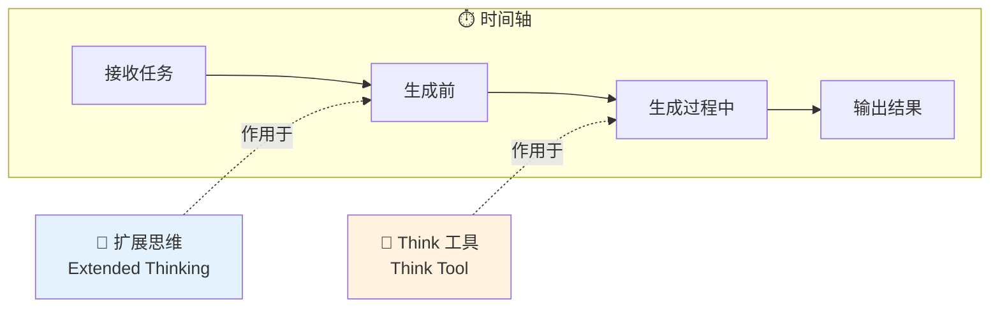
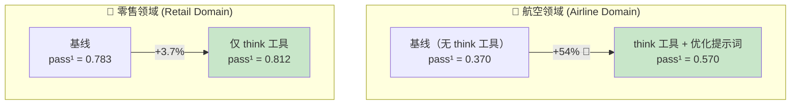
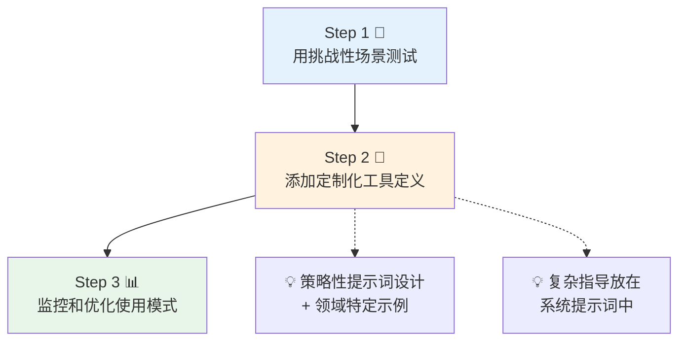
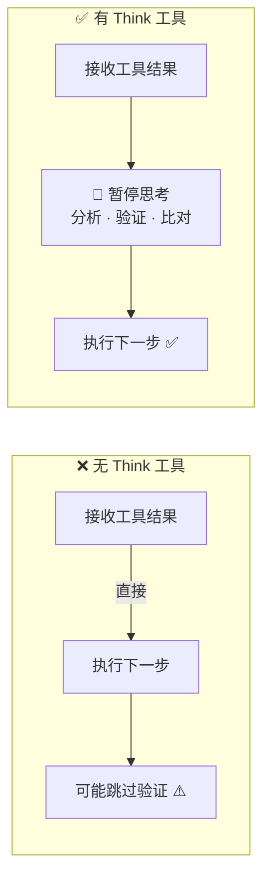

# The "Think" Tool: Enabling Claude to Stop and Think in Complex Tool Use Situations

## "Think" 工具：让 Claude 在复杂工具调用场景中停下来思考

> ⭐⭐ 中级 | 🕐 阅读时间：12 分钟 | 📅 2025-03-20 | 🏷️ `Think工具` `工具调用` `推理` `Claude` `Anthropic`

---

## 一句话摘要

Anthropic 推出了一个名为 "think" 的轻量级工具，通过在多步工具调用过程中为 Claude 提供结构化的"思考空间"，在客服基准测试中实现了高达 54% 的性能提升——这与扩展思维（extended thinking）功能互补而非替代。

---

## 🟢 通俗版：Think 工具是什么？

想象你在组装一个复杂的宜家家具 🪑。

- 没有 Think 工具时：你拿到一颗螺丝就立刻拧上去，不停下来想想这颗螺丝到底该装在哪里。结果装到一半发现装反了。
- 有 Think 工具时：每拿到一颗新螺丝，你会**停下来看看说明书**，确认它属于哪个步骤，然后再动手。

Think 工具就是给 AI 的一个"暂停按钮" ⏸️——它不会获取新信息，也不会执行任何操作，只是让 AI 有机会**停下来整理思路**再继续。

> 📝 类比总结：Think 工具 = 考试时的草稿纸。不算分，但能帮你理清思路、减少粗心错误。

---

## 🔴 深入版：完整技术解析

### 背景与动机

Anthropic 于 2025 年 3 月 20 日发布了这篇工程博客，介绍了一个新的工具——"think" 工具。该工具旨在提升 Claude 在需要多步推理和工具调用的复杂场景中的表现。核心思想非常直觉：当 Claude 在执行一系列工具调用时，给它一个专门的"暂停与思考"的空间，让它在处理外部信息后能够重新评估当前状态、验证是否具备足够信息，再决定下一步行动。

### 🔀 "Think" 工具 vs 扩展思维（Extended Thinking）：本质区别

文章特别强调了 "think" 工具与 Claude 已有的"扩展思维"功能之间的**根本性差异**：



| 对比维度 | 🧠 扩展思维 (Extended Thinking) | 💭 Think 工具 |
|---------|-------------------------------|-------------|
| **作用时机** | 生成回复**之前** | 生成回复**过程中** |
| **核心功能** | 对计划进行深度前置思考 | 接收工具结果后暂停评估 |
| **适用场景** | 非顺序性任务、直接指令执行 | 顺序性多步工具调用 |
| **类比** | 🏗️ "想好了再做" | 🔍 "做的过程中停下来想想" |
| **关系** | 互补，可叠加使用 | 互补，可叠加使用 |

### 🔧 工具实现

Think 工具的定义极其简洁，遵循标准的工具定义格式：

```json
{
  "name": "think",
  "description": "Use the tool to think about something. It will not obtain new information or change the database, but just append the thought to the log. Use it when complex reasoning or some cache memory is needed.",
  "input_schema": {
    "type": "object",
    "properties": {
      "thought": {
        "type": "string",
        "description": "A thought to think about."
      }
    },
    "required": ["thought"]
  }
}
```

关键设计哲学：该工具**不会获取新信息，也不会修改任何数据库**，仅仅是将思考过程追加到日志中。它本质上是一个"无副作用"的纯思维工具——给模型一个显式的锚点来组织内部推理。

### 📊 性能基准测试结果

#### 1. tau-bench（客户服务基准测试）



**航空领域（Airline Domain）：**

| 配置 | pass^1 得分 |
|------|------------|
| 基线（无 think 工具） | 0.370 |
| think 工具 + 优化提示词 | 0.570 |
| **相对提升** | **54%** 🚀 |

**零售领域（Retail Domain）：**

| 配置 | pass^1 得分 |
|------|------------|
| 基线 | 0.783 |
| 仅 think 工具 | 0.812 |

其中 pass^k 指标衡量的是多次试验中的一致性，这对客户服务的可靠性至关重要——不仅要一次做对，而是**每次都能做对**。

#### 2. SWE-Bench（软件工程基准测试）

将 think 工具添加到 Claude 3.7 Sonnet 的软件工程评估中，帮助达到了 **0.623** 的最先进水平，单独的工具效果显示平均 **1.6% 的改进**（统计显著性验证：Welch t 检验 t(38.89) = 6.71, p < .001, Cohen's d = 1.47）。

统计数据表明，虽然绝对提升幅度看起来不大，但效果量（Cohen's d = 1.47）属于"非常大"的范畴，说明改进是稳定且显著的。

### ✅ 推荐使用场景 vs ❌ 不适用场景

| ✅ 收益最大 | ❌ 无明显收益 |
|-----------|-------------|
| 🔬 工具输出分析：需要仔细处理返回结果 | 单次或并行的非顺序工具调用 |
| 📋 策略密集型环境：详细合规要求逐条检查 | 约束极少的简单指令执行 |
| 🔗 顺序决策：每一步建立在前一步之上 | |

### 🛠️ 最佳实践



1. **策略性提示词设计 + 领域特定示例**：提供清晰的使用指导，包含针对具体领域的示例——规则列表、信息需求、验证步骤和规划方法。
2. **将复杂指导放在系统提示词中**：冗长或复杂的指令放在系统提示词（system prompt）中比放在工具描述中更有效，因为系统提示词能提供更广泛的上下文用于整合推理。

该工具的性能开销极小——它只在 Claude **选择使用**时才激活，对现有工作流完全透明。

---

## 🔬 技术要点

### 1. 💡 显式思维空间的工程价值

Think 工具的核心创新不在于让模型"能思考"（模型本身就在思考），而在于提供了一个**显式的、可观测的思维锚点**。这解决了一个长期存在的问题：在多步工具调用链中，模型容易"忘记"之前的推理上下文，或在接收到新信息后匆忙行动而不加分析。通过一个"无副作用"的工具调用，模型被鼓励在行动前整理思路。

### 2. 🔀 与扩展思维的正交互补关系

两种机制在时间轴上占据不同位置：扩展思维在生成前（pre-generation），think 工具在生成中（mid-generation）。这种正交设计意味着它们可以叠加使用，形成"深度前置思考 + 过程中反思"的双层推理架构。

### 3. 📏 统计验证的严谨性

文章使用 Welch t 检验和 Cohen's d 效果量来报告 SWE-Bench 结果，这在 AI 工程博客中并不常见。这反映了 Anthropic 对研究严谨性的重视——1.6% 的绝对提升配合 d=1.47 的超大效果量，说明改进虽小但极为稳定。

### 4. ✨ 简洁设计的哲学

整个工具定义不超过 15 行 JSON，没有复杂的参数配置。这种极简设计降低了接入门槛，同时将灵活性留给了提示词工程——通过系统提示词和领域示例来定制行为，而非通过工具参数。

### 5. 📊 pass^k 指标的实际意义

文章选择 pass^k（而非单次成功率）作为核心指标，直击生产环境的核心需求：在客服等场景中，用户期望的不是"有时能答对"，而是"每次都可靠"。这个指标选择本身就传达了 Anthropic 对生产级可靠性的关注。

---

## 🧠 深度解读

### 为什么一个"什么都不做"的工具能带来 54% 的提升？

这个问题的答案揭示了当前大语言模型的一个深层特性：**模型的推理能力并非能力不足，而是缺乏被激活的时机**。

在标准的工具调用流程中，Claude 接收到工具返回的结果后，倾向于立即生成下一个动作。这种行为模式在简单场景中效率很高，但在复杂场景中会导致"冲动行事"——跳过关键的验证步骤、忽略边缘条件、或未能将多个工具返回的信息进行交叉比对。

Think 工具的本质是一种**认知减速机制**。它通过引入一个合法的"暂停点"，打破了模型从"接收信息"到"执行动作"的直接路径，插入了一个"分析与反思"的环节。航空客服领域 54% 的提升恰恰说明，在规则密集、需要多步验证的场景中，"停下来想想"的价值是巨大的。



### 🏗️ 对 AI Agent 架构的启示

Think 工具的成功为 AI Agent 的架构设计提供了重要启示：

1. **自我反思循环应该被显式化**：不要假设模型会自动在内部进行充分推理，而应通过架构设计（如 think 工具）显式地提供反思空间。
2. **工具不仅仅是"做事"的接口**：think 工具重新定义了"工具"的概念边界——工具也可以是纯认知性的，用于辅助思维而非执行动作。
3. **提示词工程与工具设计的协同**：最佳效果来自 think 工具 + 优化提示词的组合，说明单纯的架构改动需要配合引导策略才能最大化收益。

### 🔍 透明度与可观测性

Think 工具的另一个隐含优势在于**可观测性**。模型的"思考过程"通过工具调用日志变得可见——这对调试、审计和改进系统至关重要。在传统的端到端生成模式中，模型的中间推理过程是不可见的黑箱；而 think 工具将部分推理过程外化，成为可检查的结构化记录。

---

## 💭 延伸思考

1. 🌐 **能否推广到其他模型？** Think 工具的设计是模型无关的（model-agnostic）——理论上任何支持工具调用的 LLM 都可以采用类似机制。但其效果可能因模型的指令遵循能力和内在推理深度而异。值得探索的是：对于推理能力较弱的模型，think 工具是否反而会引入不必要的延迟而无实质收益？

2. ⚙️ **Think 工具的自动触发策略**：当前 think 工具由模型自主决定是否使用。未来是否可以设计某种机制，在检测到任务复杂度超过阈值时自动插入思考步骤？这涉及到对"任务复杂度"的实时评估。

3. 👥 **多 Agent 场景中的集体思考**：在多 Agent 协作的架构中，think 工具的理念可以进一步延伸——是否可以设计一个"集体思考"（collective think）机制，让多个 Agent 在协作过程中共享各自的思考日志，实现更深层次的信息整合？

4. 🧠 **与人类认知的类比**：Think 工具的设计暗合了认知心理学中"系统 1 vs 系统 2"的理论（Kahneman）。标准的工具调用流程类似于快速直觉的系统 1，而 think 工具激活了慢速审慎的系统 2。这种类比是否可以指导更多类似工具的设计？

5. 🛡️ **对提示词注入防御的潜在价值**：在安全敏感场景中，think 工具可以被用于让模型在执行潜在危险操作之前"停下来检查"——例如验证请求是否符合安全策略，而不是直接执行。这可能成为提示词注入防御的一个新工具。

---

## 🔗 原文链接

[The "Think" Tool: Enabling Claude to Stop and Think in Complex Tool Use Situations](https://www.anthropic.com/engineering/claude-think-tool)

📅 发布日期：2025 年 3 月 20 日 | 🏢 来源：Anthropic Engineering Blog
