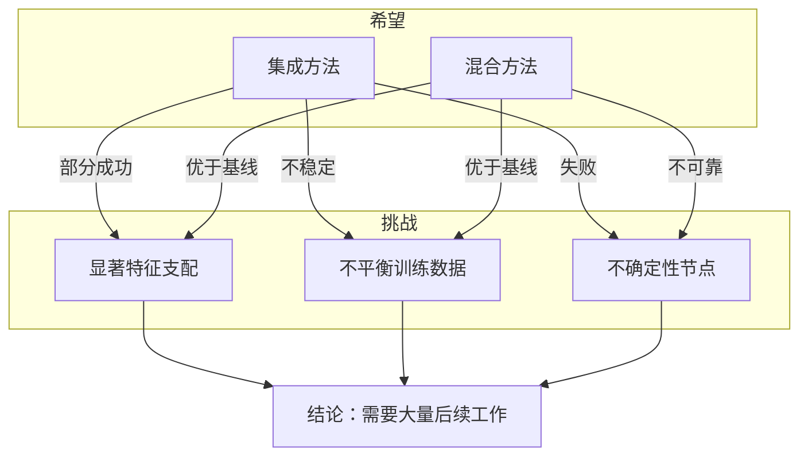

# 3 Challenges and 2 Hopes for Safety of Unsupervised Elicitation | 无监督引出安全性的三个挑战与两个希望

> **原标题：** 3 Challenges and 2 Hopes for Safety of Unsupervised Elicitation
> **作者：** Callum Canavan, Aditya Shrivastava, Allison Qi, Jonathan Michala, Fabien Roger（MATS, Anthropic Fellows, Anthropic）
> **发布日期：** 2026年3月5日
> **原文链接：** https://alignment.anthropic.com/2026/challenges-hopes/

---

## 一句话摘要

Anthropic 研究团队对无监督引出（unsupervised elicitation）和从易到难泛化（easy-to-hard generalization）技术进行系统性压力测试，识别出三个根本性挑战和两个潜在解决方向，发现目前没有任何技术能够可靠地应对所有三个挑战，对齐研究仍需大量工作。

---

## 完整核心内容翻译

### 一、研究背景

无监督引出是一种用于引导语言模型在超越人类监督能力的任务上表现正确的技术。其核心思路是：在不需要标注数据的情况下，从模型的行为中提取出"真实"的信号。从易到难泛化则是利用模型在简单任务上的已知正确行为，推断其在困难任务上的表现。

这两种技术对于 AI 安全至关重要——当模型能力超越人类评估能力时，我们需要无监督的方法来确保模型行为的可靠性。然而，这些方法是否真正可靠？本文在真实数据集上进行了系统性的压力测试。

### 二、三个挑战

#### 挑战一：显著特征支配（Salient Feature Dominance）

在真实数据集上训练的模型倾向于抓取**统计上显著但具有误导性的模式**，而非真正的事实。当非真实的特征在数据中更加突出时，模型会学习到虚假相关性。

研究者构建了数据集，其中事实上错误的答案与可观察特征之间存在强相关性，以测试各种方法能否区分信号与噪声。

**核心问题：** 模型可能学到"看起来正确"而非"实际正确"的模式。

#### 挑战二：不平衡训练数据（Imbalanced Training Data）

现实世界的数据集很少在各类别之间均匀分布。类别不平衡导致模型在无监督或半监督学习中偏向多数类。

本挑战测试了当"简单"示例不成比例地代表某些答案类别时，技术是否仍然鲁棒——潜在地扭曲了学习到的表示。

**核心问题：** 数据分布偏差会被方法放大而非纠正。

#### 挑战三：不确定性节点（Uncertainty Points）

并非所有问题在给定模型训练知识的条件下都有确定性答案。在某些情况下，适当的反应是**表达不确定性**而非强行给出单一答案。

研究包含了"承认不确定性"代表正确行为的评估节点，挑战那些假设二元正确/错误分类的方法。

**核心问题：** 好的对齐不仅要求回答正确，还要求在不确定时诚实表达。

### 三、两个希望

#### 希望一：集成方法（Ensemble Methods）

组合多个预测器增加了至少有一个捕获到真实模式的概率。"对不同预测器进行集成（因为其中一个可能对应真实情况）"是核心假设——模型间的多样性能够实现真实性检测。

该方法测试了聚合弱学习器是否能产生单个模型中不存在的可靠信号。

#### 希望二：混合方法（Hybrid Approaches）

两种组合策略浮现：

1. **无监督选择 + 有监督验证：** 在困难数据上使用无监督方法识别候选预测器，然后使用简单标签选择真实选项
2. **混合目标函数：** 在困难示例上应用无监督损失，同时在可处理的简单案例上维持有监督损失，平衡不同难度级别的信号提取

### 四、实验结果

**核心发现：没有任何一种技术能够可靠地在所有三个挑战上表现良好。**

- 集成方法在某些场景中展示了部分成功，但无法在所有三个挑战中始终一致地工作
- 混合方法优于基线，但仍不可靠
- 尽管有希望的理论动机，这些方法在实践中的鲁棒性不足

---

## 技术要点

1. **显著特征支配问题：** 无监督方法容易被数据中统计显著但与真实性无关的特征所误导，这是对"探针（probe）"和"对比学习"等流行技术的根本性质疑。
2. **不平衡数据的放大效应：** 类别不平衡不仅影响分类准确率，还会系统性地扭曲无监督方法学到的表示空间，使得少数类信号被完全淹没。
3. **不确定性的正确处理：** 传统的二元分类框架（正确/错误）无法捕获"适当表达不确定性"这一关键的对齐属性，需要新的评估范式。
4. **集成的有限价值：** 虽然集成多个预测器理论上增加了捕获真实信号的概率，但实验表明这种收益在面对系统性偏差时会消失。
5. **从易到难泛化的边界：** 简单任务上的正确行为不一定能推广到困难任务，特别是当困难任务的错误模式与简单任务本质不同时。

---

## 深度解读

这篇论文触及了 AI 对齐研究中最核心的技术难题之一：**当我们无法直接验证 AI 的输出时，如何确保它在做正确的事情？**

**无监督引出为什么重要？** 随着 AI 模型能力的增长，越来越多的任务将超越人类的直接评估能力。在这些领域中，我们不能依赖人类标注来训练和验证模型行为——我们需要"无监督"的方法来检测模型是否在做正确的事。这本质上是超级对齐（superalignment）问题的一个具体技术方向。

**三个挑战揭示了更深层的问题。** 显著特征支配说明"统计正确性"不等于"事实正确性"；不平衡数据说明现实世界的复杂性会放大方法的脆弱性；不确定性节点则指出对齐不仅是"回答正确"的问题，还涉及认识论层面的诚实。这三个挑战共同指向一个结论：**无监督引出不是一个纯技术问题，而是一个需要深度理解"真实"、"正确"和"诚实"语义的哲学-技术混合问题。**

**论文的诚实态度值得赞赏。** 在对齐研究中，承认"目前没有可靠的解决方案"比声称取得突破更有价值。这种透明度帮助社区准确评估当前的安全状态，避免对现有技术产生过度信心。

**对 scalable oversight 的影响。** 本文的发现对 Anthropic 和整个行业的"可扩展监督"议程提出了警示：如果我们不能可靠地在无监督设置下引出正确行为，那么在模型能力超越人类后的安全保障将面临根本性挑战。这加强了"在模型能力较低时就解决对齐问题"的紧迫性论证。

---

## 延伸思考

1. 显著特征支配是否意味着所有基于探针的可解释性方法都存在系统性偏差？我们如何区分"模型真正知道的"和"统计上显著的"？
2. 如果无监督引出在当前技术水平下不可靠，AI 实验室是否应该暂停部署能力超越人类评估的模型，直到这些技术成熟？
3. "适当表达不确定性"作为对齐目标，是否需要新的训练范式？现有的 RLHF/RLAIF 框架能否自然支持这一目标？
4. 混合方法的"优于基线但不可靠"是否提示了一个可能的研究路径——通过组合多种不完美的方法来逼近可靠性？

---

*本文为 Anthropic 对齐研究团队论文的深度中文解读。*
