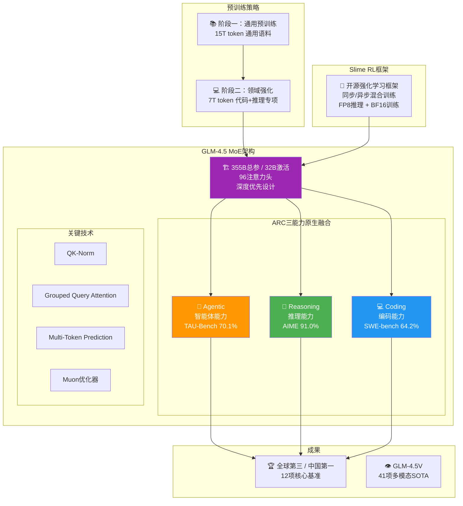

# 🤖 GLM-4.5: Agentic, Reasoning, and Coding (ARC) Foundation Models

> 📊 难度：⭐⭐⭐ | ⏱️ 阅读：14分钟 | 📅 2025年7月 | 🏷️ Agent基座, ARC三能力, MoE, 智谱AI

## 📋 原标题 + 中文标题
**GLM-4.5: Agentic, Reasoning, and Coding (ARC) Foundation Models**
**GLM-4.5：智能体、推理与编码（ARC）基座模型**

## 📝 一句话摘要
智谱 AI 发布 GLM-4.5——首个在单一模型中实现推理、编码和智能体能力原生融合的开源 MoE 基座模型，总参数 355B / 激活参数 32B，在 23T token 上进行多阶段训练，12 项全球核心基准中综合排名全球第三、中国第一。

---

## 🏗️ ARC 三能力融合架构

---

## 📖 完整核心内容翻译

### 🚀 发布背景

2025 年 7 月 28 日，智谱 AI 发布 GLM-4.5，首次在单一模型中实现推理、编码和智能体三大能力的原生融合——命名为 **ARC**。以 MIT 许可证开源。

### 📐 架构设计

| 版本 | 总参数量 | 激活参数量 |
|------|---------|-----------|
| GLM-4.5 | **355B** | **32B** |
| GLM-4.5-Air | 106B | 12B |

关键设计决策：**优先加深而非加宽**——更深的模型具有更好的推理能力。采用 QK-Norm、GQA、Multi-Token Prediction 和 Muon 优化器。

### 🎓 训练策略

**两阶段预训练**，总计 **23 万亿 token**：
1. **通用预训练**：15T token 通用语料
2. **领域强化预训练**：7T token 代码与推理专项

### 🔧 Slime 强化学习框架

开源的 RL 框架，支持同步/异步混合训练模式、FP8 推理 + BF16 训练。

### 📊 基准测试表现

| 基准测试 | GLM-4.5 成绩 |
|---------|-------------|
| AIME 2024 | **91.0%** |
| SWE-bench Verified | **64.2%** |
| TAU-Bench | **70.1%**（全球第二） |

**GLM-4.5V** 刷新了 **41 项多模态推理 SOTA**。

### 💰 定价

输入 0.8 元/百万 token，输出 2 元/百万 token，最高 100 tokens/秒。

### 🔮 后续发展

GLM-5 已于 2026 年初发布，专为复杂系统工程与长程 Agent 任务设计。

---

## 🔑 技术要点

1. **ARC 三能力原生融合**：从预训练阶段就将智能体、推理和编码作为共同优化目标
2. **"深而非宽"的 MoE 设计哲学**：增加模型深度比宽度对推理能力提升更显著
3. **23T token 两阶段训练**：15T 通用 + 7T 代码/推理，精确控制能力比例
4. **Slime 框架开源**：中国 AI 公司中少数开源 RL 训练框架的举措
5. **355B/32B 的参数效率比**：约 9:1，兼顾知识储备和推理效率

---

## 🧠 深度解读

### 🟢 通俗版

GLM-4.5 的核心理念用三个字母概括：**ARC**——Agent（智能体）、Reasoning（推理）、Coding（编程）。

传统做法是先训练一个聪明的模型，再教它用工具。智谱的做法不同：从一开始就让模型同时学习"思考"、"写代码"和"使用工具"这三件事，就像一个人从小同时学数学、编程和项目管理，而不是先学数学再临时学其他的。

成绩单：12项全球核心考试中，综合排名全球第三、中国第一。

### 🔴 深入版

GLM-4.5 代表了智谱 AI 的重要技术路线转向：从"追赶通用 AGI"到"深耕智能体基座"。

**"ARC"概念的前瞻性。** 在 2025-2026 年 AI 行业集体转向 Agent 应用的大背景下，智谱率先将"智能体能力"与"推理"和"编码"并列为基座模型的核心能力维度。GLM-4.5 不是要做"最聪明的模型"，而是要做"最好用的 Agent 底座"。

**TAU-Bench 70.1% 值得特别关注。** TAU-Bench 测试的是模型在真实智能体场景中的表现——包括工具使用、多步规划、错误恢复。全球第二的排名表明，GLM-4.5 在智能体应用中的实际表现可能优于传统基准排名。

**开源 Slime 框架的战略意义。** 在 RL 训练框架成为核心竞争力的当下，智谱选择开源 Slime，既是技术自信的体现，也是"以框架建生态"的战略选择。

**从 GLM-4.5 到 GLM-5 的快速迭代** 显示智谱已建立高效的"预训练-后训练-产品化"流水线。

---

## 💡 延伸思考

1. **Agent-native vs. Agent-augmented**：GLM-4.5 的"原生融合"路线与"通用模型 + Agent 工具链"路线，哪种最终会胜出？

2. **中国 AI 的"差异化竞争"**：智谱选择"Agent 基座"、DeepSeek 选择"推理效率"、MiniMax 选择"成本革命"——正在形成互补性的技术生态？

3. **41 项多模态 SOTA 的含义**：GLM-4.5V 的全面突破是否预示着下一代 Agent 将是"看得见世界的 Agent"？

---

## 🔗 原文链接
- arXiv 论文：https://arxiv.org/abs/2508.06471
- 技术报告解读：https://stable-learn.com/en/glm-45-usage-tech-reports/
- InfoQ 报道：https://www.infoq.com/news/2025/08/glm-4-5/
