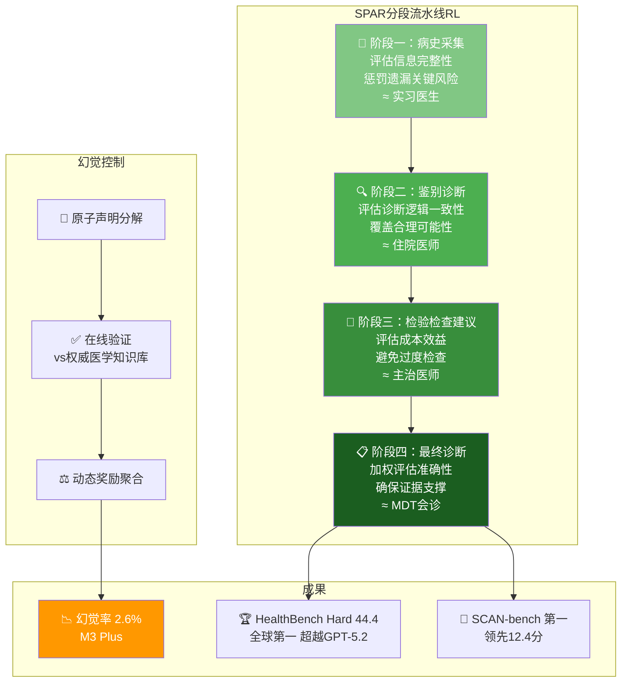

# 🏥 Baichuan-M3: Modeling Clinical Inquiry for Reliable Medical Decision-Making

> 📊 难度：⭐⭐⭐ | ⏱️ 阅读：14分钟 | 📅 2026年初 | 🏷️ 医疗AI, SPAR算法, 幻觉控制, 百川智能

## 📋 原标题 + 中文标题
**Baichuan-M3: Modeling Clinical Inquiry for Reliable Medical Decision-Making**
**百川 M3：为可靠医疗决策建模临床问诊过程**

## 📝 一句话摘要
百川智能发布 235B 参数的开源医疗大模型 Baichuan-M3，基于 Qwen3 架构并采用独创的 SPAR 分段流水线强化学习算法，将临床问诊分解为四个认知阶段分别训练，在 HealthBench Hard 上以 44.4 分排名全球第一，超越 GPT-5.2-High，幻觉率低至 3.5%（M3 Plus 进一步降至 2.6%）。

---

## 🏗️ SPAR 四阶段训练架构

---

## 📖 完整核心内容翻译

### 🔍 项目背景

2026 年初，百川智能发布 Baichuan-M3——全球首个在核心医疗基准上超越 GPT-5.2 的开源大模型。仅 9 天后，M3 Plus 版本将幻觉率从 3.5% 降至 **2.6%**，API 成本降低 **70%**。

### 📐 模型架构

- **总参数量**：235B
- **基础架构**：基于 Qwen3
- **开源许可**：Apache 2.0
- 支持从完整 FP16（>400GB）到边缘优化版（~48GB，2x RTX 4090）的多种部署配置

### 🧩 核心创新：SPAR 算法

SPAR（**Segmented Pipeline Reinforcement Learning**）将临床问诊分解为四个认知阶段，每个阶段配备专门的奖励模型——直接模仿人类医学教育的分阶段训练：

1. **病史采集**：模拟住院医师学习"全面问诊"
2. **鉴别诊断**：模拟主治医师的临床推理
3. **检验检查建议**：模拟上级医师审核检查方案
4. **最终诊断**：模拟多学科会诊（MDT）决策

### 🛡️ 幻觉控制：事实感知强化学习

1. **原子声明分解**：将回复分解为单独可验证的事实声明
2. **在线验证**：与权威医学知识库实时比对
3. **动态奖励聚合**：在流畅性和事实准确性之间动态平衡

### 📊 基准测试表现

| 测试指标 | Baichuan-M3 成绩 | 排名 |
|---------|-----------------|------|
| HealthBench Hard | **44.4** | 全球第一 |
| SCAN-bench | 第一名（领先12.4分） | 绝对领先 |
| 幻觉率 | **2.6%**（M3 Plus） | 业界最低 |

---

## 🔑 技术要点

1. **SPAR 算法的医学教育启发**：将 AI 训练过程类比人类医生的分阶段培养，是"领域知识驱动 RL 设计"的典范
2. **原子声明分解的幻觉控制**：将"事后检查幻觉"变为"过程中预防幻觉"
3. **235B 参数与消费级部署的兼顾**：通过 W4 量化可在 2x RTX 4090 上运行
4. **HealthBench Hard 超越 GPT-5.2**：垂直领域深度优化可以在特定任务上超越通用旗舰模型
5. **9 天内发布 Plus 版本**：展示极快的迭代速度

---

## 🧠 深度解读

### 🟢 通俗版

百川 M3 的训练方式很有趣——它像培养一个真正的医生一样训练AI：
1. 先学会怎么问病人问题（病史采集）
2. 再学会分析可能是什么病（鉴别诊断）
3. 然后学会开什么检查单（检验建议）
4. 最后学会下诊断（最终诊断）

每个阶段都有专门的"考官"打分。而且它还有一个特别的"防胡说"机制——把每句话拆成最小的事实单元，逐一和医学数据库核对，确保不乱说。

### 🔴 深入版

Baichuan-M3 代表了 AI 行业一个重要趋势的成熟：**垂直领域专用模型在其擅长的领域超越通用旗舰模型**。

**SPAR 算法的设计哲学值得深思。** 大多数 RL 训练采用统一的奖励函数，但临床问诊本质上是多阶段决策过程。SPAR 通过为每个阶段设计独立的奖励模型，让 AI 学会了"像医生一样分步思考"。这种"认知过程建模"的方法论，可能对法律分析、工程设计等领域具有重要借鉴意义。

**幻觉控制是医疗 AI 的生死线。** 2.6% 的幻觉率虽然仍未达到零幻觉，但已将"AI 辅助诊断"从"概念验证"推进到了"临床可用"的边界。

**百川的商业策略颇具启示。** 在其他中国 AI 公司争相追逐通用 AGI 的赛道上，百川选择深耕医疗垂直领域，2024 年 To B 业务贡献近 1 亿元收入——证明"小而深"的垂直策略同样可以建立可持续的商业模式。

---

## 💡 延伸思考

1. **2.6% 的幻觉率够用吗？** 在高风险医疗决策中，是否需要"AI + 人类医生复核"的双重保障？
2. **SPAR 的跨领域迁移**：是否可应用于法律（案件分析→法条检索→论证构建→判决建议）或金融领域？
3. **医疗 AI 的监管挑战**：当开源医疗模型可以在两张消费级显卡上运行时，如何确保质量控制？

---

## 🔗 原文链接
- arXiv 论文：https://arxiv.org/abs/2602.06570
- Dr7.ai 详细解读：https://dr7.ai/baichuan-m3
- AIBase 报道（M3 Plus）：https://news.aibase.com/news/24844
