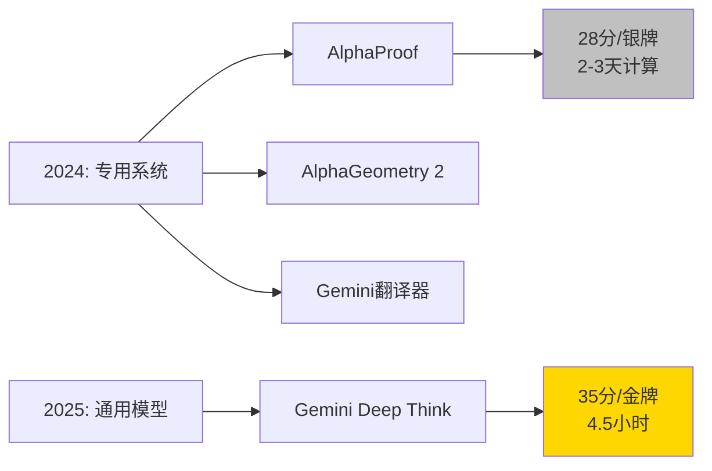

# 🏅 Gemini Deep Think 在国际数学奥林匹克竞赛中达到金牌水平

> 📊 难度：⭐⭐⭐ | ⏱️ 阅读：12分钟 | 📅 2025年7月21日 | 🏷️ 数学推理, Deep Think, IMO, 强化学习

**原标题：** Advanced version of Gemini with Deep Think officially achieves gold-medal standard at the International Mathematical Olympiad

**中文标题：** Gemini Deep Think 进阶版正式在国际数学奥林匹克竞赛中达到金牌水平

**发布日期：** 2025年7月21日

**原文链接：** https://deepmind.google/blog/advanced-version-of-gemini-with-deep-think-officially-achieves-gold-medal-standard-at-the-international-mathematical-olympiad/

---

## 📝 一句话摘要

Gemini Deep Think 进阶版在2025年国际数学奥林匹克竞赛（IMO）中解出六道题目中的五道，获得35分（满分42分），以端到端自然语言推理方式正式达到金牌水平，标志着AI数学推理能力的里程碑式突破。

---

## 🔍 核心内容

### 🏆 历史性成就

2025年夏季，Google DeepMind 的 Gemini Deep Think 进阶版在国际数学奥林匹克竞赛中取得了金牌水平的成绩。该系统成功解出六道竞赛题目中的五道，总计获得35分（满分42分）。IMO 主席 Gregor Dolinar 教授评价道："他们的解答在许多方面都令人惊叹。IMO 评审员发现这些解答清晰、精确……"

### 📈 相较2024年的重大飞跃

这一成就代表了相比2024年成绩的巨大进步——2024年 AlphaProof 和 AlphaGeometry 2 的组合系统仅获得28分，解出4道题目，达到银牌水平。关键进步体现在三个维度：

**自然语言端到端处理：** 2025年的系统完全以自然语言运作，直接从官方题目描述生成严格的数学证明，不再需要将题目翻译为 Lean 等领域专用语言。这是从"形式数学"到"非形式数学推理"的重大方法论转变。

**计算时间大幅缩短：** 所有解答均在4.5小时的竞赛时间限制内完成，而2024年的系统需要2-3天的计算时间。

**方法论革新：** 从依赖 AlphaProof/AlphaGeometry 等专用系统转向通用语言模型的深度思考能力。

### ⚙️ 技术方法论

Deep Think 的核心增强特性包括：

- **并行思维能力：** 允许模型同时探索多条解题路径，而非串行尝试
- **强化学习新技术：** 利用多步推理和定理证明数据进行训练
- **高质量数学语料：** 精心策划的高质量数学解答语料库被整合到训练过程中
- **解题策略指导：** 在模型指令中包含了关于 IMO 问题解决方法的通用指导

### ✅ 官方验证

所有结果均由 IMO 协调员按照与学生解答完全相同的标准进行官方评分和认证。IMO 确认了解答的完整性和正确性，但指出他们的审查不涉及对底层系统或模型本身的验证。

---

## 🔬 技术要点

1. **端到端自然语言推理：** 不再需要形式化语言转换，直接以自然语言输入输出，这是通用人工智能方向的重要信号
2. **推理时间计算扩展（Inference-time Compute Scaling）：** 通过在推理阶段投入更多计算资源来提升性能，是当前AI领域最重要的研究方向之一
3. **并行假设探索：** Deep Think 能同时考虑多个假设和解题路径，模拟人类数学家的思维方式
4. **从专用系统到通用模型的范式转移：** 标志着AI数学推理从需要专门构建的系统（如AlphaProof）转向通用基础模型
5. **强化学习与定理证明数据的结合：** 将形式数学的严谨性注入到自然语言推理中

---

## 🧠 深度解读

### 🟢 通俗版

想象一下：2024年，要让AI解数学奥赛题，需要一支"翻译团队"先把题目翻译成机器语言，然后三个不同的AI专家系统分工合作，花2-3天才能给出答案。到了2025年，一个通用AI直接看懂题目，像人类选手一样在4.5小时内写出清晰的证明——而且拿了金牌。这就像从需要三个专业翻译加上专业顾问团队，变成一个全能天才直接搞定一切。

### 🔴 深入版

这一成果的意义远超竞赛成绩本身。2024年的 AlphaProof 虽然取得了银牌，但它本质上是一个专用系统——需要人类专家将自然语言题目翻译为形式语言，且计算耗时以天计。而2025年的 Gemini Deep Think 是一个通用语言模型，它直接理解自然语言题目并生成自然语言证明，且在竞赛规定时间内完成。

这种"从专用到通用"的跨越，暗示着一个深刻的技术趋势：**通用基础模型正在系统性地取代特定领域的专用AI系统。** 当一个模型既能写代码、又能进行日常对话、还能解决奥赛级别的数学难题时，我们离通用人工智能（AGI）的距离比许多人预想的更近。

同时值得注意的是，"推理时间计算扩展"（Inference-time Compute Scaling）已经成为2025年AI领域最重要的范式之一。与传统的"训练更大模型"不同，这种方法在推理阶段动态分配更多计算资源来"思考"，本质上是让AI学会了"慢思考"——与 Daniel Kahneman 的系统2思维异曲同工。

---

## 💡 延伸思考

1. **数学研究的未来形态：** 如果AI已能解决奥赛级别的数学问题，那么专业数学研究会发生怎样的变化？人类数学家的核心价值将从"解题"转向"提出正确的问题"。

2. **教育影响：** 当AI在数学竞赛中超越绝大多数人类选手，数学教育的目标和方法是否需要根本性调整？

3. **验证与信任：** IMO 评委能验证AI的解答是否正确，但无法验证底层系统本身——这个"验证鸿沟"在AI能力越来越强的未来将成为核心挑战。

4. **从数学到科学：** 数学推理能力的突破是否预示着AI在物理学、生物学等实验科学领域的类似突破即将到来？

5. **通用 vs 专用系统的经济学：** 通用基础模型取代专用系统意味着AI开发的经济规模效应将越来越显著，少数几家拥有最强基础模型的公司可能主导整个AI应用生态。
