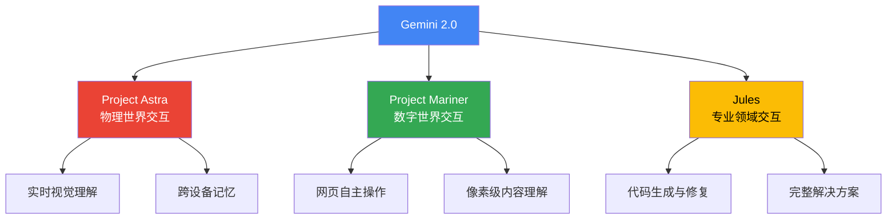

# 🤖 Gemini 2.0: 智能体时代的全新AI模型

> 📊 难度：⭐⭐⭐ | ⏱️ 阅读：12分钟 | 📅 2024年12月11日 | 🏷️ Gemini, 智能体, 多模态, Project Astra

**原标题:** Google introduces Gemini 2.0: A new AI model for the agentic era

**中文标题:** 谷歌发布 Gemini 2.0：面向智能体时代的全新AI模型

**发布日期:** 2024年12月11日

**作者:** Sundar Pichai

---

## 📝 一句话摘要

谷歌发布迄今最强大的AI模型Gemini 2.0，具备原生多模态输出和智能体能力，标志着AI从被动工具向主动智能体的范式转变。

---

## 🔍 核心内容

### 🌐 背景与愿景

2024年12月11日，谷歌CEO Sundar Pichai正式宣布Gemini 2.0的发布。这不仅是一次模型迭代升级，更是谷歌对AI发展方向的战略宣言——我们正在从"信息时代"迈入"智能体时代"（Agentic Era）。在这个新时代，AI系统不再只是回答问题的工具，而是能够理解世界、自主规划和执行复杂任务的智能代理。

### 🚀 核心能力突破

**原生多模态架构**

Gemini 2.0在架构层面实现了真正的多模态融合。模型能够无缝处理文本、图像、音频和视频等多种数据类型，实现跨模态的深度理解。与前代模型不同，Gemini 2.0不仅能"理解"多模态输入，还能"生成"多模态输出——包括原生的图像生成和多语言音频输出。

**智能体能力**

这是Gemini 2.0最具革命性的特征。模型引入了自主能力框架，使其能够：
- 独立规划和执行多步骤复杂任务
- 与数字系统和各类工具进行交互操作
- 在长时间交互中保持上下文连贯性
- 自主调用搜索、代码执行等外部工具

### 🌟 三大旗舰项目

**Project Astra（星辰计划）**

Project Astra展示了Gemini 2.0理解和响应真实世界视觉信息的能力。通过手机摄像头或智能眼镜，Astra可以实时理解用户所看到的世界，并提供自然、连贯的对话式帮助。它能够记住交互中的关键细节，实现跨对话的上下文记忆。

**Project Mariner（航海者计划）**

Project Mariner是一个网页浏览智能体原型。它能够理解浏览器屏幕上的所有信息——包括像素级内容、网页元素（文本、代码、图像、表单等），并据此自主完成网页操作任务。这标志着AI从"对话式助手"向"行动式代理"的重要跨越。

**Jules（编程助手）**

Jules是面向开发者的高级编码智能体。它不仅能理解开发需求，还能生成功能完整的代码解决方案，代表了AI辅助软件开发的新范式。

### ⚡ Gemini 2.0 Flash

首先发布的模型是Gemini 2.0 Flash——一个在保持极低延迟的同时大幅提升性能的工作型模型。它在关键基准测试中超越了上一代旗舰模型Gemini 1.5 Pro，同时速度快了一倍。

---

## 🔬 技术要点

1. **原生多模态输出：** Gemini 2.0首次实现了文本、图像和音频的原生混合生成能力，突破了传统大模型只能输出文本的限制
2. **智能体架构：** 模型内置了工具调用、多步规划和自主执行的能力框架，使AI能够作为独立代理完成复杂任务
3. **实时视觉理解：** 通过Project Astra展示的能力表明，Gemini 2.0可以实时处理视频流并理解物理世界场景
4. **网页交互代理：** Project Mariner证明了AI可以像人类一样理解和操作网页界面，开启了通用数字代理的可能性
5. **性能与效率平衡：** Gemini 2.0 Flash以1.5 Pro两倍的速度实现了更高的性能，展示了规模效率的持续提升

---

## 🧠 深度解读

### 🟢 通俗版

以前的AI就像一个只会聊天的朋友——你问它问题，它给你答案，仅此而已。Gemini 2.0更像一个能干的助理：它不仅能听懂你说的话，还能看懂你看到的东西（通过摄像头），能帮你操作电脑浏览网页，甚至能直接帮你写代码。三个旗舰项目分别对应了三种"助理模式"：Astra帮你理解现实世界，Mariner帮你操作数字世界，Jules帮你搞定编程工作。

### 🔴 深入版

Gemini 2.0的发布标志着谷歌在AI竞赛中的战略转向。如果说之前的AI竞争焦点是"谁的模型更聪明"，那么Gemini 2.0将战场转移到了"谁的AI更能做事"。

"智能体时代"这个提法并非噱头。从技术实现角度看，Gemini 2.0将工具使用（tool use）、多步推理（multi-step reasoning）和执行反馈（execution feedback）深度集成到了模型的核心架构中，而不是像之前那样通过外部编排框架来实现。这意味着AI的"行动能力"不再是锦上添花的插件，而是与"思考能力"同等重要的内置能力。

三个旗舰项目的选择也颇具深意：Astra代表物理世界交互、Mariner代表数字世界交互、Jules代表专业领域交互。它们共同勾勒出一个完整的"AI代理"生态蓝图——无论你在什么场景、做什么任务，都有一个智能体在旁边帮你完成。

从产业影响看，这对所有基于"人机对话"范式的AI产品都是一次范式冲击。当AI可以直接操作你的浏览器、直接写代码、直接帮你完成任务时，传统的聊天式交互将不再是唯一的人机协作模式。

---

## 💡 延伸思考

1. **智能体安全问题：** 当AI可以自主操作浏览器和执行代码时，如何确保它不会执行有害操作？谷歌在智能体安全方面的框架是否足够健全？
2. **隐私边界：** Project Astra需要通过摄像头实时理解用户的物理环境，这在便利性和隐私保护之间如何取得平衡？
3. **产业重构：** 如果AI智能体可以自主完成网页操作，这对RPA（机器人流程自动化）行业意味着什么？传统SaaS产品的交互逻辑是否需要重新设计？
4. **开发者生态：** Jules这样的编码助手如果足够成熟，软件开发的工作流程和开发者的角色将如何演变？

---

**原文链接:** [https://blog.google/technology/google-deepmind/google-gemini-ai-update-december-2024/](https://blog.google/technology/google-deepmind/google-gemini-ai-update-december-2024/)
