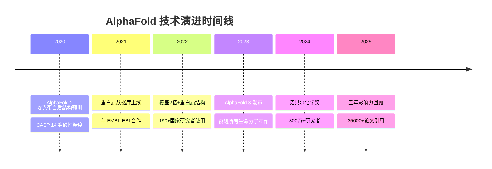

# AlphaFold：改变世界的五年

> 📊 难度：⭐⭐⭐ | ⏱️ 阅读：15分钟 | 📅 2025年11月25日 | 🏷️ AlphaFold, 蛋白质结构, 诺贝尔奖, 生物学

**原标题：** AlphaFold: Five Years of Impact

**中文标题：** AlphaFold：五年深远影响回顾

**发布日期：** 2025年11月25日

**原文链接：** https://deepmind.google/blog/alphafold-five-years-of-impact/

---

## 📝 一句话摘要

AlphaFold 自2020年攻克蛋白质结构预测这一困扰科学界50年的难题以来，已被全球190多个国家超过300万研究者使用，被引用超过35,000次，推动了从心脏病治疗到作物改良的广泛科学突破，并于2024年荣获诺贝尔化学奖。

---

## 🔍 核心内容

### 里程碑式的科学成就

2020年，Google DeepMind 的 AlphaFold 2 在第14届蛋白质结构预测关键评估实验（CASP 14）中，以前所未有的精度从氨基酸序列预测蛋白质结构，解决了困扰生物学界半个世纪的重大科学挑战。这一成就在2024年被授予诺贝尔化学奖。

### 全球影响力数据

- **全球覆盖：** 超过300万研究者在190多个国家使用 AlphaFold 蛋白质数据库
- **公平获取：** 超过100万用户来自中低收入国家
- **疾病研究：** 超过30%的 AlphaFold 相关研究聚焦疾病理解
- **学术影响：** 被超过35,000篇论文直接引用，超过200,000篇论文整合了 AlphaFold 2 的元素
- **研究质量提升：** 独立分析显示，使用 AlphaFold 2 的研究者提交的新颖蛋白质结构数量增加40%，此类研究被临床文章引用的可能性提高一倍

### 技术演进路线

**AlphaFold 2（2020年）：** 以突破性精度从氨基酸序列预测蛋白质三维结构。

**AlphaFold 蛋白质数据库（2021年）：** 与欧洲分子生物学实验室-欧洲生物信息学研究所（EMBL-EBI）合作建设，预测了超过2亿个蛋白质结构，覆盖几乎所有已知蛋白质。

**AlphaFold 3：** 将预测范围扩展到所有生命分子——蛋白质、DNA、RNA和配体，开启"数字生物学"在药物发现领域的应用。

**AlphaFold 服务器：** 已为数千名研究者生成800万个结构预测。

### 真实世界应用案例

**蜜蜂保护：** 欧洲科学家利用 AlphaFold 理解卵黄蛋白原（Vitellogenin）免疫蛋白的结构，指导濒危传粉昆虫种群的育种计划，直接服务于全球粮食安全。

**心脏病研究：** 揭示了载脂蛋白 B100——"LDL（低密度脂蛋白）中的核心蛋白"——的结构，为制药研究者提供了动脉粥样硬化治疗的原子级细节。这项发现可能改变心血管疾病（全球第一死因）的研究和治疗方式。

**作物抗逆性：** 苏黎世大学的研究表明，将 AlphaFold 与基因组学结合，"研究时间线大幅缩短"，加速了植物环境感知研究。

**教育民主化：** 土耳其本科生"在疫情期间利用在线 AlphaFold 教程自学结构生物学"，并发表了15篇研究论文——展示了AI如何降低顶尖科研的门槛。

### 衍生技术生态

- **AlphaMissense：** 评估导致疾病的基因突变
- **AlphaGenome：** 评估基因突变对疾病的影响
- **AlphaProteo：** 设计新型蛋白质结合剂，靶向癌症和糖尿病相关分子

---

## 🔬 技术要点

1. **蛋白质结构预测的范式转变：** 从耗时数年的实验方法（X射线晶体学、冷冻电镜）转向秒级计算预测，研究效率提升数个数量级
2. **从单蛋白到分子系统：** AlphaFold 3 将预测范围从单一蛋白质扩展到蛋白质-DNA-RNA-配体的复合体系统，更贴近真实生物环境
3. **开放科学模式：** 2亿+蛋白质结构的免费数据库极大地降低了科研门槛，中低收入国家研究者的大规模参与证明了这一策略的成功
4. **AI驱动的药物发现加速：** AlphaFold 3 结合 AlphaProteo 构建了从靶点发现到分子设计的完整AI管线
5. **跨领域溢出效应：** 从生物医学扩展到农业（作物改良）、生态（传粉昆虫保护）和材料科学，展示了基础科学突破的广泛应用价值

---

## 🧠 深度解读

### 🟢 通俗版

AlphaFold 的故事是AI"科学加速器"角色的最佳范例。在传统科研范式中，确定一个蛋白质的三维结构可能需要一位博士生数年时间。AlphaFold 将这一过程压缩到秒级，而其影响绝非仅仅是"提速"——它从根本上改变了科学家提问和探索的方式。

### 🔴 深入版

**从工具到基础设施的升级：** AlphaFold 蛋白质数据库已从一个研究工具演变为生命科学的基础设施。300万研究者、190多个国家——这已不是一个单纯的AI模型，而是一个全球科研生态系统。

**诺贝尔奖的信号意义：** 2024年诺贝尔化学奖授予 AlphaFold，这是AI方法首次在自然科学领域获得诺贝尔级别的认可。这发出了一个明确信号：AI不再是科学研究的辅助工具，而是可以产生诺贝尔级发现的核心研究方法。

**"数字生物学"的雏形：** AlphaFold 3 预测所有生命分子的互作，AlphaMissense 评估基因突变，AlphaProteo 设计蛋白质结合剂——这些技术的组合正在构建一个"数字生物学"平台，科学家可以在计算机中模拟、测试和设计生物分子，然后再进入实验室验证。

**100万中低收入国家用户的深远意义：** 这个数字可能是整篇文章中最重要的。科学研究长期以来是富裕国家的特权，AlphaFold 的免费开放正在打破这一壁垒，使全球南方的研究者能够参与前沿科学，这对全球科研公平具有深远意义。

---

## 💡 延伸思考

1. **AI诺贝尔奖常态化？** AlphaFold 获诺贝尔奖后，AI驱动的科学发现是否会在未来十年内频繁获得最高科学荣誉？这将如何改变科学界的评价体系？

2. **实验验证瓶颈：** AI可以快速预测蛋白质结构，但实验验证仍然缓慢且昂贵。"计算速度"与"实验速度"之间的鸿沟如何弥合？自动化实验室和机器人科学家是否是答案？

3. **药物开发的时间和成本变革：** 传统药物开发需要10-15年和数十亿美元。AlphaFold + AlphaProteo 组合能将这一时间线缩短多少？这对全球医药产业格局意味着什么？

4. **生物安全考量：** 能精确预测和设计蛋白质结构的技术是双刃剑。如何确保这些工具不被用于设计有害的生物分子？

5. **从蛋白质到材料到化学：** AlphaFold 方法论是否可以迁移到无机材料结构预测、催化剂设计等领域？DeepMind 的 GNoME 项目已在探索这一方向。
