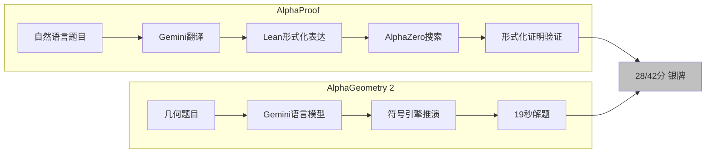

# AlphaProof 与 AlphaGeometry 2：AI首次达到国际数学奥赛银牌水平

> 📊 难度：⭐⭐⭐⭐ | ⏱️ 阅读：14分钟 | 📅 2024年7月25日 | 🏷️ AlphaProof, AlphaGeometry, 数学推理, 形式化验证

**原标题:** AI achieves silver-medal standard solving International Mathematical Olympiad problems

**中文标题:** AI达到国际数学奥林匹克竞赛银牌水平解题标准

**发布日期:** 2024年7月25日

---

## 📝 一句话摘要

Google DeepMind的AlphaProof和AlphaGeometry 2联手解决了2024年国际数学奥赛（IMO）6道题中的4道，以28/42分达到银牌水平，标志着AI在高级数学推理领域的里程碑突破。

---

## 🔍 核心内容

### 背景

国际数学奥林匹克竞赛（IMO）是全球最顶级的中学生数学竞赛，被公认为数学推理能力的最高试金石。2024年，Google DeepMind部署了两个互补的AI系统来挑战这一标杆——这是AI首次在IMO级别的数学竞赛中达到奖牌水平。

### AlphaProof：基于强化学习的形式化数学推理系统

AlphaProof是一个全新的系统，将强化学习与形式化数学语言相结合。其核心设计理念源于一个关键洞察：自然语言方法可能会"幻觉"出看似合理但实际错误的中间推理步骤和解答，而形式化语言（如Lean）则能提供可验证的正确性保证。

**技术架构：**
- 使用经过微调的Gemini语言模型将自然语言问题陈述自动翻译为形式化数学表达
- 将AlphaZero算法（此前用于围棋和国际象棋的强化学习算法）与Lean形式化验证语言相结合
- 系统生成候选解答，然后通过系统性搜索进行证明或反驳
- 每一步推理都由形式化验证器严格检查，确保逻辑链条无懈可击

**训练方法：**
- 在约100万道不同难度的数学题上进行了数周训练，覆盖多个数学领域
- 强化学习循环通过已验证的证明持续强化系统能力
- 竞赛期间，系统在自动生成的问题变体上继续训练，实现动态适应

### AlphaGeometry 2：进化的神经符号混合系统

AlphaGeometry 2是其前身的重大升级：
- 基于Gemini训练的语言模型，使用了远超前代的海量合成数据
- 符号引擎速度提升两个数量级（100倍）
- 引入了先进的知识共享机制，用于求解复杂问题
- 在历史IMO几何题上的求解率从53%跃升至83%

### 竞赛结果

| 题目类型 | 结果 | 求解者 |
|---------|------|--------|
| 代数 第1题 | 已解决 | AlphaProof |
| 代数 第2题 | 已解决 | AlphaProof |
| 数论 第1题 | 已解决（本届最难题目之一） | AlphaProof |
| 几何 第1题 | 已解决（仅用19秒） | AlphaGeometry 2 |
| 组合 第1题 | 未解决 | — |
| 组合 第2题 | 未解决 | — |

**最终得分：** 28/42分，达到银牌水平（金牌门槛为29分，仅差1分）

值得注意的是，在本届609名人类参赛者中，只有58人获得了金牌。AlphaProof解决的数论题是全场最难的题目之一，全球仅有5名选手解出。而AlphaGeometry 2仅用19秒就解决了几何题。

---

## 🔬 技术要点

1. **形式化验证保证正确性：** 不同于"黑箱"式的大模型推理，AlphaProof使用Lean形式化语言，每一步推理都有严格的数学证明支撑，从根本上避免了推理幻觉
2. **AlphaZero迁移应用：** 将原本用于博弈的AlphaZero强化学习算法成功迁移到数学证明搜索中，展示了强化学习在抽象推理领域的通用潜力
3. **神经符号混合架构：** AlphaGeometry 2结合了神经网络的直觉式推理和符号系统的严格推演，两者互补产生超越单一范式的效果
4. **自然语言-形式化语言桥梁：** Gemini模型充当翻译器，将人类可读的数学问题自动转化为机器可验证的形式化表达，解决了形式化数学的入门壁垒
5. **动态训练策略：** 竞赛期间在自生成变体上继续训练的策略，体现了一种"在线学习"的思路，使系统能够针对特定问题类型快速适应

---

## 🧠 深度解读

### 🟢 通俗版

这一成果的意义远超"AI又赢了一次竞赛"。它揭示了AI数学推理的两条互补路径，以及它们融合的巨大潜力。

### 🔴 深入版

AlphaProof代表了"严格派"路线——通过形式化验证确保每一步推理的正确性。这在数学领域至关重要，因为一个看似合理的推理链条可能因为某一步的微小错误而全盘崩塌。传统大语言模型在数学推理上的最大弱点正是"自信地犯错"，而形式化验证从根本上解决了这个问题。

AlphaGeometry 2则代表了"直觉派"路线——通过大量训练获得类似数学家"直觉"的能力，然后用符号系统验证和完善这些直觉。19秒解决IMO几何题这一事实令人惊叹，展示了当AI的"直觉"足够准确时，求解速度可以远超人类。

两个系统在组合数学上的共同失败也很有启示意义。组合问题通常需要高度创造性的构造和非标准化的论证方法，这恰恰是当前AI推理能力的短板——它们更擅长在已知模式空间中搜索，而非创造全新的论证范式。

从更宏观的视角看，这项工作验证了"AI辅助数学研究"的可行性路径：用AI的计算力量来增强人类数学家的直觉和验证能力，而非替代人类的创造性思维。

---

## 💡 延伸思考

1. **形式化数学的加速：** 如果AI能够高效地将自然语言数学翻译为形式化表达，这是否会推动整个数学界加速采用形式化证明？Lean/Coq等形式化工具的生态会如何演变？
2. **距离金牌的"最后一分"：** 28分与金牌线29分仅差1分。这"最后一分"代表的是量的差距还是质的鸿沟？组合数学的突破需要什么样的新方法？
3. **教育影响：** 当AI可以解决IMO级别的数学题时，数学竞赛训练和数学教育的价值定位是否需要重新思考？
4. **跨领域迁移：** AlphaProof的"强化学习+形式化验证"范式是否可以迁移到其他需要严格推理的领域，如法律推理、程序验证或科学假设检验？

---

**原文链接:** [https://deepmind.google/blog/ai-solves-imo-problems-at-silver-medal-level/](https://deepmind.google/blog/ai-solves-imo-problems-at-silver-medal-level/)
