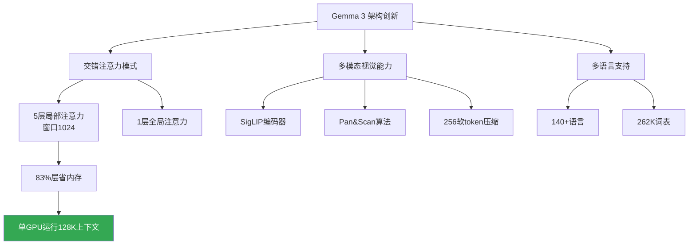

# Gemma 3：单GPU可运行的最强开源模型

> 📊 难度：⭐⭐⭐⭐ | ⏱️ 阅读：15分钟 | 📅 2025年3月12日 | 🏷️ Gemma 3, 开源模型, 多模态, 注意力机制

**原标题:** Gemma 3: Google's new open model based on Gemini 2.0 / Gemma explained: What's new in Gemma 3

**中文标题:** Gemma 3：基于Gemini 2.0技术的全新开源模型——单GPU可运行的最强模型

**发布日期:** 2025年3月12日

**作者:** Clement Farabet

---

## 📝 一句话摘要

谷歌发布Gemma 3开源模型系列，提供1B至27B四种规格，首次引入多模态视觉能力、128K上下文窗口和140+语言支持，27B版本在单GPU上即可运行并跻身LM Arena全球前十。

---

## 🔍 核心内容

### 模型概览

Gemma 3是谷歌迄今最强大、最便携、最负责任的开源模型。它基于与Gemini 2.0相同的研究和技术构建，提供四种参数规格：1B、4B、12B和27B，每种都包含预训练版和指令微调版。谷歌将其定位为"在单块GPU或TPU上就能运行的最强模型"。

### 架构创新

**交错注意力模式（Interleaved Attention）**

Gemma 3采用了全新的注意力层设计：每6层中，5层使用滑动窗口为1024的局部注意力，1层使用全局注意力。这与Gemma 2的1:1交替模式和Gemma 1的纯全局注意力截然不同。

这种设计的核心优势在于大幅降低了KV缓存的内存开销。在处理长上下文时，传统的纯全局注意力机制需要为每个token保存完整的键值缓存，而Gemma 3的5:1局部-全局比例意味着大约83%的注意力层只需要维护1024 token的窗口缓存，从而使128K上下文在消费级GPU上成为可能。

**QK归一化替代Soft-Capping**

Gemma 3用QK-Normalization替代了Gemma 2的soft-capping机制，实现了"更高的精度和更快的处理速度"。

**RoPE频率调整**

全局注意力层的RoPE基础频率从10K提升至1M，局部层保持10K不变。这种差异化设计使模型在预训练后通过RoPE rescaling即可泛化到128K上下文长度。

### 多模态视觉能力

除1B纯文本版外，所有Gemma 3模型都支持视觉-语言多模态：

- **SigLIP视觉编码器：** 使用定制的SigLIP编码器处理896x896分辨率的图像
- **Pan&Scan算法：** 专门设计用于处理不同宽高比和高分辨率输入，自动裁剪和缩放以最大化信息保留
- **视觉token压缩：** 通过MultiModalProjector将视觉数据压缩为256个"软token"，高效融入语言模型的token序列
- **双向注意力：** 图像处理使用双向注意力（而非文本的单向注意力），因为图像token不存在时序依赖

### 多语言与长上下文

- **语言支持：** 超过140种语言，词表扩展至262K token（使用SentencePiece分词器，与Gemini设计一致），对非英语语言的处理更加均衡
- **上下文窗口：** 1B模型支持32K token，4B/12B/27B模型支持128K token（约等于一部完整小说的长度）
- **函数调用：** 支持结构化输出和函数调用，方便构建智能体应用

### 训练规模

| 模型 | 参数量 | 训练token数 | 解码层数 | 隐藏维度 |
|------|--------|------------|---------|---------|
| 1B   | 10亿   | 2T tokens  | 26层    | 1,152   |
| 4B   | 40亿   | 4T tokens  | —       | —       |
| 12B  | 120亿  | 12T tokens | —       | —       |
| 27B  | 270亿  | 14T tokens | 62层    | 5,376   |

所有模型在Google TPU上使用JAX框架训练。

### 性能表现

27B指令微调版跻身LM Arena全球前十（截至2025年4月），在预训练和指令微调两个维度上全面超越Gemma 2同等规格模型。

---

## 🔬 技术要点

1. **5:1局部-全局注意力比：** 创新的交错注意力设计将绝大部分注意力层限制在1024 token窗口内，大幅降低KV缓存内存，使128K上下文在单GPU上成为现实
2. **SigLIP + Pan&Scan多模态管线：** 通过定制视觉编码器和智能裁剪算法，仅用256个软token即可高效表征一张图像，实现了低成本的视觉-语言融合
3. **262K词表 + 140+语言：** 大幅扩展词表并优化非英语语言的分词效率，使开源社区首次获得真正意义上的多语言大模型
4. **QK-Norm + RoPE频率分层：** 两项技术组合既提升了推理精度和速度，又解决了长上下文的位置编码外推问题
5. **开源许可与安全工具：** 配套发布Gemma Scope 2可解释性工具套件，覆盖270M到27B全部规格，是AI实验室迄今最大规模的开源可解释性工具发布

---

## 🧠 深度解读

### 🟢 通俗版

Gemma 3的发布代表了"开源AI"发展的一个转折点。此前，开源模型在能力上与闭源商业模型之间存在明显代差，而Gemma 3正在快速缩小这个差距。

### 🔴 深入版

最值得关注的是其架构设计哲学——"在有限资源上实现最大能力"。5:1的局部-全局注意力比例是一个精巧的工程权衡：大部分层只关注局部上下文以节省内存和计算，少数全局层负责捕捉长距离依赖。这使得27B参数的模型可以在单张消费级GPU上处理128K token的上下文，而不需要昂贵的多GPU配置。

多模态能力的引入同样意义重大。通过将视觉信息压缩为仅256个token，Gemma 3在不显著增加计算负担的情况下获得了图像理解能力。Pan&Scan算法处理不同宽高比图像的方式也很实用——这是从工程角度解决了多模态部署中的一个常见痛点。

从生态角度看，Gemma 3配套发布的Gemma Scope 2可解释性工具尤其值得关注。这意味着谷歌不仅开源了模型权重，还开源了"理解模型内部运作"的工具，这对AI安全研究社区是一份极其宝贵的资源。

---

## 💡 延伸思考

1. **开源vs闭源博弈：** 当开源模型可以在单GPU上达到LM Arena前十的性能时，闭源API服务的核心竞争力会转向哪里？是数据飞轮、安全保障，还是生态整合？
2. **端侧部署新可能：** 1B版本和即将到来的量化版本（QAT）使得手机和IoT设备上的本地AI推理更加可行。隐私计算和离线AI的应用场景将如何拓展？
3. **多模态开源的连锁反应：** Gemma 3的视觉能力开源后，社区会涌现出哪些创新应用？医学影像分析、工业质检、自动驾驶场景理解等垂直领域是否会加速落地？
4. **可解释性工具的价值：** Gemma Scope 2的发布是否会改变学术界研究大模型内部机制的方式？它对AI对齐研究有何推动作用？

---

**原文链接:**
- [https://blog.google/technology/developers/gemma-3/](https://blog.google/technology/developers/gemma-3/)
- [https://developers.googleblog.com/gemma-explained-whats-new-in-gemma-3/](https://developers.googleblog.com/gemma-explained-whats-new-in-gemma-3/)
