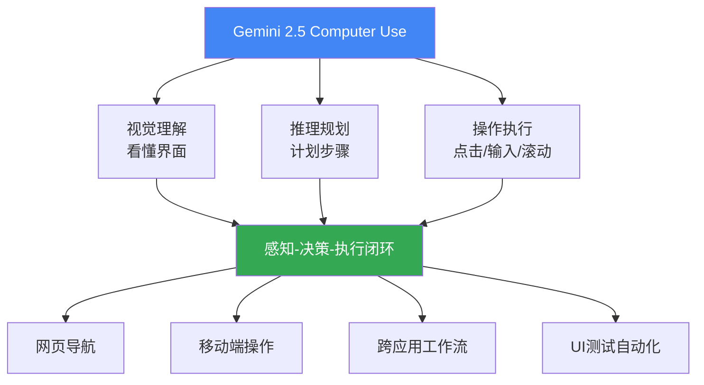

# Gemini 2.5 计算机使用模型：AI智能体的操作系统级突破

> 📊 难度：⭐⭐⭐ | ⏱️ 阅读：12分钟 | 📅 2025年10月7日 | 🏷️ 计算机使用, UI交互, 智能体, API

**原标题：** Introducing the Gemini 2.5 Computer Use model

**中文标题：** 介绍 Gemini 2.5 计算机使用模型

**发布日期：** 2025年10月7日

**原文链接：** https://blog.google/technology/google-deepmind/gemini-computer-use-model/

---

## 📝 一句话摘要

Google DeepMind 发布 Gemini 2.5 Computer Use 模型，这是首个通过API提供的专用计算机操作AI模型，能够像人类一样通过点击、输入和滚动与用户界面交互，在浏览器和移动端任务基准测试中超越所有竞争方案，同时具备最低延迟。

---

## 🔍 核心内容

### 产品定位

Google DeepMind 通过 Gemini API 发布了 Gemini 2.5 Computer Use 模型——一个专门设计用于处理计算机使用任务的AI模型。它使AI智能体能够以接近人类的方式与数字界面交互，代表了AI从"对话助手"向"数字操作者"的关键进化。

### 核心能力

该模型建立在 Gemini 2.5 Pro 的视觉理解和推理能力之上，专门优化了与用户界面（UI）的交互能力。智能体必须像人类一样导航网页和应用程序——通过点击、输入和滚动来完成任务。

关键能力场景包括：
- **网页导航：** 自主浏览网站、搜索信息、填写表单
- **移动端操作：** 在移动设备应用中执行复杂操作
- **跨应用工作流：** 在多个应用和网页之间协调完成复杂任务
- **UI测试自动化：** Google 内部团队已将该模型部署到生产环境中用于UI测试，显著加速软件开发

### 性能表现

- 在 Online-Mind2Web（Browserbase 测试框架）上以最低延迟实现最佳浏览器控制质量
- 在多个网页和移动端控制基准测试中超越所有竞争方案
- 在保持最高质量的同时实现行业最低延迟——这是生产级部署的关键指标

### 技术架构

模型基于 Gemini 2.5 Pro 构建，继承了其强大的视觉理解能力（理解屏幕截图中的UI元素布局和功能）和推理能力（规划完成任务所需的步骤序列）。计算机使用能力是在这些基础能力之上进行专门微调的结果。

### 可用性

- 以公开预览版形式通过 Gemini API 提供
- 可在 Google AI Studio 和 Vertex AI 中访问
- 面向开发者和企业的API集成

---

## 🔬 技术要点

1. **视觉-操作闭环：** 模型不仅"看懂"界面（视觉理解），还能"操作"界面（生成动作），形成感知-决策-执行的完整闭环
2. **低延迟设计：** 在计算机使用场景中，延迟直接影响任务完成速度和用户体验——最低延迟是重要的工程成就
3. **跨平台统一模型：** 同一模型支持浏览器和移动端，无需针对不同平台训练不同的智能体
4. **从对话到操作的范式扩展：** LLM的输出从"文本"扩展到"UI操作序列"，这是模型能力空间的重大拓展
5. **生产级部署验证：** Google 内部已在UI测试中使用该模型，证明其可靠性已达到生产环境要求

---

## 🧠 深度解读

### 🟢 通俗版

### 为什么"计算机使用"是AI发展的关键里程碑？

### 🔴 深入版

传统AI助手通过API和文本界面与数字世界交互。但人类构建了数十年的软件生态系统（网站、应用、桌面软件）都是为人类的视觉感知和手动操作设计的。"计算机使用"能力意味着AI可以直接进入这个为人类设计的数字世界，无需专门的API适配——这极大地扩展了AI能够执行的任务范围。

想象一下：不再需要为每个网站、每个应用、每个系统开发专门的AI集成。一个能"使用计算机"的AI智能体可以像人类实习生一样，在任何有图形界面的系统上完成工作。

### 延迟与质量的双重领先

在计算机使用场景中，低延迟至关重要。人类操作计算机时，每个点击、输入和页面加载之间的等待时间通常在毫秒到秒级。如果AI智能体每个操作步骤需要等待数秒才能"思考"下一步，那么完成一个涉及几十个步骤的任务可能需要数分钟，失去实用价值。Gemini 2.5 Computer Use 在保持最高质量的同时实现最低延迟，是生产级部署的基本前提。

### 与 Anthropic Claude Computer Use 的竞争

Anthropic 在2024年10月首先发布了 Claude 的 Computer Use 能力。Google 在一年后发布的版本声称在基准测试上全面超越，这反映了AI智能体能力领域的激烈竞争。更重要的是，Google 拥有 Android 移动平台和 Chrome 浏览器生态，这为 Gemini Computer Use 的大规模部署提供了独特的渠道优势。

### UI测试的生产部署：冰山一角

Google 内部已将该模型用于UI测试——这个看似平凡的应用场景实际上暗示了巨大的商业潜力。软件公司在UI测试上投入大量人力和资源，如果AI能自动化这一流程，将释放大量开发者生产力。这可能只是"计算机使用"AI在企业自动化领域应用的冰山一角。

### 安全与控制的新挑战

一个能自主操作计算机的AI系统带来了新的安全挑战：它可能意外删除文件、发送错误邮件、进行未授权的操作。如何确保AI智能体在操作计算机时遵循用户意图且不越权，是一个尚待充分解决的技术和伦理问题。

---

## 💡 延伸思考

1. **RPA（机器人流程自动化）行业的颠覆：** 传统RPA工具需要为每个流程编写脚本。基于视觉理解的AI Computer Use 是否会彻底取代传统RPA？对 UiPath、Automation Anywhere 等公司的冲击有多大？

2. **无障碍应用：** 计算机使用AI可以为视障人士和行动不便的用户提供前所未有的数字无障碍支持——代替他们"看"和"操作"计算机。

3. **AI员工的雏形：** 当AI既能理解指令（语言能力）、又能操作计算机（行动能力），距离"AI虚拟员工"还有多远？这对就业市场的中期影响如何评估？

4. **安全边界：** 一个能操作计算机的AI，如果被恶意使用，可能自动化网络攻击、社会工程学攻击等。如何在开放API访问与防止滥用之间取得平衡？

5. **从操作到理解系统：** 当前的计算机使用AI主要是"模仿人类操作"。下一步的进化方向可能是"理解软件系统的内部逻辑"，从而更高效、更安全地完成任务。
