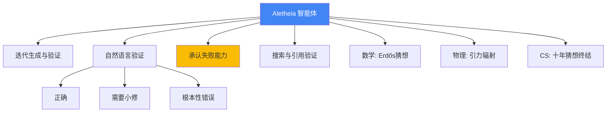

# Gemini Deep Think：重新定义AI驱动的科学研究

> 📊 难度：⭐⭐⭐⭐ | ⏱️ 阅读：16分钟 | 📅 2026年2月11日 | 🏷️ Deep Think, Aletheia, 科学研究, 人机协作

**原标题:** Gemini Deep Think: Redefining the Future of Scientific Research

**中文标题:** Gemini Deep Think：重新定义科学研究的未来——加速数学与科学发现

**发布日期:** 2026年2月11日

---

## 📝 一句话摘要

Google DeepMind展示Gemini Deep Think如何从竞赛推理走向真正的科学研究，其数学研究智能体Aletheia已自主解决开放数学猜想，并在物理学和计算机科学领域攻克了持续数十年的难题。

---

## 🔍 核心内容

### 从竞赛到研究的跨越

如果说2025年的IMO金牌证明了AI可以"解题"，那么2026年2月发布的这篇博文则展示了AI开始"做研究"。Gemini Deep Think不再仅仅是一个问题求解器，而是正在成为一个真正的科学研究协作者。

### 数学推理能力的持续进化

**基准测试成绩：**
- IMO金牌水平（2025年国际数学奥赛）
- 国际大学生程序设计竞赛（ICPC）同等水平
- 在IMO-ProofBench Advanced测试中得分高达90%（截至2026年1月）

这些数字表明，Deep Think的推理能力正在持续提升，并且从竞赛级问题向研究级问题延伸。

### Aletheia：数学研究智能体

Google DeepMind开发了一个名为Aletheia的专门数学研究智能体，它集成了多项关键能力：

**迭代式解答生成与验证**
- 生成候选解答后自动进行验证
- 使用自然语言进行错误检测和自我纠正
- 关键创新：具备"承认失败"的能力——当智能体识别出自己走入了死胡同时，会主动放弃当前路径并尝试新方向，而非陷入无效循环。这一看似简单的设计极大地提升了研究效率

**知识获取与引用验证**
- 集成网页浏览和搜索功能
- 自动查证文献引用，防止"幻觉引用"
- 在已有数学知识的基础上构建新的推理链条

### 三大科学应用领域

#### 数学：自主解决开放猜想

Aletheia智能体对Erdos猜想数据库（数学界最著名的开放问题集之一）中的多个问题做出了贡献。成果涵盖：
- 对开放问题的自主求解（达到可发表质量）
- 人机协作的联合研究成果
- 多篇相关研究论文

这标志着AI从"解决已知题目"正式跨入"探索未知问题"的领域。

#### 物理学：攻克长期研究瓶颈

Gemini帮助解决了引力辐射计算中涉及"奇点"处理的长期难题。该问题曾困扰物理学家多年，Deep Think通过跨数学学科调用技术方法，为其提供了新的解决路径。

#### 计算机科学：破解十年猜想

- 提出网络优化问题的新颖解决方案
- 解决了在线次模优化领域一个悬而未决长达十年的猜想

这些成果展示了Deep Think的一个独特优势：它可以将一个数学子领域的技术方法迁移到另一个看似无关的领域，产生人类研究者可能需要数年跨领域学习才能实现的洞察。

### 推理效率的规模化优势

性能评估揭示了重要的规模化特性：
- 在奥赛级别问题上，随着计算资源增加，性能稳步提升
- 这种规模化原则成功迁移到博士级别的研究问题上
- Aletheia智能体在更低的推理时计算量下就能达到比基线模型更高的推理质量

这意味着Deep Think的推理能力不仅仅是"堆算力"的结果，而是架构本身具有更高的推理效率。

### AI在科学研究中的定位

博文提出了一个清晰的定位：AI是"人类智力的倍增器"（force multiplier for human intellect），而非替代者。具体分工为：
- **AI负责：** 知识检索、验证、形式化推理、计算密集型探索
- **人类负责：** 概念创新、问题提出、方向判断、审美直觉

这代表了"科学工作流程的根本性转变"——AI成为理论发现过程中的协作伙伴。

博文还引入了一套分类体系，按AI贡献程度对人机协作数学研究进行分级，并为AI辅助研究成果在学术发表中的负责任记录建立了标准。

---

## 🔬 技术要点

1. **Aletheia智能体架构：** 集迭代推理、自我验证、失败识别、网络搜索于一体的数学研究智能体，代表了"AI科学家"原型的最新进展
2. **"承认失败"机制：** 智能体能够识别无效推理路径并主动放弃，这种元认知能力显著提高了研究效率，避免了在错误方向上浪费计算资源
3. **跨领域技术迁移：** Deep Think能够将一个数学分支的方法自动应用到另一个领域，实现了人类研究者需要多年跨领域学习才能达到的知识迁移
4. **推理效率的规模化：** 从竞赛问题到博士级研究问题，推理能力的规模化律（scaling law）依然成立，暗示着更大规模的计算投入可以产出更高级别的研究成果
5. **AI贡献分级体系：** 建立了对AI辅助研究成果进行分类和归因的标准，为学术界如何处理"AI合著"问题提供了框架

---

## 🧠 深度解读

### 🟢 通俗版

这篇博文可能标志着AI发展史上一个被低估的转折点：AI从"通过考试"正式转向"做科学研究"。

### 🔴 深入版

Aletheia智能体自主解决Erdos猜想数据库中的开放问题，这不是"在已知答案的题目上刷高分"，而是在人类尚未解决的前沿问题上做出了实质性贡献。这种跨越的意义在于：AI的价值不再仅仅通过"人类能做到而AI也能做到"来衡量，而是开始通过"AI能发现人类未曾发现的东西"来体现。

"承认失败"机制看似是一个工程细节，实则是一个重要的认知架构创新。真正的研究过程充满了失败和回退，而传统AI系统（包括大多数思维链方法）倾向于沿着一条路径一直走下去。Aletheia的元认知能力——知道自己何时走错了路——是更接近真实科学研究的关键特征。

跨领域技术迁移或许是最具革命性的能力。人类数学和科学研究中，许多重大突破来自于"看到不同领域之间意想不到的联系"。Deep Think在引力辐射计算中应用数学技术、在在线优化问题中破解十年猜想，都是这种跨领域洞察的体现。如果AI可以系统性地实现这种迁移，科学发现的速度可能会出现阶跃式加速。

最后，博文提出的AI贡献分级体系和学术发表规范，反映了一种成熟的行业态度：不是回避"AI做研究"的现实，而是积极建立框架来规范和引导这一趋势。这对整个学术界如何适应AI时代具有重要的先导意义。

---

## 💡 延伸思考

1. **科学发现的加速器效应：** 如果AI可以系统性地实现跨领域知识迁移，那些长期孤立发展的学科之间是否会出现大量意想不到的交叉突破？这对科研组织方式有何启示？
2. **"AI科学家"的边界：** Aletheia目前主要解决形式化程度较高的数学和理论物理问题。对于实验科学、社会科学等更依赖"直觉"和"经验"的领域，这种范式是否适用？
3. **学术发表的变革：** 当越来越多的论文有AI的实质性贡献时，同行评审、学术署名、引用体系等学术基础设施需要如何调整？
4. **人类研究者的角色转型：** 当AI接管了大量"技术性推理"工作后，人类研究者的核心竞争力将转向哪里？是提出正确的问题、判断研究方向，还是对结果的审美鉴赏力？
5. **民主化效应：** 如果一个博士生可以通过Aletheia获得世界级的推理辅助，这是否会缩小顶尖研究机构与普通大学之间的研究能力差距？

---

**原文链接:** [https://deepmind.google/blog/accelerating-mathematical-and-scientific-discovery-with-gemini-deep-think/](https://deepmind.google/blog/accelerating-mathematical-and-scientific-discovery-with-gemini-deep-think/)
