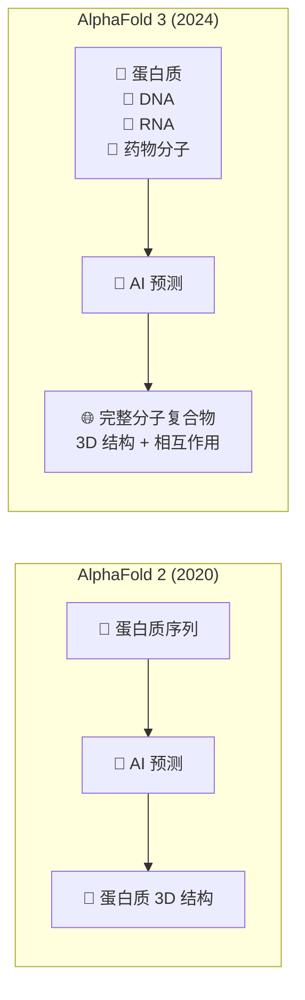

# AlphaFold 3: Predicting the Structure and Interactions of All of Life's Molecules

# AlphaFold 3：预测生命全部分子的结构与相互作用

> ⭐⭐⭐ 较高难度 | ⏱️ 阅读时间：12 分钟 | 📅 2026-03-21 | 🏷️ `AlphaFold` `蛋白质折叠` `扩散模型` `药物发现` `结构生物学`

## 📌 一句话摘要

Google DeepMind 与 Isomorphic Labs 联合推出 AlphaFold 3，首次实现对蛋白质、DNA、RNA、配体等所有生命分子的结构及其相互作用的高精度预测，开启"数字生物学"新纪元。

---

## 🟢 通俗版：AlphaFold 3 是什么？

生命的运作依赖于分子之间的精密互动。要理解疾病、开发药物，首先得知道这些分子长什么样、怎么互动。

- 🔬 **传统方式**：在实验室里做实验（冷冻电镜、X射线晶体学），耗时数月甚至数年
- 🤖 **AlphaFold 3**：输入分子序列，AI 直接预测 3D 结构，几分钟搞定

> 🎯 **关键突破**：AlphaFold 2 只能预测蛋白质结构。AlphaFold 3 能预测**所有生命分子**（蛋白质、DNA、RNA、药物分子等）的结构和它们之间的相互作用。

---

## 🔴 深入版：核心内容详解

### 1. 🌍 背景与意义

2024年5月，Google DeepMind 与 Isomorphic Labs 联合发布了 AlphaFold 3（AF3），这是蛋白质结构预测领域的又一里程碑式突破。相关论文发表于《Nature》杂志。如果说 AlphaFold 2 解决了"蛋白质折叠问题"，那么 AlphaFold 3 则将 AI 结构预测的疆域扩展到了生命科学的几乎所有分子类型。

### 2. 🚀 核心突破

AlphaFold 3 不再局限于蛋白质——它能够预测蛋白质、DNA、RNA、配体（小分子药物）以及翻译后修饰等几乎所有生命分子的三维结构。更关键的是，AF3 能够生成完整分子复合物的联合三维结构，让研究者以全局视角观察药物分子如何与靶蛋白结合、蛋白质如何与遗传物质相互作用。

| 能力维度 | AlphaFold 2 | AlphaFold 3 |
|---------|-------------|-------------|
| 🧬 蛋白质结构 | ✅ | ✅ |
| 🔵 DNA 结构 | ❌ | ✅ |
| 🔴 RNA 结构 | ❌ | ✅ |
| 💊 配体（药物分子） | ❌ | ✅ |
| 🔧 翻译后修饰 | ❌ | ✅ |
| 🤝 分子间相互作用 | ❌ | ✅ |
| 🎯 配体对接 | ❌ | ✅ 超越传统方法 |

### 3. ⚙️ 技术架构

AlphaFold 3 引入了全新的**扩散模型（diffusion model）**架构。与 AlphaFold 2 的迭代细化不同，AF3 从随机噪声出发，通过学习到的去噪过程逐步"雕刻"出精确的分子结构。这一架构选择使得模型能够更自然地处理多种分子类型的联合预测问题。

**🎯 配体对接方面的突破**：
- 超越当前最优的对接方法
- 无需预先提供参考蛋白质结构
- 无需配体口袋的位置信息
- 经常达到**原子级精度**

> 💡 这在药物发现领域具有革命性意义 —— 传统方法需要先知道药物分子"放在哪里"，AF3 可以自己预测。

### 4. 🖥️ AlphaFold Server

伴随 AF3 发布的还有 AlphaFold Server——全球最精确的蛋白质交互预测工具，作为免费平台供全球科学家进行非商业研究。

| 指标 | 数据 |
|------|------|
| 💰 价格 | 免费（非商业研究） |
| 👥 用户 | 全球数千名研究人员 |
| 📊 预测次数 | 超过 800 万次分子折叠 |

### 5. 📖 开源与开放

2024年11月，Google DeepMind 正式发布了 AlphaFold 3 的模型代码和权重，供学术界使用，进一步推动了开放科学的发展。

---

## 🧪 技术要点

1. **🌐 全分子覆盖**：从蛋白质扩展到 DNA、RNA、配体、翻译后修饰等所有生命分子类型
2. **🌫️ 扩散模型架构**：采用类似图像生成的扩散去噪方法，从随机噪声迭代生成精确分子结构
3. **🤝 联合结构预测**：能够生成完整分子复合物的三维结构，而非孤立的单分子预测
4. **🎯 零信息对接**：配体对接无需参考结构或口袋位置，超越传统对接方法
5. **🔬 原子级精度**：对 PDB 数据库中几乎所有分子实现接近实验精度的预测

---

## 🔬 深度解读

AlphaFold 3 的发布标志着 AI 驱动的结构生物学进入了一个全新阶段。

🧬 **扩散模型的精妙选择**。从技术角度看，扩散模型的引入是一个大胆而精妙的选择。传统的蛋白质结构预测依赖于序列比对和物理约束的迭代细化，而扩散模型将问题重新定义为"从噪声中生成结构"的生成式任务，这与当前图像、视频生成领域的前沿方法一脉相承。

💊 **"数字生物学"范式的确立**。更深远的影响在于当我们能够在计算机上以原子精度模拟生命分子之间的相互作用时，药物发现的范式将从"湿实验室驱动"转向"计算驱动"。传统药物研发需要数年时间和数十亿美元投入来确定一个候选分子，而 AF3 有望将这一过程大幅压缩。

🏢 **商业化布局**。Isomorphic Labs 的参与揭示了 Google 在生物制药商业化方面的战略布局——基础科学（DeepMind）与产业应用（Isomorphic Labs）的深度协同，正在构建从算法到药物的完整价值链。

### 📊 AlphaFold 系列演进

| 版本 | 年份 | 核心技术 | 突破 |
|------|------|---------|------|
| 🔹 AlphaFold 1 | 2018 | 距离预测 + 梯度下降 | CASP13 首次 AI 夺冠 |
| 🔷 AlphaFold 2 | 2020 | 注意力机制 + Evoformer | 解决蛋白质折叠问题 |
| 🔶 AlphaFold 3 | 2024 | 扩散模型 | 全分子覆盖 + 相互作用预测 |

---

## 💭 延伸思考

- **💊 药物发现加速**：AF3 能否真正替代或大幅减少药物研发中的湿实验工作？从预测到实际药物之间还有多大的鸿沟？
- **🤖 生成式 AI 与科学**：扩散模型在自然科学中的应用是否代表了一种通用范式？天气预测（GenCast）、材料设计等领域是否会出现类似的突破？
- **📖 开源的战略考量**：Google 选择开源 AF3 背后的动机是什么？是否意在构建生态系统，让更多研究者在其架构上进行二次开发？
- **🔐 伦理与生物安全**：当 AI 能够以原子精度预测任意分子复合物的结构时，如何防止潜在的生物安全风险？

---

## 🔗 原文链接

- [Google DeepMind and Isomorphic Labs introduce AlphaFold 3](https://blog.google/technology/ai/google-deepmind-isomorphic-alphafold-3-ai-model/)
- [A glimpse of the next generation of AlphaFold](https://deepmind.google/discover/blog/a-glimpse-of-the-next-generation-of-alphafold/)
- [How we built AlphaFold 3](https://blog.google/technology/ai/how-we-built-alphafold-3/)
