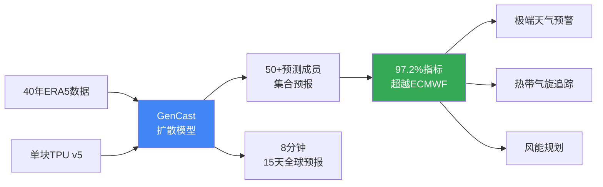

# GenCast: Predicts Weather and the Risks of Extreme Conditions with State-of-the-Art Accuracy

> 📊 难度：⭐⭐⭐ | ⏱️ 阅读：12分钟 | 📅 2024年12月4日 | 🏷️ GenCast, 天气预报, 扩散模型, 集合预报

# GenCast：以最先进精度预测天气与极端气候风险

## 📝 一句话摘要

Google DeepMind 推出基于扩散模型的 AI 天气预报系统 GenCast，在 97.2% 的测试指标上超越欧洲中期天气预报中心（ECMWF）的业务系统，仅需一块 TPU 芯片 8 分钟即可生成 15 天全球集合预报。

---

## 🔍 核心内容

### 背景

2024年12月4日，Google DeepMind 发布了 GenCast——一款基于生成式 AI 的天气预报模型。这是继 GraphCast（2023年发布的确定性预报模型）之后的重大升级。GenCast 的核心创新在于将扩散模型技术从图像生成领域迁移到气象预报领域，实现了概率性集合预报（ensemble forecasting）。

### 技术架构

GenCast 采用了针对球面几何特性进行适配的扩散模型。与传统确定性预报给出单一结果不同，GenCast 生成包含 50 个或更多预测成员的集合预报，每个成员代表一条可能的天气演化轨迹。这种方法从根本上捕捉了天气预测中的不确定性。

**训练数据**：模型在 ECMWF 的 ERA5 再分析数据集上训练，涵盖 40 年的历史气象数据，学习 0.25° 分辨率（约 28 公里）下的全球天气模式。训练变量包括不同高度层的温度、风速和气压测量值。

### 性能指标

GenCast 的表现令人瞩目：

- 在 1,320 个测试预报组合中，**97.2%** 的指标上超越 ECMWF 的业务集合预报系统（ENS）
- 在预报时效超过 36 小时后，这一优势扩大到 **99.8%**
- 使用单块 Google Cloud TPU v5，仅需 **8 分钟** 即可生成完整的 15 天集合预报
- 相比之下，传统数值模式需要超级计算机集群数小时的计算

### 核心能力

**极端天气预报**：GenCast 在热浪、寒潮和强风等极端天气事件的预测上表现卓越，为防灾减灾提供更准确的预警。

**热带气旋追踪**：模型对飓风/台风路径的预测展现出随时间收紧的置信区间，意味着更精确的路径和强度预报。

**风能规划**：改进的风速预测为可再生能源发电规划提供了直接的应用价值。

**不确定性量化**：GenCast 生成的概率预报经过良好校准，既不过度自信也不过度保守，为决策者提供可靠的风险评估。

### 开源开放

研究团队公开发布了模型代码、权重和预报数据，强调 AI 预报与传统物理模式的互补性而非替代关系。

---

## 🔬 技术要点

1. **扩散模型迁移**：将图像/视频生成领域的扩散模型技术适配到球面地球几何，实现概率性天气预报
2. **集合预报机制**：生成 50+ 个预测成员，每个代表独立的天气演化轨迹，从根本上量化预报不确定性
3. **0.25° 高分辨率**：约 28 公里全球网格分辨率，涵盖温度、风速、气压等多层大气变量
4. **极致计算效率**：单块 TPU v5 芯片 8 分钟完成 15 天全球预报，比传统超算快数百倍
5. **40 年数据训练**：基于 ERA5 再分析数据集的四十年全球气象历史进行训练

---

## 🧠 深度解读

### 🟢 通俗版

GenCast 的意义远不止于"一个更好的天气预报模型"。它代表了 AI 在地球科学领域的一次范式转换。

### 🔴 深入版

**从确定性到概率性**：传统数值天气预报和 GraphCast 都给出单一的"最可能"结果。GenCast 的集合预报方法承认并量化了天气系统的内在混沌性。对于决策者来说，知道"有 30% 的概率出现极端降水"比"明天会下大雨"更有价值。

**扩散模型的通用性**：值得注意的是，AlphaFold 3 和 GenCast 都采用了扩散模型架构。这并非巧合——扩散模型在处理"从随机性中生成结构化输出"的问题上展现出通用优势。分子结构和天气模式虽然看似毫无关联，但在数学上都可以被建模为噪声到有序结构的映射。

**97.2% 的含义**：在 1,320 个预报组合中超越 ECMWF ENS——这意味着 GenCast 不是在某些特定场景下偶尔胜出，而是系统性地全面超越了人类数十年积累的最优物理模型。这一数字的分量不可低估。

**计算民主化**：传统数值天气预报需要价值数亿美元的超级计算机和数百名专业人员。GenCast 将这一能力压缩到一块 TPU 芯片和 8 分钟。这意味着发展中国家的气象机构也有望获得世界一流的预报能力。

---

## 💡 延伸思考

- **AI 会取代气象学家吗？**：GenCast 的作者强调"互补性"而非"替代性"，但当 AI 在 99.8% 的指标上全面胜出时，传统物理模式的角色会如何演变？
- **气候变化适应**：GenCast 训练于历史数据，当气候系统进入前所未有的新状态时，模型的泛化能力是否可靠？
- **商业价值**：精确的天气预报直接影响能源交易、农业保险、航空调度等万亿美元级市场。Google 是否会通过 Cloud 服务将 GenCast 商业化？
- **GraphCast 到 GenCast 的演进路径**：从确定性预报到概率性预报的技术跃迁，是否预示了 AI 科学模型的通用发展方向？

---

## 🔗 原文链接

- [GenCast predicts weather and the risks of extreme conditions with state-of-the-art accuracy](https://deepmind.google/blog/gencast-predicts-weather-and-the-risks-of-extreme-conditions-with-sota-accuracy/)
- [GraphCast: AI model for faster and more accurate global weather forecasting](https://deepmind.google/blog/graphcast-ai-model-for-faster-and-more-accurate-global-weather-forecasting/)
