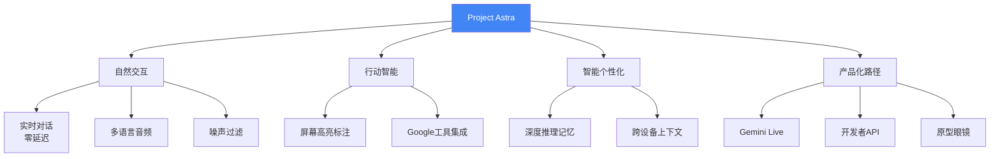

# Project Astra: Exploring a Universal AI Assistant

> 📊 难度：⭐⭐⭐ | ⏱️ 阅读：12分钟 | 📅 2025年5月 | 🏷️ Project Astra, 通用AI助手, 多模态, 无障碍

# Project Astra：探索通用 AI 助手的未来之路

## 📝 一句话摘要

Google DeepMind 的 Project Astra 是一款面向未来的多模态 AI 助手研究原型，能够实时看、听、理解并与用户自然交互，代表了 Google 对"通用 AI 助手"的终极愿景。

---

## 🔍 核心内容

### 项目定位

Project Astra（Advanced Seeing and Talking Responsive Agent，高级视听响应智能体）是 Google DeepMind 的一个研究原型项目，其目标直指"通用 AI 助手"——一个能够像人类助手一样，通过视觉、听觉和语言与用户进行自然、流畅、多模态交互的 AI 系统。

### 三大核心能力

**1. 自然交互（Natural Interaction）**

Project Astra 实现了真正的实时对话体验。它能够直觉性地开启对话，在当下即时回应——没有中断，没有延迟。系统具备改进的多语言音频输入/输出能力，生成内容的速度显著快于前代模型。关键的一点是，它能够过滤背景噪音和无关语音，只关注与用户的直接交流。

**2. 行动智能（Action Intelligence）**

Astra 不仅能"看"和"听"，还能"做"。它通过屏幕高亮标注来识别重要对象及其上下文，并与 Google 搜索、Gmail、日历、地图等工具深度集成，代表用户执行具体任务。这使它从一个被动的问答系统进化为一个主动的任务执行智能体。

**3. 智能个性化（Intelligent Personalization）**

系统运用深度推理和记忆机制来构建对用户偏好的丰富理解。它能从过去的交互中检索相关内容——无论是 PDF 文档、食谱还是其他文件——为用户提供量身定制的帮助。

### 技术特性

**多模态同步处理**：Project Astra 同时处理多种输入模态——摄像头/屏幕共享的视觉信息、多语言语音的听觉信息，以及来自用户设备的上下文数据。

**跨设备记忆**：系统支持跨设备的共享记忆。用户可以在 Android 手机上开始一段对话，然后无缝切换到原型眼镜上继续，记忆和上下文完整保留。

**屏幕共享与视频理解**：用户可以共享屏幕或通过摄像头展示环境，Astra 能够实时理解并分析所见内容。

### 无障碍倡议

Project Astra 特别关注视觉障碍群体。通过与 Aira 合作，团队开发了"Visual Interpreter"（视觉解读器）研究原型，帮助盲人和低视力用户理解物体和陌生空间。该原型整合了 Google 地图、照片和智能镜头等产品，提供专业人工监督下的早期访问体验。

### 产品化路径

Project Astra 的能力正在逐步融入 Google 的消费级产品：
- **Gemini Live**：屏幕共享、视频理解等功能已上线
- **Google 搜索**：全新的搜索体验正在整合 Astra 的多模态能力
- **开发者 API**：Live API 面向开发者开放
- **新形态设备**：原型眼镜等新硬件形态正在探索中

---

## 🔬 技术要点

1. **多模态实时处理**：同步处理视觉（摄像头/屏幕）、听觉（多语言语音）和上下文数据，实现零延迟交互
2. **智能体架构**：不仅理解世界，还能通过工具调用（搜索、邮件、日历、地图）主动执行任务
3. **跨设备持久记忆**：在手机和眼镜等不同设备间共享对话记忆和上下文状态
4. **视觉场景理解**：实时分析摄像头和屏幕内容，通过高亮标注识别关键对象
5. **噪声过滤与自然对话**：过滤背景干扰，实现不打断、无延迟的自然对话流

---

## 🧠 深度解读

### 🟢 通俗版

Project Astra 代表的不仅是一个产品或功能，而是 Google 对 AI 助手终极形态的系统性探索。

### 🔴 深入版

**从对话到智能体**：传统的 AI 助手（Siri、Alexa、早期 Google Assistant）本质上是"问答机"——用户提问，系统回答。Project Astra 的根本转变在于从"被动应答"走向"主动行动"。当 Astra 能够阅读你的屏幕、理解上下文、调用工具并代你执行任务时，它就不再是助手，而是"代理人"。

**多模态的本质意义**：人类与世界的交互本身就是多模态的——我们同时看、听、触摸、思考。Project Astra 试图让 AI 回归这种自然的交互方式，而非将一切压缩为文本输入/输出。这一方向与 OpenAI 的 GPT-4o 和 Anthropic 的 Claude 的多模态能力形成竞争态势。

**眼镜形态的战略意义**：Google 提到的"原型眼镜"绝非无心之举。从 Google Glass 到 Project Astra 眼镜，Google 始终在寻找超越手机的下一代计算平台。当 AI 助手能够通过眼镜实时感知你所见的世界时，AR/AI 的融合将创造全新的交互范式。

**无障碍的深远影响**：与 Aira 合作的 Visual Interpreter 项目或许是整个 Astra 中最具社会意义的部分。如果 AI 能够准确描述盲人用户周围的环境，这将是一次真正改变数亿人生活的技术进步。

---

## 💡 延伸思考

- **隐私边界**：当 AI 助手能够看到你的屏幕、听到你的对话、记住你的偏好时，隐私保护如何实现？持久记忆与数据安全之间的平衡在哪里？
- **注意力经济**：一个无处不在、随时响应的 AI 助手会如何改变人类的注意力模式和社交行为？
- **平台锁定**：Astra 深度整合 Google 全家桶（Search、Gmail、Calendar、Maps），这是否会加剧用户对 Google 生态系统的依赖？
- **通用 vs 专用**：在"通用 AI 助手"的愿景下，行业专用的 AI 工具（医疗、法律、金融）是否会被边缘化，还是会以插件/技能的形式被整合？

---

## 🔗 原文链接

- [Project Astra - Google DeepMind](https://deepmind.google/models/project-astra/)
- [Google Gemini updates: Flash 1.5, Gemma 2 and Project Astra](https://blog.google/technology/ai/google-gemini-update-flash-ai-assistant-io-2024/)
- [Google I/O 2025: Gemini as a universal AI assistant](https://blog.google/technology/google-deepmind/gemini-universal-ai-assistant/)
