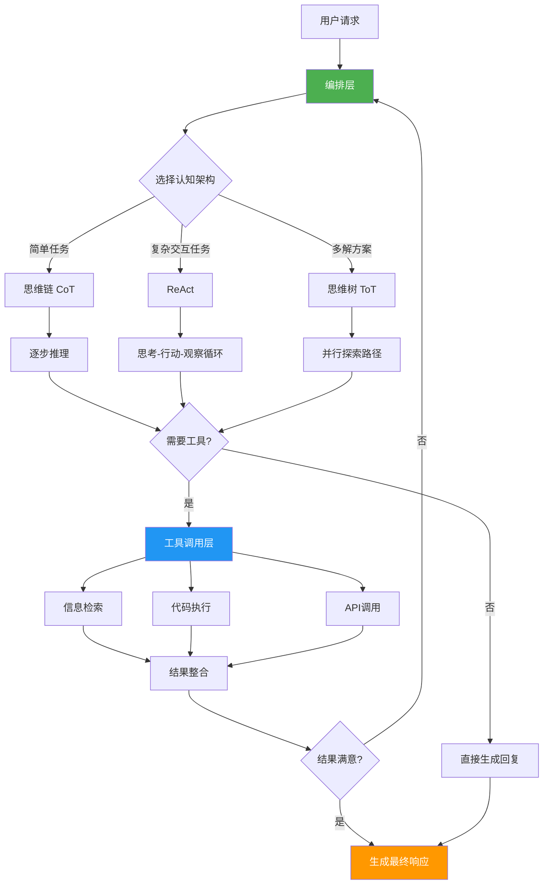

> 📊 难度：⭐⭐⭐⭐ | ⏱️ 阅读：18分钟 | 📅 2024年9月（2025年1月广泛传播） | 🏷️ AI智能体, 认知架构, 多智能体系统

# Google "Agents" Whitepaper
# Google智能体白皮书：从语言模型到自主行动者

## 一句话摘要

Google发布76页白皮书，系统性地定义了AI智能体的架构、认知模式（ReAct、思维链、思维树）、工具使用、编排层设计、评估框架，以及基于AgentSpace的企业级实战部署方案。

---

## 核心内容

### AI智能体 vs. AI模型：本质区别

白皮书开篇即澄清了一个关键概念：

**AI模型**是统计学习系统，接受输入、生成输出。**AI智能体**则在模型基础上扩展了自主行动能力——它们能够设定目标、制定计划、使用工具、与外部环境交互，并根据反馈调整行为。

模型是智能体的"大脑"，但智能体还有"手"（工具）和"意识"（编排层）。

### 三种认知架构

白皮书详细介绍了三种核心认知架构：

**1. ReAct（推理+行动）**
- 将推理（Reasoning）和行动（Acting）交替进行
- 模型先思考"我应该做什么"，然后执行一个行动，观察结果，再思考下一步
- 典型流程：思考 → 行动 → 观察 → 思考 → 行动 → ...
- 优势：将复杂任务分解为可管理的步骤

**2. 思维链（Chain of Thought, CoT）**
- 促进逐步推理过程
- 模型在给出最终答案前，先展示完整的推理路径
- 适用于数学、逻辑、多步分析等需要清晰推理的任务

**3. 思维树（Tree of Thought, ToT）**
- 同时探索多条推理路径
- 像下棋一样，评估多种可能的思路，选择最优路径
- 适用于需要创造性解决方案或存在多种可能解法的复杂问题

### 工具使用（Tool Use）

智能体通过工具与外部世界交互。白皮书将工具分为几类：

- **信息检索工具**：搜索引擎、数据库查询、知识库访问
- **代码执行工具**：Python解释器、命令行接口
- **API交互工具**：调用第三方服务（天气、地图、支付等）
- **专用工具**：特定领域的计算器、模拟器等

### 编排层（Orchestration Layer）

编排层是智能体架构的核心组件，负责：

- **任务规划**：将用户目标分解为子任务
- **工具选择**：决定何时使用哪个工具
- **记忆管理**：维护短期对话记忆和长期知识
- **错误恢复**：处理工具调用失败、结果不理想等情况

### Agentic RAG（智能体化的检索增强生成）

白皮书深入讨论了Agentic RAG——将RAG从被动的"查了就答"升级为主动的"规划-检索-推理-验证"过程：

- 智能体主动决定何时需要检索外部知识
- 可以进行多轮检索，逐步细化查询
- 能够评估检索结果的质量，必要时重新查询
- 将检索与推理深度融合

### 多智能体系统实战案例

白皮书后半部分以**车联网场景**为例，展示了多智能体协作系统：

- **导航智能体**：处理路线规划和实时导航
- **消息智能体**：管理通讯和通知
- **媒体控制智能体**：管理音乐和播客
- **用户支持智能体**：处理帮助请求和故障排除

每个智能体专注于自己的领域，通过统一的编排层协调工作。

### Google AgentSpace

白皮书介绍了**AgentSpace**作为企业级智能体平台：

- 智能体的创建、部署和监控
- 治理与合规管理
- 安全性和访问控制
- 性能优化和规模化部署

---

## 技术要点

1. **ReAct架构**通过交替"思考"和"行动"解决了纯推理或纯行动的局限，是当前主流Agent框架的理论基础
2. **编排层设计**是Agent系统的灵魂——它决定了智能体的规划能力、工具使用策略和错误恢复机制
3. **Agentic RAG**将检索从被动响应升级为主动规划，显著提升了知识密集型任务的处理质量
4. **多智能体协作**通过专业化分工解决单一智能体的能力瓶颈，但引入了协调和一致性的新挑战
5. **AgentSpace平台**代表了从"实验性Agent"到"企业级Agent"的产品化路径

---

## 解读

### 🟢 通俗版解读

想象你要装修一套房子。

**AI模型**就像一个只能回答问题的装修顾问：你问"客厅刷什么颜色好？"他给你建议。但他不会实际动手。

**AI智能体**就像一个项目经理：
- 他有一个**大脑**（AI模型）来做决策
- 他有**工具**（锤子、油漆刷、卷尺——对应各种API和工具）
- 他有**工作计划**（编排层——先拆旧墙、再布线、再刷漆）

三种思考方式的区别：
- **ReAct**："让我先看看这面墙的情况（思考）→ 用锤子敲一下试试（行动）→ 原来是承重墙（观察）→ 那我换个方案（思考）"
- **思维链**："要改这个格局，第一步要检查承重结构，第二步要申请许可，第三步..."
- **思维树**："方案A是拆墙做开放式，方案B是保留墙做推拉门，方案C是... 综合评估后选方案B"

### 🔴 深入版解读

**系统性定义的意义**：这份白皮书的最大贡献在于为Agent技术提供了一个系统性的概念框架。在此之前，"Agent"一词在行业中被滥用——从简单的提示链到复杂的多模态自主系统都被称为Agent。白皮书通过"模型+工具+编排层"的三要素定义，建立了清晰的技术边界。

**认知架构的实用性分析**：ReAct因其简单性和有效性成为主流选择，但在需要深度规划的场景中表现不佳（容易陷入局部最优）。思维树（ToT）理论上更强大，但计算开销呈指数增长，在实际部署中使用有限。白皮书对这些权衡的讨论较为理想化。

**Agentic RAG的架构影响**：传统RAG是"检索-生成"两阶段管道，Agentic RAG将其重构为"规划-检索-评估-生成"循环。这种重构带来了显著的质量提升，但也引入了更高的延迟和成本。在生产环境中，需要在质量和效率之间找到平衡点。

**多智能体系统的挑战**：车联网案例展示了优雅的专业化分工，但回避了实际部署中的核心难题：智能体间的状态同步、冲突解决、级联失败处理。这些工程问题的复杂度往往超过单个智能体的设计复杂度。

---

## 流程图

---

## 延伸思考

1. **Agent标准化**：行业是否需要统一的Agent定义和接口标准？Google的框架能否成为事实标准？
2. **评估难题**：传统NLP基准无法衡量Agent的规划和工具使用能力，需要什么样的评估框架？
3. **安全边界**：当Agent可以自主调用外部工具时，如何定义和限制其行动边界？
4. **成本控制**：ReAct和ToT等架构需要多次LLM调用，如何在Agent能力和推理成本之间取得平衡？

---

## 原文链接

- [Google Agents Whitepaper | Kaggle](https://www.kaggle.com/whitepaper-agents)
- [MarkTechPost 深度解析](https://www.marktechpost.com/2025/05/06/google-releases-76-page-whitepaper-on-ai-agents/)
