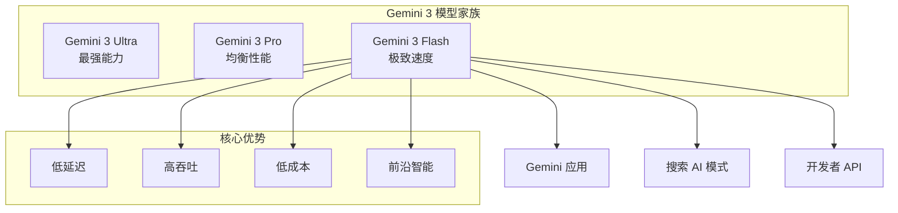

# Gemini 3 Flash: Frontier Intelligence Built for Speed | Gemini 3 Flash：为速度而生的前沿智能

> **原标题：** Gemini 3 Flash: Frontier Intelligence Built for Speed
> **作者：** Google DeepMind
> **发布日期：** 2026年3月
> **原文链接：** https://deepmind.google/blog/gemini-3-flash-frontier-intelligence-built-for-speed/

---

## 一句话摘要

Google DeepMind 发布 Gemini 3 Flash，一款专为速度优化的前沿智能模型，在保持高水平推理和多模态能力的同时实现极低延迟和成本效益，已部署于 Gemini 应用和 Google 搜索的 AI 模式。

---

## 完整核心内容翻译

### 一、设计理念

Gemini 3 Flash 的核心设计哲学是**"前沿智能，为速度而生"**。在 AI 模型日益强大但也日益庞大的趋势下，Flash 代表了另一个方向：在不牺牲关键能力的前提下，极致优化推理速度和成本效率。

这一设计选择源于对实际部署场景的深刻理解——大多数用户交互需要在毫秒级响应，大多数 API 调用对延迟敏感，而多智能体系统需要大量快速的模型调用。

### 二、核心能力

#### 速度与效率

Gemini 3 Flash 在推理速度上实现了显著突破：

- **极低首 token 延迟（TTFT）：** 用户感受到近乎即时的响应
- **高吞吐量：** 支持大规模并发请求
- **成本效益：** 显著低于同级别能力模型的调用成本

#### 前沿智能

尽管定位为"快速"模型，Gemini 3 Flash 仍保持前沿级别的核心能力：

- **推理能力：** 在复杂推理任务上保持高水平表现
- **多模态理解：** 支持文本、图像、视频、音频等多种输入模态
- **代码生成：** 高质量的代码编写和调试能力
- **工具使用：** 支持函数调用和外部工具集成
- **长上下文处理：** 支持大规模上下文窗口

### 三、部署场景

#### Gemini 应用

Gemini 3 Flash 已部署在 Google 的 Gemini 应用中，为用户提供流畅快速的对话体验。对于大多数日常交互场景，Flash 的速度优势带来了显著更好的用户体验。

#### Google 搜索 AI 模式

Gemini 3 Flash 驱动了 Google 搜索中的 **AI Mode**——一种将传统搜索与 AI 生成回答结合的新体验。在搜索场景中，延迟是用户体验的关键因素，Flash 的速度优势在此得到了充分发挥。

#### 开发者 API

通过 Google AI Studio 和 Vertex AI 向开发者提供 API 访问，适合需要高吞吐量和低延迟的应用场景。

### 四、在 Gemini 模型家族中的定位

---

## 技术要点

1. **速度-智能帕累托优化：** Gemini 3 Flash 代表了 Google 在速度和智能之间寻找最优平衡点的最新成果，通过架构优化和训练技术在不显著降低能力的前提下大幅提升速度。
2. **搜索场景的特殊优化：** AI Mode 要求模型在极短时间内综合搜索结果并生成回答，这对模型的延迟和上下文处理能力提出了独特要求。
3. **多模态保持：** 即使在优化速度的同时，Flash 仍保留了完整的多模态能力，避免了"快但能力打折"的常见妥协。
4. **规模化部署能力：** Flash 的高吞吐和低成本特性使其适合作为 Google 搜索等超大规模服务的后端模型。
5. **智能体基础设施层：** 与 OpenAI 的 mini/nano 类似，Flash 定位为多智能体系统中的高频调用模型，满足"子智能体时代"的需求。

---

## 深度解读

Gemini 3 Flash 的发布反映了 AI 行业的一个重要趋势：**模型竞争正在从"谁最强"转向"谁在特定约束下最优"。**

**速度在产品体验中的价值被长期低估。** 研究表明，响应延迟每增加 100 毫秒就会导致用户参与度显著下降。对于像 Google 搜索这样的超大规模产品，模型延迟直接影响数十亿次交互的质量。Flash 的定位正是对这一现实的回应。

**AI Mode 在搜索中的部署是一个战略性的产品决策。** Google 将 AI 模型嵌入其核心搜索产品，而非仅作为独立的聊天机器人提供。这种深度集成需要模型在延迟、成本和质量三个维度上同时满足极高标准——Flash 的设计正是为此场景量身定制。

**从竞争格局看，Flash 对标的是 OpenAI 的 GPT-5.4 mini 和 Anthropic 的 Haiku 系列。** 轻量级模型市场正在成为继旗舰模型之后的第二条竞争主线。在这个市场中，延迟和成本效率的重要性可能超过绝对性能——因为目标用户（开发者和产品团队）需要的是"足够好但足够快"的解决方案。

**Google 的独特优势在于搜索分发渠道。** 与 OpenAI 和 Anthropic 不同，Google 可以将其 AI 模型直接嵌入每天处理数十亿查询的搜索引擎中。这意味着 Flash 从发布之日起就拥有巨大的"内建分发"——无需用户主动寻找 AI 工具，AI 能力就已经融入了他们的日常信息获取流程。

---

## 延伸思考

1. 当 Flash 级别的模型速度接近传统搜索引擎时，"搜索"和"对话"之间的界限是否会完全消融？
2. 极致速度优化是否会带来新的安全挑战——更快的响应意味着更少的安全检查时间？
3. Flash 在 Google 搜索中的部署如何影响 SEO 生态系统？网站流量模式是否会因 AI 直接回答问题而发生根本性变化？
4. 在多智能体架构中，是否会出现 Flash/mini/nano 级别模型的"标准化接口"，使得不同厂商的轻量模型可以互换使用？

---

*本文为 Google DeepMind 官方博客文章的深度中文解读。*
