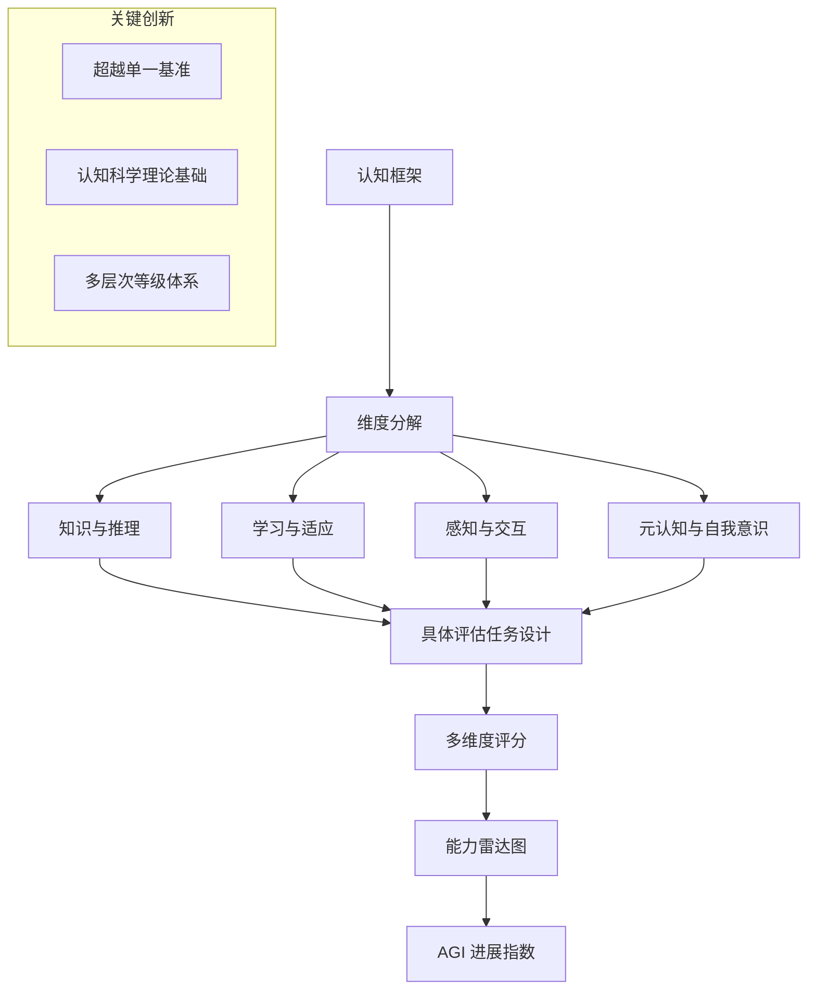

# Measuring Progress Toward AGI: A Cognitive Framework | 衡量 AGI 进展：认知框架

> **原标题：** Measuring Progress Toward AGI: A Cognitive Framework
> **作者：** Google DeepMind
> **发布日期：** 2026年3月
> **原文链接：** https://deepmind.google/blog/measuring-agi-cognitive-framework/

---

## 一句话摘要

Google DeepMind 提出一套基于认知科学的 AGI 进展衡量框架，通过定义多层次认知能力维度和评估标准，为 AI 系统向通用智能发展提供系统性、可量化的衡量方法，超越传统的单一基准测试范式。

---

## 完整核心内容翻译

### 一、研究动机

随着 AI 系统能力快速增长，"我们离 AGI 有多远"成为最常被讨论但最难回答的问题之一。现有的衡量方法存在根本性缺陷：

- **基准测试饱和：** 新模型快速"刷榜"，基准测试的区分度迅速下降
- **单维度评估：** 关注单一任务性能而忽视认知能力的多维性
- **缺乏理论框架：** 缺少对"通用智能"构成要素的系统性定义
- **人类对比偏差：** 简单地将 AI 与人类性能比较，忽略了两者认知架构的根本差异

DeepMind 的这项研究旨在提供一个植根于认知科学的理论框架，系统性地定义和衡量 AGI 进展。

### 二、认知框架的核心维度

该框架从认知科学中提取关键维度，构建多层次的评估体系：

#### 维度一：知识与推理

- **事实知识：** 世界知识的广度和准确性
- **逻辑推理：** 演绎、归纳和溯因推理能力
- **抽象思维：** 概念形成、类比和模式识别
- **因果理解：** 超越相关性的因果推断能力

#### 维度二：学习与适应

- **少样本学习：** 从极少示例中快速泛化
- **持续学习：** 在获取新知识的同时保留旧知识
- **迁移学习：** 将一个领域的能力应用到新领域
- **元学习：** "学习如何学习"的能力

#### 维度三：感知与交互

- **多模态感知：** 整合视觉、语言、听觉等多种信息源
- **环境理解：** 对物理和数字环境的理解
- **行动规划：** 基于感知制定和执行行动计划
- **社会认知：** 理解他人意图、情感和信念

#### 维度四：元认知与自我意识

- **不确定性意识：** 知道自己不知道什么
- **能力边界认知：** 理解自身能力的局限性
- **策略选择：** 根据任务特征选择合适的认知策略
- **自我监控：** 监测自身推理过程的正确性

### 三、能力等级体系

框架定义了从"无能力"到"超人类"的渐进等级：

| 等级 | 描述 | 当前 AI 状态 |
|------|------|-------------|
| L0 | 无能力 | 已超越 |
| L1 | 新手级 | 大部分已达到 |
| L2 | 胜任级 | 多数维度已达到 |
| L3 | 专家级 | 部分维度达到 |
| L4 | 大师级 | 极少维度接近 |
| L5 | 超人类级 | 仅在特定窄领域 |

### 四、评估方法论

### 五、关键发现

- 当前最先进的 AI 系统在不同认知维度上表现**极不均衡**
- 在知识检索和模式匹配上已达到或超越人类水平
- 在因果推理、持续学习和元认知方面仍有显著差距
- 传统基准测试严重高估了 AI 在"通用"认知能力上的进展
- AGI 的进展不应被理解为线性过程，而是多维度的不均匀前进

---

## 技术要点

1. **认知科学锚定：** 框架植根于认知心理学和神经科学的成熟理论，而非 AI 领域自身的临时性定义，为"什么是通用智能"提供了更坚实的理论基础。
2. **多维度评估范式：** 用多维能力雷达图替代单一分数排名，更准确地反映 AI 系统的能力结构——一个系统可能在推理上是"专家级"但在元认知上仅是"新手级"。
3. **能力等级的操作性定义：** 每个等级都有可操作的评估标准，而非模糊的定性描述，使得"AGI 进展"成为可量化的科学问题。
4. **元认知维度的纳入：** 将"知道自己不知道什么"等元认知能力纳入框架，认识到 AGI 不仅需要"能做对"，还需要"知道自己何时做不对"。
5. **非线性进展模型：** 框架明确拒绝了"AGI 进展可以用单一百分比衡量"的简化假设，强调不同维度可能以不同速率发展。

---

## 深度解读

这篇研究论文代表了 AGI 讨论从**"叙事驱动"到"框架驱动"**的重要转变。长期以来，关于 AGI 的讨论充斥着模糊的里程碑（"通过图灵测试"、"在所有基准上超越人类"）和主观判断。DeepMind 的框架试图将这一讨论置于更加科学和系统的基础上。

**认知科学的引入是关键创新。** 此前的 AGI 定义大多来自 AI 研究者的直觉——"能做人类能做的一切事情"。但认知科学提供了对"智能"更精细的分解——不是一个单一的能力，而是多个相互关联但可独立评估的认知维度。这种分解使得我们可以更准确地评估"AI 在哪些方面接近人类，在哪些方面仍有差距"。

**元认知维度的纳入尤为重要。** 当前最先进的 AI 系统在事实知识和推理上表现出色，但在"知道自己不知道什么"方面仍然薄弱。一个在数学推理上超越人类但无法判断自己何时可能出错的系统，在实际部署中可能比一个能力较弱但元认知良好的系统更加危险。这与 AI 安全研究中对"校准"（calibration）和"诚实"（honesty）的关注高度一致。

**对行业的实际影响。** 如果这一框架被广泛采用，可能会改变 AI 模型发布时的评估标准——从"在 MMLU 上得分多少"转向"在认知能力雷达图上的综合表现"。这将激励实验室在目前被忽视的维度（如持续学习、因果推理）上投入更多研究资源。

**框架的局限性。** 任何试图定义"通用智能"的框架都面临一个根本性质疑：我们是否真正理解人类智能，以至于能够为其建立完整的分解？认知科学本身对"智能"的定义仍有争议，将其作为 AGI 的衡量标准可能继承了这些争议。

---

## 延伸思考

1. 如果 AI 在某些认知维度上达到"超人类级"而在其他维度上停留在"新手级"，这算是"部分 AGI"还是"窄 AI"？框架如何处理这种不均衡？
2. 元认知能力是否可以通过现有的训练方法（如 RLHF）获得，还是需要根本性的架构创新？
3. 认知框架是否隐含了"AGI 必须像人类一样思考"的假设？是否存在不同于人类认知架构但同样"通用"的智能形式？
4. 如果行业采用多维度评估，是否会导致"维度竞争"——实验室针对特定维度过度优化而忽视整体均衡发展？

---

*本文为 Google DeepMind 官方研究论文的深度中文解读。*
