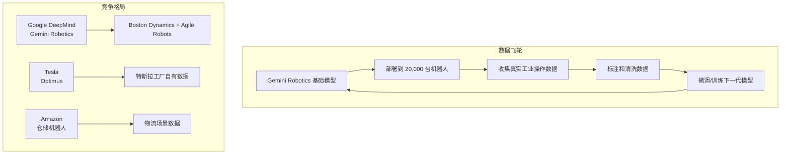

# Google DeepMind x Agile Robots：Gemini 机器人基础模型的工业化落地

> **原标题：** Agile Robots and Google DeepMind Partner to Bring Intelligence to Robots
> **发布日期：** 2026年3月24日
> **原文链接：** https://deepmind.google/blog/agile-robots-partnership

---

## 一句话摘要

Google DeepMind 与慕尼黑机器人公司 Agile Robots 达成战略合作，将 Gemini Robotics 基础模型整合进 2 万台已部署的工业机器人中，覆盖电子制造、汽车、数据中心和物流四大领域，同时利用真实部署数据反哺模型训练。

---

## 完整核心内容翻译

### 合作概要

Google DeepMind 与 Agile Robots 建立战略研究合作伙伴关系，将 Gemini Robotics 基础模型整合到 Agile Robots 的硬件平台中。双方将共同测试、微调和部署搭载 Gemini 基础模型的机器人。

### Agile Robots 简介

- **总部：** 德国慕尼黑
- **已部署机器人：** 全球超过 **20,000 台**
- **核心领域：** 工业自动化（电子制造、汽车、数据中心、物流）

### Gemini Robotics 基础模型

Google DeepMind 的 Gemini Robotics 是专为机器人设计的基础模型，旨在让机器人理解物理世界并做出智能决策。此次合作将：

1. **模型部署：** 将 Gemini Robotics 模型部署到 Agile Robots 的现有工业机器人中
2. **数据回流：** 利用真实工业场景中收集的机器人数据改进 Gemini AI 模型
3. **联合研发：** 在工业场景中测试和微调模型

### 竞争格局

这是 Google DeepMind 机器人合作矩阵的最新一环：

| 合作伙伴 | 领域 | 宣布时间 |
|---------|------|---------|
| **Boston Dynamics** | 人形机器人 Atlas | 2026年1月 |
| **Agile Robots** | 工业机械臂 | 2026年3月 |

Google 将机器人视为 AI 的核心应用场景之一，与 Amazon（仓储机器人）和 Tesla（Optimus 人形机器人）展开直接竞争。

### 投资背景

Alphabet 2026 年资本支出达 **1,750 亿至 1,850 亿美元**——几乎是 2025 年 914 亿美元的两倍，远超华尔街共识的 50%，其中绝大部分投向 DeepMind 所需的 AI 算力。

---

## 技术要点

1. **基础模型 + 硬件平台 = 具身智能：** Gemini Robotics 不是传统的机器人控制算法，而是能理解自然语言指令、视觉场景和物理约束的基础模型。机器人从"编程控制"转向"模型驱动"。
2. **数据飞轮效应：** 合作的核心不仅是模型部署，更是数据收集——2 万台机器人在真实工业环境中产生的操作数据，是训练下一代 Gemini Robotics 的宝贵资源。
3. **从仿真到现实的跨越：** 机器人 AI 的最大挑战是"仿真到现实的鸿沟"（Sim-to-Real Gap）。通过在 2 万台真实机器人上部署和收集数据，DeepMind 可以大幅缩小这一鸿沟。
4. **多厂商合作策略：** DeepMind 同时与 Boston Dynamics（人形机器人）和 Agile Robots（工业机械臂）合作，覆盖两种主流机器人形态，最大化 Gemini Robotics 的适用性。
5. **1,850 亿美元的资本赌注：** Alphabet 的天量资本支出表明，Google 将 AI+机器人视为公司未来的战略核心，而非实验性项目。

---

## 深度解读

### 🟢 通俗版（非专业读者）

以前的工厂机器人像"程序化员工"——每个动作都要提前编好程序，换一个任务就要重新编程。Google 和 Agile Robots 的合作就像给这些机器人安装了一个"大脑"（Gemini 模型）——你可以用自然语言告诉它"把这个零件装到那里"，它自己就能看懂场景、规划动作、完成任务。

而且这 2 万台机器人在工厂里工作的经验，会反过来让这个"大脑"越来越聪明。就像实习生在工厂实习越久，技能越熟练。

**为什么重要：** 这可能是 AI 对制造业产生实质性影响的起点——不再需要为每个任务编程，大幅降低工业自动化的门槛。

### 🔴 深入版（有算法基础的读者）

这次合作代表了**具身智能（Embodied AI）从实验室走向规模化部署**的标志性事件：

**关键技术挑战：**
- **实时推理延迟：** 工业机器人需要毫秒级响应，大语言模型的推理延迟通常在秒级。解决方案可能是模型蒸馏到边缘设备，仅在复杂决策时调用云端大模型。
- **安全关键性：** 工业机器人操作失误可能造成人身伤害或设备损坏，对模型的可靠性要求远高于文本生成场景。
- **多模态感知融合：** 机器人需要同时处理视觉（相机）、触觉（力传感器）、位置（编码器）等多种感知输入，Gemini 的多模态能力在此处有天然优势。

**Google 的"数据护城河"策略：** 通过与多家机器人公司合作，Google 正在构建最大的真实世界机器人操作数据集。在具身 AI 领域，数据可能比模型架构更重要——因为物理世界的复杂性远超纯文本和图像领域。

---

## 延伸思考

1. **工业场景的长尾问题：** 工厂中 80% 的任务是标准化的，但剩余 20% 的异常情况（零件缺陷、设备故障、布局变化）才是真正的挑战。基础模型能否覆盖这些长尾场景？
2. **数据所有权：** Agile Robots 提供真实世界数据，Google 提供模型。长期来看，谁拥有更大的议价权？数据提供方是否会被平台锁定？
3. **就业影响的时间线：** 当工业机器人不再需要专人编程时，工业自动化工程师的角色将如何转变？

---

> 📎 原文链接：https://deepmind.google/blog/agile-robots-partnership
