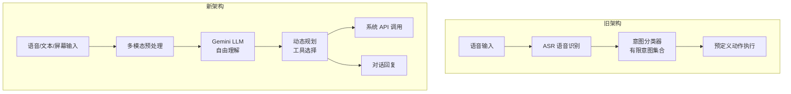

# Gemini 驱动 Apple Siri 重构：10 亿美元的 AI 大脑移植

> **原标题：** Apple's Gemini-Powered Siri Upgrade
> **发布日期：** 2026年3月（预计随 iOS 26.4 或后续版本发布）
> **原文链接：** https://www.apple.com/apple-intelligence/

---

## 一句话摘要

Apple 与 Google 达成多年合作协议（据报道年费约 10 亿美元），使用 Gemini AI 模型彻底重构 Siri 的底层架构——从传统的意图分类系统替换为 LLM 驱动的对话系统，新增屏幕感知、跨应用理解等能力，但发布时间再次推迟。

---

## 完整核心内容翻译

### 重构规模

这是 Siri 自 2011 年诞生以来最大规模的架构重构。Siri 延续多年的基于规则和意图分类的底层架构，将被完全替换为基于大语言模型的系统。

### 合作模式

- **合作方：** Google DeepMind（Gemini 模型）
- **合作形式：** 多年期协议
- **据报道年费：** 约 10 亿美元
- **集成方式：** Gemini 模型作为 Siri 的核心"大脑"

### 新功能预览

1. **屏幕感知（On-screen Awareness）：** Siri 可以理解用户当前屏幕上显示的内容，据此提供上下文相关的帮助
2. **跨应用理解：** 可以在不同应用的数据间建立关联——例如根据联系人对话中提到的书名，在全设备范围内搜索相关内容
3. **自然语言交互：** 从"命令式"交互升级为类似 ChatGPT 的自然对话体验
4. **设备端处理：** 部分推理在设备本地完成，保护隐私

### 发布时间线

| 时间节点 | 事件 |
|---------|------|
| 2024 年 WWDC | 首次宣布 Apple Intelligence |
| 2025 年 | 原计划发布，但延期 |
| 2026 年 2 月 | Apple 确认"今年发布" |
| 2026 年 3 月 | 预计随 iOS 26.4，但部分功能可能推迟到 iOS 26.5 或 iOS 27 |

Apple 选择"做到满意再发布"的策略，而非匆忙上线不成熟的产品。

---

## 技术要点

1. **从意图分类到 LLM 的架构跃迁：** 传统 Siri 的工作流是"语音→文本→意图分类→执行预定义动作"。新架构变为"语音→文本→LLM 理解→动态规划→执行"，后者能处理更复杂、更模糊的用户请求。
2. **Gemini 而非自研：** Apple 选择外购 Gemini 而非自研 LLM，反映了大模型领域的技术壁垒——即使是万亿美元市值的公司，也难以在短时间内从零构建前沿 LLM 能力。
3. **隐私-能力权衡：** Apple 的核心卖点是隐私。在设备端运行 LLM 推理可以保护数据不出设备，但设备端模型的能力不可避免地弱于云端大模型。如何平衡是关键。
4. **屏幕感知的多模态挑战：** "理解用户屏幕内容"需要实时的多模态理解——OCR、UI 元素识别、上下文推理。这对模型的延迟和准确率都有极高要求。
5. **系统级 AI 集成的独特优势：** 与 ChatGPT 等第三方应用不同，Siri 作为操作系统级别的 AI，可以访问日历、邮件、联系人、健康数据等系统级信息，提供更个性化的服务。

---

## 深度解读

### 🟢 通俗版（非专业读者）

以前的 Siri 就像一个只会按照菜单点菜的服务员——你说"设定闹钟"它能做，但说"帮我安排明天的行程"它就一脸茫然。新的 Siri 会像 ChatGPT 一样理解你的意思，而且它还能"看到"你手机屏幕上的内容来帮你。

不过这次 Apple 不是自己做这个"大脑"，而是花了大约 10 亿美元/年向 Google 买的。就像一个手机厂商自己做不出好芯片，选择买高通的芯片一样。

**为什么重要：** 全球有超过 10 亿台 iPhone，Siri 的升级意味着 AI 助手将以史无前例的规模触达普通消费者。

### 🔴 深入版（有算法基础的读者）

Apple Siri 的重构是"AI 基础设施"级别的事件：

**Apple 为什么选择 Gemini 而非 Claude 或 GPT：**
1. Google 与 Apple 有深厚的合作基础（搜索引擎默认协议每年超 200 亿美元）
2. Gemini 提供更灵活的部署方案（从 Flash-Lite 到 Pro），适配设备端到云端的不同需求
3. Google 在多模态（视觉+语言）方面可能有技术优势，而 Siri 的屏幕感知功能重度依赖多模态能力

**端云混合推理的工程挑战：** Apple 需要解决一个根本性问题——哪些推理在设备端完成（快速但能力有限），哪些需要上传到云端（能力强但涉及隐私）。可能的方案是：
- 简单意图识别和基本对话在设备端（使用 Gemini Flash-Lite 级别模型）
- 复杂推理和屏幕理解上传到云端（使用 Gemini Pro）
- 通过 Private Cloud Compute 等技术保护上传数据的隐私

**对 AI 助手赛道的影响：** 如果 Apple 成功将类 ChatGPT 体验融入 iOS，第三方 AI 应用（ChatGPT iOS 版、Claude iOS 版）的使用场景会被大幅压缩——用户为什么要打开单独的应用，如果 Siri 就能做到？

---

## 延伸思考

1. **平台依赖风险：** Apple 将 Siri 的核心能力外包给 Google，一旦合作关系破裂，Siri 将面临"大脑空白"。Apple 是否在并行开发自研大模型？
2. **隐私承诺的可信度：** 使用 Google 的模型同时承诺隐私保护，这两者是否存在内在矛盾？Apple 的技术方案能否让用户真正信任数据不会被 Google 获取？
3. **应用商店生态影响：** 如果系统级 Siri 能完成大部分 AI 任务，依赖 AI 能力的第三方应用是否面临生存危机？

---

> 📎 原文链接：https://www.apple.com/apple-intelligence/
