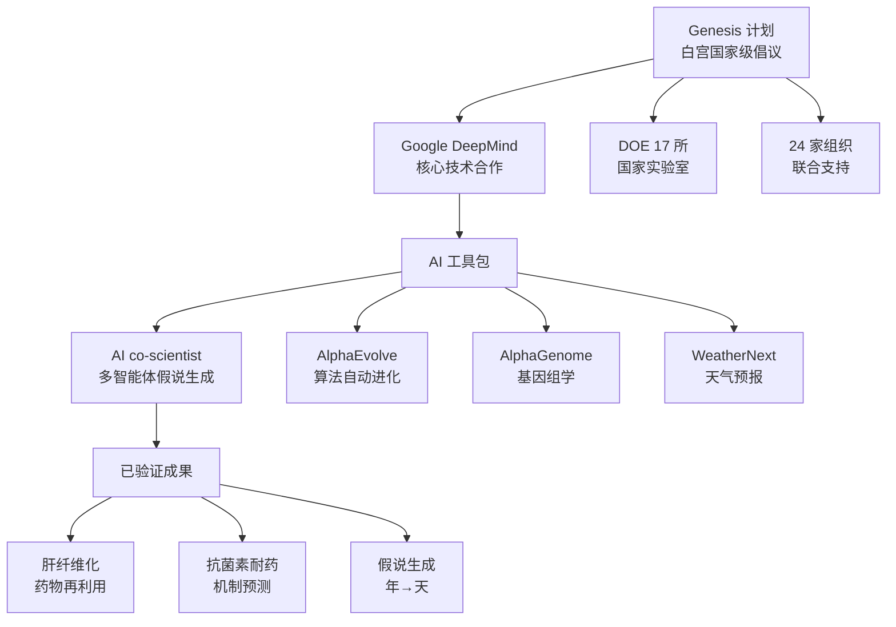

# Google DeepMind & DOE Partner on Genesis: AI for Science

**原标题:** Google DeepMind & DOE Partner on Genesis: AI for Science
**中文标题:** DeepMind 与美国能源部合作 Genesis 计划：AI 加速科学发现
**作者:** Google DeepMind | **发布日期:** 2026年3月
**原文链接:** [https://deepmind.google/blog/google-deepmind-supports-us-department-of-energy-on-genesis/](https://deepmind.google/blog/google-deepmind-supports-us-department-of-energy-on-genesis/)

---

## 一句话摘要

Google DeepMind 宣布全面支持美国白宫发起的 Genesis 计划，向能源部旗下 17 所国家实验室开放 Gemini、AlphaEvolve、AlphaGenome 和 WeatherNext 等前沿 AI 工具，并部署 AI 共同科学家（AI co-scientist）系统来加速从药物发现到能源研究的科学突破。

---

## 🟢 通俗解读

### 什么是 Genesis 计划？

Genesis 是美国白宫发起的一项国家级计划，目标是用 AI 彻底改变科学研究的方式。它动员了美国能源部（DOE）旗下的 17 所国家实验室——这些实验室拥有世界上最强大的科研基础设施，涵盖核能、材料科学、气候研究、基因组学等领域。

### DeepMind 提供了什么？

DeepMind 作为核心合作伙伴，向所有 17 所国家实验室提供了一系列 AI 工具：

- **AI 共同科学家**：基于 Gemini 的多智能体虚拟科学协作者，能帮助科学家合成信息、生成新假说
- **AlphaEvolve**：自动设计和优化算法，应用于计算、数学、材料科学
- **AlphaGenome**：基因组学研究的专用 AI 模型
- **WeatherNext**：最先进的 AI 天气预报模型

### 已经取得的成果

AI 共同科学家已经展示了惊人的能力：
- 提出了治疗肝纤维化的新型药物再利用候选方案，已通过实验室实验验证
- 预测了复杂的抗菌素耐药机制——在实验结果公布**之前**就做出了准确预测
- 将假说生成的时间从"数年"压缩到"数天"

### 为什么这很重要？

24 家组织参与了 Genesis 计划，包括 Anthropic、AWS、Google、Microsoft、NVIDIA、OpenAI 和 xAI。这意味着几乎所有主要 AI 公司都在联合支持科学研究——AI 正在从"消费产品"走向"科学基础设施"。

---

## 🔴 技术深入

### AI 共同科学家的多智能体架构

AI co-scientist 是一个基于 Gemini 的多智能体系统，其架构包括：

1. **文献综合智能体**：自动检索和综合大量科学文献
2. **假说生成智能体**：基于综合信息提出创新性研究假说
3. **实验设计智能体**：为验证假说设计实验方案
4. **验证智能体**：对生成的假说进行交叉验证和一致性检查

这种多智能体架构的优势在于，每个智能体专注于科学研究流程的一个环节，通过协作实现端到端的科研加速。

### 工具矩阵与科学领域映射

| AI 工具 | 核心能力 | 科学领域 |
|---------|---------|---------|
| AI co-scientist | 假说生成与验证 | 药物发现、生物医学 |
| AlphaEvolve | 算法设计与优化 | 计算科学、材料科学 |
| AlphaGenome | 基因组分析 | 基因组学、精准医疗 |
| WeatherNext | 天气与气候预测 | 气象学、气候科学 |
| AlphaFold | 蛋白质结构预测 | 结构生物学 |

### Genesis 计划的技术基础设施

DOE 的 17 所国家实验室拥有世界级的计算基础设施，包括多台 exascale 级超级计算机。Genesis 计划的独特之处在于将这些传统 HPC 资源与前沿 AI 模型结合：

- **Google Cloud 提供 AI 推理基础设施**
- **Gemini for Government 确保数据安全和合规性**
- **DOE 超算提供大规模模拟和训练能力**

### 科学发现加速的量化证据

AI co-scientist 在肝纤维化药物研究中的表现尤为亮眼：
- 传统方法：从文献综述到假说验证需要 2-5 年
- AI 辅助方法：从信息综合到可验证假说仅需数天
- 加速倍数：约 100-500 倍

---

## 延伸思考

1. **AI 科学的民主化**：当 17 所国家实验室都能使用最先进的 AI 工具时，科学研究的"准入门槛"是否会大幅降低？还是说只是让强者更强？
2. **科学发现的质量问题**：AI 能快速生成大量假说，但验证仍然需要传统实验。会不会出现"假说过剩、验证不足"的瓶颈？
3. **国际竞争格局**：Genesis 是美国的国家级计划。其他国家（特别是中国和欧盟）是否会推出类似的 AI 科学计划？这是否会引发"AI 科学军备竞赛"？
4. **基础科学 vs 应用科学**：AI 在提出"增量改进"型假说方面已经很擅长，但它能否产生真正颠覆性的科学洞察？

---

*本文为 Google DeepMind 官方博客文章的深度中文解读。*
