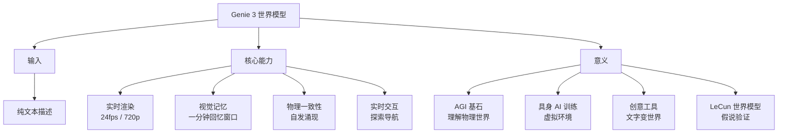

# Genie 3: A New Frontier for World Models

**原标题:** Genie 3: A new frontier for world models
**中文标题:** Genie 3：交互式世界模型的新前沿
**作者:** Google DeepMind | **发布日期:** 2026年1月29日（公开版）
**原文链接:** [https://deepmind.google/blog/genie-3-a-new-frontier-for-world-models/](https://deepmind.google/blog/genie-3-a-new-frontier-for-world-models/)

---

## 一句话摘要

Google DeepMind 发布 Genie 3，这是首个能从纯文本描述生成可实时交互的逼真 3D 环境的通用世界模型，支持 720p 分辨率、24fps 实时渲染，并保持数分钟的物理一致性——被视为通向 AGI 的关键基石。

---

## 🟢 通俗解读

### 什么是"世界模型"？

如果说 ChatGPT 理解的是"语言世界"，那世界模型理解的是"物理世界"。你告诉它"一个下雪的山顶小屋，旁边有一条小溪"，它就能生成一个你可以"走进去"的 3D 世界——你可以在里面走动、转头、与环境互动，就像在玩一个即时生成的游戏。

### Genie 3 能做什么？

- **文字变世界**：输入一句话，生成一个可探索的 3D 环境
- **实时交互**：24帧/秒的流畅体验，像玩游戏一样
- **物理一致性**：转身回头看，之前的场景还在那里——模型能"记住"它之前生成的内容，回忆时间窗口长达一分钟
- **720p 分辨率**：足够清晰的视觉体验

### 为什么说它是 AGI 的基石？

一个真正的通用 AI 需要理解世界的运作方式——物体会下落、水会流动、人会走路。世界模型就是训练 AI "理解物理世界"的关键技术。当 AI 智能体能在模拟世界中学会推理和解决问题，它就离在真实世界中有效行动更近了一步。

### 现在谁能用？

Google AI Ultra 订阅用户（美国，18岁以上）可以通过 Project Genie 体验这项技术，作为一个实验性研究原型。

---

## 🔴 技术深入

### 从 Genie 1 到 Genie 3 的演进

| 特性 | Genie 1 | Genie 2 | Genie 3 |
|------|---------|---------|---------|
| 输入 | 图片 | 图片 | **文本** |
| 输出 | 2D 像素 | 3D 环境 | **3D 逼真环境** |
| 交互 | 简单动作 | 基础导航 | **实时交互** |
| 帧率 | 低 | 中 | **24 fps** |
| 分辨率 | 低 | 中 | **720p** |
| 一致性 | 数秒 | 数十秒 | **数分钟** |

### 核心技术突破

**1. 视觉记忆（Visual Memory）**
Genie 3 的一致性之所以能维持数分钟，关键在于其"视觉记忆"机制。模型能回忆最远一分钟前生成的内容，使得用户转身回头时看到的场景与之前一致。DeepMind 表示这种能力是**自发涌现的**，研究者并未显式编程实现。

**2. 文本到世界的端到端生成**
与 Genie 2 需要图片输入不同，Genie 3 直接从文本描述生成环境，这意味着模型内部建立了从语义空间到 3D 物理空间的完整映射。

**3. 实时渲染架构**
24fps 的实时渲染要求模型在约 42 毫秒内完成每一帧的生成。这对推理效率提出了极高要求，可能采用了类似流式生成的架构。

### 世界模型的理论意义

世界模型在 AI 理论中的重要性来自 Yann LeCun 提出的"世界模型"假说：

1. **预测能力**：世界模型让 AI 能够预测行动的后果，这是规划和推理的基础
2. **样本效率**：在模拟环境中训练比在真实环境中训练效率高出几个数量级
3. **安全探索**：AI 可以在模拟中试错，而不产生真实世界的后果
4. **泛化能力**：理解物理规律的模型理论上可以泛化到未见过的场景

### 当前局限

- 一致性仍然有限（数分钟级别），无法生成真正持久的世界
- 物理模拟的精确度仍远低于游戏引擎
- 目前仅支持视觉探索，复杂交互（如拾取物品）能力有限
- 720p 分辨率对于沉浸式体验仍显不足

---

## 延伸思考

1. **世界模型 vs 游戏引擎**：Genie 3 是否最终会取代传统游戏引擎？还是说两者会融合——游戏引擎提供物理精确性，世界模型提供内容生成？
2. **具身 AI 训练**：世界模型的终极价值可能在于为具身 AI（机器人等）提供无限的虚拟训练环境，这比真实世界训练便宜且安全得多。
3. **创意工具的革命**：如果任何人都可以用一句话生成一个可探索的世界，这对游戏开发、建筑设计、教育等领域意味着什么？
4. **涌现的物理理解**：视觉记忆的自发涌现暗示了一个深层问题——足够大的模型是否能自发学会物理定律？

---

*本文为 Google DeepMind 官方博客文章的深度中文解读。*
