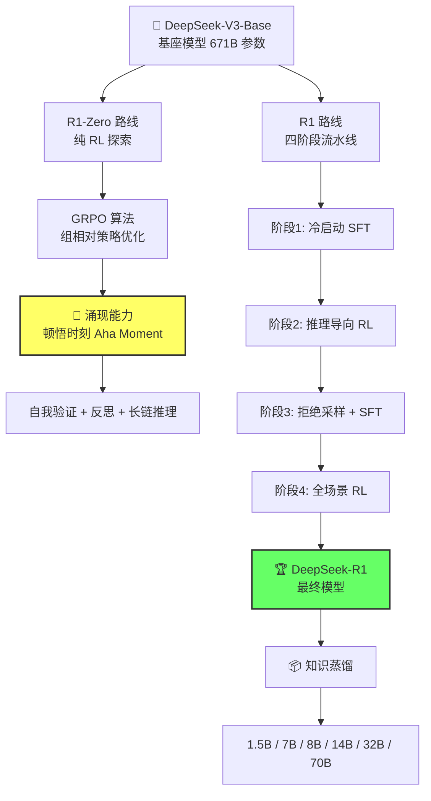
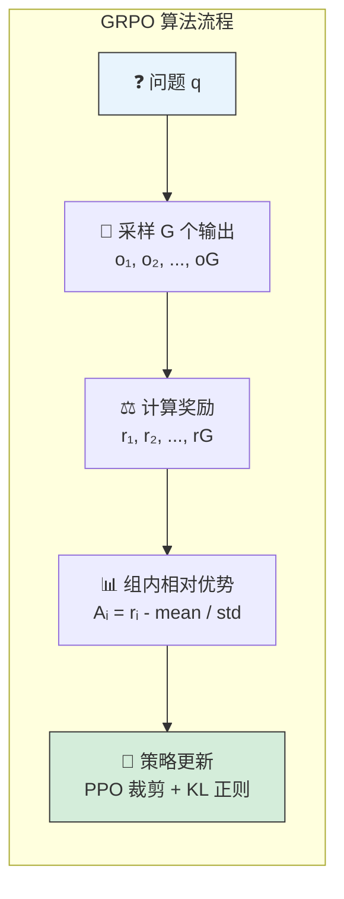
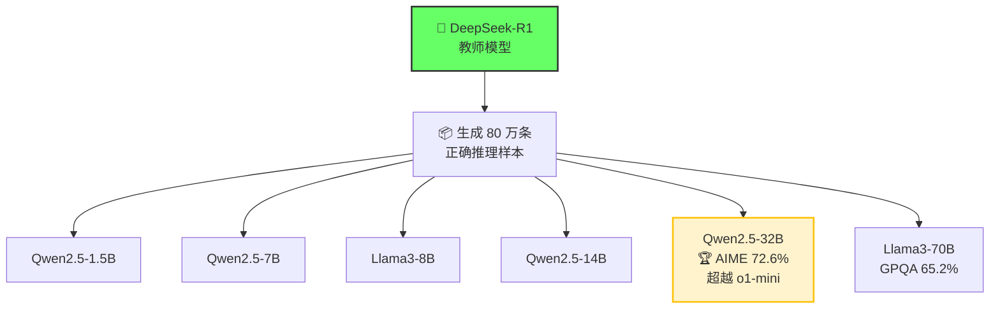

# DeepSeek-R1: Incentivizing Reasoning Capability in LLMs via Reinforcement Learning / DeepSeek-R1：通过强化学习激发大语言模型的推理能力

> 🏷️ **难度**: ⭐⭐⭐⭐ 进阶 | ⏱️ **阅读时间**: 20 分钟 | 🔖 **标签**: `强化学习` `推理模型` `GRPO` `知识蒸馏` `开源模型`

---

## 一句话摘要

DeepSeek-R1 证明了大语言模型的推理能力可以仅通过纯强化学习（RL）激发，无需人工标注的推理轨迹，其中 R1-Zero 模型在训练过程中自发涌现出自我验证、反思和长链式推理等高级能力，最终 R1 模型在数学、编程和推理任务上达到了与 OpenAI o1 相当的性能水平。

---

## 📊 与竞品对比

| 特性 | DeepSeek-R1 | OpenAI o1 | Claude 3.5 Sonnet | Gemini 1.5 Pro |
|------|------------|-----------|-------------------|----------------|
| 🧠 推理方式 | 长链式思维 (RL 涌现) | 长链式思维 (未公开方法) | 标准推理 | 标准推理 |
| 📖 开源 | ✅ MIT 许可证 | ❌ 闭源 | ❌ 闭源 | ❌ 闭源 |
| 💰 训练成本 | 极低（基于 V3） | 未公开（估计极高） | 未公开 | 未公开 |
| 🎯 AIME 2024 | 79.8% | ~79.2% | — | — |
| 📐 MATH-500 | 97.3% | 96.4% | 78.3% | 86.5% |
| 🧬 蒸馏支持 | ✅ 6 种规模 | ❌ | ❌ | ❌ |
| 🔧 训练方法 | GRPO (无需 Critic) | 未公开 | RLHF | RLHF |

---

## 🏗️ 架构总览



---

## 🟢 通俗版：给所有人的解读

### 🤔 这项研究解决了什么问题？

想象你在教一个孩子做数学题。传统方法是：**一步一步示范给他看**（监督学习）。DeepSeek-R1 做的事情是：**只告诉孩子答案对不对，让他自己摸索出解题方法**（强化学习）。

更令人惊讶的是，这个"孩子"（R1-Zero）在摸索过程中自己学会了：
- 🔍 **检查自己的答案** — "等等，让我验证一下这一步对不对"
- 🔄 **换个思路** — "这个方法好像行不通，让我试试另一种"
- 💡 **恍然大悟** — 突然在某个时刻学会了反思，就像人类的"顿悟"

### 🎯 最终结果如何？

DeepSeek-R1 在数学竞赛题上的表现追平了 OpenAI 最强的推理模型 o1，而且**完全开源、免费使用**。更妙的是，它还能把自己的"解题能力"教给更小的模型，让手机上也能跑的小模型拥有强大的推理能力。

---

## 🔴 深入版：技术细节解析

### 1. 研究动机与核心发现

本研究的核心问题是：大语言模型能否在不依赖人工标注推理示例的情况下，仅通过强化学习自主发展出推理能力？

答案是肯定的。研究团队提出的 RL 框架推动了高级推理模式的涌现式发展，包括自我反思、验证和动态策略调整。这篇论文于 2025 年 1 月发表，随后被《Nature》收录（卷 645，633-638 页，2025 年）。

### 2. DeepSeek-R1-Zero：纯 RL 的推理之路

#### 核心理念

R1-Zero 是第一个公开验证"LLM 推理能力可以仅通过纯 RL 激发"的研究。研究团队的假设是：人为定义的推理模式可能限制模型的探索空间，而无约束的 RL 训练能更好地激发新推理能力的涌现。

#### 技术方案：GRPO（组相对策略优化）

R1-Zero 以 DeepSeek-V3-Base 为基座模型，采用 GRPO 作为 RL 框架。GRPO 的核心创新在于：

**无需价值模型（Critic Model）**：传统 RL 需要训练一个单独的价值模型来估计状态价值，GRPO 通过组内相对优势计算绕过了这一需求。

**组相对优势计算**：
- 对每个问题 q，从当前策略采样一组 G 个输出 {o_1, o_2, ..., o_G}
- 每个输出的优势值 A_i = (r_i - mean(r)) / std(r)
- 使用类 PPO 的裁剪目标函数 + KL 散度正则化



**奖励信号设计**：
- 🎯 **准确性奖励**：数学和代码任务的二元正确性信号
- 📋 **格式奖励**：鼓励使用 `<think>...</think>` 标签进行结构化推理

#### 🌟 涌现能力："顿悟时刻"（Aha Moment）

在训练过程中，R1-Zero 自发展现出令人惊叹的行为：

```mermaid
graph TD
    subgraph 🧠 R1-Zero 顿悟时刻演化
        T0[🏁 训练初期<br/>简单模式匹配] --> T1[📈 中期涌现<br/>开始延长推理链]
        T1 --> T2[💡 顿悟时刻<br/>突然学会自我反思]
        T2 --> T3[🔍 自我验证<br/>"等一下，让我验证这个结果"]
        T2 --> T4[🔄 策略切换<br/>"这个方法不行，换一种思路"]
        T2 --> T5[🛠️ 自我纠错<br/>"我发现前面有个错误"]
        T3 --> T6[🏆 成熟推理<br/>系统性多步推理]
        T4 --> T6
        T5 --> T6
    end

    style T2 fill:#fff3cd,stroke:#ffc107,stroke-width:3px
    style T6 fill:#d4edda,stroke:#28a745,stroke-width:2px
```

1. **自发延长推理链** 📏：面对困难问题时，模型自动生成更长的思考过程
2. **重新评估策略** 🔄：当早期方法可能失败时，模型会退后一步重新审视
3. **自我纠错** 🛠️：在推理过程中检测到错误并自行修正
4. **反思性思维** 🪞：展现出真正的反思性推理，而非简单的模式匹配

> ⚡ **这些复杂行为完全从奖励信号中涌现，没有任何关于"如何推理"的监督指导。** 这被研究者称为"顿悟时刻"（Aha Moment）——模型在某个训练阶段突然学会了重新审视和验证自己的推理过程。

#### 📈 性能表现

- AIME 2024 pass@1：从基线 15.6% 提升至 **71.0%** 🚀
- AIME 2024 多数投票：进一步提升至 **86.7%**，**超越了 OpenAI o1-0912** 👑

#### ⚠️ R1-Zero 的局限性

尽管推理能力令人印象深刻，R1-Zero 存在明显的可读性问题：
- 🌐 输出内容经常出现中英文混杂
- 📝 推理链有时过于冗长且结构混乱
- 🚫 不适合直接面向用户使用

### 3. DeepSeek-R1：四阶段训练流水线

为解决 R1-Zero 的局限性，DeepSeek-R1 采用了精心设计的四阶段训练流水线：

```mermaid
graph LR
    subgraph 🔄 R1 四阶段训练流水线
        S1[❄️ 阶段1<br/>冷启动 SFT] -->|数千条人工 CoT| S2[🎯 阶段2<br/>推理导向 RL]
        S2 -->|数学/编程/逻辑 RL| S3[🧹 阶段3<br/>拒绝采样 + SFT]
        S3 -->|正确 CoT + 通用数据| S4[🌍 阶段4<br/>全场景 RL]
    end

    S1 -.->|建立质量基线| S1a[初始推理模式]
    S2 -.->|语言一致性奖励| S2a[连贯单语输出]
    S3 -.->|新基础检查点| S3a[写作/问答/自我认知]
    S4 -.->|有用性 + 无害性| S4a[多轮对话能力]

    style S1 fill:#cce5ff,stroke:#004085
    style S2 fill:#d4edda,stroke:#155724
    style S3 fill:#fff3cd,stroke:#856404
    style S4 fill:#f8d7da,stroke:#721c24
```

**阶段 1：冷启动** ❄️
- 在数千个精心策划的人工编写思维链样本上进行微调
- 建立初始推理模式的质量基线

**阶段 2：推理导向的 RL** 🎯
- 在数学、编程和逻辑任务上大规模 RL 训练
- 新增语言一致性奖励，确保输出使用单一语言
- 优化连贯的单语言输出

**阶段 3：拒绝采样 + SFT** 🧹
- 从 RL 模型采样正确且结构良好的思维链
- 补充通用能力数据（写作、问答、自我认知等）
- 在新的基础检查点上训练

**阶段 4：全场景 RL** 🌍
- 在推理和通用任务上进行第二阶段 RL
- 优化有用性和无害性
- 整合多轮对话能力

### 4. 📊 性能基准

| 基准测试 | DeepSeek-R1 | OpenAI o1 | 备注 |
|---------|------------|-----------|------|
| AIME 2024 (pass@1) | 79.8% | ~79.2% | ⚔️ 接近 o1 水平 |
| MATH-500 | 97.3% | 96.4% | 🏆 极高准确率 |
| CNMO 2024 | 78.8% | — | 🇨🇳 中国数学奥赛 |
| MMLU-Pro | 84.0% | — | 📚 综合知识推理 |
| DROP | 92.2% | — | 📖 阅读理解 |
| LiveCodeBench | 65.9% | — | 💻 实时编程评测 |
| Codeforces Rating | 2029 | 1891 | 🏅 竞赛编程评级 |
| AlpacaEval 2.0 | 87.6% | — | 📝 通用指令遵循 |

### 5. 🎓 知识蒸馏：让小模型也能推理



**关键发现**：
- 🏆 DeepSeek-R1-Distill-Qwen-32B：AIME 72.6%，超越 o1-mini
- 📈 DeepSeek-R1-Distill-Llama-70B：GPQA Diamond 65.2%
- ⚡ **蒸馏效果显著优于同等规模模型的纯 RL 训练**
- 🔑 小模型通过纯 RL 能达到的推理水平存在上限，但蒸馏可以突破这一限制

### 6. ❌ 失败的尝试

论文坦诚分享了两个未能成功的技术路线：

1. **过程奖励模型（PRM）**：难以在大规模下稳健定义逐步正确性
2. **蒙特卡洛树搜索（MCTS）**：生成空间的组合爆炸 + 脆弱的价值模型，使其在大规模 RL 中不实用

---

## 🔑 技术要点

1. **GRPO 算法创新** 🧮：通过组内相对优势计算消除了对价值模型的依赖，大幅降低了 RL 训练的计算成本
2. **推理能力可以纯 RL 涌现** 💡：R1-Zero 证明了无需人工标注推理轨迹，LLM 可以自主发展出自我验证、反思等高级推理能力
3. **四阶段训练流水线** 🔄：冷启动 SFT → 推理 RL → 拒绝采样 SFT → 全场景 RL，平衡了推理深度和输出质量
4. **蒸馏优于纯 RL** 🎓：对于小模型，从大型推理模型蒸馏远比自主 RL 训练有效
5. **开源策略** 🌐：MIT 许可证下完全开源，支持商业使用和蒸馏，推动了整个行业的推理模型民主化

---

## 🧐 深度解读

DeepSeek-R1 的发布堪称 2025 年 AI 领域最重要的事件之一。它的影响远超技术层面，深刻改变了行业格局。

**🔬 范式意义**：R1-Zero 的"顿悟时刻"是 AI 研究中的一个标志性发现。它表明，在正确的奖励信号下，LLM 可以自主发展出人类研究者可能都未曾想到的推理策略。这不是简单的模式匹配或记忆，而是某种形式的"创造性问题解决"的涌现。

**🛠️ 方法论革新**：传统观点认为，训练推理模型需要大量人工标注的推理过程。R1 证明了一种全新的路径：只需定义"什么是正确的"（准确性奖励），模型就能自主探索"如何到达正确答案"。这大大降低了训练推理模型的数据门槛。

**💹 市场冲击**：R1 的发布直接导致美国科技股市值蒸发数十亿美元。它向世界证明了一个令人不安的事实：最先进的 AI 推理能力可以用远低于预期的成本实现，而且可以完全开源。这对"AI 竞赛需要巨额资本"的叙事构成了根本性挑战。

**🎯 蒸馏的战略价值**：R1 的蒸馏结果表明，一旦大模型获得了推理能力，这种能力可以高效地转移到小模型上。这意味着推理能力的"生产"和"分发"可以分离，开辟了全新的商业和研究模式。

---

## 💭 延伸思考

1. **涌现的本质** 🧬：R1-Zero 的"顿悟时刻"引发了一个深层问题——推理能力是 LLM 的固有能力，只是需要正确的训练信号来"解锁"？还是 RL 训练过程中真正"创造"了新的能力？这个问题的答案对 AI 安全有重大影响。

2. **奖励设计的艺术** 🎨：R1 的成功在很大程度上归功于精妙的奖励设计——简单的准确性奖励加上格式奖励就足以引导出复杂的推理行为。这暗示着奖励工程（Reward Engineering）可能成为比提示工程更重要的技能。

3. **开源的不可逆性** 🌍：R1 在 MIT 许可证下开源，意味着推理模型的技术已经不可逆地传播到了全球。任何试图通过出口管制限制 AI 推理能力传播的努力，在 R1 开源后都变得更加困难。

4. **推理的极限** 🚧：R1 在复杂对话、角色扮演和结构化 JSON 输出上仍然落后。这是否意味着"推理"和"通用智能"之间仍然存在本质性的差距？

---

## 🔗 原文链接

- 📄 技术论文（arXiv）：https://arxiv.org/abs/2501.12948
- 🏛️ Nature 发表版：https://www.nature.com/articles/s41586-025-09422-z
- 💻 GitHub 仓库：https://github.com/deepseek-ai/DeepSeek-R1
- 📢 官方发布公告：https://api-docs.deepseek.com/news/news250120
- 🤗 Hugging Face 模型页：https://huggingface.co/deepseek-ai/DeepSeek-R1
- 📖 详细解读：https://huggingface.co/blog/NormalUhr/deepseek-r1-explained
