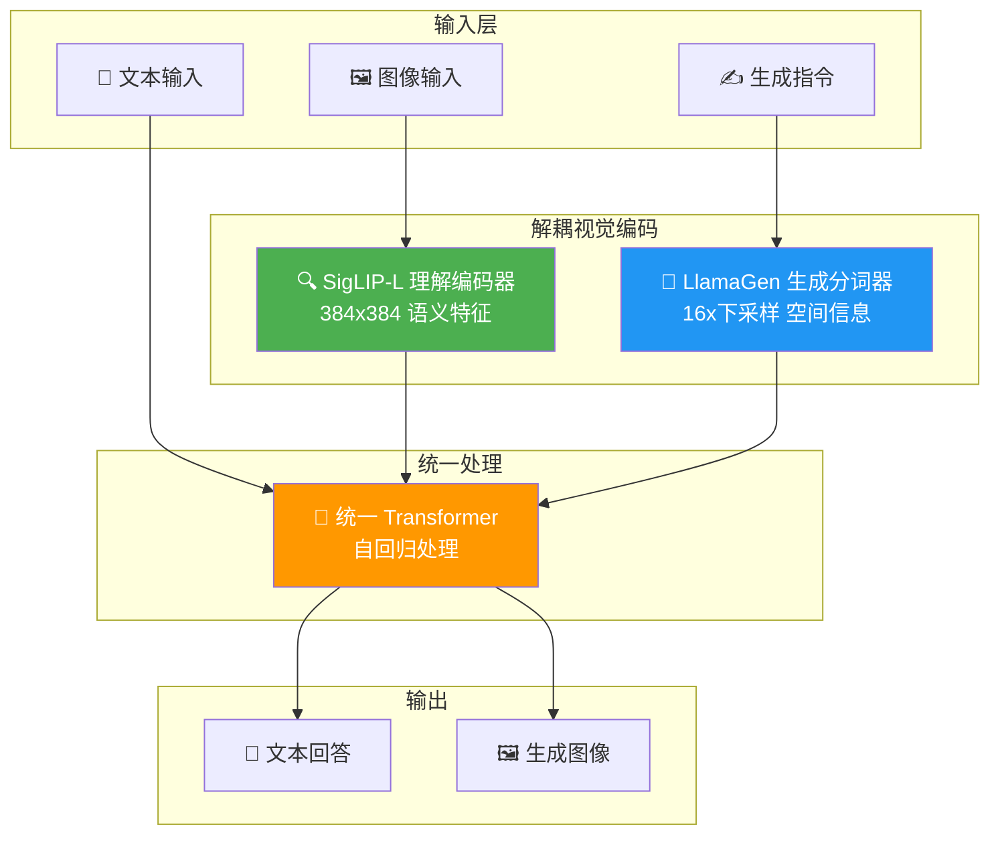

# 🎨 Janus-Pro: Unified Multimodal Understanding and Generation with Data and Model Scaling / Janus-Pro：通过数据与模型扩展实现统一的多模态理解与生成

> 📊 难度：⭐⭐⭐ | ⏱️ 阅读：12分钟 | 📅 2025年1月 | 🏷️ 多模态, 图像生成, DeepSeek, 开源

## 📝 一句话摘要

Janus-Pro 是 DeepSeek 于 2025 年 1 月发布的开源多模态 AI 模型，通过解耦视觉编码的创新架构，在单一统一的 Transformer 中同时实现了多模态理解和文本到图像生成，在 GenEval 和 DPG-Bench 等基准上超越了 DALL-E 3 和 Stable Diffusion 3。

---

## 🏗️ 架构总览

---

## 📖 完整核心内容翻译

### 1. 🔬 研究背景与动机

传统多模态模型面临一个根本性的矛盾：视觉理解（给一张图片，回答问题）和视觉生成（给一段文字，生成图片）对视觉编码器的需求存在冲突。理解任务需要高级语义特征，而生成任务需要精细的空间和纹理信息。

Janus-Pro 正是为解决这一矛盾而生。它是 Janus 系列模型的增强版，核心理念是：**解耦视觉编码，统一处理架构**。

### 2. 🧩 核心架构创新

#### 解耦视觉编码（Decoupled Visual Encoding）

这是 Janus-Pro 最核心的创新。不同于传统方法使用单一视觉编码器同时服务理解和生成，Janus-Pro 为两种任务设计了独立的视觉编码路径：

- **理解编码器**：SigLIP-L 视觉编码器，支持 384x384 输入分辨率，专注于提取高级语义特征
- **生成分词器**：基于 LlamaGen 的视觉分词器，16 倍下采样率，专注于保留精细空间信息

#### 统一 Transformer 处理

尽管视觉编码是解耦的，但所有模态的处理都在一个统一的 Transformer 中完成。这意味着：

- 文本理解、图像理解、图像生成共享同一个语言模型骨干
- 通过自回归方式统一处理所有任务
- 模型可以在理解和生成之间自由切换

#### 模型规格

- **基座模型**：基于 DeepSeek-LLM-1.5b-base 和 DeepSeek-LLM-7b-base
- **模型变体**：Janus-Pro-1B 和 Janus-Pro-7B
- **许可证**：代码为 MIT，模型权重为 DeepSeek Model License

### 3. 🚀 三大改进方向

相比原始 Janus 模型，Janus-Pro 在三个维度上进行了增强：

1. **优化训练策略**：改进了训练过程中理解和生成任务之间的平衡方式
2. **扩大训练数据**：显著增加了训练数据规模，涵盖更多样化的图像-文本对
3. **模型规模扩展**：从更小的原型扩展到 1B 和 7B 参数，验证了架构的可扩展性

### 4. 📊 性能表现

#### 多模态理解

Janus-Pro 在多模态理解基准上超越了之前的统一模型，并在某些任务上匹配甚至超越了专门的理解模型。准确率超过 84%。

#### 文本到图像生成

Janus-Pro-7B 的生成质量令人印象深刻：

- **GenEval 基准**：超越 DALL-E 3
- **DPG-Bench 基准**：超越 DALL-E 3
- **与 Stable Diffusion 3 Medium 的比较**：在多项指标上领先
- **生成稳定性**：相比原始 Janus 模型，显著提升了文本到图像生成的稳定性

#### 统一架构的优势

关键在于，Janus-Pro 用一个模型同时完成了理解和生成，而传统方案需要两个独立的专用模型。这不仅降低了部署成本，还使得模型可以在理解和生成之间建立更紧密的联系。

---

## 🔑 技术要点

1. **解耦编码、统一处理**：为理解和生成设计独立的视觉编码路径，但共享统一的 Transformer 处理核心，优雅地解决了多模态模型中的编码冲突
2. **SigLIP-L + LlamaGen 双编码器**：理解用 SigLIP-L 提取语义，生成用 LlamaGen 保留细节，各司其职
3. **自回归统一框架**：文本和图像在同一个自回归序列中处理，实现了真正的多模态统一
4. **数据与模型双重扩展**：系统性验证了架构在数据规模和模型规模两个维度上的可扩展性
5. **开源可及**：MIT 许可证下开源代码，模型权重公开可用

---

## 🧠 深度解读

### 🟢 通俗版

想象你有两个专家：一个擅长"看图说话"（看到一只猫，能告诉你这是什么品种），另一个擅长"听话画图"（你说"画一只橘猫"，它能画出来）。传统方法试图让一个人同时做这两件事，结果两边都做不好。

Janus-Pro 的聪明之处在于：给这个人配了两副"眼镜"——看图时戴理解眼镜，画图时戴创作眼镜——但用的是同一个大脑来思考。这样既保证了专业性，又实现了统一。而且仅用 7B 参数就超越了 DALL-E 3，说明好的设计比堆参数更重要。

### 🔴 深入版

Janus-Pro 的发布标志着多模态 AI 发展中一个重要的方向转变：从"专门化"走向"统一化"。

**为什么解耦编码如此重要？** 在 Janus-Pro 之前，多模态模型面临一个两难困境：使用统一编码器会导致理解和生成都做不好（因为两者需要的视觉特征本质不同），而使用完全独立的模型又失去了跨任务协同的可能性。Janus-Pro 的解耦编码方案在这两个极端之间找到了精妙的平衡点——编码阶段各取所需，处理阶段共享知识。

**7B 参数超越 DALL-E 3 意味着什么？** DALL-E 3 是 OpenAI 的旗舰图像生成模型，而 Janus-Pro 仅用 7B 参数就在基准测试上超越了它。这再次证明了架构创新可以弥补规模差距。更重要的是，Janus-Pro 不仅能生成图片，还能理解图片——这种多功能性是纯生成模型无法比拟的。

**统一模型的实际价值**：在实际应用中，一个能同时理解和生成图像的模型远比两个独立模型有价值。想象一个设计助手场景：用户上传一张草图（理解），模型提出改进建议（推理），然后直接生成优化后的设计图（生成）——这在统一模型中是自然的工作流，在分离模型中则需要复杂的管道连接。

---

## 💡 延伸思考

1. **统一的极限在哪里？** Janus-Pro 证明了理解和生成可以统一，但视频理解和生成呢？3D 内容呢？音频呢？统一多模态模型的边界将在哪里？

2. **编码解耦 vs 端到端**：Janus-Pro 选择了在编码阶段解耦。但随着模型规模的增长，是否有可能让模型自主学会在统一编码空间中区分理解和生成所需的特征？

3. **对商业图像生成服务的冲击**：一个 7B 参数的开源模型就能超越 DALL-E 3，这对 Midjourney、DALL-E 等商业服务的长期竞争力意味着什么？

4. **多模态推理的可能性**：如果将 R1 的推理能力与 Janus-Pro 的多模态能力结合，能否实现"视觉推理"——即模型不仅能看懂图片，还能对图片中的问题进行深度推理？

---

## 🔗 原文链接

- 技术论文（arXiv）：https://arxiv.org/abs/2501.17811
- GitHub 仓库：https://github.com/deepseek-ai/Janus
- Hugging Face 模型页（7B）：https://huggingface.co/deepseek-ai/Janus-Pro-7B
- InfoQ 报道：https://www.infoq.com/news/2025/01/deepseek-ai-janus/
