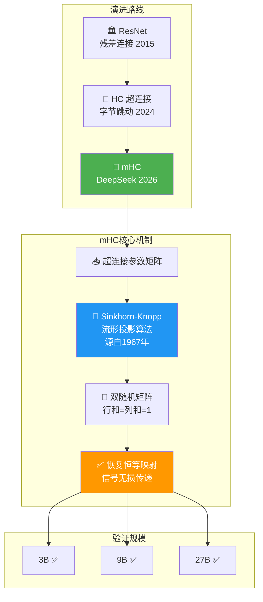

# 🔬 Manifold-Constrained Hyper-Connections: DeepSeek's 2026 Architecture Innovation

> 📊 难度：⭐⭐⭐ | ⏱️ 阅读：12分钟 | 📅 2026年1月 | 🏷️ 架构创新, 流形约束, 训练效率, DeepSeek

## 📋 原标题 + 中文标题
**Manifold-Constrained Hyper-Connections (mHC)**
**流形约束超连接：DeepSeek 2026 年开年的架构创新论文**

## 📝 一句话摘要
DeepSeek 在 2026 年初发表由创始人梁文锋共同署名的论文，提出流形约束超连接（mHC）架构，在 3B、9B 和 27B 参数规模上验证了一种比传统 Transformer 残差连接更高效的大模型训练方法，以几乎可忽略的额外计算开销实现了显著的扩展性提升。

---

## 🏗️ 技术演进与核心原理

---

## 📖 完整核心内容翻译

### 🔍 研究背景

2026 年 1 月初，DeepSeek 发表了一篇重要的技术论文，由 19 位研究人员共同撰写，创始人梁文锋也在作者之列。论文提出了对基础 AI 模型训练所用核心架构的根本性重新思考——流形约束超连接（Manifold-Constrained Hyper-Connections, mHC）。

### 📚 技术渊源

mHC 建立在**超连接（Hyper-Connections, HC）**的基础之上。HC 最初由字节跳动研究人员于 2024 年 9 月提出，是对残差网络（ResNet）的一种改进。ResNet 是微软亚洲研究院提出的基础架构，也是 GPT、AlphaFold 等模型的核心组件。

超连接（HC）通过扩展残差流（residual stream），成功解决了深度网络训练中的**信号坍塌问题**——即梯度信号在深层网络中逐渐衰减直至消失的现象。然而，DeepSeek 发现 HC 存在一个关键的实际局限：随着模型规模增大，**内存成本会急剧上升**。

### 🧩 核心创新

mHC 的核心思想是：在超连接网络上施加特定的**流形几何约束**（manifold constraint）。通过将超连接的参数空间约束在一个低维流形上，mHC 在保持 HC 带来的训练稳定性和扩展性优势的同时，有效控制了计算和内存开销。

用更直观的类比来说：如果把 HC 比作"修建一条更宽的高速公路来解决交通拥堵"，那么 mHC 就是"在不显著拓宽道路的前提下，通过优化车道设计和交通规则来实现同样的通行效率"。

### 📊 实验验证

研究团队在三个参数规模上对 mHC 进行了系统验证：
- **3B 参数**
- **9B 参数**
- **27B 参数**

实验结果表明：mHC 在所有规模上均实现了稳定训练，展现出优于传统超连接的扩展性，且这些增益**几乎不增加额外的计算开销**（"negligible computational overhead"）。这一点通过基础设施层面的优化得以实现。

### 🎯 战略意义

DeepSeek 的技术论文通常是其下一代旗舰模型工程选择的早期信号。这篇 mHC 论文的发表，被业界普遍解读为 DeepSeek 在为其下一代主力模型（后来的 DeepSeek-V4 方向）奠定架构基础。

---

## 🔑 技术要点

1. **残差连接的进化路线**：从 ResNet（2015）→ 超连接 HC（字节跳动 2024）→ 流形约束超连接 mHC（DeepSeek 2026），每一步都在解决更深层的训练稳定性和效率问题。mHC 代表了这一技术路线的最新进展。

2. **流形约束的数学优雅性**：通过将超连接参数限制在低维流形上，mHC 在理论上保证了参数空间的结构性，避免了高维空间中的冗余和低效。这种"以约束换效率"的思路在优化理论中有深厚的数学基础。

3. **跨规模的一致性验证**：在 3B 到 27B 的规模跨度上（近 10 倍差距）保持一致的性能增益，是 mHC 可扩展性的有力证据，暗示该方法可能在更大规模上同样有效。

4. **"几乎零额外开销"的工程实现**：理论上的架构改进如果带来显著的计算开销增加，其实际价值就会大打折扣。mHC 通过基础设施层面的优化实现了"免费午餐"般的性能提升。

5. **创始人署名的信号意义**：梁文锋亲自参与论文的撰写，表明 mHC 不仅是一篇学术贡献，更是 DeepSeek 未来技术路线的核心方向之一。

---

## 🧠 深度解读

### 🟢 通俗版

打个比方：传统的神经网络像一栋楼，每层之间有楼梯（残差连接）。字节跳动说"楼梯太窄了，我们加电梯"（超连接），但电梯装多了，楼不稳了。DeepSeek 说"我们不拆电梯，而是用数学方法加固楼体结构"（流形约束），结果楼又稳了，电梯还在。加固成本？只多花了 6.7% 的建筑预算。

更关键的是，DeepSeek 的创始人亲自参与了这篇论文，相当于老板说"这个技术就是我们下一代产品的核心"。

### 🔴 深入版

这篇论文的重要性需要放在更宏观的视角下理解。

**首先，它揭示了 DeepSeek 的方法论**：与许多依赖"堆算力堆数据"的团队不同，DeepSeek 持续投入基础架构层面的创新。从 DeepSeekMoE 到多头潜在注意力（MLA），再到 mHC，每一项创新都旨在"用更少的资源做更多的事"。在美国对中国实施芯片出口管制的大背景下，这种"效率优先"的技术路线既是被动适应，也是主动选择。

**其次，mHC 解决的问题具有普遍性**。训练信号衰减是所有深度网络的共性挑战，尤其随着模型深度不断增加（从几十层到几百层），这一问题愈发严峻。mHC 提供的解决方案不局限于语言模型——它对视觉模型、多模态模型乃至科学计算模型都可能产生影响。

**第三，论文的发表时机意味深长**。2026 年 1 月发表、春节前后预期新模型发布——这种节奏表明 mHC 很可能已经被集成到 DeepSeek 的下一代模型训练流程中。论文更像是一份"已完成验证的技术备忘录"，而非"未来设想的研究提案"。

从更深的技术角度看，"流形约束"这一概念的引入，暗示 DeepSeek 的研究团队正在将微分几何的工具引入深度学习架构设计。这种跨学科的技术融合，可能为未来的架构创新开辟全新的方向。

---

## 💡 延伸思考

1. **架构创新 vs. 规模扩展**：AI 行业正在经历从"规模至上"到"效率至上"的范式转变。mHC 论文是否预示着"用更聪明的架构取代更大的规模"将成为 2026 年的主旋律？

2. **中国 AI 的"逆境创新"**：芯片限制是否反而推动了中国 AI 团队在架构效率上的更深入探索？如果是，这种"约束驱动的创新"对全球 AI 发展有什么启示？

3. **开源论文的竞争策略**：DeepSeek 选择公开发表 mHC 论文而非保密，这种"开放式竞争"策略的考量是什么？是技术自信的表现，还是通过建立学术影响力来吸引人才的手段？

---

## 🔗 原文链接
- 南华早报报道：https://www.scmp.com/tech/big-tech/article/3338427/deepseek-kicks-2026-paper-signalling-push-train-bigger-models-less
- Bloomberg 报道：https://www.bloomberg.com/news/articles/2026-01-02/deepseek-touts-new-training-method-as-china-pushes-ai-efficiency
