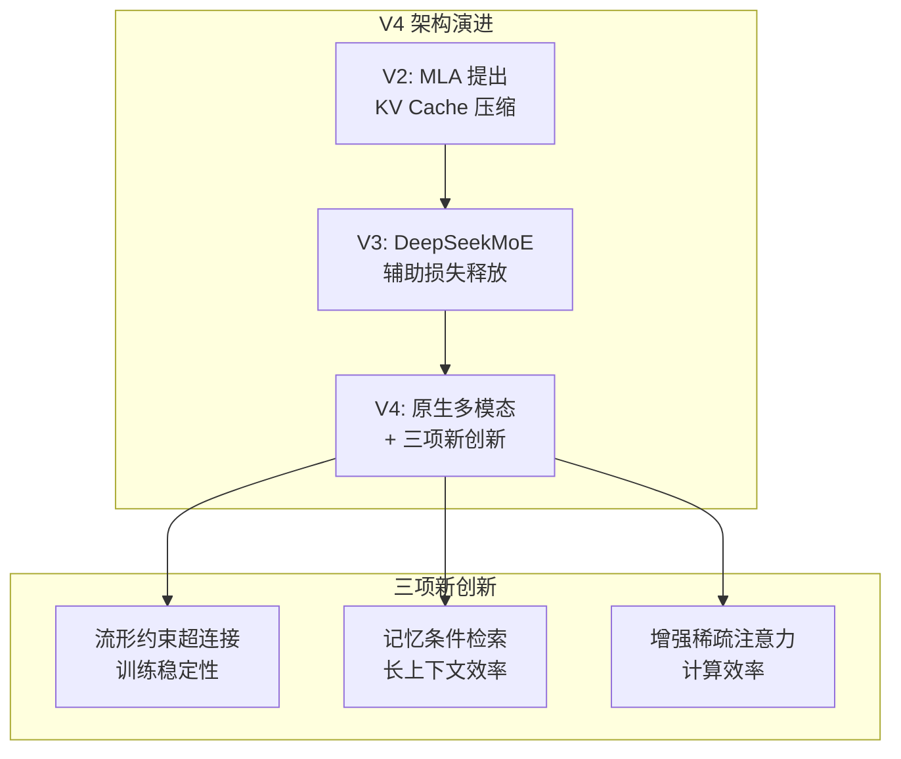

# DeepSeek V4 Lite：万亿参数原生多模态模型的先行版

> **原标题：** DeepSeek V4 Lite
> **发布日期：** 2026年3月9日
> **原文链接：** https://www.deepseek.com/v4-lite

---

## 一句话摘要

DeepSeek 发布 V4 Lite 作为万亿参数 V4 的先行版本，约 2,000 亿参数，搭载原生多模态架构、100 万 token 上下文窗口，延续 Multi-head Latent Attention 并引入三项新技术创新，同时针对华为昇腾芯片优化推理。

---

## 完整核心内容翻译

### 发布背景

DeepSeek V4 Lite 于 3 月 9 日在官网上线，是万亿参数 V4 模型的渐进式发布策略的第一步。截至 3 月下旬，完整版 V4 尚未正式发布。

### 核心架构

**原生多模态设计：** V4 系列与此前的 V3（纯文本）不同，从预训练阶段就整合了文本和视觉理解能力，而非后期拼接。

**沿用并升级 MLA：** Multi-head Latent Attention（MLA）从 V2 开始提出，V4 在此基础上新增三项创新：

| 创新技术 | 功能 |
|---------|------|
| **流形约束超连接（Manifold-Constrained Hyper-Connections）** | 确保万亿参数规模下的训练稳定性 |
| **记忆条件检索（Engram Conditional Memory）** | 高效检索百万 token 上下文中的相关信息 |
| **增强稀疏注意力（Enhanced DeepSeek Sparse Attention）** | 进一步优化长序列计算效率 |

### V4 Lite 规格

| 参数 | V4 Lite | V4（完整版预期） |
|------|---------|----------------|
| 总参数 | ~2,000 亿 | ~1 万亿 |
| 上下文窗口 | 100 万 token | 100 万 token |
| 多模态 | 原生文本+视觉 | 原生文本+视觉+视频 |
| MoE 架构 | 是 | 是 |
| 活跃参数 | ~32B（预估） | ~32B |

### 性能表现

泄露的基准测试数据显示：
- **HumanEval：** ~90%
- **SWE-bench Verified：** 80%+
- 整体达到当前前沿模型竞争水平

### 定价

- **输入：** $0.30 / 百万 token
- **输出：** $0.50 / 百万 token

### 硬件策略

V4 的推理栈专门针对**华为昇腾（Ascend）**和**寒武纪**芯片优化，刻意排除了 NVIDIA 和 AMD 的预发布优化。这一决策反映了中国 AI 公司在芯片受限环境下的自主化战略。

---

## 技术要点

1. **原生多模态 vs 后期拼接：** 从预训练阶段就整合视觉理解，意味着文本和图像共享底层表示空间。这比先训练文本模型再"嫁接"视觉编码器（如 LLaVA 方案）在跨模态理解上有根本优势。
2. **流形约束超连接（Manifold-Constrained Hyper-Connections）：** 这是应对万亿参数训练不稳定性的新方法。训练不稳定（loss spike）是大规模模型训练的最大工程挑战之一，这项技术可能通过约束梯度在参数空间的流形上流动来缓解。
3. **记忆条件检索（Engram Conditional Memory）：** 专为百万 token 上下文设计的检索机制，"Engram"一词来自神经科学（记忆痕迹），暗示这是一种类似人类记忆的稀疏检索机制，仅在需要时激活相关上下文片段。
4. **华为昇腾优化的战略含义：** DeepSeek 选择优先适配国产芯片，而非 NVIDIA GPU，这既是应对出口管制的务实选择，也可能预示中国 AI 生态将逐步形成独立于 NVIDIA 的技术栈。
5. **渐进式发布策略：** 先发 V4 Lite 再发完整 V4，可能是为了在较小模型上验证新架构的稳定性，降低完整版发布的技术风险。

---

## 深度解读

### 🟢 通俗版（非专业读者）

DeepSeek 的 V4 Lite 就像一辆"概念车的量产预览版"——完整版 V4 有万亿个参数（可以理解为"脑细胞"），而 V4 Lite 是一个 2,000 亿参数的精简版，用来提前验证技术路线。

最特别的是，V4 Lite 天生就能同时理解文字和图片（原生多模态），不像以前的模型是先学文字再学看图。就像一个孩子从小就在双语环境中长大，比后来学第二语言的人理解更深。

另外，这个模型专门为中国自主研发的芯片优化，而不是依赖美国的 NVIDIA 芯片。

**为什么重要：** DeepSeek V4 展示了中国 AI 公司在技术封锁下依然能推出前沿模型的能力，同时也在芯片层面走出了自主化的路线。

### 🔴 深入版（有算法基础的读者）

V4 的技术创新集中在三个方向：

**MLA 的持续演进：** DeepSeek 的 Multi-head Latent Attention 通过将 KV Cache 压缩到低秩隐空间来减少推理时的内存开销。V4 在此基础上的三项创新都是针对"规模化"挑战：
- 万亿参数的训练稳定性
- 百万 token 的上下文效率
- 极端稀疏性下的计算效率

**华为昇腾的算力约束：** 华为昇腾 910B 的单卡算力约为 NVIDIA H100 的 60-70%，但互联带宽更有优势。DeepSeek 的 MoE 架构天然适合昇腾的特性——稀疏激活减少了对单卡算力的依赖，而专家路由可以利用高互联带宽。

**V4 Lite 作为架构验证：** 在万亿参数模型上直接验证新架构的风险极高（一次完整训练可能耗费数千万美元）。V4 Lite 的 2,000 亿参数规模足以验证流形约束超连接等新技术的有效性，同时训练成本可控。这是大模型研发的标准风控策略。

---

## 延伸思考

1. **芯片独立路线的可持续性：** DeepSeek 针对昇腾优化是短期权宜之计还是长期战略？如果未来出口管制放松，是否会回归 NVIDIA 生态？
2. **原生多模态的评估标准：** 如何评判"原生多模态"是否真的优于"后期拼接"？需要什么样的基准测试来区分两种方案的真实差异？
3. **万亿参数的经济性：** V4 的 $0.30/M token 定价极具竞争力。在万亿参数规模下保持低价，DeepSeek 的推理优化到底做到了什么程度？

---

> 📎 原文链接：https://www.deepseek.com/v4-lite
