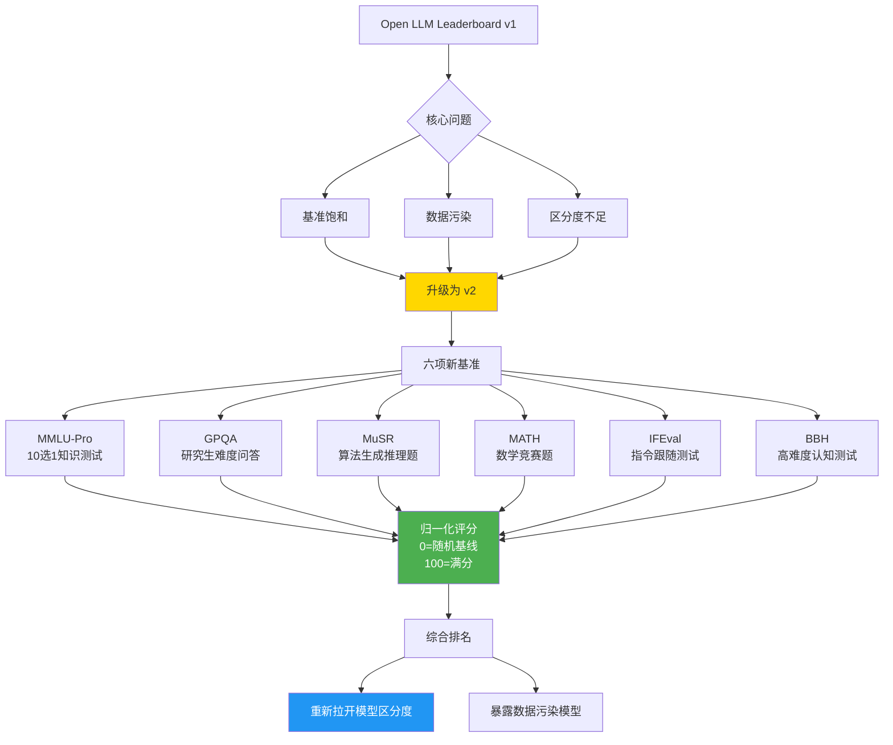

> 📊 难度：⭐⭐⭐ | ⏱️ 阅读：14分钟 | 📅 2024年6月（正式发布2024年10月） | 🏷️ 模型评估, 基准测试, 开源生态

# Open LLM Leaderboard v2
# 开源大模型排行榜v2：当所有模型都考满分，是时候换一套更难的试卷了

## 一句话摘要

Hugging Face推出Open LLM Leaderboard v2，引入MMLU-Pro、GPQA、MuSR等六项更具挑战性的评测基准，采用归一化评分体系解决旧排行榜的分数饱和、数据污染和区分度不足问题。

---

## 核心内容

### 为什么需要v2？

Open LLM Leaderboard v1自发布以来吸引了超过**200万独立访客**和**30万月活跃用户**，成为开源LLM评估的事实标准。但随着模型能力的快速提升，三个核心问题浮现：

**1. 基准饱和（Benchmark Saturation）**
- 模型在HellaSwag、MMLU、ARC等传统基准上的分数接近甚至达到人类基线水平
- 排行榜顶部的模型分数差异微小（<1%），失去了区分能力
- 就像一场考试所有学生都考了99分——无法识别真正的优秀

**2. 数据污染（Data Contamination）**
- 部分模型的训练数据中包含了与基准测试相似的内容
- 这导致分数虚高——模型不是真正掌握了知识，而是"背了答案"
- 破坏了评估的公信力

**3. 区分度不足**
- 旧基准无法有效区分不同模型在复杂推理、知识深度、指令跟随等方面的能力差异

### v2的六项新基准

**1. MMLU-Pro（增强版多任务语言理解）**
- 原版MMLU的升级版
- 从4选1变为**10选1**——大幅提高难度，降低猜对概率
- 覆盖更广泛的专业知识领域

**2. GPQA（研究生水平问答）**
- **极高难度**的知识问答数据集
- 问题由领域专家设计，非专业人士几乎无法回答
- 测试模型在物理、化学、生物等领域的深度知识

**3. MuSR（多步推理）**
- **算法生成**的复杂推理问题
- 需要长距离上下文解析
- 测试多步骤逻辑推理能力
- 因为是算法生成的，天然抗数据污染

**4. MATH（数学竞赛题）**
- 高中数学竞赛水平的问题
- 涵盖代数、几何、数论、组合等多个领域
- 需要真正的数学推理能力，不能靠模式匹配

**5. IFEval（指令跟随评估）**
- 评估模型**精确遵循指令**的能力
- 例如："用恰好3个句子回答"、"不要使用字母E"
- 测试模型的可控性和服从性

**6. BBH（BIG-Bench Hard）**
- BIG-Bench基准中最困难的子集
- 涵盖多种认知能力测试
- 传统语言模型在这些任务上表现远低于人类

### 归一化评分体系

v2采用了全新的**归一化评分方法**：

- **0分** = 随机基线（Random Baseline）——猜对的概率
- **100分** = 理论最高分
- 所有基准统一到[0, 100]区间
- 防止任何单一基准过度影响总排名

这确保了：10选1的MMLU-Pro和2选1的MuSR在总分中有公平的权重。

### 关键发现

- 模型在新基准上的分数**大幅下降**，重新拉开了区分度
- 某些在v1上排名靠前的模型在v2上表现平平——暴露了数据污染问题
- 开源模型与闭源模型的差距在某些任务上依然显著
- 纯粹追求MMLU分数的模型在IFEval等实用性基准上表现不佳

---

## 技术要点

1. **10选1的MMLU-Pro**将随机基线从25%降到10%——更有效地区分真正的知识掌握与随机猜测
2. **算法生成的MuSR**是对抗数据污染的创新方案——由于是程序化生成的，训练数据中不可能包含这些问题
3. **IFEval的引入**反映了行业需求的转变——从"模型有多聪明"到"模型有多听话"
4. **归一化评分**解决了多基准聚合的公平性问题——不同难度和格式的基准在总分中获得等权重
5. **社区驱动的评估体系**：Hugging Face与EleutherAI等社区合作开发评估基础设施

---

## 解读

### 🟢 通俗版解读

想象你是一所大学的招生办主任。以前你用的入学考试（v1排行榜）出了几年后，考生们都学会了套路，大家都考90分以上，你根本分不清谁真正优秀。更糟的是，有些培训班直接拿到了往年考题（数据污染），学生背了答案来考试。

所以你决定换一套新试卷（v2排行榜）：
- **MMLU-Pro**：把4选1改成10选1——蒙对的概率大大降低
- **GPQA**：加入研究生级别的超难题——真正有实力的才答得出来
- **MuSR**：用电脑随机生成的推理题——保证没人能提前背题
- **IFEval**：测试你能不能严格按照指令行事——不只是聪明，还要听话
- **评分方式**：所有科目统一打分标准，不让某一科拉偏总分

结果：很多原来的"学霸"（高分模型）在新试卷面前现了原形，真正有实力的模型脱颖而出。

### 🔴 深入版解读

**评估基准的军备竞赛**：v2的推出反映了一个深层矛盾——当基准测试成为优化目标（Goodhart's Law），它就不再是有效的评估工具。v2通过提高难度和引入新维度暂时缓解了这个问题，但历史经验表明，模型很快会在新基准上再次饱和。这引发了一个根本性问题：**静态基准能否持续有效地评估快速进化的AI系统？**

**数据污染的技术检测**：除了换新基准，更根本的解决方案可能是建立系统化的数据污染检测工具。例如，通过检查模型在基准问题的微小变体上的表现下降幅度来推断训练数据是否包含原始基准。这个方向有一些学术工作（如Min-K%法），但尚未在实践中广泛应用。

**IFEval的战略意义**：在六项新基准中，IFEval最具实用价值。它不测试模型的"智力"，而是测试"服从性"——这恰恰是企业部署中最关心的特性。一个在IFEval上表现优异的模型，在实际应用中更可靠、更可控。

**归一化评分的局限**：将所有基准等权重聚合的假设是否合理？不同的应用场景（代码生成、医疗问答、客服对话）可能需要不同的基准权重。v2提供了总分，但用户可能需要更灵活的多维评估视图。

---

## 流程图

---

## 延伸思考

1. **基准的半衰期**：v2能保持多长时间的有效性？是否需要持续更新基准？
2. **领域特定排行榜**：通用排行榜是否足够？Hugging Face已推出医疗和金融领域的专项排行榜
3. **动态评估**：能否实现"每次评估使用不同的随机生成题目"来彻底解决数据污染？
4. **评估与能力的关系**：排行榜分数与实际应用表现之间的相关性有多强？

---

## 原文链接

- [Open LLM Leaderboard | Hugging Face](https://huggingface.co/spaces/open-llm-leaderboard/open_llm_leaderboard)
- [Open LLM Leaderboard v2 介绍](https://huggingface.co/spaces/open-llm-leaderboard/blog)
- [InfoQ 报道](https://www.infoq.com/news/2024/10/open-llm-leaderboard-v2-launch/)
